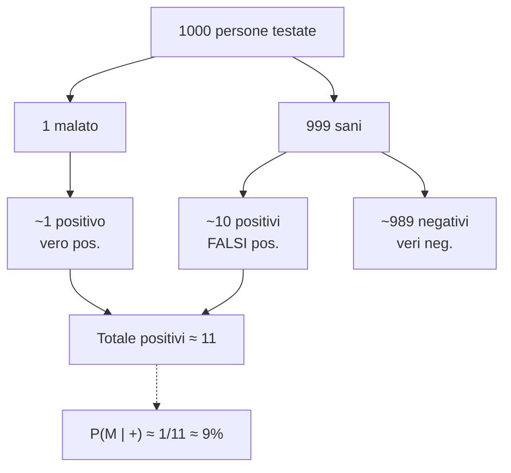

# Teorema di Bayes e aggiornamento delle credenze

Il reverendo Thomas Bayes (1701–1761) propose una formula per aggiornare credenze alla luce di nuove evidenze. Il teorema, semplice sul piano matematico, ha avuto un impatto sproporzionato: è il motore dell'inferenza statistica moderna, dei filtri anti-spam, del riconoscimento vocale, della medicina diagnostica, e — applicato come abito mentale — del pensiero quantitativo sotto incertezza (cf. Tetlock, *Superforecasting*).

## 1. Derivazione

Dalla definizione di probabilità condizionale:

$$P(A \mid B) = \frac{P(A \cap B)}{P(B)} \qquad P(B \mid A) = \frac{P(B \cap A)}{P(A)}$$

Da entrambe: $P(A \cap B) = P(A \mid B) P(B) = P(B \mid A) P(A)$. Da cui:

$$\boxed{P(A \mid B) = \frac{P(B \mid A) \cdot P(A)}{P(B)}}$$

In nomenclatura bayesiana:

- $P(A)$ = **prior** (la mia credenza iniziale su $A$).
- $P(B \mid A)$ = **likelihood** (quanto è verosimile osservare $B$ se $A$ è vero).
- $P(B)$ = **evidence** o costante di normalizzazione.
- $P(A \mid B)$ = **posterior** (la mia credenza aggiornata su $A$ dopo aver visto $B$).

## 2. La forma più utile

Se $A_1, A_2, \ldots, A_n$ sono ipotesi alternative ed esaustive, possiamo esplicitare il denominatore (legge della probabilità totale):

$$P(A_i \mid B) = \frac{P(B \mid A_i) P(A_i)}{\sum_j P(B \mid A_j) P(A_j)}$$

In pratica: il posteriore di ogni ipotesi è proporzionale a prior × likelihood, normalizzato.

## 3. Esempio canonico: il test medico

**Setup**: una malattia rara colpisce **1 persona su 1000**. Esiste un test con:

- Sensibilità = $P(+ \mid \text{malato}) = 0{,}99$.
- Specificità = $P(- \mid \text{sano}) = 0{,}99$, quindi $P(+ \mid \text{sano}) = 0{,}01$ (falsi positivi).

Sei positivo. Qual è la probabilità che tu sia davvero malato?

S1 dice ~99% (perché il test è "accurato al 99%"). Sbagliato.

**Calcolo**:

$$P(M \mid +) = \frac{P(+ \mid M) P(M)}{P(+)}$$

$P(M) = 0{,}001$, $P(+ \mid M) = 0{,}99$.

$P(+) = P(+ \mid M)P(M) + P(+ \mid \bar M) P(\bar M) = 0{,}99 \cdot 0{,}001 + 0{,}01 \cdot 0{,}999 = 0{,}00099 + 0{,}00999 = 0{,}01098$.

$$P(M \mid +) = \frac{0{,}99 \cdot 0{,}001}{0{,}01098} \approx 0{,}090 = 9\%$$

**Solo il 9%**. L'intuizione tradisce perché ignora la *base rate* (1/1000). Su 1000 persone testate, ti aspetti 1 malato (correttamente positivo) e ~10 sani falsamente positivi: dei ~11 positivi, solo 1 è davvero malato.

### 3.1 Visualizzazione

### 3.2 Lezione

La fallacia di ignorare la base rate (vedi [fallacie informali di presunzione](22-fallacie-informali-presunzione.html) e [bias cognitivi](23-bias-cognitivi.html)) è una delle ragioni di errore mediche più comuni. Per malattie rare, anche test ottimi danno spesso falsi positivi.

## 4. La forma odds

A volte è più comoda. Le **odds** a favore di $A$ sono $O(A) = P(A)/P(\bar A)$.

$$\frac{P(A \mid B)}{P(\bar A \mid B)} = \frac{P(B \mid A)}{P(B \mid \bar A)} \cdot \frac{P(A)}{P(\bar A)}$$

In parole: **posterior odds = likelihood ratio × prior odds**.

Nel test medico: prior odds di essere malati = $1/999$. Likelihood ratio = $0{,}99 / 0{,}01 = 99$. Posterior odds = $99/999 \approx 0{,}099$. Converte in probabilità: $0{,}099 / (1 + 0{,}099) \approx 9\%$. ✓

La forma odds è particolarmente utile quando aggiorni **sequenzialmente** con più evidenze indipendenti: moltiplichi i likelihood ratio.

## 5. Aggiornamento sequenziale

Se ricevi due evidenze $B_1, B_2$ indipendenti dato $A$:

$$P(A \mid B_1, B_2) \propto P(B_1 \mid A) P(B_2 \mid A) P(A)$$

Ripetendo il test medico positivo una seconda volta (indipendentemente):

Prior aggiornato = posterior precedente = 9%. Stesso likelihood ratio. Nuovo posterior odds = $99 \times 0{,}099 \approx 9{,}8$. Nuova probabilità: $9{,}8/10{,}8 \approx 91\%$. **Due test positivi ti portano da 9% a 91%**. Questo è il senso del re-testing.

## 6. Estensione: Bayes per parametri continui

In statistica bayesiana, si aggiornano distribuzioni intere, non singole probabilità.

$$p(\theta \mid D) = \frac{p(D \mid \theta) \cdot p(\theta)}{p(D)}$$

$\theta$ = parametro (es. probabilità di testa di una moneta), $D$ = dati osservati. Si parte da una distribuzione prior $p(\theta)$ (es. uniforme se non sai nulla); con dati si ottiene una posterior più stretta. La media della posterior è la stima di $\theta$; la sua larghezza misura l'incertezza residua.

## 7. Naive Bayes (cenno)

Algoritmo di classificazione: assumi che le features siano indipendenti dato la classe ($P(x_1, \ldots, x_n \mid C) = \prod_i P(x_i \mid C)$, *naive* perché l'indipendenza è quasi mai vera). Per filtro anti-spam: $C \in \{\text{spam}, \text{ham}\}$, $x_i$ = presenza/assenza di parole specifiche. Funziona sorprendentemente bene nonostante l'assunzione semplificata.

## 8. Bayes vs frequentismo

| | Bayesiano | Frequentista |
|---|---|---|
| Cosa è probabilità? | grado di credenza | limite di frequenza |
| Sui parametri | distribuzione | valore fisso ma ignoto |
| Inferenza | posterior, credible interval | p-value, confidence interval |
| Aggiornamento | naturale, sequenziale | richiede multipli "esperimenti" |
| Critica | scelta del prior soggettiva | uso e abuso dei p-value |

Le due scuole hanno coesistito a lungo. Il ritorno del bayesianesimo è dovuto a calcoli computazionali (MCMC, Stan, PyMC) che hanno reso pratiche analisi prima intrattabili.

## 9. Bayes come *forma mentis*

Tetlock e altri (*Superforecasting*, vedi [sez. 36](36-forecasting-calibrazione.html)) mostrano che i migliori previsori del mondo aggiornano le loro previsioni in modo **bayesiano-like**: non scartano l'ipotesi precedente al primo dato contrastante, e non si attaccano testardamente alla prior al primo dato confermativo. La probabilità si muove a piccoli passi, proporzionale alla forza dell'evidenza.

## Esercizi

  
Esercizio 1 — In una città il 30% dei taxi è verde e il 70% azzurro. Un testimone identifica un taxi come verde dopo un incidente, ma in test ha solo 80% accuratezza nel distinguere i colori. Probabilità che il taxi fosse davvero verde?

$P(V) = 0{,}3$, $P(A) = 0{,}7$.
$P(\text{dice V} \mid V) = 0{,}8$, $P(\text{dice V} \mid A) = 0{,}2$.

$P(\text{dice V}) = 0{,}8 \cdot 0{,}3 + 0{,}2 \cdot 0{,}7 = 0{,}24 + 0{,}14 = 0{,}38$.

$P(V \mid \text{dice V}) = (0{,}8 \cdot 0{,}3) / 0{,}38 = 0{,}24 / 0{,}38 \approx 0{,}63 = 63\%$.

Non 80%! La base rate (più taxi azzurri) compensa. È il famoso "Cab Problem" di Kahneman-Tversky.

  
Esercizio 2 — Hai 3 monete: 2 eque, 1 truccata che dà testa il 90%. Ne peschi una a caso e fai un lancio: viene testa. Probabilità che sia la truccata?

Prior: $P(T) = 1/3$, $P(\bar T) = 2/3$.
Likelihood: $P(\text{testa} \mid T) = 0{,}9$, $P(\text{testa} \mid \bar T) = 0{,}5$.

$P(\text{testa}) = 0{,}9 \cdot 1/3 + 0{,}5 \cdot 2/3 = 0{,}3 + 0{,}333 = 0{,}633$.

$P(T \mid \text{testa}) = (0{,}9 \cdot 1/3) / 0{,}633 = 0{,}3 / 0{,}633 \approx 0{,}474 = 47{,}4\%$.

Da 33% a 47% per una sola testa. Dopo 5 teste consecutive di seguito la probabilità sale a >95%.

## Sintesi

- $P(A \mid B) = P(B \mid A) P(A) / P(B)$.
- Posterior ∝ likelihood × prior.
- **Posterior odds = likelihood ratio × prior odds**: forma comoda per aggiornamenti sequenziali.
- Base rate cruciale: ignorarla porta a sovrastimare drammaticamente la probabilità di malattia rara dato test positivo.
- Bayes opera anche sui parametri (statistica bayesiana) ed è la base di Naive Bayes, MCMC, ecc.
- Adottato come *forma mentis*, distingue ragionatori calibrati da intuitivi.

## Letture

- Bayes, *An Essay towards solving a Problem in the Doctrine of Chances* (1763, postumo).
- Jaynes, *Probability Theory: The Logic of Science* (2003).
- McElreath, *Statistical Rethinking* (2020) — corso moderno bayesiano.
- Silver, *The Signal and the Noise* (2012) — divulgativo, Bayes nei dati reali.
