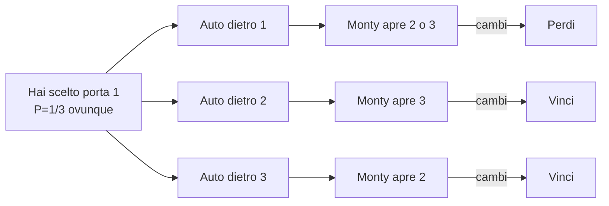

# Paradossi probabilistici

I "paradossi" probabilistici non sono contraddizioni: sono esempi in cui l'intuizione di Sistema 1 (vedi [dual process](24-dual-process.html)) è sistematicamente errata. Capirli è il modo più rapido di vaccinarsi contro errori di ragionamento reali.

## 1. Monty Hall

**Setup**: in un game show ci sono 3 porte; dietro una c'è un'auto, dietro le altre due una capra. Scegli una porta (diciamo la 1). Il conduttore Monty Hall, che sa cosa c'è dietro, apre una *altra* porta che nasconde una capra (diciamo la 3). Ti offre di cambiare scelta. Conviene?

**Intuizione errata**: "rimangono due porte, 50-50, è uguale".

**Risposta corretta**: cambia. Probabilità di vincere cambiando = $2/3$. Probabilità restando = $1/3$.

### 1.1 Albero bayesiano

Inizialmente $P(\text{auto dietro 1}) = P(\text{dietro 2}) = P(\text{dietro 3}) = 1/3$.

Se l'auto è dietro 1: Monty apre 2 o 3 (a caso). Se cambi → perdi.
Se l'auto è dietro 2: Monty deve aprire 3 (l'unica con capra fra 2, 3). Se cambi → vinci.
Se l'auto è dietro 3: Monty deve aprire 2. Se cambi → vinci.

Probabilità di vittoria cambiando: $1/3 + 1/3 = 2/3$.

### 1.2 Lezione

Monty Hall ha informazione che tu non hai. La sua scelta non è "neutrale" — dipende da dove sta l'auto. Trascurare questa correlazione condizionale è la radice dell'errore.

## 2. Base rate fallacy (cab problem, test medico)

Già visto in [Bayes](33-teorema-bayes.html). Riassumo: ignorare la prevalenza di base porta a sovrastimare drasticamente. Test del 99% accuratezza su malattia all'1‰ → solo ~9% probabilità di malattia dato il positivo.

**Lezione**: senza la base rate, un'evidenza apparentemente forte può essere debole.

## 3. Paradosso del compleanno

In una stanza con 23 persone, la probabilità che almeno due condividano il compleanno è $>50\%$ (precisamente 0,507).

L'intuizione errata calcola "23 su 365 ≈ 6%". Il calcolo corretto considera tutte le coppie: $\binom{23}{2} = 253$ coppie da confrontare.

$$P(\text{nessuna coppia}) = \prod_{k=0}^{22} \frac{365-k}{365} \approx 0{,}493$$

**Lezione**: cresce quadraticamente. Non confondere "probabilità che qualcuno coincida con TE" (lineare) con "probabilità che qualcuno coincida con qualcun altro" (quadratica).

## 4. Paradosso dei due bambini

> Una famiglia ha due figli. Almeno uno è maschio. Probabilità che entrambi siano maschi?

Spazio campionario: $\{MM, MF, FM, FF\}$ equiprobabili. Sai che $\bar{FF}$. Tra $\{MM, MF, FM\}$, solo 1 su 3 è $MM$.

**Risposta**: 1/3, NON 1/2.

L'errore è pensare "l'altro figlio è 50-50". Ma "almeno uno è maschio" è informazione asimmetrica: include "il primo è maschio" e "il secondo è maschio".

### 4.1 Variante "ho visto un maschio per strada"

Se invece di "almeno uno è maschio" sai "il primo è maschio" (informazione su uno specifico), allora la probabilità è 1/2. La differenza sta nel *processo di osservazione*: condizionare su una proprietà esistenziale ($\exists$) è diverso da condizionare su un individuo specifico.

## 5. Paradosso di Simpson

Una tendenza che appare in sottogruppi può scomparire o invertirsi nei dati aggregati.

### 5.1 Esempio classico — UC Berkeley 1973

Tassi di ammissione: maschi 44%, femmine 35%. Sembra discriminazione.

Ma dipartimento per dipartimento, le donne erano ammesse a tassi *uguali o superiori* ai maschi. Il "trucco": le donne si candidavano di più a dipartimenti molto selettivi (es. medicina), gli uomini a dipartimenti meno selettivi (es. ingegneria), distorcendo l'aggregato.

| Dip. | Candidate F | Ammesse F | Candidati M | Ammessi M |
|---|---|---|---|---|
| A (facile) | 100 | 80 (80%) | 800 | 600 (75%) |
| B (difficile) | 900 | 90 (10%) | 200 | 16 (8%) |
| Totale | 1000 | 170 (17%) | 1000 | 616 (61.6%) |

In ciascun dipartimento le donne avevano percentuali superiori, ma l'aggregato favoriva gli uomini perché si candidavano a dipartimenti più facili.

### 5.2 Lezione

Aggregare può ribaltare conclusioni. **Sempre disaggregare**, soprattutto quando esiste una variabile confondente. Vedi [causalità di Pearl](45-causalita-pearl.html) per la teoria che spiega quando l'aggregazione è legittima.

## 6. Paradosso di San Pietroburgo

Gioco: lanci una moneta finché esce testa. Se testa al $k$-esimo lancio, vinci $2^k$ €. Quanto pagheresti per giocare?

Valor atteso:

$$\mathbb{E}[\text{vincita}] = \sum_{k=1}^\infty \frac{1}{2^k} \cdot 2^k = 1 + 1 + 1 + \ldots = \infty$$

Eppure nessuno pagherebbe €100, figuriamoci infinito. Daniel Bernoulli (1738) propone come soluzione l'**utilità marginale decrescente**: l'utilità di guadagnare $2^k$ € non è $2^k$, ma qualcosa come $\log(2^k) = k$. Con utilità logaritmica, il valor atteso è finito.

Questa intuizione è alla base della **teoria dell'utilità attesa** (von Neumann–Morgenstern) e poi di prospect theory: vedi [teoria della decisione](35-teoria-decisione.html).

## 7. Paradosso dello scegliere bene

Hai due buste. So che una ha $x$ € e l'altra $2x$. Ne apri una, contiene 100 €. Devi scegliere se tenerla o cambiare con l'altra.

Argomento ingannevole: l'altra ha o 50 € o 200 €, equiprobabili. Valor atteso del cambio = $0{,}5 \cdot 50 + 0{,}5 \cdot 200 = 125 > 100$. Quindi cambia sempre. Ma se hai cambiato e ottenuto $y$ €, lo stesso ragionamento dice di cambiare di nuovo.

**Soluzione**: l'argomento usa probabilità condizionali in modo scorretto. Il vero spazio campionario dipende dalla distribuzione su $x$, che non esiste se uniforme su tutti i reali. Con una distribuzione propria su $x$ il paradosso si dissolve.

## 8. Paradosso di Sleeping Beauty

Bella addormentata si iberna. Lanciano una moneta. Se testa, la svegliano una volta (lunedì). Se croce, due volte (lunedì e martedì), ma dopo lunedì la riaddormentano con farmaci che cancellano la memoria. Le viene chiesto: "qual è la probabilità che la moneta sia stata testa?".

**Halfer**: 1/2 (la moneta è ancora la stessa, non c'è nuova evidenza).

**Thirder**: 1/3 (su molte ripetizioni dell'esperimento, dei "risvegli" 1/3 sono in scenari testa).

Dibattito filosofico aperto. Mostra che "probabilità soggettiva di un evento osservato" dipende dal processo di osservazione, non solo dal mondo. Tema correlato a **anthropic reasoning** in cosmologia (Carter 1974).

## Esercizi

  
Esercizio 1 — Variante di Monty Hall con 10 porte: una con auto, 9 con capre. Scegli una, Monty apre 8 porte con capra. Probabilità di vincere cambiando?

Probabilità che la prima scelta fosse l'auto = 1/10. Probabilità che fosse capra (e quindi cambiando vinci) = 9/10. **Cambiando vinci con probabilità 9/10**. Lezione: più porte amplificano l'effetto, lo rendono "ovvio".

  
Esercizio 2 — In una scuola con 60% maschi e 40% femmine, in matematica i bravi sono 80% dei maschi e 90% delle femmine, ma in totale i bravi sono 84%. Verifica.

$0{,}6 \cdot 0{,}8 + 0{,}4 \cdot 0{,}9 = 0{,}48 + 0{,}36 = 0{,}84$. ✓ Coerente. Notare che senza disaggregare per genere, la conclusione "le femmine sono migliori in matematica" emerge solo dai sotto-gruppi.

## Sintesi

- **Monty Hall**: cambia sempre. 2/3 vs 1/3.
- **Base rate**: senza prior, le evidenze ingannano.
- **Compleanni**: cresce quadraticamente nelle coppie, non lineare.
- **Due bambini**: 1/3, non 1/2 — condizione esistenziale vs individuale.
- **Simpson**: aggregazione ribalta conclusioni; disaggrega.
- **San Pietroburgo**: valor atteso infinito ma rifiutato → utilità marginale decrescente.
- **Sleeping Beauty**: 1/2 vs 1/3 — dibattito su come trattare osservazioni multiple.

## Letture

- Mlodinow, *The Drunkard's Walk* (2008) — divulgativo, esempi.
- Hand, *The Improbability Principle* (2014).
- Diaconis & Skyrms, *Ten Great Ideas about Chance* (2017).
