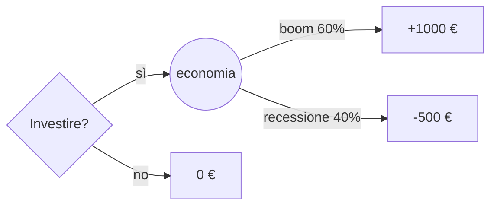

# Teoria della decisione: utilità attesa e prospect theory

Sotto incertezza, qual è la scelta razionale? La teoria della decisione cerca di rispondere. Tre tappe storiche: l'utilità attesa, gli assiomi di von Neumann–Morgenstern, e poi la sua demolizione empirica da parte di Kahneman e Tversky con la prospect theory.

## 1. Decisioni sotto rischio vs sotto incertezza (Knight 1921)

- **Rischio**: probabilità note. Es. lancio dado, gioco del lotto.
- **Incertezza** (knightiana): probabilità sconosciute o non assegnabili. Es. probabilità di una crisi geopolitica.

La teoria della decisione classica tratta solo il rischio. L'incertezza profonda è argomento di [Knight, Taleb, cigni neri](37-knightian-cigni-neri.html).

## 2. Valor atteso e suo limite

Decisione razionale = scelta che massimizza il valor atteso:

$$\mathbb{E}[X] = \sum_i p_i \cdot x_i$$

Già il paradosso di San Pietroburgo (vedi [paradossi probabilistici](34-paradossi-probabilistici.html)) mostra il limite: valor atteso infinito ma nessuno pagherebbe più di poche decine di € per giocarci.

## 3. Utilità attesa (Bernoulli 1738, vNM 1944)

Daniel Bernoulli propone di sostituire i guadagni grezzi con la loro **utilità** $u(x)$, tipicamente concava (utilità marginale decrescente):

$$\mathbb{E}[u(X)] = \sum_i p_i \cdot u(x_i)$$

Esempio: $u(x) = \log x$. Pagheresti meno di 100 € per Pietroburgo perché $\log(2^k)/2^k$ ha somma finita.

### 3.1 Assiomi di von Neumann–Morgenstern (1944)

Una persona razionale che soddisfi quattro assiomi (completezza, transitività, indipendenza, continuità) si comporta *come se* massimizzasse $\mathbb{E}[u]$ per qualche $u$ unica fino a trasformazione affine. È un teorema di rappresentazione: razionalità ⇔ utilità attesa.

### 3.2 Forme di $u$ e atteggiamento al rischio

- **$u$ concava** ($u'' < 0$): avversione al rischio. Preferisci 50€ sicuri a 0/100€ con probabilità 1/2.
- **$u$ lineare**: neutralità al rischio. Indifferente.
- **$u$ convessa** ($u'' > 0$): propensione al rischio.

Misura di Arrow-Pratt:

$$r(x) = -\frac{u''(x)}{u'(x)}$$

avversione assoluta al rischio.

## 4. Paradossi che rompono vNM

### 4.1 Paradosso di Allais (1953)

Scelta A: 100% di 1 milione $.
Scelta B: 89% di 1 milione, 10% di 5 milioni, 1% di nulla.
Maggior parte sceglie A (avversione al rischio).

Scelta C: 89% di nulla, 11% di 1 milione.
Scelta D: 90% di nulla, 10% di 5 milioni.
Maggior parte sceglie D.

Sotto vNM, se preferisci A a B, dovresti preferire C a D. La preferenza simultanea (A>B, D>C) viola l'assioma di indipendenza. Allais ha mostrato che persone razionali violano sistematicamente vNM.

### 4.2 Paradosso di Ellsberg (1961)

Urna con 90 palline: 30 rosse, 60 nere-o-gialle (proporzione sconosciuta).

Scommessa A: vinci se peschi rossa.
Scommessa B: vinci se peschi nera.

La maggior parte sceglie A (ambiguity aversion). Ma poi:

Scommessa C: vinci se peschi rossa o gialla.
Scommessa D: vinci se peschi nera o gialla.

La maggior parte sceglie D. Le preferenze A>B e D>C non sono compatibili con NESSUNA distribuzione su nera/gialla. Le persone preferiscono **probabilità note** anche quando sub-ottimali — *ambiguity aversion*.

## 5. Prospect theory (Kahneman & Tversky 1979)

Una teoria descrittiva (non normativa) del modo in cui le persone effettivamente decidono.

### 5.1 Tre fenomeni chiave

**Reference point**: le persone non valutano la ricchezza finale, ma i **guadagni e perdite rispetto a un punto di riferimento** (status quo, aspettativa).

**Loss aversion**: una perdita di $x$ duole più di un guadagno equivalente. Coefficiente empirico $\lambda \approx 2{,}25$.

**Diminishing sensitivity**: sia per guadagni sia per perdite, l'utilità marginale decresce con la distanza dal punto di riferimento (concava in gain, convessa in loss).

### 5.2 La funzione del valore $v(x)$

$$v(x) = \begin{cases} x^\alpha & \text{se } x \ge 0 \\ -\lambda \cdot (-x)^\beta & \text{se } x < 0 \end{cases}$$

con $\alpha, \beta \approx 0{,}88$ e $\lambda \approx 2{,}25$.

Grafico schematico (descrittivo, non in scala):

<svg viewBox="0 0 400 240" xmlns="http://www.w3.org/2000/svg" style="background:#181834">
  <line x1="20" y1="120" x2="380" y2="120" stroke="#9890b8" stroke-width="1"/>
  <line x1="200" y1="20" x2="200" y2="220" stroke="#9890b8" stroke-width="1"/>
  <text x="370" y="135" fill="#ecebff" font-size="11">x</text>
  <text x="206" y="28" fill="#ecebff" font-size="11">v(x)</text>
  <path d="M 200 120 Q 280 100 360 80" stroke="#4cb38a" stroke-width="2" fill="none"/>
  <path d="M 200 120 Q 120 175 40 230" stroke="#e07a8d" stroke-width="2" fill="none"/>
  <text x="270" y="95" fill="#4cb38a" font-size="11">guadagni: concava</text>
  <text x="60" y="195" fill="#e07a8d" font-size="11">perdite: convessa e ripida</text>
  <text x="206" y="135" fill="#9a8cf0" font-size="10">reference</text>
</svg>

Funzione del valore di Kahneman–Tversky: asimmetrica, ripida nelle perdite.

### 5.3 Funzione di ponderazione delle probabilità $w(p)$

Le persone **sovrastimano probabilità piccole** (es. lotterie, polizze) e **sottostimano probabilità grandi**. La forma a "S inversa":

$$w(p) = \frac{p^\gamma}{(p^\gamma + (1-p)^\gamma)^{1/\gamma}}$$

con $\gamma \approx 0{,}65$. Spiega perché si compra il biglietto della lotteria *e* l'assicurazione casa contemporaneamente — sembrano contraddittori sotto utilità attesa.

### 5.4 Framing

Lo stesso problema descritto come "guadagni" vs "perdite" produce scelte opposte.

**Asian disease (Tversky-Kahneman 1981)**: 600 persone malate.
Frame guadagno: programma A salva 200 sicuro, B salva 600 con $p=1/3$. La maggioranza sceglie A (avversione al rischio nei guadagni).
Frame perdita: programma C uccide 400 sicuri, D uccide 600 con $p=2/3$. La maggioranza sceglie D (propensione al rischio nelle perdite).

A e C sono identici (200 vivi = 400 morti su 600). Stesso problema, scelte invertite dal framing.

## 6. Implicazioni pratiche

- **Polizze**: vendono perché sovrastimi piccole probabilità ($w(p) > p$) e detesti perdite (loss aversion).
- **Lotterie**: stesso meccanismo opposto direzione.
- **Investimenti**: gli investitori tengono troppo a lungo i titoli in perdita (vendita realizzerebbe la perdita, $\lambda$ duole) e vendono troppo presto i vincenti (disposition effect, Shefrin-Statman 1985).
- **Negoziazione**: presenta le offerte come guadagni dall'anchor, non come perdite.
- **Marketing**: "perdi il 30% se non ti iscrivi" funziona meglio di "guadagni il 30% se ti iscrivi".

## 7. Decisioni a più stadi: matrici e alberi

Per problemi complessi si usano:

- **Decision tree**: nodi quadrati (decisione) e cerchi (caso), propagi il valor atteso (o utilità) all'indietro.
- **Matrice dei payoff**: righe = strategie, colonne = stati del mondo. Vedi [teoria dei giochi](41-negoziazione-teoria-giochi.html).
- **Influence diagram**: variante con grafi orientati (Howard, Matheson).

Valor atteso del sì = $0{,}6 \cdot 1000 + 0{,}4 \cdot (-500) = 400$. Conviene rispetto a 0.

## Esercizi

  
Esercizio 1 — Con $u(x)=\sqrt{x}$, preferisci 50 € sicuri o lancio di moneta tra 0 e 100 €?

$u(50) = \sqrt{50} \approx 7{,}07$.
$\mathbb{E}[u(\text{lancio})] = 0{,}5 \cdot \sqrt{0} + 0{,}5 \cdot \sqrt{100} = 0 + 5 = 5$.

$u(50) > \mathbb{E}[u(\text{lancio})]$: preferisci il sicuro. La utilità concava genera avversione al rischio.

  
Esercizio 2 — Spiega il "disposition effect" via prospect theory.

Hai comprato un titolo a 100 €. Ora è a 80. La "perdita" di 20 € pesa molto (loss aversion); vendere "realizzerebbe" la perdita. Speri di tornare a 100, anche se l'analisi razionale dice "vendi". La curva convessa nelle perdite ti spinge a tollerare rischio. Risultato: i piccoli investitori conservano i perdenti troppo a lungo.

## Sintesi

- Utilità attesa (Bernoulli, vNM): razionalità ⇔ massimizzazione $\mathbb{E}[u]$.
- $u$ concava → avversione al rischio.
- Allais ed Ellsberg falsificano vNM come descrizione del comportamento reale.
- Prospect theory: reference point, loss aversion ($\lambda \approx 2{,}25$), diminishing sensitivity, sovrappesatura probabilità piccole.
- Framing produce scelte opposte su problemi identici.

## Letture

- von Neumann & Morgenstern, *Theory of Games and Economic Behavior* (1944).
- Kahneman & Tversky, *Prospect Theory*, Econometrica (1979).
- Kahneman, *Thinking Fast and Slow* (2011).
- Wakker, *Prospect Theory* (2010) — trattamento tecnico.
