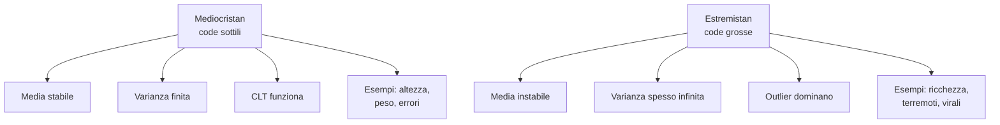

# Knightian uncertainty, cigni neri, antifragile

La teoria della decisione standard presuppone che le probabilità degli esiti siano note, o almeno stimabili. Ma cosa succede quando *non sappiamo nemmeno che cosa non sappiamo*? Questa sezione esplora il confine fra rischio (probabilità nota) e incertezza radicale (probabilità ignote o non definibili), passando per Frank Knight (1921), Nassim Nicholas Taleb (cigni neri, antifragile), e i loro critici. È materiale operativo per chi prende decisioni in finanza, geopolitica, R&D, pandemie — ovunque la distribuzione di probabilità sia essa stessa incognita.

## 1. Knight 1921: rischio vs incertezza

Frank Knight, economista di Chicago, in *Risk, Uncertainty and Profit* (1921) introduce una distinzione che la teoria neoclassica aveva offuscato:

- **Rischio**: situazione in cui gli esiti possibili sono noti e la loro distribuzione di probabilità è quantificabile. Esempio: lanciare un dado equilibrato, vendere assicurazioni auto con dati attuariali decennali.
- **Incertezza (knightian)**: situazione in cui gli esiti o le loro probabilità non sono conoscibili a priori. Esempio: lanciare un nuovo prodotto in un mercato emergente, prevedere l'evoluzione politica di un paese.

Formalmente, sotto rischio possiamo scrivere il valore atteso $\mathbb{E}[X] = \sum_i p_i x_i$. Sotto incertezza knightiana, i $p_i$ non sono dati. Per Knight, **il profitto economico è il premio per sopportare incertezza knightiana**: il rischio puro viene assorbito dal mercato assicurativo, ciò che resta all'imprenditore è il residuo non assicurabile.

> Knight scrive: «It is *un*-measurable uncertainty that gives the entrepreneur his peculiar function». Senza incertezza vera, non esisterebbe né profitto né impresa.

La distinzione anticipa di decenni il dibattito su ambiguità (Ellsberg, 1961 — vedi [Paradossi probabilistici](34-paradossi-probabilistici.html)) e oggi torna centrale grazie a Taleb.

## 2. Taleb: il cigno nero

Nassim Nicholas Taleb, trader e saggista libanese-americano, in *The Black Swan* (2007) popolarizza un'idea filosofica antica con un'immagine forte. Prima della scoperta dell'Australia, gli europei credevano per induzione enumerativa che tutti i cigni fossero bianchi. Bastò un singolo cigno nero (*Cygnus atratus*) a falsificare millenni di osservazioni — un'eco diretta di Popper (vedi [Metodo scientifico e Popper](43-metodo-scientifico-popper.html)).

Un **cigno nero** è un evento con tre proprietà congiunte:

1. **Outlier**: sta al di fuori del regno delle aspettative ordinarie; nulla nel passato indica plausibilmente la sua possibilità.
2. **Impatto estremo**: produce conseguenze sproporzionate.
3. **Retrospettiva esplicativa**: dopo che è accaduto, la mente umana confeziona una narrazione che lo rende prevedibile e spiegabile (*hindsight bias*).

Esempi tipici nella narrativa talebiana: l'attacco dell'11 settembre 2001, la crisi finanziaria del 2008, il successo improvviso di Google, la caduta del Muro di Berlino. La pandemia di COVID-19 è dibattuta: per Taleb stesso *non* è un cigno nero, ma un **cigno bianco** ignorato — epidemiologi (e lo stesso Taleb in *The Black Swan*) la prevedevano da decenni.

## 3. Mediocristan vs Estremistan

Taleb classifica i fenomeni in due "province":

- **Mediocristan**: dominio in cui nessuna singola osservazione altera significativamente la media o il totale. Distribuzioni a coda sottile (gaussiane, esponenziali). Esempi: altezza umana, peso, errori di misura. Se aggiungi una persona scelta a caso a un gruppo di 1000, anche fosse il più alto del mondo (2,72 m), la media si sposta di millimetri.
- **Estremistan**: dominio in cui una singola osservazione può dominare il totale. Distribuzioni a coda grossa (power law, log-normale, Cauchy). Esempi: ricchezza, vendite di libri, vittime di guerre, capitalizzazione di mercato. Se aggiungi Bezos a un gruppo di 1000 persone, la ricchezza media esplode.

$$\text{Mediocristan}: \quad P(X > x) \sim e^{-\lambda x} \quad \text{(decadimento esponenziale)}$$

$$\text{Estremistan}: \quad P(X > x) \sim x^{-\alpha} \quad \text{(power law, } \alpha \text{ piccolo)}$$

In Estremistan i momenti possono divergere: una Cauchy ha media non definita; una power law con $\alpha \le 2$ ha varianza infinita. **Le statistiche classiche (media campionaria, CLT) smettono di essere affidabili.** Calcolare il VaR di un portafoglio assumendo normalità in Estremistan equivale a navigare con una bussola che punta a sud.

## 4. Antifragile: oltre il robusto

In *Antifragile* (2012) Taleb propone una tripartizione che la lingua inglese (e l'italiano) non codificavano:

| Categoria   | Comportamento sotto shock | Esempio                  |
|-------------|---------------------------|--------------------------|
| Fragile     | Si rompe                  | Calice di cristallo      |
| Robusto     | Resta uguale              | Roccia                   |
| Antifragile | **Migliora**              | Sistema immunitario, muscoli sotto carico |

Un sistema antifragile non solo sopravvive ai cigni neri, ne *trae beneficio*. Formalmente, Taleb caratterizza l'antifragilità tramite la **convessità** della funzione di payoff rispetto alla volatilità $\sigma$.

### 4.1 Convexity / concavity

Sia $f(x)$ il payoff in funzione di un fattore stocastico $x$. Per la disuguaglianza di Jensen:

$$f \text{ convessa} \implies \mathbb{E}[f(X)] \ge f(\mathbb{E}[X])$$
$$f \text{ concava} \implies \mathbb{E}[f(X)] \le f(\mathbb{E}[X])$$

L'aumento di volatilità $\sigma$ aiuta una funzione convessa (antifragile) e danneggia una concava (fragile). Caso scuola: tassisti vs dipendenti pubblici. Il tassista beneficia di una giornata caotica (più richiesta, sciopero metro, eventi); l'impiegato con stipendio fisso e poca opzionalità non guadagna nulla dal caos e perde tutto se l'ente chiude.

### 4.2 La barbell strategy

Strategia "a manubrio": evitare il centro mediano, combinare estremi.

- **90%** in asset estremamente sicuri (cash, titoli di stato a brevissima scadenza).
- **10%** in scommesse altamente speculative con downside limitato (call out-of-the-money, venture, opzioni asimmetriche).

Il payoff è **convesso**: il 90% è invariante (loss massima limitata all'inflazione), il 10% può moltiplicarsi 100× su un cigno nero positivo. Si massimizza l'esposizione all'upside minimizzando la rovina (*ruin*).

Antitesi: il portafoglio "intelligente" tutto in obbligazioni BBB e azioni mid-cap. Sembra prudente, ma è esposto sia al downside (default a catena) sia *zero* all'upside straordinario.

## 5. Esempio lavorato: due fondi, una crisi

Fondo A (concavo): ogni anno rende +5% se non c'è crisi, $-80\%$ se c'è crisi. Probabilità annua di crisi 5%.

Fondo B (convesso, barbell): ogni anno rende $-1\%$ se non c'è crisi, $+200\%$ se c'è crisi.

Valore atteso annuo:
$$\mathbb{E}[A] = 0.95 \cdot 0.05 + 0.05 \cdot (-0.80) = 0.0475 - 0.04 = +0.75\%$$
$$\mathbb{E}[B] = 0.95 \cdot (-0.01) + 0.05 \cdot 2.00 = -0.0095 + 0.10 = +9.05\%$$

Il fondo B *batte* A in valore atteso, ma soprattutto **sopravvive** alla crisi (anzi prospera). Su 30 anni con almeno una crisi, A può azzerarsi (ruin), B esplode. Il punto cruciale di Taleb: **in Estremistan il valore atteso è quasi irrilevante; conta la sopravvivenza** (vedi [Teoria della decisione](35-teoria-decisione.html), criterio di Kelly e ergodicità).

## 6. Critiche al concetto

Il framework Knight–Taleb ha ricevuto critiche serie:

1. **Tautologia retrospettiva**: definire "cigno nero" come "non previsto" rischia di essere circolare. Ogni evento sufficientemente raro lo è.
2. **Vaghezza operativa**: in pratica, distinguere rischio knightiano da rischio con priors mal calibrati è difficile. La statistica bayesiana (vedi [Teorema di Bayes](33-teorema-bayes.html)) ammette priors soggettivi e aggiorna — non c'è incertezza non-quantificabile in linea di principio.
3. **Successi predittivi reali**: meteorologi, attuari, epidemiologi *predicono* eventi rari (ma non univoci) con calibrazione decente. Tetlock (*Superforecasting*) dimostra che la previsione di eventi "imprevedibili" è migliorabile col metodo.
4. **Polemicità di Taleb**: lo stile aforistico e l'attacco frontale a economisti accademici (Merton, Markowitz, Shiller) ha alienato parti della comunità che condividono punti tecnici.

Una sintesi equilibrata: il concetto di knightian uncertainty è *operazionalmente utile* quando le distribuzioni storiche non sono affidabili (cambi di regime, regole non stazionarie); la barbell strategy è un'istanza di **principio di precauzione asimmetrico**, valido ovunque il downside sia non-ergodico (rovina assorbente).

## 7. Esempi storici discussi

- **2008**: per Taleb, archetipo di cigno nero — ma molti (Roubini, Rajan, alcuni hedge fund) lo avevano previsto. Forse era cigno "grigio".
- **COVID-19**: pandemie da coronavirus erano previste in piani sanitari nazionali da SARS (2003). Lo *shock politico-economico* fu sorpresa, la patologia no.
- **Crollo URSS 1989-91**: pochi sovietologi lo previdero, ma alcuni (Amalrik 1969, Todd 1976) sì. Caso classico in cui il "non si poteva sapere" era pigrizia analitica.
- **Successo di Bitcoin**: cigno nero positivo? O fenomeno power-law prevedibile per chi capiva crittografia e moneta?

## 8. Esercizio

  
Esercizio — barbell vs portafoglio bilanciato

Hai 100.000 €. Devi scegliere fra:

- **Portafoglio C (centrale)**: 100% in un ETF mondiale azionario, rendimento atteso annuo +7%, deviazione standard 18%, ma in un crash a $-3\sigma$ perdi 45%.
- **Portafoglio B (barbell)**: 90.000 € in T-bill a 3 mesi (resa 3%) + 10.000 € in opzioni call out-of-the-money su un indice tech, costo annuo intero ($-100\%$ del 10%), ma con probabilità 5% paga 30× (cioè 300.000 €).

Calcola valore atteso annuo e perdita massima.

**Portafoglio C**:
$$\mathbb{E}[C] = 100\,000 \cdot 1.07 = 107\,000 \text{ €}$$
Loss massima ($-3\sigma$): $-45\%$ = $-45\,000$ €.

**Portafoglio B**:
- T-bill: $90\,000 \cdot 1.03 = 92\,700$ € (sicuro).
- Opzioni: con probabilità 0.95 perdo 10.000 €; con probabilità 0.05 guadagno $10\,000 \cdot 30 - 10\,000 = 290\,000$ €.
- Atteso opzioni: $0.95 \cdot (-10\,000) + 0.05 \cdot 290\,000 = -9\,500 + 14\,500 = +5\,000$ €.
- Totale atteso B: $92\,700 + 10\,000 + 5\,000 - 10\,000 = 97\,700$ € *se* perdo opzioni; o $92\,700 + 300\,000 = 392\,700$ € se vincono. Valore atteso $\approx 102\,700$ €.

C ha valore atteso più alto ma loss potenziale −45.000 €. B ha valore atteso simile ma loss massima limitata a −7.300 € (in valore reale: 92.700 − 100.000 = −7.300). E mantiene upside teorico di +292.700 €. **B è convesso, C è circa lineare-concavo**.

Conclusione: a parità di valore atteso, B è preferibile in Estremistan perché riduce il rischio di rovina mentre conserva esposizione asimmetrica all'upside.

## Sintesi

- **Knight (1921)**: rischio = probabilità note; incertezza = probabilità sconosciute. Il profitto è il premio per l'incertezza non assicurabile.
- **Cigno nero (Taleb)**: outlier + impatto estremo + razionalizzazione retrospettiva.
- **Mediocristan vs Estremistan**: in coda grossa la statistica classica non funziona; outlier dominano.
- **Antifragile**: oltre il robusto, beneficia di shock. Convessità del payoff rispetto a volatilità.
- **Barbell strategy**: 90% sicuro + 10% scommesse asimmetriche → payoff convesso, ruin esclusa.
- **Critiche**: circolarità definitoria, vaghezza operativa, successi predittivi reali (Tetlock).

## Letture

- Frank H. Knight, *Risk, Uncertainty and Profit*, 1921 (libero su archive.org).
- Nassim N. Taleb, *Fooled by Randomness* (2001), *The Black Swan* (2007), *Antifragile* (2012), *Skin in the Game* (2018).
- Philip E. Tetlock, *Superforecasting*, 2015 — risposta empirica al pessimismo predittivo.
- Mervyn King & John Kay, *Radical Uncertainty*, 2020 — sintesi accademica equilibrata.
- Daniel Ellsberg, "Risk, Ambiguity, and the Savage Axioms", *QJE* 1961 — sull'ambiguità formalizzata.
