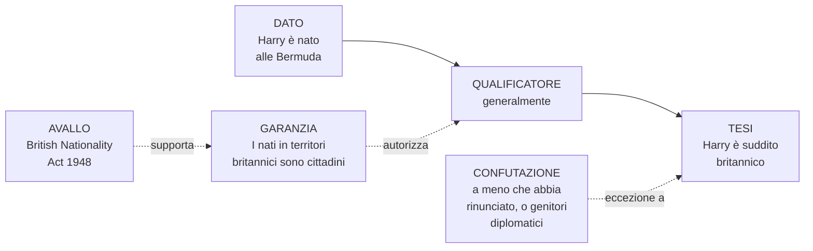
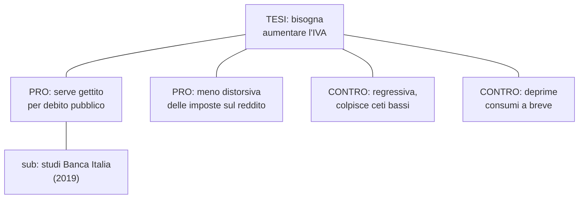

# Argomentazione: Toulmin, Walton, argument mapping

La logica formale (sezioni 7–13) tratta argomenti deduttivi astratti, dove la validità si decide con tabelle di verità. Ma il 95% degli argomenti che incontriamo — in tribunale, sui giornali, nelle riunioni di lavoro — non è deduttivo: è **argomentazione informale**, dove le premesse supportano la conclusione *con un certo grado* di forza, non con necessità. Stephen Toulmin, nel 1958, ha proposto un modello che è diventato lo standard de facto per analizzare questo tipo di ragionamento. Walton, decenni dopo, lo ha esteso con un catalogo di schemi argomentativi e domande critiche. Insieme costituiscono la cassetta degli attrezzi della **logica informale**.

## 1. Toulmin 1958: la rivolta contro il sillogismo

Stephen Toulmin (1922–2009), filosofo britannico, pubblica *The Uses of Argument* nel 1958. La tesi centrale: il sillogismo aristotelico ("tutti gli uomini sono mortali, Socrate è uomo, quindi Socrate è mortale") cattura troppo poco. Gli argomenti reali — del giurista, del medico, dell'editorialista — hanno una struttura più ricca. Toulmin propone sei componenti:

| Componente | Inglese | Funzione |
|------------|---------|----------|
| Tesi / pretesa | **Claim (C)** | La conclusione che vuoi sostenere |
| Dati / fondamenti | **Data / Grounds (D)** | I fatti che adduci a supporto |
| Garanzia | **Warrant (W)** | Il principio generale che collega D a C |
| Avallo | **Backing (B)** | Ciò che giustifica la garanzia stessa |
| Qualificatore | **Qualifier (Q)** | Grado di certezza ("probabilmente", "presumibilmente") |
| Confutazione | **Rebuttal (R)** | Eccezioni e condizioni in cui la tesi cade |

In forma schematica:

$$\underbrace{D}_{\text{Dato}} \xrightarrow[W]{\text{(perché } W\text{)}} \underbrace{Q\ C}_{\text{Conclusione qualificata}} \quad \text{a meno che } R$$

Il **warrant** è la chiave: è la regola di inferenza che autorizza il passaggio dai dati alla tesi. Spesso resta implicito — esplicitarlo è metà del lavoro di analisi.

## 2. Esempio diagrammato

Argomento: «Harry è suddito britannico (C), perché è nato alle Bermuda (D). I nati in territori britannici sono cittadini britannici (W); il British Nationality Act 1948 lo stabilisce (B). Generalmente (Q) — a meno che non abbia rinunciato alla cittadinanza o uno dei genitori fosse diplomatico straniero (R)».

Si noti che lo schema *non* è un sillogismo: la conclusione è qualificata (non necessaria) e ammette eccezioni. È **defeasible reasoning** — vedi anche [Logiche non classiche](18-logiche-non-classiche.html).

## 3. Walton: gli schemi argomentativi

Douglas N. Walton (1942–2020), filosofo canadese, sviluppa negli anni '90 un catalogo di **argument schemes**: pattern ricorrenti di argomentazione plausibile, ciascuno con la sua lista di *domande critiche* (CQ) che testano la sua tenuta. Il riferimento è *Argumentation Schemes* (Walton, Reed, Macagno, 2008), oltre 60 schemi catalogati.

### 3.1 Schema da autorità

> **Premessa maggiore**: $E$ è esperto nel dominio $D$.
> **Premessa minore**: $E$ asserisce che $A$ è vero in $D$.
> **Conclusione (plausibile)**: $A$ è vero.

**Domande critiche**:
1. *Expertise CQ*: $E$ è davvero esperto in $D$?
2. *Field CQ*: $A$ è davvero nel dominio $D$?
3. *Opinion CQ*: $E$ ha realmente asserito $A$ (citazione accurata)?
4. *Trustworthiness CQ*: $E$ è personalmente attendibile (no conflitti di interesse)?
5. *Consistency CQ*: altre fonti autorevoli concordano con $E$?
6. *Backup evidence CQ*: $E$ può fornire prove per $A$?

Se queste domande non hanno risposte soddisfacenti, l'argomento da autorità collassa nella fallacia *ad verecundiam* (vedi [Fallacie informali di rilevanza](21-fallacie-informali-rilevanza.html)).

### 3.2 Altri schemi notevoli

- **Argomento da segno**: «c'è fumo, dunque c'è fuoco». CQ: il segno è univoco? Altre cause possibili?
- **Argomento da analogia**: «$A$ è simile a $B$; $B$ ha proprietà $P$; quindi $A$ ha $P$». CQ: la somiglianza è rilevante? Ci sono dis-analogie cruciali?
- **Argomento da conseguenze**: «se accade $A$ seguirà $B$; $B$ è desiderabile/disastroso; quindi pro/contro $A$». CQ: il legame causale è solido? Ci sono altre conseguenze trascurate?
- **Argomento dal caso popolare** (*ad populum* se mal usato): «tutti credono $A$; dunque $A$». CQ: il gruppo è competente? Indipendenza dei pareri?
- **Argomento da causa a effetto**: vedi sezione [Causalità: Hume, Pearl](45-causalita-pearl.html).

## 4. Argument mapping

Mappare un argomento significa rappresentarne esplicitamente la struttura inferenziale come un grafo orientato. Strumenti software dedicati:

- **Rationale** (van Gelder, Austhink): commerciale, integrato a curricula universitari australiani.
- **Argunet**: open source, basato su standard Argument Interchange Format.
- **Kialo**: piattaforma collaborativa per dibattiti pubblici online.
- **MindMup, Coggle, draw.io**: generici ma utilizzabili.

Convenzione grafica tipica:
- Tesi al vertice (o al centro).
- Frecce verdi continue per premesse di supporto (pro).
- Frecce rosse tratteggiate per obiezioni (contra).
- Sotto-argomenti annidati: ogni premessa può a sua volta essere conclusione di un sotto-argomento.

Mappare costringe a (a) separare premesse implicite, (b) distinguere supporto da illustrazione, (c) localizzare il *vero* punto di disaccordo.

## 5. Esempio italiano analizzato

Editoriale (parafrasato e neutralizzato — l'origine ideologica è secondaria): «Bisogna ridurre il numero di parlamentari (C). L'Italia ha più rappresentanti pro-capite della Francia (D1). I parlamentari italiani costano 1,2 miliardi l'anno (D2). Una democrazia efficiente non richiede assemblee gonfiate (W). La Commissione europea raccomanda razionalizzazione (B). Probabilmente (Q) la riforma migliorerebbe efficienza — a meno che la rappresentatività territoriale ne soffra in modo irreversibile (R)».

| Toulmin | Estrazione |
|---------|-----------|
| Claim (C) | Ridurre numero parlamentari |
| Data (D) | (D1) ratio Italia > Francia; (D2) costo 1,2 mld |
| Warrant (W) | Democrazia efficiente ↛ assemblea gonfiata |
| Backing (B) | Raccomandazione UE |
| Qualifier (Q) | "probabilmente" |
| Rebuttal (R) | Salvo perdita rappresentanza territoriale |

Domande critiche stile Walton:
- (D1) Confronto Italia-Francia è omogeneo per popolazione, federalismo, bicameralismo perfetto? In Italia ci sono *due* camere paritarie; in Francia il Senato è asimmetrico.
- (D2) Il costo include solo emolumenti o anche staff e funzionamento? Una cifra senza struttura non è argomento.
- (W) "Efficiente" rispetto a cosa — produttività legislativa, qualità delle leggi, costo? Definizione operativa mancante.
- (R) La confutazione è ammessa ma non quantificata: quanto perde rappresentanza al Sud, nelle isole?

Esercizio metacognitivo: *anche* se la conclusione politica fosse condivisibile, l'argomento sopra è **debolmente articolato**. Lo schema Toulmin rende visibili i punti di pressione.

## 6. Difetti del modello

Toulmin è uno strumento potente ma non perfetto:

1. **Confine sfumato W/B**: in pratica è arduo separare la garanzia (regola) dal suo avallo (evidenza per la regola). Vari analisti propongono di fondere W e B.
2. **Non-formalità**: il modello non si presta a verifica meccanica; non c'è "tabella di verità" per un argomento Toulmin.
3. **Insufficienza per argomenti complessi**: un editoriale di 5000 parole con 30 premesse non si mappa banalmente; serve gerarchia, e qui Toulmin lascia spazio alla soggettività dell'analista.
4. **Statico**: cattura un argomento in una posa; non modella la *dinamica* del dibattito (per quella servono i sistemi di argumentation formale di Dung, 1995, basati su grafi di attacco).

Walton risponde in parte alle critiche col concetto di **dialogue type** (persuasion, inquiry, negotiation, deliberation, information seeking, eristic): ogni schema va valutato nel suo *contesto dialogico*, non in vacuo.

## 7. Esercizio

  
Esercizio — analizza secondo Toulmin

Argomento (immaginario, fonte: presunto editoriale): «Vaccinare obbligatoriamente i bambini in età scolare è giustificato. La copertura sotto il 95% mette a rischio l'immunità di gregge per il morbillo. Studi epidemiologici (OMS, Lancet) mostrano focolai in aree con copertura calante. La salute pubblica prevale, in genere, sulla scelta individuale quando esiste esternalità negativa. Salvo casi di controindicazione medica documentata.»

Estrai i sei elementi.

| Elemento | Estrazione |
|----------|-----------|
| **Claim** | Vaccinazione obbligatoria nei bambini in età scolare è giustificata |
| **Data** | Copertura sotto 95% mette a rischio immunità di gregge; focolai osservati in aree a bassa copertura |
| **Warrant** | Salute pubblica > scelta individuale quando c'è esternalità negativa |
| **Backing** | Studi OMS e *Lancet*; teoria delle esternalità in economia pubblica |
| **Qualifier** | "in genere" |
| **Rebuttal** | Controindicazione medica documentata |

Domande critiche da porre:
- I dati epidemiologici sono replicati? (vedi [Metodo scientifico](43-metodo-scientifico-popper.html))
- La soglia del 95% vale per ogni patologia? (no: per la pertosse serve >92%, per il morbillo >95%)
- Il warrant è un principio universalmente condiviso o una premessa contestata? (è teoria filosofico-politica, contestabile)
- La confutazione copre anche obiezioni *non* mediche (es. religiose, di coscienza)? Se no, l'argomento ignora rebuttal rilevanti.

## Sintesi

- **Toulmin 1958**: claim, data, warrant, backing, qualifier, rebuttal — anatomia dell'argomento informale.
- **Defeasibility**: gli argomenti informali sono qualificati e revocabili, non deduttivi.
- **Walton**: argument schemes con *critical questions* — diagnosi sistematica della tenuta argomentativa.
- **Argument mapping**: strumento per esplicitare la struttura, individuare premesse implicite e punti di disaccordo.
- **Esempio italiano**: anche tesi politiche condivisibili possono essere debolmente argomentate; il metodo è neutrale.
- **Limiti**: confini W/B sfumati, non-formalità, non cattura la dinamica dialogica (vedi Dung 1995).

## Letture

- Stephen Toulmin, *The Uses of Argument*, Cambridge UP, 1958 (ed. aggiornata 2003).
- Douglas Walton, Christopher Reed, Fabrizio Macagno, *Argumentation Schemes*, Cambridge UP, 2008.
- Phan Minh Dung, "On the acceptability of arguments...", *Artificial Intelligence* 77 (1995): 321–357 — argumentation formale.
- Tim van Gelder, "Teaching critical thinking: some lessons from cognitive science", *College Teaching* 53.1 (2005).
- Per pratica: piattaforma Kialo (kialo.com) e Argunet (argunet.org).
