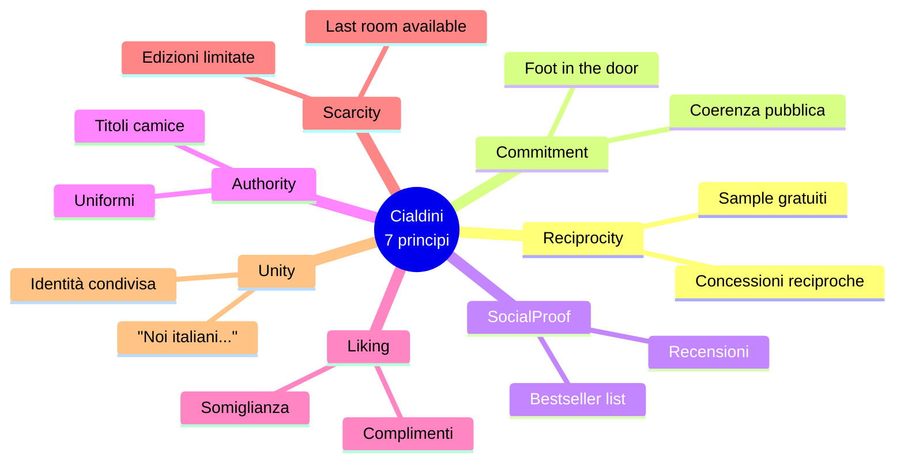

# Retorica e persuasione

L'argomentazione (sezione precedente) si occupa della *struttura razionale*. La retorica si occupa di *come* quella struttura entra nella mente dell'ascoltatore. Per duemila anni la retorica è stata insegnata come disciplina autonoma — Aristotele, Cicerone, Quintiliano — poi screditata nell'Ottocento come tecnica sospetta, infine riabilitata nel Novecento dalla "Nuova Retorica" (Perelman, Toulmin) e dalla psicologia sociale (Cialdini). Questa sezione è una guida pratica per **persuadere consapevolmente** e — soprattutto — **riconoscere quando qualcuno sta persuadendo te**.

## 1. Aristotele: ethos, pathos, logos

Nella *Retorica* (IV sec. a.C.), Aristotele definisce la disciplina come «la facoltà di scoprire, per ciascuna questione, i possibili mezzi di persuasione» (1355b). Distingue tre pìsteis — "prove" o mezzi di persuasione:

| Mezzo | Greco | Fa leva su | Domanda chiave |
|-------|-------|-----------|----------------|
| **Ethos** | ἦθος | Carattere e credibilità di chi parla | Perché dovrei fidarmi di te? |
| **Pathos** | πάθος | Emozioni dell'ascoltatore | Cosa devo sentire? |
| **Logos** | λόγος | Argomentazione razionale | Cosa è vero o probabile? |

Aristotele non considera questi mezzi sostituti l'uno dell'altro: il discorso efficace li **intreccia**. Un argomento *solo* logos è arido (e l'arguto Aristotele sapeva che la fredda razionalità persuade meno di quanto si creda); *solo* pathos è demagogia; *solo* ethos è argomento di autorità (vedi domande critiche di Walton in [sez. 38](38-argomentazione-toulmin.html)).

### 1.1 Ethos in pratica

Si costruisce con:
- **Phronesis** (prudenza, buon senso pratico): dimostrare di capire la situazione.
- **Arete** (virtù morale): integrità, coerenza con i valori dell'uditorio.
- **Eunoia** (benevolenza): mostrare cura per l'ascoltatore, non solo per se stessi.

L'ethos può essere **antecedente** (la reputazione che hai prima di parlare) o **costruito nel discorso** (dimostrato dal modo in cui parli, dalle scelte lessicali, dall'auto-ironia che mostra sicurezza, dal riconoscere obiezioni avverse).

### 1.2 Pathos: emozioni come argomento

Aristotele nel libro II della *Retorica* analizza sistematicamente le emozioni (orgé, philia, phobos, eleos…) — è di fatto il primo trattato di psicologia. Le emozioni non sono nemiche della ragione: orientano l'attenzione, segnalano valori, motivano l'azione. Una pubblicità AIRC che mostra un volto di bambino malato non è "fallace": evoca *pertinentemente* compassione per un fenomeno reale.

Diventa manipolazione (vedi [sez. 50](50-propaganda-manipolazione.html)) quando:
1. L'emozione evocata è *spropositata* rispetto alla cosa.
2. L'emozione è evocata *al posto* di evidenze, non *in aggiunta*.
3. L'emozione orienta a un'azione *non legata* alla causa dell'emozione (paura del terrorismo → vota X che taglia le tasse).

### 1.3 Logos: vedi tutta la prima parte del corso

L'argomentazione razionale è già trattata nelle sezioni 4–13 e 20–22.

## 2. Le tre forme di discorso

Aristotele divide i discorsi pubblici in tre generi, ciascuno con tempo verbale, fine e topoi tipici:

| Genere | Tempo | Fine | Topoi |
|--------|-------|------|-------|
| **Giudiziaria** (forense) | Passato | Giusto / ingiusto | Tribunale, accusa/difesa |
| **Deliberativa** (politica) | Futuro | Utile / dannoso | Assemblea, raccomandare azione |
| **Epidittica** (cerimoniale) | Presente | Onorevole / vergognoso | Elogio funebre, celebrazione |

Esempio: l'orazione di Cicerone *Pro Milone* è giudiziaria; un discorso al Parlamento europeo sull'IA è deliberativo; un'orazione del Presidente della Repubblica al 25 aprile è epidittica. Sbagliare genere è subito notabile: un'intervista politica che usa solo registro epidittico ("celebrare la grandezza dell'Italia") senza dire cosa farà domani è retoricamente debole.

## 3. Figure retoriche fondamentali

Le figure (*schemata*) sono pattern linguistici che amplificano effetto, memorabilità o impatto emotivo. Catalogo minimo essenziale:

- **Anafora**: ripetizione iniziale. «Lo dico ai giovani. Lo dico ai disoccupati. Lo dico alle famiglie». (Forza martellante, struttura tripla.)
- **Metafora**: trasferimento semantico. «Il debito pubblico è una zavorra». La metafora *frame* il problema: zavorra = liberarsi; ricchezza dei nipoti = preservare.
- **Antitesi**: opposizione bilanciata. «Non chiedete che cosa il vostro Paese può fare per voi; chiedete che cosa voi potete fare per il vostro Paese» (JFK, 1961).
- **Climax** (gradazione): «Sono venuto, ho visto, ho vinto» — Cesare, *Veni, vidi, vici*.
- **Iperbole**: esagerazione consapevole. «Ho mille cose da fare» (in italiano colloquiale, normalissimo).
- **Eufemismo**: sostituzione attenuante. «Esuberi» per "licenziamenti", «danni collaterali» per "vittime civili".
- **Dubitatio**: domanda retorica che simula incertezza. «E allora, davvero crediamo che questa sia la strada?»
- **Praeteritio**: fingere di non dire mentre si dice. «Non parlerò degli scandali del mio avversario» — ovviamente lo hai fatto.
- **Litote**: negazione del contrario per affermazione attenuata. «Non è male» = è buono.
- **Chiasmo**: incrocio sintattico. «Ama chi ti merita, merita chi ti ama».
- **Aposiopesi**: interruzione voluta. «E se non agiamo, le conseguenze… ».

Le figure non sono **fronzoli**: sono macchine cognitive. L'anafora aumenta la memorabilità del 30-50% (studi di psicologia della memoria, paradigma del *processing fluency*); la metafora attiva regioni sensorimotorie del cervello (Lakoff–Johnson, *Metaphors We Live By*, 1980).

## 4. Cialdini: sei (poi sette) principi di influenza

Robert Cialdini, psicologo sociale (Arizona State University), in *Influence* (1984) sintetizza decenni di ricerca sperimentale in sei principi (poi sette nell'edizione 2021):

### 4.1 Reciprocity (reciprocità)

Riceviamo, ci sentiamo obbligati a contraccambiare. Krishna distribuivano fiori a aeroporti USA negli anni '70: donazioni quintuplicarono. Modulazione **door-in-the-face**: prima chiedi tanto, ti rifiutano, poi chiedi meno (la "concessione" attiva reciprocità → sì).

### 4.2 Commitment & consistency

Una volta presa una posizione (specie pubblicamente o per iscritto) tendiamo a mantenerla. **Foot-in-the-door**: chiedi prima una piccola cosa (firma una petizione), poi una grande (esponi cartello in giardino). Studio Freedman-Fraser 1966: aderenza al cartello sale dal 17% al 76%.

### 4.3 Social proof

Se gli altri lo fanno, è probabile sia corretto. Asch 1951 (conformismo nei giudizi di lunghezza). Funziona soprattutto sotto incertezza e fra simili. Pubblicità: «Otto italiani su dieci usano X».

### 4.4 Authority

Obbedienza al ruolo (Milgram 1963). Il camice bianco vende vitamine inutili; l'uniforme convince a mentire al telefono. Si distingue da **autorità competente** legittima (vedi domande critiche da Walton).

### 4.5 Liking

Persuasi da chi ci piace: somiglianza, attrattività fisica, complimenti, cooperazione su obiettivi comuni. Spiega l'ubiquità del marketing influencer.

### 4.6 Scarcity

«Solo 3 camere rimaste a questo prezzo» — la scarsità (reale o percepita) aumenta il valore percepito. Funziona sull'avversione alla perdita (Kahneman–Tversky, vedi [Bias cognitivi](23-bias-cognitivi.html)).

### 4.7 Unity (aggiunto 2021)

Più forte dello *liking*: appartenenza a un'identità condivisa («noi medici», «noi italiani all'estero», «noi che siamo cresciuti negli anni '80»). Genera fiducia automatica.

## 5. Manipolazione vs persuasione

Dove finisce la persuasione legittima e inizia la manipolazione? Tre criteri condivisi in etica della comunicazione (Habermas, Sissela Bok, *Lying*, 1978):

1. **Trasparenza**: il persuasore *userebbe lo stesso argomento* se l'audience fosse consapevole della tecnica? Se sì, persuasione; se no, manipolazione.
2. **Veridicità**: l'argomento si basa su fatti veri e rappresentati equamente, o su distorsioni?
3. **Autonomia razionale**: la tecnica fa appello alla capacità decisionale dell'ascoltatore, o la aggira (paura cieca, lusinga emotiva, esaurimento cognitivo)?

Tre esempi:
- Pubblicità AIRC che mostra paziente reale, dà dati di sopravvivenza, chiede donazione: **persuasione** (tutti i criteri).
- Telemarketer che dice «Ti chiamo come fa la TV» (autorità falsa) e «Solo per oggi» (scarsità inventata): **manipolazione** (cri 1, 2).
- Politico che usa solo emozioni di paura (immigrazione = invasione, statistiche selezionate): tipicamente **manipolazione** (cri 2, 3) — anche se la posizione politica è in sé legittimamente sostenibile con argomenti.

Approfondiamo nella [sez. 50: propaganda e manipolazione](50-propaganda-manipolazione.html).

## 6. Esempi italiani di retorica politica (analisi formale)

Senza schierarsi: analizziamo *strumenti*, non contenuti.

**Esempio A — discorso d'insediamento di un Presidente del Consiglio** (parafrasi neutralizzata):
«Cari italiani (unity), in un'epoca difficile (pathos: gravità), io che vengo dalla provincia profonda (ethos: vicinanza), prometto cinque punti concreti (logos: struttura). Non sarà facile, *ma noi non ci tiriamo indietro* (climax + ethos di phronesis). Lo dobbiamo ai nostri figli (pathos: futuro, family values)».

**Esempio B — comizio di opposizione** (parafrasi):
«Mentre loro (antitesi: noi vs loro) banchettano (metafora svalutativa) sui privilegi (frame: ingiustizia), gli italiani veri (unity + scarcity simbolica) — gli onesti, i lavoratori, i pensionati (anafora) — pagano. *È accettabile questo?* (dubitatio). Cambiamo il Paese, *insieme* (commitment richiesto)».

Entrambi gli esempi sono **retoricamente densi** in modo simile, indipendentemente dall'orientamento politico. La lezione: la *capacità tecnica* retorica è ortogonale alla bontà delle proposte. Sviluppare il riconoscimento delle figure ti permette di **valutare il contenuto** senza essere risucchiato dalla forma.

## 7. Esercizio

  
Esercizio — analizza un brano

Prendi questa parafrasi: «Amici, mai come oggi (anafora con esempio successivo? identifica), in un'epoca in cui tutto si frantuma e ogni certezza vacilla (figura: identifica), abbiamo bisogno di voi. Non chiedete cosa lo Stato può darvi: chiedete (chiasmo o antitesi? quale?) cosa potete fare voi. Otto su dieci concittadini (principio Cialdini: quale?) hanno già detto sì. E voi?»

Analizza:
1. Identifica almeno tre figure retoriche.
2. Identifica almeno due principi cialdiniani.
3. Valuta ethos/pathos/logos: quale predomina?

**Risposta**:
1. *«in un'epoca in cui tutto si frantuma e ogni certezza vacilla»*: **iperbole** (e/o **anafora** se la formula «in un'epoca in cui...» fosse ripetuta). *«Non chiedete... chiedete...»*: **antitesi** (e citazione di JFK). *«E voi?»*: **dubitatio**.
2. *«Otto su dieci hanno già detto sì»*: **social proof**. La domanda finale «E voi?» implicita richiama **commitment & consistency** (sei degli otto su dieci o no?).
3. **Pathos** dominante (frantuma, vacilla, appello), con **ethos** secondario (l'"amici" costruisce vicinanza). **Logos** assente: non ci sono dati, ragionamenti, o premesse esplicite.

Diagnosi: discorso retoricamente efficace, argomentativamente vuoto. È un buon prompt per chiedersi «di cosa stiamo parlando, concretamente?»

## Sintesi

- **Aristotele**: ethos, pathos, logos — tre mezzi di persuasione intrecciati, non sostituti.
- **Tre generi di discorso**: giudiziario (passato), deliberativo (futuro), epidittico (presente).
- **Figure retoriche**: macchine cognitive (anafora, metafora, antitesi, climax, eufemismo, dubitatio…), non fronzoli.
- **Cialdini 7 principi**: reciprocity, commitment, social proof, authority, liking, scarcity, unity.
- **Persuasione vs manipolazione**: criteri di trasparenza, veridicità, autonomia razionale.
- **Analisi politica**: la capacità retorica è ortogonale alla bontà del contenuto; saperla riconoscere permette di valutare nel merito.

## Letture

- Aristotele, *Retorica* (trad. Marcello Zanatta, BUR 2004; oppure ed. Laterza).
- Robert B. Cialdini, *Influence: The Psychology of Persuasion*, Harper Business, 1984 (ed. ampliata 2021).
- Bice Mortara Garavelli, *Manuale di retorica*, Bompiani, 1988 — classico italiano.
- Chaïm Perelman & Lucie Olbrechts-Tyteca, *Trattato dell'argomentazione*, Einaudi, 1958 (orig.).
- George Lakoff & Mark Johnson, *Metaphors We Live By*, University of Chicago Press, 1980.
- Sissela Bok, *Lying: Moral Choice in Public and Private Life*, Pantheon, 1978.
