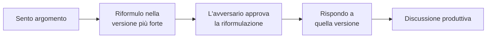

# Dibattito, dialettica socratica, steelmanning

Dibattere non è "vincere una conversazione". È un metodo per **chiarire idee**: tue, dell'interlocutore, di chi ascolta. La tradizione filosofica ha sviluppato tecniche precise — alcune di 2500 anni fa — per evitare che il dibattito degeneri in scontro fra ego.

## 1. La dialettica socratica (elenchos)

Platone (Apologia, Menone, Teeteto) rappresenta Socrate come maestro del *metodo elenchico*. Lo schema, idealizzato:

1. **Ironia**: Socrate finge ignoranza, chiede definizioni.
2. **Elenchos**: pone domande successive che mostrano come la definizione iniziale porti a contraddizioni.
3. **Aporia**: l'interlocutore si trova confuso, "non sa più cosa pensava di sapere". È l'obiettivo: l'aporia è precondizione per la ricerca seria.
4. **Maieutica** (nel Menone): aiutare a "partorire" idee che il discente già ha — il sapere come riemersione.

### 1.1 Esempio del *Menone*

Socrate dimostra a un giovane schiavo, ignaro di geometria, come duplicare l'area di un quadrato. Le risposte istintive del ragazzo (lato doppio → area quadrupla, sbagliato) lo portano all'aporia, poi alla scoperta corretta (lato = diagonale del quadrato dato). Socrate non insegna: chiede.

### 1.2 Il metodo in pratica oggi

- Definizioni chiare ("cosa intendi esattamente con X?").
- Esemplari e controesempi ("la tua definizione include Y? esclude Z?").
- Generalizzazioni e casi limite.
- Tolleranza dell'aporia: non temere il "non lo so".

Funziona magnificamente in 1-a-1, malissimo in dibattito televisivo (dove l'aporia è percepita come "perdita").

## 2. Dialettica hegeliana: una nota d'uso

Il triangolo "tesi → antitesi → sintesi" attribuito a Hegel è in realtà di Fichte e Schelling. Hegel parla di *Aufhebung* (superamento/conservazione), un processo molto più complesso. In ogni caso, lo schema **come dispositivo retorico** è abusato: viene usato per giustificare quasi qualsiasi conclusione presentandola come "sintesi". Non è la dialettica di Socrate (che cerca verità tramite contraddizione), ma una progressione storica/storicistica.

## 3. Habermas e l'azione comunicativa

Jürgen Habermas (1929–) propone un'etica del discorso: la verità emerge dalla *situazione ideale di parola* in cui tutti i partecipanti:

- Hanno pari diritto di parlare.
- Sono sinceri e veritieri (claim of truthfulness).
- Argomentano (claim of rightness e claim of truth).
- Nessun argomento è escluso a priori.

Questa è un'utopia regolativa, non un fatto. Ma fornisce un criterio per giudicare la qualità di un dibattito reale: quanto si avvicina o si allontana dall'ideale.

## 4. Steelmanning

**Strawmanning** (vedi [fallacie informali](21-fallacie-informali-rilevanza.html)): caricare l'argomento dell'avversario nella sua versione più debole o caricaturale, e demolirlo. Disonesto e inefficace.

**Steelmanning** (Anand Daniel / Chana Messinger, popolarizzato in rationalist community 2010s): caricare l'argomento dell'avversario nella sua versione *più forte possibile*, anche più forte di come lui stesso l'ha articolata. Poi rispondere a *quella*.

### 4.1 Perché funziona

- **Onestà epistemica**: se hai ragione, devi avere ragione contro il miglior argomento contrario, non contro un fantoccio.
- **Persuasione**: l'avversario, vedendo la propria posizione presa sul serio, è più aperto al dialogo.
- **Apprendimento**: spesso scopri che la versione forte dell'argomento contiene qualcosa di vero — il tuo modello si arricchisce.

### 4.2 Esempio

Versione weak (strawman): "I no-vax pensano che tutti i medici siano corrotti e i vaccini siano una cospirazione delle case farmaceutiche."

Versione steel: "Alcuni preoccupazioni vaccinali genuine includono: rari ma documentati effetti avversi; conflitti di interesse reali fra industria, regolatori e media; episodi storici di malafede (Tuskegee, Vioxx); processo di approvazione accelerato per nuovi vaccini in pandemia. La domanda non è 'i vaccini sono sicuri o no?' (binaria), ma 'come valutiamo il rapporto rischio/beneficio individualizzato in presenza di incertezza?'."

La risposta seria si confronta con la versione 2, non con la versione 1.

## 5. Principio di carità (Davidson, Quine)

Quando interpreti il discorso altrui, assumi che il parlante sia *razionale e veritiero per quanto possibile*. Solo se l'assunzione fallisce, considera errore o malafede.

Quine (1960) formula il principle nella *traduzione radicale*: per interpretare una lingua aliena, devi assumere che i loro enunciati siano in gran parte veri (per quanto ne sai). Davidson estende a interpretazione di credenze.

Applicazione pratica: prima di concludere "il tuo argomento è assurdo", chiediti "c'è un'interpretazione meno assurda?". Quasi sempre sì.

## 6. Formati di dibattito formale

Quando il dibattito serve a decidere/persuadere un'audience, i formati strutturano la conversazione.

| Formato | Caratteristiche |
|---|---|
| **British Parliamentary** | 4 squadre da 2; 7 min per discorso; argomento dato 15 min prima |
| **Lincoln-Douglas** | 1v1, focus su questioni etico-filosofiche; valore vs valore |
| **Policy Debate** | argomento "Resolved that..."; piano + contro-piano; ricerca approfondita |
| **Karl Popper Debate** | 3v3, due tornate di interrogatorio; intermedio rigore |
| **Oxford-style** | proposta votata prima e dopo; chi sposta più persone vince |

L'Oxford-style è interessante per riconoscere il "vincitore": non chi convince di più, ma chi *cambia di più* le opinioni. Premia la qualità persuasiva al netto delle convinzioni iniziali.

## 7. Tecniche di confutazione costruttiva

Tre modi onesti di rispondere a un argomento:

- **Reductio ad absurdum**: mostrare che l'argomento porta a una conclusione assurda → almeno una premessa è falsa.
- **Controesempio**: esibire un caso che l'argomento dovrebbe coprire ma che falsifica la conclusione.
- **Affondare una premessa**: portare evidenza che una premessa è falsa o non supportata.

Tre modi disonesti (da evitare):

- **Strawman**: distorsione dell'argomento.
- **Ad hominem**: attacco al parlante.
- **Whataboutism**: deflessione su un argomento diverso.

## 8. Il dibattito è epistemico, non bellicoso

Pull quote di Daniel Dennett: "Hai capito veramente la posizione del tuo avversario solo quando lui la riconosce nella tua riformulazione". Steelmanning è esattamente questo.

## Esercizi

  
Esercizio 1 — Steelman: "I social media sono uno strumento positivo per la società."

Versione steel: i social hanno connesso persone isolate (LGBT in paesi conservatori, malati rari con altri malati), reso possibili movimenti di emancipazione (#MeToo, primavere arabe), democratizzato l'accesso a informazione scientifica, ridotto i costi di coordinamento per cause benefiche. Le esternalità negative (polarizzazione, salute mentale) sono frutto del design specifico (algoritmi che ottimizzano engagement) — risolvibili senza eliminare i social. Le metriche aggregate di benessere mostrano effetti netti contestati, non chiaramente negativi.

Una risposta seria deve affrontare *queste* affermazioni, non la versione "i social sono inequivocabilmente buoni".

## Sintesi

- Dialettica socratica: domande, contraddizioni, aporia, scoperta condivisa.
- Steelmanning: rispondi alla versione più forte dell'argomento opposto.
- Principio di carità: interpreta razionalmente prima di concludere errore o malafede.
- Formati di dibattito formale strutturano qualità della conversazione.
- Reductio, controesempio, affondamento di premessa: confutazione onesta.

## Letture

- Platone, *Apologia di Socrate*, *Menone*, *Teeteto*.
- Habermas, *Theorie des kommunikativen Handelns* (1981).
- Dennett, *Intuition Pumps and Other Tools for Thinking* (2013).
- Schopenhauer, *L'arte di ottenere ragione* — divertente lista di trucchi (e contro-trucchi) retorici.
