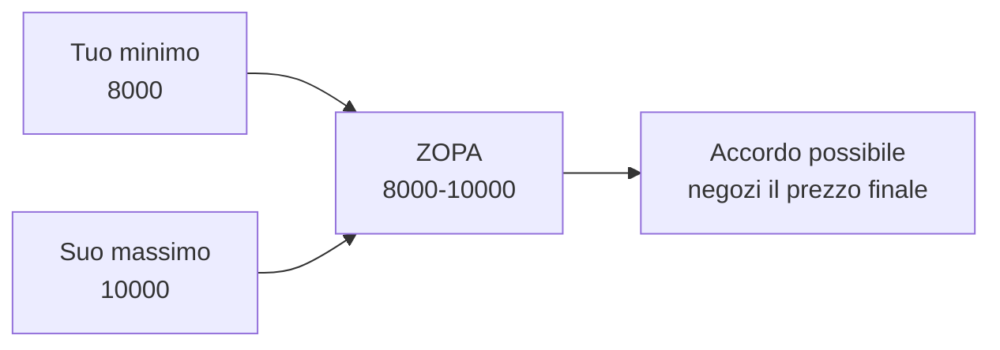

# Negoziazione e teoria dei giochi

Quando una scelta dipende anche dall'altro che decide, la teoria della decisione classica non basta. Serve la **teoria dei giochi**: lo studio formale delle interazioni strategiche.

## 1. Negoziazione integrativa vs distributiva

- **Distributiva**: torta fissa. Quello che uno guadagna l'altro perde (somma zero). Es: contrattare il prezzo di un'auto usata.
- **Integrativa**: torta espandibile. Cercando interessi anziché posizioni, si scoprono accordi vincenti per entrambi (positive sum).

Esempio canonico (Fisher-Ury, *Getting to Yes*, 1981): due sorelle litigano per un'arancia. Ne tagliano una metà ciascuna. In realtà una voleva la buccia per la torta, l'altra la polpa per la spremuta. Comprendendo gli interessi, ognuna avrebbe avuto il 100% di ciò che cercava. La posizione ("voglio l'arancia") nascondeva un interesse ("voglio la buccia"/"voglio la polpa"); negoziando sulle posizioni si perde valore.

## 2. Harvard Negotiation Project: i 4 principi (Fisher-Ury)

1. **Separa le persone dal problema**: il conflitto sui meriti non deve diventare attacco personale.
2. **Concentrati sugli interessi, non sulle posizioni**: perché vuoi X? Cosa risolverebbe il tuo problema?
3. **Genera opzioni a beneficio reciproco** prima di decidere (brainstorming senza giudizio).
4. **Insisti su criteri oggettivi**: standard di mercato, precedenti, leggi.

## 3. BATNA e ZOPA

**BATNA (Best Alternative To a Negotiated Agreement)**: cosa fai se la negoziazione fallisce? È il tuo *piano B*. Migliore è il tuo BATNA, più forte sei in negoziazione.

**ZOPA (Zone Of Possible Agreement)**: range di accordi accettabili a entrambe le parti.

Esempio: vendo auto. Minimo accettabile per me 8000 €. Massimo che compratore vuole pagare: 10000 €. ZOPA = [8000, 10000]. Senza ZOPA non c'è accordo.

## 4. Teoria dei giochi: nozioni base

### 4.1 Giochi in forma normale

Matrice dei payoff. Riga = strategia mia, colonna = strategia avversaria, cella = (payoff mio, payoff suo).

### 4.2 Strategia dominante

Una strategia che dà payoff maggiore di ogni alternativa, qualunque cosa faccia l'altro. Se entrambi ne hanno una, l'equilibrio è semplice.

### 4.3 Equilibrio di Nash

Nessun giocatore può migliorare il proprio payoff cambiando unilateralmente strategia (data la strategia dell'altro). Nash dimostra (1950) che ogni gioco finito ha almeno un equilibrio in strategie miste.

## 5. Il dilemma del prigioniero

Due sospettati interrogati separatamente. Confessare o tacere?

| | Lui tace | Lui confessa |
|---|---|---|
| **Tu taci** | -1, -1 | -10, 0 |
| **Tu confessi** | 0, -10 | -5, -5 |

Anni di carcere (negativi). Strategia dominante per ciascuno: **confessare** (qualsiasi cosa faccia l'altro, confessare è migliore). Risultato: entrambi confessano, ricevono -5 a testa. Ma se entrambi avessero taciuto: -1 a testa.

**L'equilibrio individualmente razionale è collettivamente irrazionale**. Caposcuola della letteratura sulla cooperazione.

### 5.1 Gioco ripetuto: tit-for-tat

Se il gioco si ripete, la cooperazione può emergere. Axelrod (1980) lancia un torneo: la strategia vincente è **tit-for-tat** (Anatol Rapoport):

1. Al primo round: coopera.
2. Successivamente: fai ciò che l'altro ha fatto al turno precedente.

Tit-for-tat è "nice" (mai defetta per prima), "retaliatory" (punisce subito), "forgiving" (perdona se l'altro torna a cooperare), "clear" (l'avversario capisce la regola).

## 6. Altri giochi canonici

### 6.1 Coordinazione

| | Auto A | Auto B |
|---|---|---|
| **Stadio** | 2, 2 | 0, 0 |
| **Cinema** | 0, 0 | 1, 1 |

Due equilibri di Nash (entrambi stadio, entrambi cinema). Coordinarsi su quello migliore richiede comunicazione o convenzione.

### 6.2 Chicken (gioco dei polli)

| | Sterza | Dritto |
|---|---|---|
| **Sterza** | 0, 0 | -1, 1 |
| **Dritto** | 1, -1 | -10, -10 |

Equilibri puri: (sterza, dritto), (dritto, sterza). Strategia mista in equilibrio: ciascuno sterza con probabilità $p < 1$.

Applicazione: crisi nucleare (Cuba 1962), trattative laburiste, brexit.

### 6.3 Battle of the sexes

Coordinarsi su un'attività, ognuno preferisce un'attività diversa. Equilibri multipli, asimmetrici.

## 7. Strategie miste

Quando non c'è equilibrio in strategie pure, si "randomizza". Nel gioco sasso-carta-forbici, equilibrio: 1/3 ciascuno. Qualsiasi strategia non uniformemente casuale è exploitable.

## 8. Giochi sequenziali

Forma estesa: albero di decisione. **Induzione all'indietro**: parti dalle foglie, calcola il payoff ottimale, propaga.

Esempio: ultimatum game. A propone come dividere 100 €. B accetta o rifiuta. Se rifiuta, entrambi 0.

Equilibrio teorico (induzione): B accetta qualsiasi offerta > 0 (perché 1 > 0). A offre 1 €, tiene 99.

Risultato reale (Güth 1982 e replicati): la maggior parte degli umani rifiuta offerte < 30%. Per fairness, non per razionalità individuale ristretta. La teoria dei giochi razionale fallisce a predire il comportamento reale — input importante per la behavioral economics.

## 9. Mechanism design (cenno)

Inverso della teoria dei giochi: dato che le persone giocano strategicamente, come progetto le **regole** per ottenere il risultato sociale che voglio?

Esempi: aste (Vickrey 1961: la second-price auction induce a dire la propria valutazione vera). Sistemi elettorali (paradosso di Arrow: nessun sistema di voto è "perfetto"). Allocazione di risorse senza prezzi (Gale-Shapley deferred acceptance, usato per matching medici-ospedali e studenti-scuole).

## Esercizi

  
Esercizio 1 — In un negoziato per la vendita di un'azienda, qual è il tuo BATNA?

Il tuo BATNA è la migliore opzione *non-negoziata*. Es: vendere a un altro acquirente, tenere l'azienda, fonderla con altra. Migliore è il BATNA, più puoi accettare offerte basse senza rischio. Se il BATNA è "nessun acquirente alternativo, l'azienda perde valore", sei in posizione debole — devi accettare ZOPA stretta.

  
Esercizio 2 — Costruisci un dilemma del prigioniero per "due nazioni che devono ridurre emissioni di CO2".

| | Altra riduce | Altra non riduce |
|---|---|---|
| **Tu riduci** | clima ok, costo, costo | clima ok-ish, costo, gratis |
| **Tu non riduci** | clima ok-ish, gratis, costo | clima catastrofe, gratis, gratis |

Per ciascuna nazione, "non ridurre" è dominante (costo evitato qualunque cosa faccia l'altra). Risultato: nessuno riduce. È il classico dei "global commons" — Garrett Hardin, *Tragedy of the Commons* (1968).

Soluzioni reali: accordi vincolanti (Parigi), sanzioni, tassazione carbonio. Tutti tentativi di modificare la matrice dei payoff.

## Sintesi

- Negoziazione integrativa scopre torte espandibili dietro posizioni rigide.
- Quattro principi Harvard: separa persone, focus interessi, opzioni multiple, criteri oggettivi.
- BATNA = la tua forza. ZOPA = lo spazio degli accordi.
- Equilibrio di Nash: nessuno migliora cambiando unilateralmente.
- Dilemma del prigioniero: individualmente razionale, collettivamente sub-ottimale.
- Tit-for-tat vince nei giochi ripetuti (Axelrod): nice, retaliatory, forgiving, clear.
- Ultimatum game: gli umani non sono homo economicus puro — la fairness importa.

## Letture

- Fisher, Ury, Patton, *Getting to Yes* (1981/2011).
- Axelrod, *The Evolution of Cooperation* (1984).
- Nash, *Equilibrium Points in n-Person Games*, PNAS (1950).
- Camerer, *Behavioral Game Theory* (2003).
