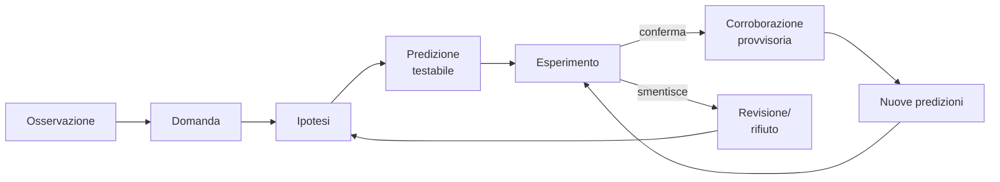

# Metodo scientifico, Popper, falsificabilità

Il "metodo scientifico" è una di quelle cose che si insegnano alle medie come se fosse pacifica — "osservazione, ipotesi, esperimento, conclusione" — quando in realtà su cosa esattamente lo sia, e su quale sia la differenza tra scienza e non-scienza, si discute ancora.

## 1. L'induzione classica (Bacon, Mill)

Francis Bacon (*Novum Organum*, 1620): rovesciare il metodo aristotelico. Non partire da assiomi generali; partire da **osservazioni**, costruire generalizzazioni progressive, salire passo dopo passo all'ipotesi generale. L'induzione baconiana è il modello della scienza moderna nascente.

John Stuart Mill (*A System of Logic*, 1843) formalizza canoni dell'inferenza causale:

- **Agreement**: se molti casi di un fenomeno condividono un solo fattore, quello è la causa.
- **Difference**: se due casi differiscono solo per la presenza di un fattore e per il fenomeno, quel fattore è la causa.
- **Residues**: sottrai gli effetti già spiegati; il residuo deve corrispondere a un residuo di cause.
- **Concomitant variation**: variazione correlata sistematicamente → causalità.

Sono i progenitori del **disegno sperimentale** moderno (RCT, controlli, gruppi).

## 2. Il problema dell'induzione (Hume 1748)

David Hume, *Enquiry Concerning Human Understanding*: come giustifichi l'inferenza induttiva? "Il sole è sorto ogni mattina per millenni, quindi sorgerà domani" è giustificato?

L'argomento di Hume:

1. Per dedurre il futuro dal passato hai bisogno del principio "la natura è uniforme" (PUN).
2. Da dove vien il PUN? O da ragionamento *a priori* (no — è contingente che la natura sia uniforme) o da esperienza (cioè da induzione passata: la natura è stata uniforme finora, quindi sarà uniforme).
3. Il secondo caso è **circolare**: per giustificare l'induzione usi l'induzione.

Conclusione di Hume: l'induzione non ha giustificazione razionale; è un'**abitudine psicologica**, ma utile.

Questo è il "problema dell'induzione". Le risposte sono molteplici e nessuna definitiva. Goodman (1955) lo aggrava con "grue/bleen": come decido se la regolarità da estrapolare è "tutti gli smeraldi sono verdi" o "tutti gli smeraldi sono *grue*" (verde fino al 2050, blu dopo)? Entrambe sono coerenti con i dati passati.

## 3. La risposta di Popper: falsificazionismo

Karl Popper, *Logik der Forschung* (1934, trad. *The Logic of Scientific Discovery* 1959). Tesi: la scienza **non procede per induzione**. Procede per **congetture e confutazioni**:

1. Si propongono ipotesi audaci (congetture).
2. Si derivano deduttivamente predizioni testabili.
3. Si tentano esperimenti volti a **falsificare** l'ipotesi.
4. Le ipotesi che sopravvivono ai tentativi di falsificazione sono *corroborate*, non *verificate*. Restano provvisorie.

### 3.1 Asimmetria fra verifica e falsificazione

"Tutti i cigni sono bianchi" non è verificabile (richiederebbe osservare ogni cigno). Ma è **falsificabile**: basta un cigno nero. Quando in Australia trovano cigni neri (1697, sì, davvero), la conjectura cade.

Per Popper, è proprio la falsificabilità a distinguere la scienza. Una teoria che *non può* essere falsificata (es. "esiste un Dio che si nasconde") non è scientifica — può essere vera, meaningful, importante, ma non scientifica.

### 3.2 Esempi popperiani

- Einstein (Relatività generale): "il sole devia la luce stellare di tot millisecondi d'arco". Eddington 1919 misura e conferma. Avrebbe potuto falsificare: la teoria era a rischio.
- Marxismo, psicanalisi (per Popper): troppo flessibili per essere falsificate. "Spiegano" qualsiasi cosa post-hoc. Pseudoscienze.

## 4. Criterio di demarcazione

**Falsificabilità = scienza**. Vediamo come si applica:

| Affermazione | Falsificabile? | Scientifica? |
|---|---|---|
| "Tutti i metalli si dilatano col calore" | sì (basta trovare un metallo che si contrae) | sì |
| "Gli individui hanno un'aura che li circonda" | dipende come definisci "aura" — se non-rilevabile, no | dubbia |
| "Dio interviene nella storia attraverso eventi imperscrutabili" | no | no (non significa "falsa", solo non-scientifica) |
| "Esistono extraterrestri" | parzialmente — falsificabile solo *per assenza universale*, difficile | scientifica in linea di principio |
| "L'omeopatia funziona oltre il placebo" | sì (RCT) e ripetutamente **falsificata** | scientifica (e falsificata) |

### 4.1 Astrologia vs astronomia

Le previsioni astronomiche su un'eclissi sono falsificabili a 1 secondo di tempo. Le previsioni astrologiche su un giorno tipo ("incontrerai una persona importante") sono vaghe abbastanza da resistere a qualsiasi esito. **Quella vaghezza è il sintomo di non-scientificità**.

## 5. Limiti del falsificazionismo "ingenuo"

### 5.1 Tesi Duhem-Quine

Una teoria scientifica non viene mai testata da sola. Sempre con un fascio di **ipotesi ausiliarie**: strumenti, misure, condizioni al contorno. Se l'esperimento contraddice la teoria, hai sempre la scelta di rigettare la teoria *o* un'ipotesi ausiliaria.

Esempio storico: Urano non si comportava come la meccanica newtoniana prevedeva. Si poteva: (a) falsificare Newton, oppure (b) ipotizzare un pianeta sconosciuto che perturba Urano. Scelsero (b) — e nel 1846 trovarono **Nettuno** lì dove avevano calcolato.

Buona ipotesi ausiliaria: nuovo pianeta è verificato. Cattiva ipotesi ausiliaria: la teoria sopravvive solo grazie a ad hoc rescues — i moderni programmi di ricerca *degenerati* di Lakatos (vedi [sez. 44](44-kuhn-lakatos-feyerabend.html)).

### 5.2 Falsificazione probabilistica

Le teorie statistiche non si falsificano con un singolo controesempio. "Fumare aumenta il rischio di cancro" non si falsifica trovando un fumatore sano. Si valuta con dati aggregati e modelli statistici. Popper riconosce ma è in tensione con il falsificazionismo stretto.

### 5.3 Asimmetria psicologica

I ricercatori (umani) cercano conferme più volentieri di falsificazioni (confirmation bias). La scienza istituzionale (peer review, replicazione) deve compensare. La crisi di replicabilità (Ioannidis 2005) mostra che il sistema fallisce spesso.

## 6. Il metodo scientifico in pratica

Note importanti:

- È iterativo, non lineare.
- L'osservazione iniziale è già "carica di teoria" (theory-laden): cosa osservi dipende da cosa cerchi.
- "Esperimento" comprende studi osservazionali, modelli, simulazioni.
- "Corroborazione" non è "prova": è sopravvivenza al tentativo di falsificazione.

## 7. Astrology test (esempio applicato)

Esperimento di Shawn Carlson (*Nature*, 1985): astrologi devono associare 116 profili psicologici a oroscopi (in doppio cieco). Predizione astrologica: tasso di successo > 50%. Risultato: 34% — **non meglio del caso**. Falsificazione netta sotto procedura standard. (Nota: il singolo esperimento è solo *un* fallimento; ce ne sono molti altri. L'astrologia non sopravvive al cumulo.)

## Esercizi

  
Esercizio 1 — "I cristalli emettono energie curative". È scientificamente falsificabile? Come testarlo?

Sì. Definisci "energia curativa" operazionalmente (es. "riduce dolore lombare misurato su scala VAS dopo 4 settimane"). RCT in doppio cieco: gruppo A con cristallo, gruppo B con sasso indistinguibile. Confronta riduzione VAS.

Predizione astrologico-cristallica: gruppo A migliora più di B significativamente. Test ha condotto risultati: nessuna differenza statistica. Falsificazione.

Difesa astrologica tipica: "non funziona in laboratorio per influenze elettriche". È ad hoc rescue → degenera l'ipotesi.

  
Esercizio 2 — Popper avrebbe definito scientifica la teoria di Darwin? Discussione.

Popper inizialmente la considera "metafisica" (predizioni troppo deboli). In *Unended Quest* (1974) cambia idea: l'evoluzione *è* scientifica, ma la "sopravvivenza del più adatto" è quasi tautologica. Le predizioni *concrete* dell'evoluzione (es. anatomia comparata, biogeografia, fossili intermedi, sequenze DNA) sono falsificabili. Sono state testate e corroborate. Quindi: teoria di base = metafisica feconda, ma applicazioni specifiche = scienza falsificabile.

## Sintesi

- Hume: l'induzione non ha giustificazione razionale, è abitudine.
- Popper: la scienza procede per congetture e tentativi di falsificazione, non per verifica.
- Falsificabilità = criterio di demarcazione scienza/non-scienza.
- Duhem-Quine: non si testa mai solo la teoria, ma teoria + ausiliarie — flessibilità → rischio degenerazione.
- Crisi di replicabilità mostra che il metodo *istituzionale* fallisce spesso pur essendo "in teoria" corretto.

## Letture

- Hume, *An Enquiry Concerning Human Understanding* (1748), sez. IV-V.
- Popper, *The Logic of Scientific Discovery* (1959).
- Popper, *Conjectures and Refutations* (1963) — più accessibile.
- Goodman, *Fact, Fiction, and Forecast* (1955) — paradosso del grue.
- Ioannidis, *Why Most Published Research Findings Are False*, PLOS Medicine (2005).
