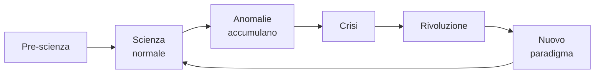

# Paradigmi: Kuhn, Lakatos, Feyerabend

Popper aveva una visione idealizzata della scienza: scienziati che propongono congetture audaci e si sforzano di falsificarle. La storia della scienza, però, mostra qualcosa di diverso. Negli anni '60-'70 tre filosofi — Kuhn, Lakatos, Feyerabend — descrivono la scienza come **pratica sociale storica**, non come algoritmo ideale.

## 1. Thomas Kuhn — *The Structure of Scientific Revolutions* (1962)

Il libro più influente del XX secolo nella filosofia della scienza. Kuhn era originariamente uno storico della fisica (lavorò sulla rivoluzione copernicana).

### 1.1 Il ciclo della scienza

- **Scienza normale**: la comunità lavora dentro un **paradigma** condiviso (insieme di assunzioni, modelli esemplari, tecniche). Risolve "puzzle" — problemi normali per cui il paradigma offre la struttura.
- **Anomalie**: risultati che non si conformano. Inizialmente vengono ignorate o reinterpretate come errori.
- **Crisi**: quando anomalie si accumulano, diventano impossibili da ignorare. La comunità entra in crisi.
- **Rivoluzione**: emerge un paradigma rivale incompatibile col vecchio. Battaglia comunitaria. Vince quello che attrae più giovani (gli anziani spesso restano col vecchio).
- **Nuovo paradigma**: si reinstaura la scienza normale.

### 1.2 Paradigma

Concetto polisemico (Kuhn stesso ne contò 21 usi diversi nel suo libro). Significa:

- Un **modello esemplare** (es. equazioni di Maxwell, doppia elica).
- Una **matrice disciplinare**: simboli, modelli ontologici, valori (cosa conta come "buona spiegazione"), esemplari paradigmatici.

### 1.3 Incommensurabilità

Forse il concetto più discusso. Due paradigmi sono **incommensurabili** se non condividono un linguaggio neutro per confrontarli. "Massa" in Newton e in Einstein "significa" cose diverse perché incastonata in teorie diverse. Conseguenza: il cambiamento di paradigma non è "progresso cumulativo lineare".

Critiche all'incommensurabilità: troppo forte, lascia poco spazio al "perché credere al nuovo paradigma?". Kuhn riformulò (1969) parlando di "incommensurabilità *locale*".

### 1.4 Esempi storici

- **Tolemaico → copernicano** (1543).
- **Flogisto → ossigeno** (Lavoisier 1770s).
- **Newton → Einstein** (1905-1915).
- **Generazione spontanea → biogenesi** (Pasteur 1861).
- **Deriva continentale**: a lungo "pseudoscientific" (Wegener 1912), accettata negli anni '60 con tettonica a placche.

## 2. Imre Lakatos — *The Methodology of Scientific Research Programmes* (1970)

Lakatos tenta una sintesi tra Popper e Kuhn. Riconosce che le teorie reali non vengono abbandonate al primo controesempio (contro Popper ingenuo) ma rifiuta la visione kuhniana come "irrazionalista".

### 2.1 Programmi di ricerca

Un **programma di ricerca scientifico** ha due parti:

- **Nucleo duro** (*hard core*): assunzioni fondamentali non negoziabili. Es: "le particelle si muovono secondo F=ma".
- **Cintura protettiva** (*protective belt*): ipotesi ausiliarie, condizioni al contorno, strumenti. Modificabile.

Quando arriva un'anomalia, si modificano le ipotesi della cintura, non il nucleo.

### 2.2 Progressivo vs degenerativo

- **Programma progressivo**: modifiche alla cintura producono **nuove predizioni che vengono confermate**.
- **Programma degenerativo**: modifiche sono **ad hoc**, salvano la teoria ma non producono predizioni nuove.

Esempio progressivo: la fisica newtoniana che predice Nettuno via anomalie di Urano.

Esempio degenerativo: ad hoc rescue dell'astrologia ("non funziona oggi perché Mercurio retrogrado").

Lakatos: la differenza è giudicabile *retrospettivamente* — col senno di poi vedi se il programma "produce" o no.

## 3. Paul Feyerabend — *Against Method* (1975)

Il più radicale dei tre. Anarchismo metodologico.

### 3.1 Tesi

Non esiste *nessun* metodo universale che caratterizzi la scienza. Ogni regola metodologica è stata violata in episodi cruciali del progresso scientifico.

Es: Galileo abbracciò il copernicanesimo *prima* di avere prove decisive (l'osservazione cannocchiale non era considerata affidabile dai contemporanei); fece propaganda, ricorse a retorica, cooptò il vocabolario.

Conclusione di Feyerabend: **"anything goes"** (anche se non è proprio un endorsement; è una constatazione descrittiva).

### 3.2 Critica radicale al razionalismo scientifico

Feyerabend sostiene che la scienza occidentale moderna è *una* tradizione tra molte, non superior a priori. Difende il pluralismo epistemologico: medicina cinese, agricoltura indigena, ecc. possono produrre conoscenze legittime.

Posizione controversa, spesso fraintesa come anti-scienza. Feyerabend si dichiarava amico della scienza ma critico del *metodismo dogmatico*.

## 4. Confronto

| | Popper | Kuhn | Lakatos | Feyerabend |
|---|---|---|---|---|
| Vincolo a "metodo"? | sì, falsificazionismo | dipende da paradigma | metodologica + storica | nessuno |
| Razionalità del cambio | individuale | sociologica | inter-programma | anti-razionalismo |
| Verità? | approssimazione progressiva | incommensurabilità → no progresso lineare | progresso relativo a programmi | pluralista |
| Demarcazione? | falsificabilità | paradigma+comunità | progressivo vs degenerativo | non esiste |

## 5. Esempi attuali

### 5.1 Ipotesi delle multi-verse

La cosmologia inflazionaria predice (in alcune versioni) infiniti universi. Sembra non-falsificabile. Critica: pseudo-scienza. Difesa: è una *conseguenza* di teorie testabili (inflation, string theory).

### 5.2 Psicologia evoluzionistica

Spiegazioni evolutive di tratti comportamentali. Critica: just-so stories, non-falsificabili. Difesa: predizioni concrete su preferenze, differenze culturali, ecc.

### 5.3 Stringa

La string theory è stata accusata di essere "non scientifica" per decenni per mancanza di predizioni testabili. Sopravvive perché è matematicamente fertile e produce idee usabili in altri contesti.

## 6. Per il pensiero critico ordinario

Cosa significano Kuhn-Lakatos-Feyerabend per chi non fa ricerca scientifica?

- Non sopravvalutare il "consenso scientifico" come oracolo: rifletteva il paradigma corrente, era ribaltato in passato e sarà di nuovo.
- Ma neanche sottovalutarlo: il consenso è basato su evidenza cumulata su decenni; le "teorie alternative" hanno burden of proof.
- Distinguere tra modifiche ad hoc (sospetto) e estensioni progressive (legittime).
- Diffidare di affermazioni che "spiegano tutto" — sono inevitabilmente non-falsificabili.

## Esercizi

  
Esercizio 1 — La psicanalisi freudiana classica è programma progressivo o degenerativo (Lakatos)?

Argomentabile come **degenerativo** dopo gli anni '50: la cintura protettiva si è espansa per spiegare contro-evidenze (es. "se non hai sintomi è rimozione di rimozione") senza produrre nuove predizioni testabili e confermate. Tuttavia alcune sue sotto-teorie (es. attaccamento di Bowlby) sono progressive.

## Sintesi

- Kuhn: scienza normale dentro paradigma + rivoluzioni che cambiano paradigma + incommensurabilità.
- Lakatos: programmi di ricerca = nucleo + cintura; distinguibili come progressivi o degenerativi.
- Feyerabend: nessun metodo universale; "anything goes" — anti-dogmatico.
- Implicazioni: il consenso scientifico è epistemicamente prezioso ma non sacro; serve discernere ad hoc rescues da estensioni feconde.

## Letture

- Kuhn, *The Structure of Scientific Revolutions* (1962).
- Lakatos & Musgrave (eds), *Criticism and the Growth of Knowledge* (1970).
- Feyerabend, *Against Method* (1975).
- Chalmers, *What Is This Thing Called Science?* (4ª ed. 2013) — manuale didattico.
