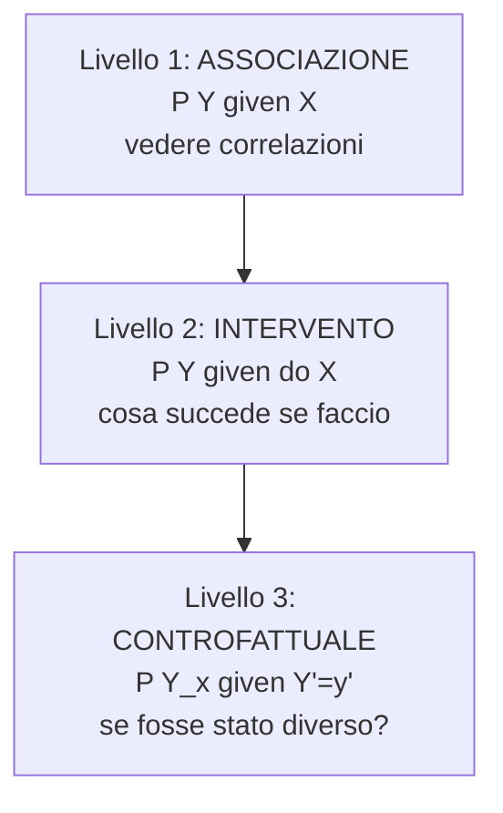
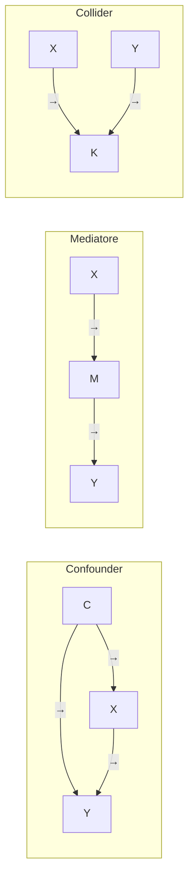

# Causalità: Hume, Pearl, do-calculus

"Correlation does not imply causation" si insegna ovunque. Ma cosa *significa* esattamente "causare"? E come si stabilisce causazione da dati? Per duemila anni la filosofia c'è girata intorno. Dagli anni '90, Judea Pearl ha dato una risposta tecnica precisa che ha trasformato statistica, epidemiologia, AI.

## 1. Hume: causalità come abitudine

David Hume (*Treatise of Human Nature*, 1739): non osserviamo mai "la causa". Osserviamo solo:

1. **Contiguità spaziale**: causa ed effetto sono vicini.
2. **Successione temporale**: causa precede effetto.
3. **Congiunzione costante**: ogni volta che $A$, anche $B$.

La "necessità" causale è solo un'abitudine psicologica di aspettarsi $B$ dopo $A$. Niente più, niente meno. È la **regularity theory of causation**.

Critiche: troppi falsi positivi. Il giorno (causa apparente) precede sempre la notte (effetto), ma è la rotazione terrestre la vera causa di entrambi.

## 2. Mill's methods (1843)

Approccio empirico alla discriminazione causa-correlazione:

- **Method of agreement**: cerca il fattore comune ai casi positivi.
- **Method of difference**: cerca il fattore che varia tra casi positivi e controlli.
- **Joint method**: combina i due.

Antenato del **disegno sperimentale**: gruppi di trattamento e controllo. Limite: presuppone di conoscere già il set delle cause candidate.

## 3. Il paradigma statistico tradizionale

Per gran parte del XX secolo, la statistica si è rifiutata di parlare di causalità in modo formale. Karl Pearson stesso (1911) chiamò "obsolete" il concetto.

Strumenti:

- **Correlazione (Pearson, Spearman)**: misura co-variazione lineare/monotona.
- **Regressione**: $Y = \beta_0 + \beta_1 X + \epsilon$. Stima $\beta_1$, ma il "significato causale" non è automatico.
- **RCT (Fisher 1925)**: la randomizzazione del trattamento *garantisce* che il gruppo trattato sia confrontabile con il controllo in media. Quindi la differenza media si può interpretare causalmente.

Problema: spesso non puoi randomizzare (epidemiologia, economia, scienze sociali). Servono altri metodi.

## 4. La rivoluzione di Pearl

Judea Pearl (*Causality*, 2000; 2ª ed. 2009; *The Book of Why*, 2018). Premio Turing 2011.

### 4.1 Strumenti

**Diagrammi causali (DAG — Directed Acyclic Graphs)**: nodi = variabili, archi = relazioni causali dirette. Permettono di esplicitare le *assumzioni* causali del modello.

**Operatore $do(\cdot)$**: $P(Y \mid do(X=x))$ = probabilità di $Y$ se *intervieni* fissando $X=x$. È diverso da $P(Y \mid X=x)$ (probabilità condizionale osservazionale).

**Structural Causal Model (SCM)**: insieme di equazioni $X_i = f_i(\text{Parents}(X_i), U_i)$, dove $U_i$ sono variabili esogene. Permettono di calcolare interventi e controfattuali.

### 4.2 La scala della causazione



- **L1 — Associazione**: "Quanti che fumano hanno cancro?". Conoscenza disponibile da dati osservazionali.
- **L2 — Intervento**: "Se obbligassi una persona a fumare, quale rischio di cancro?". Richiede manipolazione (mentale o fisica). Non sempre derivabile da L1.
- **L3 — Controfattuale**: "Marco fumava, ha avuto cancro. Se non avesse fumato, ne avrebbe avuto?". Domanda controfattuale.

I tre livelli formano una gerarchia: domande di L_k+1 non sono in generale rispondibili usando solo dati e modelli di L_k. **Per intervenire o controfattualizzare serve un modello causale**.

## 5. Confounders, mediator, collider

Tre strutture causali fondamentali nei DAG. Sia $C$ una terza variabile che lega $X$ e $Y$.



- **Confounder $C$**: causa sia $X$ che $Y$. Crea correlazione spuria. ESempio classico: il fumo causa sia bere caffè sia cancro al polmone — bere caffè e cancro appaiono correlati senza causazione diretta.
- **Mediatore $M$**: sta fra $X$ e $Y$ — $X$ causa $M$ causa $Y$. Es: esercizio (X) → meno grasso (M) → meno cardiopatia (Y).
- **Collider $K$**: $X$ e $Y$ entrambi causano $K$. Condizionare su $K$ crea correlazione spuria fra $X$ e $Y$ (collider bias / Berkson's paradox).

### 5.1 Esempio di collider: bellezza e talento attorale

In Hollywood, gli attori celebri sembrano avere talento e bellezza scorrelati (o anti-correlati). Spiegazione causale: nessuno dei due è strettamente necessario, ma per arrivare a Hollywood serve abbastanza dell'uno *o* dell'altro. Hollywood = collider. Selezionare su "essere ad Hollywood" induce anti-correlazione spuria nei selezionati.

## 6. Backdoor criterion

**Domanda**: dato un DAG, come calcolo $P(Y \mid do(X))$ da dati osservazionali $P(Y, X, \ldots)$?

**Backdoor criterion** (Pearl 1995): un insieme $Z$ di variabili è ammissibile se:

1. $Z$ non contiene discendenti di $X$.
2. $Z$ blocca tutti i percorsi "indiretti" (backdoor paths) tra $X$ e $Y$.

Se trovi un tale $Z$, allora:

$$P(Y \mid do(X)) = \sum_z P(Y \mid X, Z=z) P(Z=z)$$

Esempio: nel grafo confounder $C \to X, C \to Y, X \to Y$, condizionando su $C$ ottieni l'effetto causale di $X$ su $Y$ depurato del confondimento.

## 7. Frontdoor criterion (per quando il confounder è inosservabile)

Setup: vorresti stimare effetto di $X$ su $Y$. Esiste un confounder $U$ non osservabile. Ma c'è un mediatore $M$ tra $X$ e $Y$ che $U$ non influenza.

```
X → M → Y
↑           ↑
U ←─────────┘
```

In questa struttura il frontdoor criterion (Pearl 1995) permette comunque l'identificazione di $P(Y \mid do(X))$ usando $M$.

## 8. Do-calculus (le tre regole)

Pearl prova che ogni effetto causale identificabile da un DAG può essere ridotto a probabilità osservabili usando tre regole di trasformazione:

1. **Inserzione/cancellazione di osservazioni**: se sapere $Z$ è irrilevante data una struttura, possiamo aggiungerla/toglierla.
2. **Action/observation exchange**: in certe condizioni $P(\cdot \mid do(X), Z) = P(\cdot \mid X, Z)$.
3. **Inserzione/cancellazione di azioni**: si può rimuovere o aggiungere un $do$ se l'azione non altera la distribuzione.

Combinando queste regole, ogni espressione $P(\cdot \mid do(\cdot))$ identificabile viene riportata a una formula in termini di probabilità osservazionali — applicabile ai dati.

Risultato fondamentale (Shpitser-Pearl, Huang-Valtorta): do-calculus è **completo** — se un effetto è identificabile, le tre regole lo trovano.

## 9. Controfattuali

L'ultimo livello. "Se Marco non avesse fumato, avrebbe avuto il cancro?". Richiede SCM con variabili esogene specifiche e procedura di "twin world" (creare un mondo identico a quello osservato cambiando solo il valore di $X$). Tecnicamente:

1. **Abduzione**: deduci i valori delle $U$ esogene da ciò che osservi.
2. **Azione**: intervieni $X \leftarrow x'$ nel modello.
3. **Predizione**: calcola $Y$ nel nuovo modello.

Applicazioni: responsabilità legale ("sarebbe morto se avesse ricevuto cure?"), trattamento individuale di salute.

## 10. Implicazioni pratiche

- "Correlazione ≠ causazione" non basta: devi sapere *quale tipo di struttura causale* genera i dati.
- I dati osservazionali, da soli, **sotto-determinano** la struttura causale. Servono assunzioni.
- Le RCT sono il gold standard ma non sempre fattibili. Pearl mostra quando metodi osservazionali sono validi.
- Le moderne tecniche di "causal inference" (DoWhy, EconML, causalML) implementano questi principi.

## Esercizi

<details>
  <summary>Esercizio 1 — In un dataset, "consumo gelati" e "annegamenti" sono correlati. DAG?</summary>

Confounder: `mese estivo`. Mese estivo → consumo gelati. Mese estivo → annegamenti (più persone in piscina). Quindi correlazione spuria. Condizionando su "mese": niente correlazione.
</details>

<details>
  <summary>Esercizio 2 — Studio: pazienti con cura X hanno mortalità maggiore di senza X. La cura aumenta mortalità?</summary>

Possibile collider bias: chi riceve X sono i pazienti più gravi. La gravità (variabile latente) causa sia "ricevere X" sia "mortalità". Per stimare l'effetto vero servirebbe condizionare sulla gravità (variabile confounder), o un RCT.
</details>

## Sintesi

- Hume: causalità = congiunzione costante + abitudine.
- Mill, Fisher: metodi sperimentali → RCT come gold standard.
- Pearl: DAG + $do(\cdot)$ + scala (associazione, intervento, controfattuale).
- Confounder vs mediator vs collider — strutture causali con effetti opposti.
- Backdoor e frontdoor criteria identificano effetti causali da dati osservazionali sotto assunzioni esplicite.
- Do-calculus: macchina formale completa per identificazione causale.

## Letture

- Pearl, *Causality: Models, Reasoning, and Inference* (2ª ed., 2009).
- Pearl & Mackenzie, *The Book of Why* (2018) — divulgativo eccellente.
- Hernán & Robins, *Causal Inference: What If* (2020, gratuito online) — manuale moderno.
- Imbens & Rubin, *Causal Inference for Statistics, Social, and Biomedical Sciences* (2015) — paradigma alternativo (Rubin).
