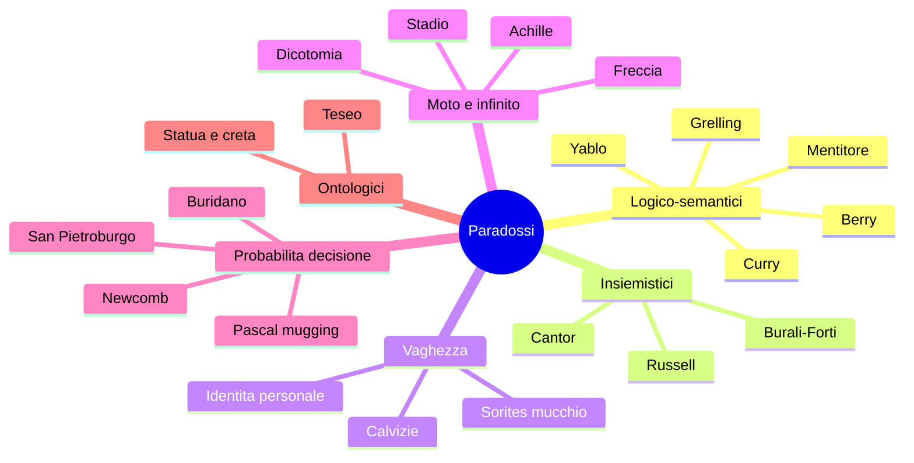

# Paradossi celebri: dal mentitore al Newcomb

Un **paradosso** non è una stranezza pittoresca. Nella definizione minima di R. M. Sainsbury (*Paradoxes*, 1988) un paradosso è "una conclusione apparentemente inaccettabile derivata da premesse apparentemente accettabili tramite ragionamenti apparentemente accettabili". Tre "apparentemente": è qui che si nasconde il lavoro filosofico. Risolvere un paradosso significa identificare quale dei tre stadi cede — premessa, regola di inferenza, o accettabilità della conclusione — e farlo in modo non arbitrario.

I paradossi sono motori di progresso teorico. Il paradosso di Russell ha forzato la riscrittura della teoria degli insiemi (ZFC), il paradosso del mentitore ha generato la teoria della verità di Tarski e la gerarchia metalinguistica, Zenone ha costretto i matematici a fare i conti con l'infinito attuale (Weierstrass, Cantor). Senza paradossi la logica resterebbe descrittiva; con i paradossi diventa esplosiva.

Questa sezione organizza una quindicina di paradossi celebri in sette famiglie. Per ciascuno: enunciato canonico, **perché** è un paradosso (quale premessa rifiutare costa di più), soluzioni storiche, eredità nei programmi di ricerca attuali. Esercizio finale: costruire la propria mappa di parentela tra paradossi.

## 1. Paradossi logici e semantici

### 1.1 Paradosso del mentitore (Eubulide di Mileto, IV sec. a.C.)

La frase "Questa frase è falsa" è vera o falsa? Se è vera, allora dice il vero — ma dice di essere falsa, quindi è falsa. Se è falsa, allora dice il falso — ma dice di essere falsa, quindi è vera. Contraddizione.

**Perché è paradossale.** Sembra una frase normale in un linguaggio normale (italiano), eppure assegnarle un valore di verità in $\{V, F\}$ porta a contraddizione. La logica classica ammette il **principio di bivalenza**: ogni proposizione è vera o falsa. Il mentitore mostra che questo principio, combinato con l'**auto-riferimento** e un predicato di verità $T(x)$ all'interno del linguaggio, è incompatibile.

**Soluzioni.**

- **Gerarchia di Tarski (1933):** in *Der Wahrheitsbegriff in den formalisierten Sprachen*, Tarski distingue **linguaggio oggetto** $L_0$ e **metalinguaggio** $L_1$. Il predicato di verità $T_0$ riguarda solo frasi di $L_0$ e vive in $L_1$; il mentitore "questa frase è falsa" è malformato perché tenta di applicare $T$ a se stesso.
- **Approccio dei punti fissi (Kripke 1975, "Outline of a Theory of Truth"):** ammettere un terzo valore "undefined" e definire $T$ come un punto fisso minimo. Il mentitore riceve valore *undefined*, non V né F.
- **Dialeteismo (Priest 1979):** accettare che esistano contraddizioni vere. Servono logiche **paraconsistenti** ([Logiche non classiche](18-logiche-non-classiche.html)) che non collassano sotto contraddizione.
- **Risposta contestualista (Barwise & Etchemendy, *The Liar*, 1987):** il mentitore parla di una situazione $s$ e la frase in $s$ non si applica a se stessa nella stessa situazione.

**Eredità.** Tarski, definibilità della verità, teorema di indefinibilità: in un linguaggio sufficientemente espressivo non si può definire al suo interno un predicato di verità per le proprie frasi senza contraddizione. Connessione diretta con [Gödel](15-metalogica-godel.html).

### 1.2 Paradosso di Russell (1901)

Sia $R = \{x \mid x \notin x\}$, l'insieme di tutti gli insiemi che non appartengono a se stessi. $R \in R$? Se sì, allora per definizione $R \notin R$. Se no, $R \notin R$ — ma allora soddisfa la condizione di appartenenza, quindi $R \in R$.

$$R \in R \iff R \notin R$$

**Perché è paradossale.** Russell ha trovato la contraddizione nel sistema di Frege (*Grundgesetze*, Vol. II) tramite l'assioma di comprensione illimitata: per ogni proprietà $\varphi(x)$ esiste l'insieme $\{x \mid \varphi(x)\}$. Prendendo $\varphi(x) \equiv x \notin x$ si ottiene il paradosso. Frege ricevette la lettera di Russell mentre il secondo volume era in stampa e la pose in appendice con queste parole: "uno scienziato non può che trovarsi in posizione più sgradevole della mia".

**Soluzioni.**

- **Teoria dei tipi (Russell, *Principia Mathematica*, 1910-13):** gli insiemi sono stratificati per tipo; $x \in y$ è ben formato solo se $\text{tipo}(y) = \text{tipo}(x) + 1$. La formula $x \in x$ è malformata.
- **Zermelo-Fraenkel (ZFC, 1908-1922):** sostituisce comprensione illimitata con lo schema di **separazione**: $\{x \in A \mid \varphi(x)\}$ è un insieme solo dato un insieme $A$ già esistente. L'assioma di **fondazione** (von Neumann 1925) vieta inoltre $x \in x$.
- **NBG (von Neumann-Bernays-Gödel):** distingue insiemi (sets) e classi (classes). $R$ è una classe propria, non un insieme.

**Eredità.** Riformulazione della teoria degli insiemi, nascita della teoria dei tipi (riprende vita 50 anni dopo con [Curry-Howard](19-curry-howard-type-theory.html)).

### 1.3 Paradosso di Curry (Curry 1942, Löb 1955)

Sia $C$ la frase "se questa frase è vera, allora $\psi$" — per qualunque $\psi$. Assumiamo $C$. Allora "se $C$, allora $\psi$" è vera. Per modus ponens, $\psi$. Quindi se $C$ allora $\psi$ — cioè $C$ è vera per definizione. Allora $\psi$. **Qualunque $\psi$ è dimostrabile** — totale esplosione.

**Perché è paradossale.** Diversamente dal mentitore, Curry non usa la negazione. Mostra che bastano contraction (poter usare un'assunzione due volte) + auto-riferimento + un'implicazione che si riferisce a sé per dedurre qualsiasi cosa.

**Soluzioni.** Logiche substrutturali (lineare, affine) che eliminano la regola di **contrazione**. Senza contrazione $C \rightarrow (C \rightarrow \psi)$ non collassa in $C \rightarrow \psi$, e l'esplosione si blocca.

### 1.4 Paradosso di Berry (1906)

"Il più piccolo numero naturale non definibile in meno di venti parole italiane." Questa stessa descrizione lo definisce in 17 parole. Contraddizione.

**Perché è paradossale.** Mescola lingua naturale (imprecisa) e nozione matematica di definibilità. Una versione formalizzata diventa un teorema (Boolos 1989): non esiste un predicato $\text{Def}(n, k)$ che dica "$n$ è definibile in $k$ simboli" all'interno di un'aritmetica ricorsiva.

**Soluzione.** Tarski di nuovo: separare linguaggio e metalinguaggio. "Definibile" è un concetto metalinguistico.

### 1.5 Paradosso di Grelling-Nelson (1908)

Un aggettivo è **autologico** se descrive se stesso (es. "italiano" è italiano, "polisillabico" è polisillabico) ed **eterologico** altrimenti (es. "monosillabico" non è monosillabico — è di 6 sillabe). "Eterologico" è autologico o eterologico? Se è autologico, descrive se stesso: dunque è eterologico. Se è eterologico, non descrive se stesso: dunque è autologico.

**Perché è paradossale.** Variante linguistica del paradosso di Russell. Mostra che la contraddizione di Russell non dipende dalla teoria degli insiemi ma dall'auto-riferimento più qualche schema di astrazione.

**Soluzione.** Stessa di Russell: stratificare i predicati per tipo, vietare l'auto-applicazione.

### 1.6 Paradosso di Yablo (1993)

Una successione infinita di frasi $S_1, S_2, S_3, \ldots$ dove ciascuna $S_i$ asserisce "tutte le $S_j$ con $j > i$ sono false". Nessuna frase si riferisce direttamente a se stessa, eppure la successione genera contraddizione (se $S_1$ fosse vera, $S_2$ sarebbe falsa — ma se $S_2$ è falsa significa che esiste $S_k$ con $k > 2$ vera, contraddicendo $S_1$).

**Perché è paradossale.** Yablo mostra che l'auto-riferimento **diretto** non è necessario per generare paradossi tipo mentitore: basta un riferimento "circolare" distribuito su infinite frasi. Sfida la diagnosi standard ("evita l'auto-riferimento").

## 2. Paradossi insiemistici

### 2.1 Paradosso di Cantor (1899)

Sia $U$ l'insieme di tutti gli insiemi. Il suo insieme potenza $\mathcal{P}(U)$ ha cardinalità strettamente maggiore di $U$ per il teorema di Cantor ($|\mathcal{P}(X)| > |X|$). Ma $\mathcal{P}(U) \subseteq U$ (ogni suo elemento è un insieme, quindi in $U$), quindi $|\mathcal{P}(U)| \leq |U|$. Contraddizione.

**Soluzione.** In ZFC l'**insieme di tutti gli insiemi** semplicemente non esiste (assioma di fondazione + assenza di un assioma di "insieme universale"). $U$ è una classe propria.

### 2.2 Paradosso di Burali-Forti (1897)

L'insieme di tutti gli ordinali $\Omega$ è esso stesso un ordinale (è ben ordinato dalla relazione $\in$), ed è strettamente maggiore di ogni ordinale — quindi maggiore di se stesso. $\Omega < \Omega$, contraddizione.

**Soluzione.** Come Cantor: $\Omega$ è classe propria, non insieme. Storicamente è il **primo** paradosso scoperto in teoria degli insiemi, due anni prima di Russell.

## 3. Paradossi di vaghezza

### 3.1 Sorites (paradosso del mucchio, Eubulide)

Un granello di sabbia non è un mucchio. Aggiungere un granello a un non-mucchio dà ancora un non-mucchio. Per induzione, nessuna quantità di sabbia è un mucchio. Eppure 10.000 granelli sono chiaramente un mucchio.

Formalmente:

$$\text{base: } \neg M(1) \qquad \text{passo: } \neg M(n) \rightarrow \neg M(n+1) \qquad \therefore \forall n.\, \neg M(n)$$

**Perché è paradossale.** Il predicato "essere un mucchio" è **vago**: non c'è una soglia precisa $n^*$ tale che $n < n^*$ non sia mucchio e $n \geq n^*$ sì. Eppure il ragionamento induttivo classico richiede una soglia precisa.

**Soluzioni.**

- **Epistemicismo (Williamson 1994, *Vagueness*):** la soglia esiste ma ci è epistemicamente inaccessibile. C'è un $n^*$ esatto, semplicemente non sappiamo quale.
- **Logica fuzzy (Zadeh 1965):** il predicato $M(n)$ ha valori in $[0, 1]$, non in $\{0, 1\}$. La verità di $\neg M(n) \rightarrow \neg M(n+1)$ scivola progressivamente, e l'inferenza si attenua.
- **Supervaluazionismo (Fine 1975):** $\varphi$ è vero sse vero in **ogni** precisazione ammissibile del linguaggio. "Tre granelli sono un mucchio" è né vero né falso (alcune precisazioni dicono sì, altre no), ma "esiste un $n$ critico" è vero (in ogni precisazione c'è un punto critico — solo diverso in ognuna).
- **Contestualismo (Shapiro 2006):** la soglia varia col contesto conversazionale.

### 3.2 Paradosso della calvizie

Variante: chi ha 0 capelli è calvo. Chi ha 1 capello più di un calvo è calvo. Quindi tutti sono calvi.

## 4. Paradossi di Zenone (V sec. a.C.)

Quattro paradossi (per Aristotele, *Fisica*) contro la realtà del moto e della molteplicità.

### 4.1 Achille e la tartaruga

Achille corre 10 volte più veloce della tartaruga, che parte 100 m avanti. Quando Achille raggiunge il punto di partenza della tartaruga, lei è 10 m avanti. Quando Achille percorre quei 10 m, lei è avanti 1 m. E così via, all'infinito. Achille non la raggiunge mai.

**Soluzione moderna.** Il tempo totale è $t = \sum_{n=0}^{\infty} 10/(10^n \cdot v_A) = \frac{10}{v_A} \cdot \frac{1}{1 - 0.1}$, una **serie geometrica convergente**. Un'infinità di passi può avere somma finita (Weierstrass, Cauchy hanno dato senso rigoroso ai limiti nel XIX secolo).

### 4.2 Dicotomia

Per percorrere un metro bisogna prima percorrere mezzo metro, prima ancora un quarto, prima ancora un ottavo... infinite operazioni in tempo finito.

**Soluzione.** Stesso argomento di serie convergente: $\sum_{n=1}^{\infty} 1/2^n = 1$.

### 4.3 Freccia

In ogni istante $t$ la freccia in volo occupa una posizione precisa, e in essa è ferma. La somma di istanti di immobilità è immobilità. Quindi la freccia non si muove.

**Soluzione moderna.** Il **moto** non è una proprietà istantanea, ma è la **derivata** della posizione rispetto al tempo: in $t_0$ la freccia ha velocità $v(t_0) = dx/dt$, anche se occupa una posizione precisa. Il concetto di derivata (Newton, Leibniz) dissolve il paradosso.

### 4.4 Stadio

Tre file di corpi $A, B, C$ — $A$ ferma, $B$ e $C$ in moto opposto. $B$ supera due $A$ nello stesso tempo in cui supera quattro $C$. Quindi un'unità di tempo equivale a due unità di tempo.

**Soluzione.** Confondere velocità relativa e velocità assoluta. Il moto è relativo (precorre Galileo).

**Eredità di Zenone.** Forzano la matematica greca a confrontarsi con l'infinito; rivivono nel XIX secolo con la rigorizzazione dell'analisi (Bolzano, Cauchy, Weierstrass) e il continuo (Dedekind, Cantor).

## 5. Paradossi probabilistici e decisionali

### 5.1 Paradosso di Newcomb (1969, Nozick)

Un Predittore quasi infallibile mette davanti a te due scatole:

- **Scatola A**: trasparente, contiene 1.000 €.
- **Scatola B**: opaca, contiene **1.000.000 €** se il Predittore ha previsto che prenderai solo B, **0 €** se ha previsto che prenderai entrambe.

Puoi prendere **una sola** (B) o **entrambe** (A+B). Cosa fai?

- **Argomento "due scatole" (causal decision theory, CDT):** il contenuto di B è già fissato. Qualunque sia, prendere A in più dà 1000 € extra. Domina. Prendi entrambe.
- **Argomento "una scatola" (evidential decision theory, EDT):** il Predittore è quasi infallibile. Se prendi solo B, quasi certamente B contiene il milione. Se prendi entrambe, quasi certamente B è vuota. EV(una scatola) $\approx 999.000$, EV(due scatole) $\approx 1.000$. Prendi solo B.

**Perché è paradossale.** Due principi razionali — dominanza e massimizzazione dell'utilità attesa — danno risposte opposte. Ha generato il dibattito **CDT vs EDT** (Lewis, Joyce, Spohn), ancora aperto.

### 5.2 Pascal's mugging (Bostrom 2009)

Uno sconosciuto ti ferma e dice: "Dammi 5 €, in cambio domani ti darò $3^{^{^{100}}}$ utili (numero astronomico)". Probabilità della promessa: $10^{-20}$. Utilità attesa: gigantesca. Devi pagare?

**Perché è paradossale.** L'utilità attesa $E[U] = p \cdot V$ comanda di pagare, ma intuitivamente è una truffa. Bostrom mostra che **EU classica + utilità illimitate** è vulnerabile a "ricatti probabilistici" arbitrari.

**Soluzioni.** Utilità limitate (bounded utility), penalizzazione bayesiana di ipotesi ad alta complessità (Kolmogorov prior), euristica di rifiuto sotto $p$ molto piccola.

### 5.3 Paradosso di San Pietroburgo (Bernoulli, 1738)

Si lancia una moneta finché non esce testa. Se esce al lancio $n$, vinci $2^n$ €. Quanto pagheresti per giocare?

$$E[\text{vincita}] = \sum_{n=1}^{\infty} \frac{1}{2^n} \cdot 2^n = \sum_{n=1}^{\infty} 1 = \infty$$

Eppure nessuno pagherebbe più di pochi euro.

**Soluzioni.** Daniel Bernoulli (1738): l'utilità del denaro è **logaritmica**, non lineare. $E[\log(W)]$ converge. Nasce l'**utilità marginale decrescente** e poi la teoria dell'utilità attesa di [von Neumann-Morgenstern](35-teoria-decisione.html).

### 5.4 Asino di Buridano

Un asino perfettamente razionale equidistante da due mucchi di fieno identici muore di fame perché non ha ragione per preferire uno all'altro.

**Soluzioni.** Critica della razionalità "punto-massa": un agente reale ha **bias breaker** (perturbazioni casuali, lancio di moneta, regola "se indifferente, prendi il primo"). La razionalità deve includere meta-regole di rottura dell'indifferenza.

## 6. Paradossi ontologici e filosofici

### 6.1 Nave di Teseo (Plutarco, *Vita di Teseo*)

Gli ateniesi sostituiscono ogni asse della nave di Teseo, una alla volta, fino a che nessuna asse originale resta. È ancora la stessa nave? E se con le assi originali scartate si ricostruisce una seconda nave, **quale** delle due è la nave di Teseo?

**Soluzioni.**

- **Sostanzialismo materiale:** quella con le assi originali (ricostruita).
- **Continuità funzionale/spazio-temporale (Locke):** quella che ha mantenuto continuità d'uso e di forma.
- **Quattro-dimensionalismo (Sider 2001):** gli oggetti sono "vermi spazio-temporali"; "la nave di Teseo" è una distribuzione di stadi temporali, e non c'è un'unica risposta ma piuttosto diverse aggregazioni legittime.
- **Convenzionalismo:** "stessa nave" è una convenzione linguistica, non una proprietà metafisica.

### 6.2 Sorites dell'identità personale

Cellule del corpo si sostituiscono ogni 7-10 anni. Sei la stessa persona di 10 anni fa? Variante: trapianto graduale di neuroni, fino a che il tuo cervello è interamente sostituito (Parfit, *Reasons and Persons*, 1984).

**Eredità.** Soluzioni di Parfit ("identità personale non importa, quello che importa è la continuità psicologica"), animalismo, narrative identity (MacIntyre).

## 7. Mappa concettuale dei paradossi

## 8. Diagnosi comparativa

| Paradosso | Forza | Cosa rifiutare | Eredità teorica |
|-----------|-------|---------------|-----------------|
| Mentitore | Auto-rif. + bivalenza + truth predicate | Truth predicate interno | Tarski, Kripke |
| Russell | Comprensione illimitata | Comprensione illimitata | ZFC, tipi |
| Curry | Contrazione + auto-rif. | Contrazione | Logiche substrutturali |
| Sorites | Induzione su predicato vago | Tertium non datur | Fuzzy, supervaluazione |
| Zenone | Infinito attuale = impossibile | Premessa "moto = catena di punti" | Calcolo infinitesimale |
| Newcomb | Dominanza vs EU | Una delle due (apriori) | CDT vs EDT |
| San Pietroburgo | EV lineare = utilita | Utilita lineare | Utilita marginale decr. |
| Teseo | Identita = somma di parti | Identita atomica | 4-dim, convenzionalismo |

## 9. Esercizi

  
Esercizio 1 — Variante del mentitore

Considera la frase $S$: "Questa frase non è dimostrabile in PA (Peano Arithmetic)". Mostra che (a) se $S$ è dimostrabile in PA, allora PA è inconsistente; (b) se PA è consistente, $S$ è vera ma non dimostrabile.

**Soluzione.** È esattamente la frase di Gödel della [sezione 15](15-metalogica-godel.html). (a) Se PA $\vdash S$, allora $S$ è dimostrabile, ma $S$ asserisce di non esserlo, quindi $\neg S$ è vero. Se PA è ω-consistente, dimostra solo vere, contraddizione. (b) Se PA è consistente, allora $S$ non è dimostrabile (altrimenti caso a); quindi $S$ — che asserisce proprio questo — è vera. Quindi PA, se consistente, è incompleta.

  
Esercizio 2 — Risolvere Sorites con fuzzy logic

Sia $M(n) = 1 - e^{-n/1000}$ (logistica) la "verità" di "$n$ granelli sono un mucchio". Calcola $M(1), M(100), M(1000), M(10000)$ e mostra che il passo induttivo $M(n) \rightarrow M(n+1)$ ha verità $< 1$ ma molto vicina, e iterandolo 10000 volte la conclusione $M(10000)$ resta alta.

**Soluzione.** $M(1) \approx 0.001$, $M(100) \approx 0.095$, $M(1000) \approx 0.632$, $M(10000) \approx 0.99995$. In logica fuzzy di Łukasiewicz $A \rightarrow B = \min(1, 1 - A + B)$. Per ogni passo $M(n) \rightarrow M(n+1)$ è $\approx 1$, ma non esattamente 1; iterando, il modus ponens fuzzy attenua il risultato. La conclusione "$10000$ è un mucchio" emerge con grado alto, "$10$" con grado basso — coerente con l'intuizione.

  
Esercizio 3 — Newcomb in numeri

Predittore con accuratezza $p = 0.99$. Calcola EV di "una scatola" e "due scatole".

**Soluzione.**
- Una scatola: $P(\text{milione}) = 0.99$, $P(\text{vuoto}) = 0.01$. $EV = 0.99 \cdot 10^6 + 0.01 \cdot 0 = 990.000$ €.
- Due scatole: $P(\text{milione})$ se prendi entrambe $= 0.01$ (Predittore quasi sempre azzecca). $EV = 0.01 \cdot 1.001.000 + 0.99 \cdot 1.000 = 10.010 + 990 = 11.000$ €.

EDT preferisce una scatola. CDT noterebbe che la scelta non causa il contenuto già fissato e preferirebbe due scatole comunque: 1.000 € garantiti in più sotto qualsiasi stato del mondo già fissato.

  
Esercizio 4 — Nave di Teseo formalizzata

Definisci tre criteri di identità per oggetti composti: (a) composizione materiale identica; (b) continuità spazio-temporale; (c) continuità funzionale. Per ciascuno indica come risponde al caso "nave riassemblata vs nave ricostruita".

**Soluzione.** (a) Materiale: la nave originale è quella riassemblata con le assi vecchie. (b) Spazio-temporale: la nave originale è quella che ha mantenuto continuità di posizione e graduale ricambio (la ricostruita ha "salto"). (c) Funzionale: entrambe sono navi funzionanti — il criterio non discrimina. Risultato: nessun criterio è "il" criterio; "identità" è multi-dimensionale. Buon esempio di come la metafisica non sia sempre fattuale ma anche definizionale.

## Sintesi

- Un paradosso è una conclusione inaccettabile da premesse plausibili: risolverlo costringe a identificare quale parte cedere.
- **Logico-semantici** (mentitore, Russell, Curry, Berry, Yablo, Grelling): hanno generato Tarski, ZFC, teoria dei tipi, logiche substrutturali e paraconsistenti.
- **Insiemistici** (Cantor, Burali-Forti): mostrano che l'insieme universale e l'ordinale di tutti gli ordinali sono classi proprie, non insiemi.
- **Vaghezza** (Sorites): predicati graduali invalidano induzione classica; soluzioni in fuzzy, supervaluazione, epistemicismo.
- **Moto** (Zenone): risolti dal calcolo infinitesimale e dalla teoria moderna del continuo.
- **Decisione** (Newcomb, San Pietroburgo, Pascal, Buridano): mostrano i limiti di EU classica e generano CDT/EDT, utilità marginale decrescente, bounded utility.
- **Ontologici** (Teseo, identità personale): mostrano che "identità" è un grappolo di criteri, non un fatto bruto.
- Eredità unificante: ogni paradosso ha forzato un raffinamento concettuale. Resistere al disagio paga.

## Letture

- Sainsbury, R. M., *Paradoxes* (Cambridge University Press, 3rd ed. 2009)
- Priest, Graham, *In Contradiction* (Oxford, 2nd ed. 2006) sul dialeteismo
- Russell, Bertrand, *Principles of Mathematics* (1903), §§78-79 sul paradosso
- Williamson, Timothy, *Vagueness* (Routledge, 1994)
- Nozick, Robert, "Newcomb's Problem and Two Principles of Choice" (1969)
- Sorensen, Roy, *A Brief History of the Paradox* (Oxford, 2003)
- Parfit, Derek, *Reasons and Persons* (Oxford, 1984), parte III
- Tarski, Alfred, "The Concept of Truth in Formalized Languages" (1933)
