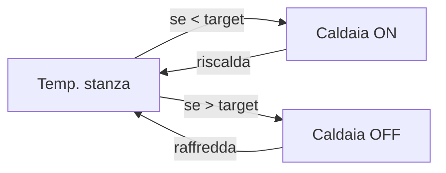
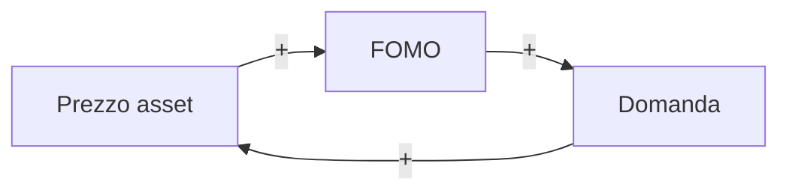
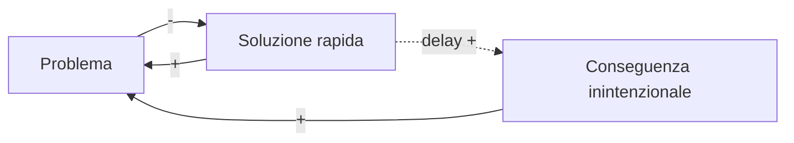
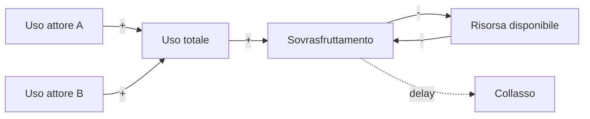
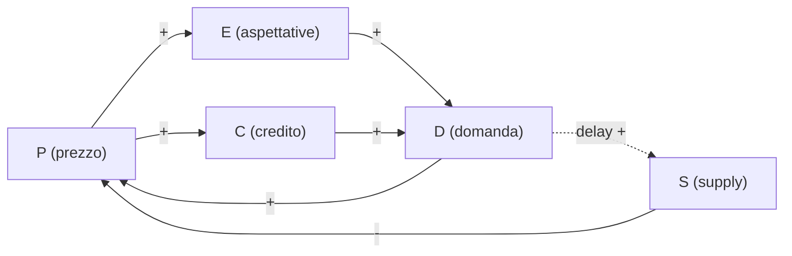

# Systems thinking e modelli di feedback

Il pensiero analitico — il modo di ragionare ereditato dalla rivoluzione scientifica — scompone, isola, riduce. Per capire un orologio: smontalo. Per capire un farmaco: isola la molecola attiva. Funziona benissimo per **sistemi semplici e lineari**. Fallisce per **sistemi complessi** in cui le parti interagiscono in modo non additivo e dove la stessa azione produce effetti opposti in tempi diversi.

Il pensiero sistemico (systems thinking) nasce nella prima metà del XX secolo come reazione a questo limite. **Ludwig von Bertalanffy** (*General System Theory*, 1968) propone una teoria generale dei sistemi viventi come "totalità organizzate". **Jay W. Forrester** al MIT crea negli anni '50 la **system dynamics**, applicando l'ingegneria dei sistemi di controllo a problemi sociali (industrial dynamics, urban dynamics, world dynamics). La sua allieva **Donella Meadows** porta questo approccio al grande pubblico con *Thinking in Systems* (2008, postumo) e con il rapporto *The Limits to Growth* (1972, Club di Roma) che ha definito il dibattito sulla sostenibilità.

Questa sezione presenta il vocabolario di base (sistema, stocks, flows, feedback loops), i diagrammi causal loop, i 12 leverage points di Meadows, e gli archetipi sistemici di Peter Senge (*The Fifth Discipline*, 1990). Esercizi: modellare un termostato, una bolla speculativa, una tragedia dei beni comuni.

## 1. Cos'è un sistema

Definizione di Meadows: un **sistema** è un insieme di elementi interconnessi che produce comportamenti caratteristici per perseguire una funzione o uno scopo. Tre componenti:

1. **Elementi** (cose visibili: persone, organizzazioni, molecole).
2. **Interconnessioni** (relazioni causali, flussi di informazione e materia).
3. **Funzione/scopo** (cosa il sistema fa nel tempo — non sempre dichiarato esplicitamente).

> *"Il comportamento di un sistema deriva più dalle sue interconnessioni che dai suoi elementi. Cambia gli elementi e il sistema spesso continua come prima. Cambia le interconnessioni e cambierà drasticamente."* — Donella Meadows

Un'azienda con tutti i dipendenti sostituiti (ma stessa struttura organizzativa) produrrà comportamenti simili. Stessi dipendenti con una struttura nuova: comportamento radicalmente diverso. È il motivo per cui le "ristrutturazioni" che cambiano persone senza cambiare incentivi falliscono.

## 2. Stocks e flows

**Stock** (livello, accumulo): qualsiasi cosa si accumuli o si esaurisca nel tempo. Una vasca da bagno piena d'acqua, il PIL accumulato, il numero di cittadini, le emozioni represse, la fiducia in un'istituzione.

**Flow** (flusso): tasso di entrata o uscita da uno stock per unità di tempo. Il rubinetto aperto e lo scarico della vasca; assunzioni e dimissioni; nascite e morti.

$$\frac{dS}{dt} = \text{flussi in entrata} - \text{flussi in uscita}$$

Dietro questa equazione differenziale banale c'è un'enorme implicazione cognitiva: gli esseri umani sono **pessimi** nel ragionare su stock e flussi. Sterman (MIT, 2008) ha mostrato sperimentalmente che anche studenti MIT confondono sistematicamente "ridurre il flusso in ingresso" con "ridurre lo stock". Esempio: se le emissioni di CO₂ smettono di crescere ma restano positive, la concentrazione atmosferica continua a crescere. La maggior parte delle persone (anche policymaker) crede invece che "stabilizzare le emissioni" stabilizzi la concentrazione. È sbagliato — è come dire che chiudendo a metà il rubinetto la vasca smette di riempirsi.

<svg viewBox="0 0 500 200" xmlns="http://www.w3.org/2000/svg" style="background:#181834">
  <rect x="180" y="60" width="140" height="80" fill="#181834" stroke="#9a8cf0" stroke-width="2"/>
  <text x="250" y="105" text-anchor="middle" fill="#ecebff" font-size="14" font-family="sans-serif">STOCK</text>
  <text x="250" y="125" text-anchor="middle" fill="#ecebff" font-size="11">(livello)</text>
  <path d="M 30 100 L 175 100" stroke="#9a8cf0" stroke-width="3" fill="none" marker-end="url(#arr)"/>
  <text x="100" y="90" text-anchor="middle" fill="#ecebff" font-size="11">Flow in</text>
  <circle cx="100" cy="110" r="10" fill="none" stroke="#9a8cf0" stroke-width="2"/>
  <text x="100" y="115" text-anchor="middle" fill="#ecebff" font-size="14">≈</text>
  <path d="M 325 100 L 470 100" stroke="#9a8cf0" stroke-width="3" fill="none" marker-end="url(#arr)"/>
  <text x="400" y="90" text-anchor="middle" fill="#ecebff" font-size="11">Flow out</text>
  <circle cx="400" cy="110" r="10" fill="none" stroke="#9a8cf0" stroke-width="2"/>
  <text x="400" y="115" text-anchor="middle" fill="#ecebff" font-size="14">≈</text>
  <defs>
    <marker id="arr" viewBox="0 0 10 10" refX="9" refY="5" markerWidth="6" markerHeight="6" orient="auto">
      <path d="M 0 0 L 10 5 L 0 10 z" fill="#9a8cf0"/>
    </marker>
  </defs>
</svg>

Stock-and-flow: lo stock cambia solo quando i flussi sono sbilanciati.

## 3. Feedback loops

Un **feedback loop** è una catena causale chiusa: una variabile influenza altre che alla fine la modificano a loro volta. Due tipi.

### 3.1 Loop di feedback negativo (bilanciante, $B$)

Riporta il sistema verso un obiettivo. Esempio classico: **termostato**.

Comportamento tipico: **oscillazione attorno al target**, o convergenza monotona se il loop è ben smorzato.

Altri esempi: omeostasi corporea (sudorazione), prezzi di mercato attorno all'equilibrio, regolazione della pressione sanguigna.

### 3.2 Loop di feedback positivo (amplificante, $R$)

Amplifica la deviazione. Esempi: **bolla speculativa** (più sale il prezzo → più investitori comprano → sale ancora), crescita demografica (più persone → più nascite → più persone), virali su social media.

Comportamento tipico: **crescita esponenziale** (o decrescita esponenziale verso zero). I loop positivi sono **instabili**: prima o poi incontrano un vincolo che li trasforma in $B$ (collasso, saturazione).

### 3.3 Delay (ritardo)

Tra causa ed effetto c'è sempre un ritardo. Un ritardo trasforma loop bilancianti in **oscillazioni** (overshoot e undershoot continui) e amplifica l'instabilità nei loop positivi. Esempio: doccia con boiler lontano. Apri il caldo, niente succede, apri di più, niente, finalmente arriva un getto bollente, freni a chiusura, niente, apri freddo, bollente di nuovo. Le persone gestiscono male i ritardi e oscillano.

In economia: politica monetaria. La BCE alza i tassi, gli effetti sull'inflazione si vedono dopo 12-18 mesi. Se ad ogni report mensile la BCE reagisse "subito", il sistema oscillerebbe drasticamente.

## 4. Causal loop diagrams (CLD)

I CLD sono il diagramma sintetico del systems thinking: archi con polarità $(+)$ o $(-)$, loop etichettati $R$ (reinforcing) o $B$ (balancing). Esempio: **diffusione di un'epidemia** con immunità di gregge.

```mermaid
flowchart LR
  S["Suscettibili"] -->|"-"| I["Infetti"]
  I -->|"+"| R["Recuperati"]
  R -->|"+"| Imm["Immunità popolazione"]
  Imm -->|"-"| I
  I -->|"+"| I
  classDef loop fill:#181834,stroke:#9a8cf0,stroke-width:2px
```

Due loop: $R$ (contagi → infetti → più contagi) e $B$ (recuperati → immunità → meno contagi). Il sistema SIR genera la curva epidemica classica come bilanciamento tra i due.

## 5. I 12 leverage points di Donella Meadows

In *Leverage Points: Places to Intervene in a System* (1997), Meadows propone una gerarchia di **punti di leva**: posti in cui un piccolo intervento produce grandi cambiamenti. Dal più debole al più potente:

| Rank | Punto di leva | Esempio |
|------|---------------|---------|
| 12 | Costanti, parametri, numeri | Aliquota fiscale, tasso minimo |
| 11 | Dimensione dei buffer (stock) | Riserve di emergenza |
| 10 | Struttura degli stock e flussi | Rete elettrica, infrastrutture |
| 9  | Lunghezza dei delay | Velocità di risposta del sistema |
| 8  | Forza dei loop bilancianti rispetto agli impatti che cercano di correggere | Capacità di regolazione |
| 7  | Forza dei loop di feedback positivo | Limitarli prima del collasso |
| 6  | Struttura del flusso di informazione | Chi sa cosa, quando |
| 5  | Regole del sistema (incentivi, vincoli, punizioni) | Leggi, contratti |
| 4  | Potere di aggiungere, cambiare, evolvere la struttura | Capacità di auto-organizzazione |
| 3  | Obiettivi del sistema | "Crescita PIL" vs "Benessere" |
| 2  | Paradigma da cui il sistema emerge | Mindset culturale |
| 1  | Potere di trascendere i paradigmi | Capacità di vedere oltre |

Insight di Meadows: la maggior parte degli interventi politici operano ai livelli 9-12 (cambiare numeri, parametri) — quelli più visibili e meno efficaci. Gli interventi al livello 1-3 (cambiare obiettivi, paradigmi) sono difficili ma trasformativi. *"It's hardest to change paradigms, but they're where the leverage is."*

Esempio: ridurre l'inquinamento.
- Livello 12 (parametro): alzare la multa per chi inquina.
- Livello 5 (regole): impedire l'autorizzazione di nuove centrali a carbone.
- Livello 3 (obiettivo): cambiare l'obiettivo del sistema da "massimizzare PIL" a "massimizzare benessere netto".
- Livello 2 (paradigma): da "ambiente come risorsa illimitata" a "economia come sottoinsieme della biosfera".

## 6. Archetipi sistemici (Senge)

Strutture ricorrenti che compaiono in mille contesti diversi. Riconoscerle è metà del lavoro.

### 6.1 Fixes that fail

Una soluzione rapida $S$ risolve il sintomo nel breve, ma ha conseguenze non intenzionali $C$ che peggiorano il problema nel lungo.

Esempio: antibiotici a pioggia → risolvono infezione → ma aumentano resistenza batterica → problema più grave.

### 6.2 Shifting the burden (spostare il problema)

Soluzione superficiale tratta i sintomi e indebolisce la capacità di applicare la soluzione fondamentale, che richiede tempo e dolore.

Esempio: stress lavorativo → ansiolitici (soluzione superficiale) → meno motivazione a cambiare lavoro → cronicizzazione. La soluzione fondamentale (cambiare lavoro/condizioni) viene rimandata indefinitamente.

### 6.3 Tragedy of the commons (Hardin 1968)

Più attori condividono una risorsa comune; ciascuno è incentivato a sfruttarla individualmente; la risorsa collassa.

Esempi: pesca eccessiva (cod del Canada, 1992), traffico in città, atmosfera (gas serra), uso di antibiotici. Soluzioni: privatizzazione (Coase), regolazione (Ostrom *Governing the Commons*, 1990), gestione comunitaria.

### 6.4 Escalation

Due attori reagiscono al rafforzamento dell'altro aumentando la propria potenza. Corsa agli armamenti, escalation di guerra commerciale, escalation di prezzo in marketing.

### 6.5 Growth and underinvestment

Il sistema cresce, ma non investe abbastanza in capacità: la capacità diventa il collo di bottiglia, la crescita si blocca, "vedi: non era una crescita reale" — sotto-investimento confermato. Esempio: aziende SaaS che crescono ma non scalano infrastruttura.

## 7. Pensiero analitico vs sistemico

| Dimensione | Analitico | Sistemico |
|------------|-----------|-----------|
| Approccio | Scomporre | Comporre |
| Causalità | Lineare (A → B) | Circolare (A → B → A) |
| Focus | Eventi e cose | Pattern e processi |
| Tempo | Statico | Dinamico |
| Confini | Chiusi (problema isolato) | Aperti (problema in contesto) |
| Soluzione tipica | Risolvere il sintomo | Cambiare la struttura |

Non sono mutuamente esclusivi: il pensiero analitico è perfetto per problemi *tame* (sezione 48: [wicked problems](48-wicked-problems.html)), il sistemico per problemi complessi e wicked.

## 8. Bounded rationality

Herbert Simon (Nobel 1978) ha introdotto la **razionalità limitata**: gli agenti non massimizzano l'utilità globale (impossibile in pratica), ma **satisficing** (cercare la prima opzione "abbastanza buona") entro limiti cognitivi e di informazione. Il systems thinking abbraccia questa visione: i sistemi reali non sono ottimizzati, sono *good enough* localmente. Per cambiarli serve capire le razionalità locali degli attori, non assumere razionalità globale.

## 9. Esempio lavorato: la bolla speculativa

Variabili:
- $P$: prezzo asset
- $D$: domanda
- $E$: aspettative di crescita prezzo
- $S$: supply
- $C$: credit availability

Loop $R$ (rinforzante): $P \to E \to D \to P$ e $P \to C \to D \to P$. La bolla cresce esponenzialmente.

Loop $B$ (bilanciante, ritardato): $D \to S$ con delay → quando il supply arriva, P scende. Storia tipica: tulipani 1637, dotcom 2000, immobiliare 2008. Il delay nel loop B è il motivo per cui le bolle durano anni anziché correggersi all'istante.

## 10. Esercizi

  
Esercizio 1 — Modella un termostato in CLD

Disegna il loop $B$ con: temperatura misurata, target, gap, caldaia, calore prodotto, perdite verso esterno. Indica polarità su ogni arco.

**Soluzione.** Target − Temp = Gap (+). Gap → Caldaia ON (+). Caldaia → Calore prodotto (+). Calore − Perdite → Temp (netto). Temp → riduce Gap (−). Il loop B = Temp → Gap → Caldaia → Calore → Temp ha numero dispari di "−" (uno solo, Temp→Gap), quindi è bilanciante.

  
Esercizio 2 — Tragedy of the commons: pesca

Hai 100 pescatori in una baia con 10.000 pesci. Ogni pescatore prende 2 pesci/anno, i pesci riproducono al 5% annuo. Modella in stock-flow. Cosa succede se i pescatori salgono a 300?

**Soluzione.** Stock $F$ (pesci). Inflow: $0.05 F$ (riproduzione). Outflow: $2 \cdot N$ (cattura). Steady state quando $0.05 F = 2 N$, cioè $F^* = 40 N$. Con $N = 100$: $F^* = 4000$ (pesci scendono da 10000 a 4000, sostenibile). Con $N = 300$: $F^* = 12000$ ma serve $F > 12000$ per sostenere, e con $F = 10000$ iniziali la cattura ($600$/anno) supera la riproduzione ($500$): $F$ scende, riproduzione scende, spirale negativa — collasso classico.

  
Esercizio 3 — Trova il leverage point

Una città ha traffico cronico. Proponi un intervento per ciascun livello 12, 5, 3 di Meadows.

**Soluzione.**
- Livello 12 (parametri): aumentare costo parcheggio, abbassare velocità max. Effetto modesto.
- Livello 5 (regole): congestion charge tipo Londra, ZTL. Riduce sensibilmente.
- Livello 3 (obiettivo): cambiare obiettivo "città per auto" → "città per persone". Pedonalizzazione, mobilità ciclabile diffusa, lavoro a distanza. Trasformazione radicale.

## Sintesi

- Un **sistema** è elementi + interconnessioni + scopo; il comportamento dipende più dalle interconnessioni che dagli elementi.
- **Stock** = accumulo, **flow** = tasso. Confondere riduzione di flow con riduzione di stock è errore cognitivo diffuso (CO₂, debito).
- **Loop $R$** (rinforzante, amplificante) genera crescita/decrescita esponenziale; **loop $B$** (bilanciante) stabilizza verso target.
- **Delay** trasforma loop $B$ in oscillazioni: doccia col boiler, politica monetaria, ciclo economico.
- I **12 leverage points** di Meadows: i punti più potenti (paradigma, obiettivi) sono i più difficili da cambiare e i più trasformativi.
- **Archetipi**: fixes that fail, shifting the burden, tragedy of the commons, escalation, growth and underinvestment.
- Pensiero analitico per problemi semplici/lineari; sistemico per complessi. Servono entrambi.

## Letture

- Meadows, Donella, *Thinking in Systems: A Primer* (Chelsea Green, 2008)
- Senge, Peter, *The Fifth Discipline* (Doubleday, 1990) per gli archetipi
- Forrester, Jay, *Industrial Dynamics* (MIT Press, 1961)
- Sterman, John, *Business Dynamics: Systems Thinking and Modeling for a Complex World* (McGraw-Hill, 2000)
- Bertalanffy, Ludwig von, *General System Theory* (Braziller, 1968)
- Hardin, Garrett, "The Tragedy of the Commons" (*Science*, 1968)
- Ostrom, Elinor, *Governing the Commons* (Cambridge, 1990) — Nobel 2009
- Meadows et al., *The Limits to Growth* (Universe Books, 1972; aggiornato 2004)
