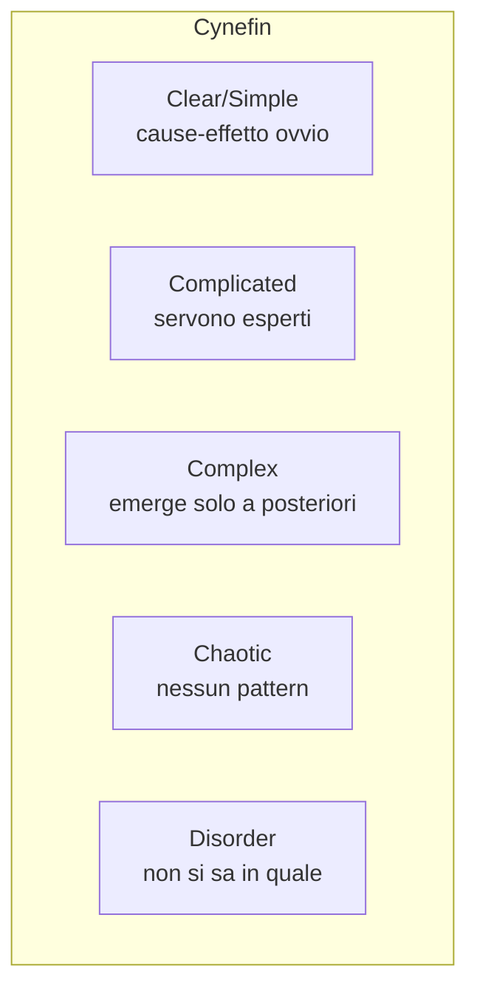

# Wicked problems, complessità, VUCA

Non tutti i problemi sono uguali. Alcuni hanno soluzioni standard (calcolare la radice quadrata di 7). Altri sono **wicked** — "perversi" — nel senso che resistono a ogni metodo classico. Distinguere i tipi di problema è la prima decisione strategica.

## 1. Rittel & Webber, 1973

Horst Rittel e Melvin Webber (planning urbano, Berkeley) coniano "wicked problem" in un paper sulla pianificazione delle politiche pubbliche. Identificano 10 caratteristiche:

1. **Nessuna formulazione definitiva**. La descrizione del problema dipende dalla soluzione che hai in mente.
2. **Nessuno stop rule**. Non si finisce mai veramente.
3. **Le soluzioni sono giuste/sbagliate, non vere/false** (in senso valoriale).
4. **Non c'è test immediato e definitivo**. Gli effetti si vedono a lungo termine.
5. **One-shot operation**. Ogni tentativo ha conseguenze irreversibili; non puoi "provarlo" prima.
6. **Set non enumerabile di soluzioni possibili**.
7. **Ogni problema è unico**.
8. **Ogni wicked è sintomo di un altro problema**.
9. **Esistono molte spiegazioni causali ammissibili**.
10. **Il pianificatore non ha diritto di sbagliare** (perché le conseguenze sono permanenti).

### 1.1 Esempi

- **Cambiamento climatico**: come definirlo? Costi vs benefici intergenerazionali? Soluzioni hanno effetti irreversibili. Cause multiple. Nessuna fine.
- **Povertà urbana**: non c'è definizione unica. Cause sociali, economiche, urbanistiche intrecciate.
- **Sanità pubblica**: ogni intervento crea nuove sfide.
- **Polarizzazione politica**: parte del problema è disaccordo sui valori.

### 1.2 Tame problems

L'opposto. Hanno definizione chiara, criteri di successo, soluzioni testabili. Es: progettare un ponte, scrivere un compilatore, vincere a scacchi.

## 2. VUCA

Acronimo militare US Army War College, anni '90:

- **Volatility**: cambiamenti rapidi e imprevedibili.
- **Uncertainty**: probabilità ignote (knightiana, vedi [sez. 37](37-knightian-cigni-neri.html)).
- **Complexity**: molti elementi interconnessi.
- **Ambiguity**: cause-effetti poco chiari, interpretazioni multiple.

Usato in business e management per descrivere ambienti operativi turbolenti.

## 3. Cynefin framework (Dave Snowden, 1999)

Un modello di **classificazione dei problemi** che ne propone modalità decisionali diverse.

### 3.1 I cinque domini

| Dominio | Caratteristiche | Approccio |
|---|---|---|
| **Clear** | causa-effetto ovvio, ripetibile | sense → categorize → respond (best practices) |
| **Complicated** | causa-effetto serve analisi esperta | sense → analyze → respond (good practices) |
| **Complex** | causa-effetto solo in retrospettiva | probe → sense → respond (emergent practices) |
| **Chaotic** | nessuna causa-effetto stabile | act → sense → respond (novel practices) |
| **Disorder** | non si sa in che dominio si è | il primo passo è capire |

### 3.2 Errore comune: trattare un Complex come Complicated

Tipico delle organizzazioni che applicano best practice a problemi che richiederebbero sperimentazione. Es: si applicano "metodologie agili" come ricetta a contesti dove vanno reinventate.

## 4. Strategie per problemi complessi

### 4.1 Probe-Sense-Respond

Quando non sai cosa fare, fai piccoli esperimenti (probes) reversibili. Osservi gli effetti (sense). Decidi sulla base di ciò che è emerso (respond). Antifragile (vedi [sez. 37](37-knightian-cigni-neri.html)) by design.

### 4.2 Scenario planning

Sviluppa 3-5 scenari plausibili e radicalmente diversi del futuro. Pianifica robustezza in ognuno, non ottimo in uno. Shell pioniere (Pierre Wack anni '70). Aiuta a evitare overfitting su un singolo scenario.

### 4.3 Adattamento iterativo

Non "piano definitivo" → esecuzione. Ma plan-do-learn loop. OODA loop (Boyd), agile, lean startup — tutte varianti.

### 4.4 Coinvolgimento degli stakeholder

I wicked problem hanno molte parti interessate con valori diversi. La "soluzione" emerge solo da processo di dialogo, non da analisi tecnica unilaterale.

## 5. Le trappole tipiche

**Searching for the silver bullet**: cercare la soluzione perfetta. Non esiste per wicked.

**Tame-ification**: ridurre il problema wicked a tame ignorando la complessità. Es: ridurre "polarizzazione politica" a "problema algoritmico dei social".

**Solutionism**: applicare strumenti software a problemi sociali profondi. Critica di Evgeny Morozov: la tecnologia da sola non risolve wicked.

**Analysis paralysis**: aspettare di "capire bene" prima di agire. Su wicked, l'azione cambia il problema; senza azione non capisci.

## 6. Esempio applicato: gestire una pandemia

- **Clear**: vaccinare popolazioni a rischio (procedure standard).
- **Complicated**: progettare la catena del freddo per il vaccino (analisi logistica esperta).
- **Complex**: convincere la popolazione a vaccinarsi (interazione di fattori sociali, culturali, mediatici — richiede sperimentazione, messaggi diversi per gruppi diversi).
- **Chaotic**: prime settimane di una pandemia ignota — atti decisi senza dati completi.

L'errore in COVID-19: trattare la dimensione sociale "convincere a vaccinarsi" come Complicated (un buon messaggio basta) invece che Complex (richiede engagement comunitario differenziato).

## 7. Antifragility per problemi complessi

Da Taleb (vedi [sez. 37](37-knightian-cigni-neri.html)): sistemi che *traggono beneficio* da shock e stress. Per wicked problems:

- Decentralizzare le decisioni.
- Mantenere molteplici opzioni aperte (optionality).
- Limitare il downside (cap delle perdite).
- Costruire ridondanza.
- Tollerare piccoli fallimenti per evitare grandi.

## Esercizi

  
Esercizio 1 — Classifica via Cynefin: (a) ottimizzare l'inventario di un magazzino, (b) integrare gli immigrati di seconda generazione, (c) montare un mobile IKEA, (d) gestire un attacco terroristico in corso.

(a) Complicated — analisi statistica/operativa.
(b) Complex — molti fattori, esiti emergenti, valori diversi.
(c) Clear — procedura standard.
(d) Chaotic — agire prima di capire.

## Sintesi

- Wicked problems (Rittel-Webber): definizione fluida, no stop, no test definitivo, ogni mossa cambia il problema.
- VUCA: ambiente Volatile, Incerto, Complesso, Ambiguo.
- Cynefin: 4 domini di problema + disorder. Approcci diversi a ciascuno.
- Per problemi complex: probe-sense-respond, scenario planning, adattamento iterativo, stakeholder engagement.
- Trappole: silver bullet, tame-ification, solutionism, analysis paralysis.

## Letture

- Rittel & Webber, *Dilemmas in a General Theory of Planning*, Policy Sciences (1973).
- Snowden & Boone, *A Leader's Framework for Decision Making*, HBR (2007).
- Bennett & Lemoine, *What VUCA Really Means for You*, HBR (2014).
- Conklin, *Dialogue Mapping* (2005) — pratico per wicked.
