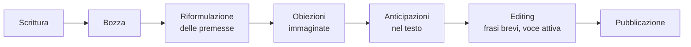

# Critical reading e scrittura argomentativa

Leggere e scrivere bene non sono attività intuitive: sono tecniche allenabili. Il critico legge **per smontare** un argomento, non per riassumerlo. Lo scrittore di argomentazioni costruisce **come se ogni lettore stesse cercando il punto debole**.

## 1. Critical reading: tecniche

### 1.1 SQ3R (Robinson 1946)

Metodo classico dallo studio universitario:

1. **Survey**: scorri il testo (titoli, introduzione, conclusione, immagini) — 2-3 minuti.
2. **Question**: trasforma i titoli in domande ("Cosa risponde questo paragrafo?").
3. **Read**: leggi attivamente cercando le risposte.
4. **Recite**: ripeti a voce le idee chiave senza guardare.
5. **Review**: rileggi le tue note, ricolloca nel quadro.

Funziona per testi tecnici e divulgativi. Per testi argomentativi serve un livello supplementare.

### 1.2 Close reading

Lettura riga per riga, con annotazioni a margine. Tecnica letteraria/filosofica. Cerca:

- Parole-chiave non ovvie (cosa intende per "giustizia"? per "naturale"?).
- Assunzioni nascoste.
- Connettivi logici espliciti ("quindi", "perché", "sebbene").
- Cambi di tono o di voce.

### 1.3 La mappa dell'argomento

Per testi argomentativi (editoriale, paper, saggio), riduci a struttura:

- **Tesi principale**: cosa il testo vuole farti credere.
- **Premesse / argomenti di sostegno**: cosa porta a sostegno.
- **Sub-argomenti**: per ogni premessa, c'è un sotto-argomento.
- **Obiezioni e risposte**: il testo le considera? come?
- **Conclusione**: identica alla tesi o sviluppata?

Usa Toulmin (vedi [sez. 38](38-argomentazione-toulmin.html)) o argument mapping con bullet list / diagramma.

## 2. Esempio di analisi: un editoriale

> "Le tasse vanno abbassate perché stimolano la crescita economica, come dimostrano le politiche di Reagan, che hanno portato all'espansione degli anni '80."

Mappa:

- **Tesi**: tasse vanno abbassate.
- **Premessa 1**: abbassare le tasse stimola crescita.
- **Sub-premessa 1.1 (evidenza)**: Reagan abbassò le tasse, l'80 fu espansione.
- **Warrant** (assunzione implicita): *correlazione = causazione*; gli anni '80 sono attribuibili principalmente alla politica fiscale.
- **Backing**: nessuno fornito esplicitamente.
- **Rebuttal/qualifier**: nessuno menzionato.

Punti deboli evidenti:

1. Confonde correlazione con causazione (vedi [Pearl](45-causalita-pearl.html)).
2. Ignora altri fattori (deregolamentazione, demografia, fine guerra fredda, politiche monetarie Volcker).
3. Cherry picking di un caso favorevole — gli anni '80 furono espansivi anche grazie a deficit pubblico, non solo a riduzione tasse.
4. Non considera evidenze contrarie (studi che mostrano effetti modesti o nulli, es. Romer & Romer 2010).

Una lettura critica produce queste 4 obiezioni in 5 minuti. La lettura passiva produce "ah, interessante".

## 3. Trappole nella lettura

### 3.1 Confirmation bias

Vedi solo evidenza che conferma. Mitigazione: cerca attivamente quale parte del testo *non* avresti voluto leggere.

### 3.2 Source credibility

Sopravvaluti contenuti perché vengono da fonti percepite come autorevoli. Mitigazione: leggi prima il contenuto, poi guarda la fonte.

### 3.3 Bullshit asymmetry (Brandolini 2013)

Confutare una stronzata richiede 10× lo sforzo di produrla. Non bisogna sentirsi obbligati a confutare tutto: scegliere strategicamente cosa.

## 4. Scrittura argomentativa

Specchio della lettura: scrivi pensando al lettore critico ostile.

### 4.1 Thesis statement

Una frase che riassume la tua tesi. **Specifica, contestabile, dimostrabile**.

Cattiva tesi: "L'inquinamento è un problema." (chi può negare?)
Buona tesi: "L'Italia dovrebbe vietare l'auto a benzina entro il 2035 perché i benefici sanitari aggregati superano i costi di transizione."

### 4.2 Struttura Toulmin di un saggio

1. **Introduzione**: contesto + tesi + roadmap.
2. **Body**: una premessa per paragrafo, ognuna con:
   - Claim (sub-tesi).
   - Data/evidence (numeri, citazioni, fatti).
   - Warrant (perché l'evidenza implica la sub-tesi).
3. **Anticipazione e risposta a obiezioni** (1-2 paragrafi): considera la versione steel dell'avversario (vedi [sez. 40](40-dibattito-dialettica.html)).
4. **Conclusione**: ripeti tesi alla luce dell'argomento; non introdurre idee nuove.

### 4.3 Errori comuni

| Errore | Esempio | Correzione |
|---|---|---|
| Assertion without evidence | "È ovvio che X." | Aggiungi dati, fonti, esempi. |
| Padding | Frasi lunghe per riempire | Tagliare. |
| Hedge abuse | "Forse, in alcuni casi, potrebbe essere..." | Posizione chiara. |
| False precision | "il 73,42% delle persone..." | Arrotondare o citare. |
| Cherry picking | un solo esempio | Riconoscere casi contrari. |
| Strawman implicito | "i critici dicono..." (caricatura) | Steelmanning. |
| Conclusione non sequitur | non legata alle premesse | Verificare il legame. |

### 4.4 Stile

- **Frasi brevi** dove possibile. Una idea per frase.
- **Voce attiva** preferibile a passiva ("Il governo ha approvato" > "È stata approvata dal governo").
- **Concretezza**: nomi propri, esempi specifici, numeri.
- **Coerenza terminologica**: se usi "razionalità", usalo sempre con lo stesso senso.

## 5. Steelmanning + scrittura

Prima di pubblicare, immagina il critico ostile più intelligente possibile. Cosa direbbe? Anticipalo nel testo. Il risultato è più forte e più onesto.

Concretamente: scrivi una bozza. Poi sotto ogni paragrafo immagina un commento del lettore critico. Modifica.

## 6. Critical writing per paper accademici

Differenze rispetto al saggio:

- Tesi nella forma "ipotesi → metodo → risultato → conclusione".
- Letteratura precedente esplicitamente discussa.
- Limitazioni dello studio dichiarate (sezione apposita).
- Linguaggio tecnico, ma comprensibile da revisori non specialisti.
- Citazioni rigorose (no "alcuni autori"; cita).

## 7. Diagramma del processo

## Esercizi

  
Esercizio 1 — Mappa l'argomento: "Bisogna abolire l'obbligo del casco perché ognuno deve essere libero di rischiare per sé."

- **Tesi**: abolire obbligo casco.
- **Premessa**: libertà individuale di rischio personale.
- **Warrant implicito**: il rischio è solo del motociclista.

Punto debole: il warrant è falso. Costi sanitari di un incidente con casco vs senza vengono pagati dal sistema sanitario (esternalità). Quindi non è "solo per sé". Bisogna almeno: (a) modificare il principio, (b) o privatizzare i costi sanitari, (c) o accettare il fatto.

Una scrittura critica considera questa obiezione.

## Sintesi

- Critical reading: SQ3R + close reading + mappa dell'argomento (Toulmin).
- Cerca tesi, premesse, warrant, evidenza, obiezioni mancanti.
- Critical writing: thesis specifica, struttura Toulmin, steelmanning preventivo, frasi brevi, voce attiva.
- Errori comuni: assertion senza evidence, hedge abuse, false precision, cherry picking.
- Steelmanning = scrittura più forte: anticipa l'obiezione migliore.

## Letture

- Robinson, *Effective Study* (1946) — SQ3R originale.
- Adler & Van Doren, *How to Read a Book* (1972).
- Booth, Colomb, Williams, *The Craft of Research* (2016).
- Williams, *Style: Lessons in Clarity and Grace* (2014) — sul mestiere.
