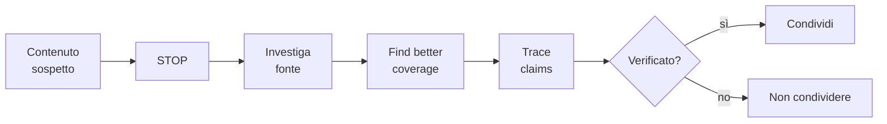

# Propaganda, manipolazione, news literacy, fact-checking

La propaganda non è un'invenzione moderna né esclusiva dei regimi totalitari. È la sistematizzazione delle tecniche di persuasione di massa al servizio di un'agenda. Riconoscerla è oggi un'abilità di sopravvivenza informativa.

## 1. Le tecniche classiche (IPA 1937)

L'**Institute for Propaganda Analysis** (USA, 1937) cataloga sette tecniche di base, ancora oggi attuali.

| Tecnica | Cosa fa | Esempio |
|---|---|---|
| **Name-calling** | etichetta negativa a una persona o idea | "comunista", "fascista", "élite", "anti-italiani" |
| **Glittering generalities** | parole vaghe con forte risonanza positiva | "libertà", "democrazia", "famiglia", "il popolo" |
| **Transfer** | associa un simbolo positivo (bandiera, croce) a un'idea | foto del leader davanti al monumento ai caduti |
| **Testimonial** | celebrità appoggia | attore famoso che sostiene un partito |
| **Plain folks** | "sono uno di voi" | politico che gioca a briscola in osteria |
| **Card stacking** | seleziona solo i fatti favorevoli | grafici con scale truccate, periodo cherry-picked |
| **Bandwagon** | "tutti la pensano così" | "il 70% degli italiani vuole X" |

Da notare: spesso queste tecniche **non sono fallacie in sé** (un politico può davvero essere "uno del popolo"). Diventano problematiche quando sostituiscono argomenti, non quando li accompagnano.

## 2. Edward Bernays e la PR moderna

Bernays (1891–1995), nipote di Freud. *Propaganda* (1928), *Crystallizing Public Opinion* (1923). Convinto che la democrazia moderna richiedesse la "gestione razionale" dell'opinione pubblica da parte di esperti. Suoi esempi:

- Convince le donne americane a fumare ("torches of freedom", 1929) inquadrando le sigarette come emancipazione.
- Trasforma colazione in "uovo e bacon" come "tradizione" americana (campagna per i produttori di bacon).
- Rovescia un governo guatemalteco democraticamente eletto per la United Fruit (1954).

La sua opera è un manuale, scritto dall'interno, su come manipolare opinioni con tecniche derivate dalla psicanalisi e dalla psicologia di massa.

## 3. Chomsky-Herman: *Manufacturing Consent* (1988)

Cinque filtri attraverso cui passa l'informazione nei media mainstream:

1. **Proprietà concentrata**: i media sono di pochi conglomerati con interessi propri.
2. **Pubblicità come modello di business**: i giornali servono l'inserzionista, non il lettore.
3. **Affidamento a fonti ufficiali**: governo, esperti istituzionali — economici, non controversi.
4. **Flak**: pressione organizzata (lettere, campagne, lawsuits) contro chi devia.
5. **Ideologia anti-X**: comune nemico (anticomunismo nel 1988; antiterrorismo dopo 2001).

Il risultato non è "censura": è auto-selezione di chi entra nei media e cosa dicono. Modello descrittivo controverso ma ampiamente discusso.

## 4. Tipologie moderne (UNESCO 2018)

- **Misinformation**: informazione falsa, condivisa senza intenzione di danneggiare. Es: bufale virali su WhatsApp.
- **Disinformation**: falsa **e** intenzionale. Es: campagne russe in elezioni USA 2016.
- **Malinformation**: vera, ma divulgata strategicamente per danneggiare. Es: doxxing, leak selettivi.

Tutte fanno parte del fenomeno **infodemic** durante la pandemia COVID-19.

## 5. Deepfake e AI-generated content

Dal 2018 in poi, modelli generativi (GAN, diffusion, LLM) producono:

- **Video deepfake**: facce sostituite, sincronia labiale falsa, voci sintetiche.
- **Immagini generate**: nessuna foto originale dietro.
- **Testo plausibile**: articoli, commenti, recensioni.

Implicazione: **la possibilità di creazione massiva e a basso costo** di contenuti credibili. Conseguenze:

- "Liar's dividend" (Chesney-Citron 2019): chiunque può dichiarare "è deepfake" anche su contenuti veri.
- Erosione fiducia istituzionale generalizzata.
- Bisogno di nuove infrastrutture di provenance (C2PA, content credentials).

## 6. News literacy: il metodo SIFT (Mike Caulfield)

Quattro mosse rapide per valutare un contenuto:

1. **STOP**: prima di reagire/condividere, fermati 10 secondi.
2. **Investigate the source**: chi pubblica? Wikipedia su 1 minuto basta per molte fonti.
3. **Find better coverage**: cerca lo stesso fatto in più fonti affidabili. Se nessuno lo riporta, sospetto.
4. **Trace claims, quotes, media**: risali al pezzo originale. Cita Y? Cerca Y. Foto X? Reverse-image-search.

## 7. Fact-checking pratico

Strumenti gratuiti:

- **Google Reverse Image Search / TinEye**: dove è apparsa una foto, quando.
- **Wayback Machine (archive.org)**: snapshot storici di pagine web.
- **InVID** (browser extension): analisi forense di video.
- **Bellingcat OSINT toolkit**: tecniche da open source intelligence.
- **CrowdTangle (ex)**: monitoraggio social.
- **AllSides, MediaBiasFactCheck**: rating di orientamento politico/affidabilità delle fonti.

### 7.1 Esempio: una foto virale su WhatsApp

"Foto di Putin con un bambino siriano del 2024." 

Mossa 1: reverse image search. Risultato: la foto è del 2008, in una visita di Putin in Cecenia. Falsa attribuzione.

Mossa 2: cerca il claim "Putin Siria 2024" su fonti affidabili. Risultato: nessuna conferma.

Tempo investito: 60 secondi. La foto non si ricondivide.

## 8. Confirmation bias e filter bubbles

Eli Pariser, *The Filter Bubble* (2011): gli algoritmi dei social personalizzano in modo che tu veda quasi solo contenuti che confermano il tuo punto di vista. Effetti:

- Sovrastima del consenso sulle proprie idee.
- Riduzione del confronto con punti di vista diversi.
- Polarizzazione.

Mitigazione: segui attivamente fonti con cui sei in disaccordo (in modo critico, non per "scimmiottare"). Disabilita la personalizzazione dove possibile. Cerca i fatti senza prima vedere l'opinione.

## 9. Detox informativo

Tecniche per ridurre il consumo tossico:

- Limitare social media a tempi precisi.
- Sostituire feed algoritmici con RSS o newsletter (controlli tu cosa leggi).
- Non leggere notizie nella prima e ultima ora della giornata.
- "Slow news": letture lunghe e contestuali settimanali, no fluss continuo di breaking news.

## Esercizi

  
Esercizio 1 — Applica SIFT a un titolo virale come "Studio rivela che il vino rosso allunga la vita di 10 anni"

**STOP**: aspetta.

**Investigate**: chi pubblica il post? Magazine di lifestyle che vivono di click. Lo studio è citato? Cerco autore.

**Find better coverage**: pubmed, riviste mediche serie. Probabilmente lo studio reale (se esiste) è un'analisi correlazionale su un sottocampione, con effect size piccolo, conclude "associazione modesta tra consumo moderato e mortalità", lontano da "+10 anni".

**Trace**: cerco lo studio originale. Spesso il claim è una distorsione 5× rispetto al testo originale del paper.

Decisione: non condividere.

## Sintesi

- IPA 1937: name-calling, glittering generalities, transfer, testimonial, plain folks, card stacking, bandwagon.
- Bernays inventa PR moderna applicando psicologia di massa.
- *Manufacturing Consent* (Chomsky-Herman): 5 filtri strutturali dei media mainstream.
- UNESCO: mis-/dis-/mal-information.
- Deepfake e AI generativa abbassano il costo della disinformazione e producono "liar's dividend".
- SIFT (Stop, Investigate, Find, Trace) è il metodo rapido di valutazione.
- Strumenti: Reverse image, archive.org, InVID, Bellingcat.

## Letture

- Bernays, *Propaganda* (1928) — il manuale dell'interno.
- Chomsky & Herman, *Manufacturing Consent* (1988).
- Caulfield, *Web Literacy for Student Fact-Checkers* (2017, gratuito online).
- Bellingcat, *We Are Bellingcat* (Eliot Higgins, 2021).
- Pariser, *The Filter Bubble* (2011).
