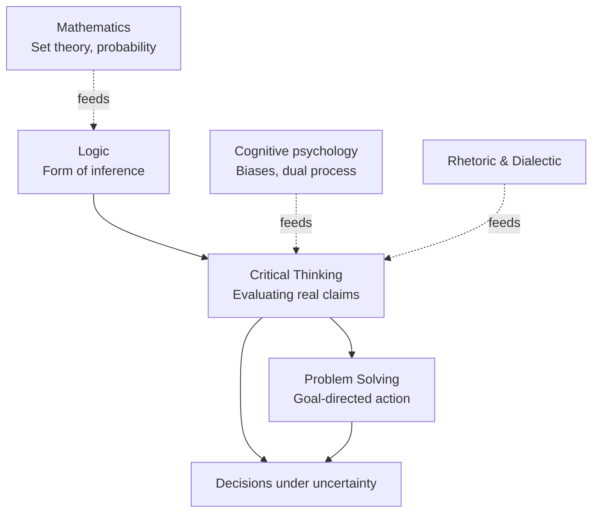

# What is logic and critical thinking

Logic is the systematic study of correct reasoning. Critical thinking is the disciplined habit of applying that study — plus a stock of cognitive hygiene — to real claims, real evidence, real decisions. Problem solving is the engineering layer on top: take a goal, find a sequence of operations that gets you there. The three disciplines overlap heavily, but they are not the same thing, and a recurring source of confusion (in HR courses, MOOCs, LinkedIn posts) is treating them as interchangeable.

This first section fixes the vocabulary, explains the object of each discipline, and gives you the map of the 53 sections ahead. By the end you should be able to answer, in one sentence each: *what does a logician study, what does a critical thinker do, what does a problem solver produce*.

## 1. Logic, narrowly defined

A working definition, in the spirit of Aristotle's *Prior Analytics*: **logic is the science of the forms of inference that preserve truth**. An inference is a passage from one or more **premises** to a **conclusion**. Logic asks when that passage is *valid* — when the truth of the premises *guarantees* the truth of the conclusion — independently of what the sentences are actually about.

The key word is *form*. The argument

$$\text{All } M \text{ are } P;\ \text{all } S \text{ are } M;\ \therefore\ \text{all } S \text{ are } P$$

is valid whether $M, P, S$ stand for *mammals, vertebrates, dogs* or for *prime numbers, integers, twin primes greater than 10^{18}$. Logic abstracts away the content and studies the schema. This is why Boole (1854) could write *The Laws of Thought* as an algebra and why Frege (1879) could build a *Begriffsschrift*, a "concept-script", as a formal language. Modern logic, in the line Frege → Russell-Whitehead → Gödel → Tarski → Gentzen, is essentially mathematics applied to inference.

> Logic does **not** tell you whether a premise is true. It tells you whether your reasoning *from* the premise is correct. "All cats fly; Whiskers is a cat; therefore Whiskers flies" is a valid argument. It is unsound, because the first premise is false, but the *form* is impeccable. We return to this distinction in [Anatomy of arguments](04-anatomy-of-arguments.html).

## 2. Critical thinking, more broadly

Critical thinking inherits logic's standards but adds the dirty work that real-world claims demand: identifying assumptions, weighing evidence, checking sources, spotting biases, considering alternative viewpoints, calibrating confidence. The canonical modern formulation is the **Paul-Elder framework** (Richard Paul and Linda Elder, *The Miniature Guide to Critical Thinking*, 2006): nine universal intellectual standards (clarity, accuracy, precision, relevance, depth, breadth, logic, significance, fairness) applied to eight elements of reasoning (purpose, question, information, interpretations, concepts, assumptions, implications, point of view). We unpack the framework in [Paul-Elder standards](05-paul-elder-standards.html).

So the slogan: logic is *necessary but not sufficient* for critical thinking. A formally valid argument resting on a cherry-picked premise is bad critical thinking. A vague but well-sourced essay is bad critical thinking too.

## 3. Problem solving

Problem solving is goal-directed cognition. George Pólya's *How to Solve It* (1945) gives the canonical four-stage loop: **understand the problem, devise a plan, carry out the plan, look back**. Herbert Simon and Allen Newell, in *Human Problem Solving* (1972), recast problem solving as search through a **problem space**: a graph whose nodes are states and whose edges are operators. From this AI tradition we inherit heuristics, algorithms, complexity considerations — all collected in sections [25–28](25-polya-problem-solving.html).

Problem solving uses logic (to check that a candidate solution actually works) and critical thinking (to question whether the problem is even well posed; see [Wicked problems](48-wicked-problems.html)). It is not reducible to either.

## 4. A picture of the three

The dotted arrows are the inputs we will draw on along the way: a bit of [set theory](14-sets-relations-functions.html), a chunk of [probability](32-probability-foundations.html), the [dual-process](24-dual-process.html) account of cognition (Kahneman, *Thinking, Fast and Slow*, 2011), and the rhetorical tradition that began with the Sophists and was systematised by Aristotle's *Rhetoric*.

## 5. Why study them

Three reasons, in increasing order of urgency.

1. **They are infrastructural skills.** Every field — law, medicine, engineering, journalism, software, public policy — runs on arguments and decisions. Reasoning well is leverage.
2. **The information environment is hostile.** Social media is engineered for engagement, not truth. Generative AI now produces fluent prose that may or may not be grounded. Without working defences against [propaganda](50-propaganda-manipulation.html), [informal fallacies](21-informal-fallacies-relevance.html), and [cognitive biases](23-cognitive-biases.html), you cannot read the news, much less make policy.
3. **You will be wrong, repeatedly, and you should know it.** Calibration — knowing how confident to be — is a learnable skill (Philip Tetlock, *Superforecasting*, 2015). Logic gives you the tools to notice the gap between *what you have shown* and *what you believe*.

## 6. Map of this site

The 53 sections cluster in nine arcs:

- **Foundations (1–2)**: what logic is, where it came from.
- **Reasoning and arguments (3–6)**: deductive vs inductive vs abductive, the anatomy of arguments, the Paul-Elder standards, language and ambiguity.
- **Formal logic (7–19)**: propositional, predicate, modal, non-classical, all the way to Curry-Howard.
- **Fallacies and biases (20–24)**: where reasoning breaks.
- **Problem solving (25–28)**: Pólya, heuristics, computational thinking, algorithms.
- **Creativity and mental models (29–31)**: divergent thinking, design thinking, mental models à la Charlie Munger.
- **Probability and decision (32–37)**: Bayes, paradoxes, decision theory, forecasting, black swans.
- **Argumentation in practice (38–41)**: Toulmin, rhetoric, debate, game-theoretic negotiation.
- **Philosophy, science, causality (42–48)**: epistemology, Popper, Kuhn, Pearl, paradoxes, systems thinking.
- **Practice and reference (49–53)**: critical reading and writing, propaganda, exercises, glossary, formula sheet.

You can read linearly or zigzag. Each section declares its prerequisites in the frontmatter.

## 7. A first worked example

Consider the claim, lifted almost verbatim from a real op-ed: *"Cities with more libraries per capita have lower crime rates. Therefore building libraries reduces crime."*

A logical reading isolates the form:

- Premise: $\text{Correlation}(L, \neg C)$, where $L$ = libraries per capita, $C$ = crime.
- Conclusion: $L \Rightarrow \neg C$ (causal arrow).

A critical reading asks: how was the data gathered? Are richer cities both building more libraries *and* preventing crime via, say, better schools? Is this a [post hoc ergo propter hoc](22-informal-fallacies-presumption.html) move? What does [Pearl's causal hierarchy](45-causality-pearl.html) say about going from correlation to intervention?

A problem-solver asks: if a mayor reads this op-ed and wants to "use" it, what experiment or policy pilot would actually settle the matter?

Three lenses, same sentence, three different jobs. That is the trio.

## 8. Exercises

Exercise 1 — Classify the question

For each question, tag it L (pure logic), CT (critical thinking), PS (problem solving), or a mix.

1. "Is the argument *if it rained, the streets are wet; the streets are wet; therefore it rained* valid?"
2. "Should I trust this YouTube video on vaccines?"
3. "How do I route the wiring in my apartment with the least cable?"
4. "Is the assumption that 'all swans are white' justified?"

**Solution.** (1) L: it is the formal fallacy of affirming the consequent — see [Formal fallacies](20-formal-fallacies.html). (2) CT: source evaluation, evidence weighing. (3) PS: a shortest-path-like problem; see [Algorithms](28-algorithms-strategies.html). (4) CT + L: a textbook Hume induction problem; see [Types of reasoning](03-types-of-reasoning.html).

Exercise 2 — Valid but unsound

Construct an argument that is *valid* but *unsound*, and a separate one that is *invalid* but has true premises and a true conclusion. Reflect on why "true premises + true conclusion" is not enough.

**Solution sketch.** Valid but unsound: "All birds are mammals; all sparrows are birds; therefore all sparrows are mammals." Form is fine, first premise false. Invalid with true premises and true conclusion: "The Earth is round; Rome is in Italy; therefore $2 + 2 = 4$." No logical link, even though everything happens to be true. This is the moral: validity is about *form*, not content.

## Summary

- **Logic** studies the *form* of inference: when premises guarantee conclusions.
- **Critical thinking** evaluates real claims using logic plus a checklist of intellectual standards (Paul-Elder).
- **Problem solving** searches a space of states for ones that satisfy a goal (Pólya, Simon-Newell).
- The three are distinct but interlocking; this course treats them in that order.
- Being able to *tell them apart* on a given sentence is itself a skill — practice it as you read on.

## Further reading

- Aristotle, *Prior Analytics* (c. 350 BCE) — origin of formal logic.
- I. M. Copi, C. Cohen, K. McMahon, *Introduction to Logic*, 14th ed., Pearson, 2014.
- R. Paul, L. Elder, *The Miniature Guide to Critical Thinking*, Foundation for Critical Thinking, 2006.
- G. Pólya, *How to Solve It*, Princeton University Press, 1945.
- A. Newell, H. Simon, *Human Problem Solving*, Prentice-Hall, 1972.
- D. Kahneman, *Thinking, Fast and Slow*, FSG, 2011.
