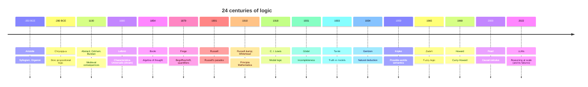

# A short history of logic

Logic is older than universities, younger than philosophy, and has been re-founded at least three times in its career — once by Aristotle, once by Boole and Frege, once by Gödel and the post-war model theorists. This section gives you the spine: who, when, what changed. The point is not to memorise dates but to see that *logic is a moving target*. The "five connectives" you will meet in [Propositional logic](07-propositional-logic.html) are not eternal Platonic truths handed down at Sinai; they are crystallised choices made by particular people for particular reasons.

## 1. Pre-formal beginnings (before 350 BCE)

Reasoning, of course, predates logic. The earliest Mesopotamian and Egyptian mathematical tablets implicitly use inference. Greek philosophers — Parmenides, Zeno, Socrates — already weaponise arguments. Zeno's paradoxes (5th c. BCE) are essentially proofs by contradiction. Plato's *Sophist* and *Theaetetus* probe the structure of predication and falsehood.

But no one systematises *inference itself* as an object of study until Aristotle.

## 2. Aristotle and the syllogism (c. 350 BCE)

In the six treatises later collected as the *Organon* — *Categories*, *On Interpretation*, *Prior Analytics*, *Posterior Analytics*, *Topics*, *Sophistical Refutations* — Aristotle invents formal logic. The centrepiece is the **syllogism**: a three-line argument of the form

$$\text{All } M \text{ is } P;\quad \text{all } S \text{ is } M;\quad \therefore\ \text{all } S \text{ is } P.$$

He classifies syllogisms by *figure* (the position of the middle term $M$) and *mood* (the quantity and quality of the propositions — A, E, I, O — yielding names like *Barbara*, *Celarent*, *Darii*, *Ferio* that medievals would later sing). Aristotelian logic also gives us the **principles of identity, non-contradiction, and excluded middle** (*Metaphysics* IV), which still anchor classical logic today.

> Aristotle's logic stayed essentially unchallenged in the West for 2,000 years. Kant in 1781 could still claim, with a straight face, that since Aristotle logic "has not been able to advance a single step, and is thus to all appearance a closed and completed body". Within a century Frege would prove him spectacularly wrong.

## 3. The Stoics and propositional logic (c. 300–200 BCE)

Aristotle's logic is a logic of *terms* (subjects and predicates). The Stoics — Diodorus Cronus, Philo of Megara, and especially Chrysippus of Soli (c. 280–207 BCE) — developed an alternative: a logic of *whole propositions* connected by what we now call truth-functional connectives. Chrysippus wrote over 300 logic treatises (mostly lost); the surviving fragments show a system with conditional, conjunction, disjunction, and a debate about the truth conditions of "if … then …" that anticipates the modern material conditional by 2,100 years.

The Stoic-Aristotelian rivalry was the propositional-vs-predicate debate. It would only be resolved by Frege, who showed you need both.

## 4. Medieval scholasticism (c. 1100–1500)

The Arabic tradition (Al-Farabi, Avicenna, Averroes) preserved and extended Aristotle. From Spain and Sicily, his works re-entered Latin Europe in the 12th century. Scholastics — Peter Abelard, William of Ockham, John Buridan, Walter Burley — developed:

- **Supposition theory**: a forerunner of reference and scope.
- **Theory of consequences** (*consequentiae*): closer to modern propositional logic than Aristotle.
- **Insolubilia**: the liar paradox and its kin (more in [Famous paradoxes](46-famous-paradoxes.html)).
- **Obligationes**: dialogue games that prefigure modern dialogical logic.

This was sophisticated work, but it was buried by the Renaissance's anti-scholastic backlash and only rehabilitated by 20th-century historians like Jan Łukasiewicz.

## 5. Leibniz and the dream of *Characteristica Universalis* (c. 1680)

Gottfried Wilhelm Leibniz, polymath par excellence, dreams of a *characteristica universalis*: a universal symbolic language in which philosophical disputes could be settled by calculation — *Calculemus!* ("Let us calculate!"). He sketches an algebraic logic centuries ahead of its time, but the work remains in unpublished notes. The dream waits.

## 6. Boole and algebraic logic (1847–1854)

George Boole publishes *The Mathematical Analysis of Logic* (1847) and *An Investigation of the Laws of Thought* (1854). He treats logic as algebra: propositions are variables, conjunction is multiplication ($\cdot$), disjunction is addition ($+$), and the laws of identity and non-contradiction become equations like $x^2 = x$. Boolean algebra is born. It will become, a century later, the substrate of digital circuits — every NAND gate is a Boolean operator.

## 7. Frege's Begriffsschrift (1879)

Gottlob Frege publishes *Begriffsschrift, eine der arithmetischen nachgebildete Formelsprache des reinen Denkens* — "Concept-script, a formula language, modelled on that of arithmetic, of pure thought". This is the most important book in the history of logic. In it Frege:

- introduces **quantifiers** ($\forall, \exists$), solving the millennial Aristotle-vs-Stoics split by unifying predicate and propositional logic;
- treats logic as the foundation of mathematics (the *logicist* programme);
- distinguishes **sense** (*Sinn*) and **reference** (*Bedeutung*), which we cover in [Language and ambiguity](06-language-and-ambiguity.html).

Frege's notation was unreadable (2D trees) and his book sold poorly. Russell read it.

## 8. Russell, Whitehead, Russell's paradox (1900–1913)

In 1901 Bertrand Russell discovers the paradox: the set of all sets that do not contain themselves both does and does not contain itself. This breaks Frege's *Grundgesetze* (Frege famously receives Russell's letter while volume II is at the printer). Russell and Alfred North Whitehead salvage logicism with *Principia Mathematica* (1910–1913), a 2,000-page edifice that proves $1+1=2$ on page 379 of volume II. It is unreadable but foundational.

## 9. Gödel and the limits (1931)

Kurt Gödel, age 25, proves the **incompleteness theorems**: any consistent formal system strong enough to encode arithmetic contains true statements it cannot prove, and cannot prove its own consistency. This shatters Hilbert's dream of a complete, decidable foundation for mathematics. Logic now has *limits* — and we know they are sharp. We treat this in [Metalogic and Gödel](15-metalogic-godel.html).

## 10. Tarski, Gentzen, semantics and proof theory (1930s)

Alfred Tarski (1933) gives the first rigorous **semantic** definition of truth — what it means for a sentence to be true in a model. Gerhard Gentzen (1934) invents **natural deduction** and the **sequent calculus**, turning proof itself into a mathematical object. From here, model theory and proof theory split into two thriving subfields. See [Natural deduction](10-natural-deduction.html) and [Axiomatic and sequent systems](11-axiomatic-sequent-systems.html).

## 11. Modal logic (1918–1960s)

C. I. Lewis (1918) introduces strict implication to handle counter-intuitive features of the material conditional. Saul Kripke (1959, age 18, then 1963) gives the **possible-worlds semantics** that makes modal logic respectable: $\Box \varphi$ ("necessarily $\varphi$") means $\varphi$ holds in every world accessible from the current one. Modal logic explodes into temporal, deontic, epistemic, doxastic variants — see [Modal logic](16-modal-logic.html) and [Temporal, deontic, epistemic logic](17-temporal-deontic-epistemic-logic.html).

## 12. Non-classical logics (1920s–onward)

- **Intuitionistic logic** (Brouwer 1908, formalised by Heyting 1930): no excluded middle, constructive proofs only.
- **Many-valued logics** (Łukasiewicz 1920): three or more truth values.
- **Fuzzy logic** (Lotfi Zadeh 1965): truth degrees in $[0, 1]$, applied in control systems and AI.
- **Paraconsistent logic** (da Costa 1958): tolerates contradictions without exploding.
- **Relevance logic** (Anderson and Belnap 1975): the conditional must be *relevant*, killing classical paradoxes of material implication.

All explored in [Non-classical logics](18-non-classical-logic.html).

## 13. Curry-Howard, logic meets computer science (1934–1969)

Haskell Curry (1934) and William Howard (1969) note a deep correspondence: **propositions are types, proofs are programs**. Proving a theorem is constructing a term of the appropriate type. This isomorphism turns logic into the backbone of programming language theory, type systems, and proof assistants like Coq, Lean, and Agda. See [Curry-Howard and type theory](19-curry-howard-type-theory.html).

## 14. Pearl, causality, and contemporary AI (2000s–today)

Judea Pearl (*Causality*, 2000; *The Book of Why*, 2018) develops a logic and calculus of causal inference, separating observation, intervention, and counterfactual — a genuinely new layer on top of probability, which had not really moved since Kolmogorov in 1933. Meanwhile, the explosion of large language models (LLMs) since 2018 raises a new question: do they *reason*, or just *interpolate*? Logicians are again in demand.

## 15. Timeline

## 16. A worked micro-example: from Aristotle to Frege

Take the sentence "every philosopher admires some logician".

- **Aristotle** cannot represent it cleanly. Syllogistic handles "all $S$ are $P$" but stumbles on multiple quantifiers over relations.
- **Frege** writes it as $\forall x\, (P(x) \rightarrow \exists y\, (L(y) \wedge A(x, y)))$, with $P$ = philosopher, $L$ = logician, $A(x, y)$ = "$x$ admires $y$". Done.

That one formula encapsulates the leap from 350 BCE to 1879.

## 17. Exercises

Exercise 1 — Order the events

Arrange the following in chronological order: Boole's *Laws of Thought*, Frege's *Begriffsschrift*, Gödel's incompleteness, Russell's paradox, Kripke's possible-worlds semantics, Pearl's *Causality*.

**Solution.** 1854 Boole → 1879 Frege → 1901 Russell → 1931 Gödel → 1959 Kripke → 2000 Pearl.

Exercise 2 — Translate Aristotle into Frege

Render the syllogism *Barbara* ("all M are P; all S are M; therefore all S are P") in first-order notation.

**Solution.** $\forall x\, (M(x) \rightarrow P(x))$, $\forall x\, (S(x) \rightarrow M(x))$, therefore $\forall x\, (S(x) \rightarrow P(x))$. The conclusion follows by two applications of universal instantiation and hypothetical syllogism — see [Rules of inference](09-rules-of-inference.html).

## Summary

- Logic begins with **Aristotle** (term logic, syllogism) and the **Stoics** (propositional logic), c. 350–200 BCE.
- The **medievals** refine, the **Renaissance** forgets, **Leibniz** dreams of universal calculation.
- **Boole** (1854) algebraises logic; **Frege** (1879) unifies terms and propositions via quantifiers.
- **Russell**'s paradox forces foundational rethinking; **Gödel** (1931) shows the limits.
- Modal, non-classical, and computational logics flourish in the 20th century; **Pearl** adds causality in 2000.
- Logic is alive: LLMs, type theory, and proof assistants are the current frontier.

## Further reading

- W. Kneale, M. Kneale, *The Development of Logic*, OUP, 1962 — still the standard history.
- D. Bonevac (ed.), *A History of Logic*, in *Routledge History of Philosophy*.
- J. van Heijenoort (ed.), *From Frege to Gödel: A Source Book in Mathematical Logic, 1879–1931*, Harvard, 1967.
- J. Pearl, *The Book of Why*, Basic Books, 2018.
- D. Hofstadter, *Gödel, Escher, Bach*, Basic Books, 1979 — for the long version of section 9.
