# Types of reasoning: deductive, inductive, abductive, analogical

Not all inferences are created equal. Some *guarantee* their conclusions; some only make them likely; some merely propose them as the best available guess. Lumping them together produces both bad philosophy and bad science. This section names and contrasts the four main families — deductive, inductive, abductive, analogical — gives canonical examples of each, and closes with Hume's bombshell: induction has no logical foundation.

## 1. Deduction: from general to particular, with guarantee

A **deductive** inference is one in which, *if* the premises are true, the conclusion *must* be true. The truth of the premises *necessitates* the truth of the conclusion. There is no room for the conclusion to fail.

Canonical example:

- **P1.** All humans are mortal.
- **P2.** Socrates is human.
- **C.** Therefore, Socrates is mortal.

If P1 and P2 are true, C cannot be false — on pain of contradiction. The argument is **valid**. If P1 and P2 are *also* true (they are), the argument is **sound**. The distinction is taken up in [Anatomy of arguments](04-anatomy-of-arguments.html).

```mermaid
flowchart LR
  P1[General rule<br/>All H are M] --> C[Conclusion<br/>Socrates is M]
  P2[Particular case<br/>Socrates is H] --> C
  style C fill:#1a3a1a,stroke:#5fd95f
```

Deduction is the *form* of mathematical proof. It is also the form of every well-conducted formal argument, every legal syllogism ("if the contract has clause X and X was breached, then…"), every type-check by a compiler. It does *not*, by itself, produce new knowledge about the world — at best it makes explicit what is already implicit in the premises. This is the famous "non-ampliative" character of deduction.

## 2. Induction: from particular to general, with risk

An **inductive** inference moves from observed cases to a generalisation. The truth of the premises makes the conclusion more or less *probable*, but does not guarantee it.

Canonical example:

- **P1.** Every swan I have ever seen was white. (Plus reports of thousands more.)
- **C.** Therefore, all swans are white.

This was a respectable European inference until 1697, when Willem de Vlamingh saw black swans in Western Australia. The premise was true; the conclusion was not. Induction is **ampliative** — it goes beyond what the premises strictly contain — but it is **defeasible**: new evidence can overturn it.

```mermaid
flowchart LR
  P1[Observations<br/>s1, s2, ..., sn<br/>all are white] --> C[Generalisation<br/>All swans are white]
  Risk[New evidence<br/>can falsify] -.threatens.-> C
  style C fill:#3a2a1a,stroke:#d99c5f
```

Empirical science is largely inductive, even when dressed in deductive clothing (Popper, in [Scientific method](43-scientific-method-popper.html), tried to dispense with induction; whether he succeeded is contested).

### 2.1 Statistical induction

A more refined form: from a sample to a population. "In a random sample of 1,000 adult Italians, 62% prefer espresso to caffè americano. Therefore approximately 62% of adult Italians prefer espresso." Confidence intervals quantify the residual risk. We treat this in [Probability foundations](32-probability-foundations.html).

### 2.2 The problem of induction (Hume)

David Hume, *An Enquiry Concerning Human Understanding* (1748), demolishes inductive reasoning's foundations in two strokes:

1. *Deductive justification*: no deductive argument can carry you from "the sun rose every day in the past" to "the sun will rise tomorrow", because the conclusion is not contained in the premises.
2. *Inductive justification*: any inductive argument *for* induction ("induction has worked in the past, so it will work in the future") is circular.

We use induction because we cannot help it, says Hume — it is a *custom* of the mind, not a logical inference. Kant's *Critique of Pure Reason* (1781) tries to ground induction in synthetic a priori knowledge. Modern Bayesianism (see [Bayes' theorem](33-bayes-theorem.html)) recasts induction as probability updating, which sidesteps Hume's worry but inherits the problem of choosing priors. The debate is still alive.

> Take-home: induction works empirically but resists rational justification. Pretending it doesn't is bad epistemology; abandoning it is impossible. We live with the tension.

## 3. Abduction: inference to the best explanation

**Abduction** was named by Charles Sanders Peirce (*Collected Papers*, vol. 5, c. 1903) as a third basic mode of inference. The pattern:

- The surprising fact $F$ is observed.
- If hypothesis $H$ were true, $F$ would be expected.
- Therefore, there is reason to suspect $H$.

This is the logic of detective work, medical diagnosis, scientific hypothesis-generation. Sherlock Holmes calls it "deduction" but it is in fact abduction: the conclusion does not follow with necessity, only with plausibility.

Canonical example:

- **F.** The lawn is wet this morning.
- **H.** It rained last night.
- $H$ would explain $F$. So tentatively, *probably it rained*.

Of course, the sprinklers may have come on, or a pipe burst. Abduction picks the *best* (most parsimonious, most explanatory, most consistent with background knowledge) of multiple possible explanations. The criterion of "best" is famously slippery — see Gilbert Harman (*The Inference to the Best Explanation*, 1965) and Peter Lipton's book of the same title (1991, 2nd ed. 2004).

```mermaid
flowchart LR
  F[Surprising fact<br/>Wet lawn] --> Q{Which hypothesis<br/>best explains it?}
  Q --> H1[H1: rain<br/>probable]
  Q --> H2[H2: sprinkler<br/>possible]
  Q --> H3[H3: dew<br/>less probable]
  H1 --> C[Best: H1]
  style C fill:#3a1a3a,stroke:#d95fd9
```

Abduction is *risky* — even more than induction, because we are not even generalising from data, we are jumping to a posited cause. But it is indispensable: without abduction there is no science, no diagnosis, no investigation. Bayesian updating (section 33) is its statistical formalisation.

## 4. Analogical reasoning

An **analogical** argument transfers a property from a known case to a structurally similar unknown case:

- $A$ has properties $p_1, p_2, \dots, p_n$ and also property $q$.
- $B$ has properties $p_1, p_2, \dots, p_n$.
- Therefore, probably $B$ has property $q$.

Examples are legion: Rutherford modelling the atom on the solar system; Darwin reasoning from artificial to natural selection; lawyers citing precedent (the *ratio decidendi* of a case is essentially "this new case is relevantly similar to that old case, so the same rule applies").

Analogy is even more defeasible than induction or abduction. The relevant similarities can be misleading; the disanalogies may matter more than the analogies. But for generating hypotheses, communicating, teaching, and law, analogy is irreplaceable.

```mermaid
flowchart LR
  A[Source A<br/>has p1..pn and q] --> Sim((shared<br/>p1..pn))
  Sim --> B[Target B<br/>has p1..pn]
  B --> C[Probably B<br/>also has q]
  style C fill:#1a2a3a,stroke:#5f9cd9
```

## 5. Comparison table

| Type | Direction | Strength | Ampliative? | Example domain |
|---|---|---|---|---|
| Deductive | General → particular (or rearrangement) | Necessitating | No | Mathematics, formal proof |
| Inductive | Particular → general | Probabilistic | Yes | Empirical science |
| Abductive | Effect → cause | Plausible | Yes | Diagnosis, detective work |
| Analogical | Source → target | Suggestive | Yes | Law, hypothesis generation |

The vertical descent — from deduction's guarantee to analogy's hint — is also a descent in epistemic standing. *In the same argument* you might mix types: a deductive chain whose premises are inductive generalisations whose generation involved abduction whose framing relied on analogy. Most real-world reasoning is precisely this layered.

## 6. When to use what

- **Deduction**: when the rules are explicit (math, formal systems, law applied to facts), or to make implicit consequences explicit ("does this code path violate the spec?").
- **Induction**: when you have data and want a generalisation (most of empirical science, machine learning).
- **Abduction**: when you have a surprising fact and need to *posit* an explanation. The first move in any investigation.
- **Analogy**: when you have no data on the target but have a relevantly similar source. Often the first move in *teaching* a new concept; powerful in law and ethics.

A good thinker uses all four, *and knows which one they are using*.

## 7. Worked example: a medical mini-case

A 45-year-old reports fatigue, weight gain, cold intolerance.

- **Abduction**: what best explains this constellation? Hypothyroidism is a candidate.
- **Analogy**: this patient's presentation resembles cases I have seen before.
- **Induction**: in the literature, of 1,000 patients with this triad, 78% turned out to have hypothyroidism. So the prior probability is high.
- **Deduction**: if TSH is high, *and* high TSH is diagnostic of hypothyroidism, *then* the patient has hypothyroidism. Order the test.

Four kinds of reasoning, one diagnosis.

## 8. Exercises

Exercise 1 — Classify the inference

For each, name the kind of reasoning:

1. "Every car of this model I have driven gets ~50 mpg. So this one will probably get ~50 mpg too."
2. "The patient has fever, cough, and recent travel to a region with malaria. Probably malaria."
3. "If $x > 5$ and $x < 7$, then $x$ is in the open interval $(5, 7)$."
4. "The Roman Empire fell due to overextension; the United States is overextending; therefore the US may fall."
5. "All ravens observed so far are black; therefore all ravens are black."

**Solution.** (1) Inductive (sample → generalisation about a particular new case; also analogical at a stretch). (2) Abductive. (3) Deductive. (4) Analogical. (5) Inductive — and the classical site of [Hempel's paradox of the ravens](46-famous-paradoxes.html).

Exercise 2 — Diagnose a flaw

A friend says: "Three of my acquaintances who took vitamin C avoided getting a cold this winter. Therefore vitamin C prevents colds." Identify the type of reasoning and at least two weaknesses.

**Solution.** Inductive (small sample → causal generalisation). Weaknesses: (a) sample size of three is statistically nothing; (b) no control group — the acquaintances may have avoided colds anyway; (c) hidden abduction is doing work — the friend has *also* inferred a causal mechanism, not just a regularity. A proper RCT (large sample, control, blinding) is the only way to settle this. The Cochrane meta-analysis on vitamin C and the common cold actually finds a small effect on duration but not on prevention in the general population.

## Summary

- **Deduction** guarantees the conclusion (truth-preserving, non-ampliative). Math and formal proof live here.
- **Induction** generalises from cases (truth-likely, ampliative, defeasible). Empirical science lives here. Hume reminds us it has no purely logical foundation.
- **Abduction** posits the best explanation for a surprising fact. Diagnosis, detective work, hypothesis generation.
- **Analogy** transfers from a similar source. Law, teaching, creative hypothesis.
- Real arguments mix all four. Skill is naming which is doing the work at each step.

## Further reading

- D. Hume, *An Enquiry Concerning Human Understanding*, 1748, §IV–V.
- C. S. Peirce, *Collected Papers*, vol. 5, on abduction.
- P. Lipton, *Inference to the Best Explanation*, 2nd ed., Routledge, 2004.
- J. R. Brown, *The Laboratory of the Mind*, on analogical reasoning in science.
- I. M. Copi, C. Cohen, *Introduction to Logic*, ch. 8 (induction).
