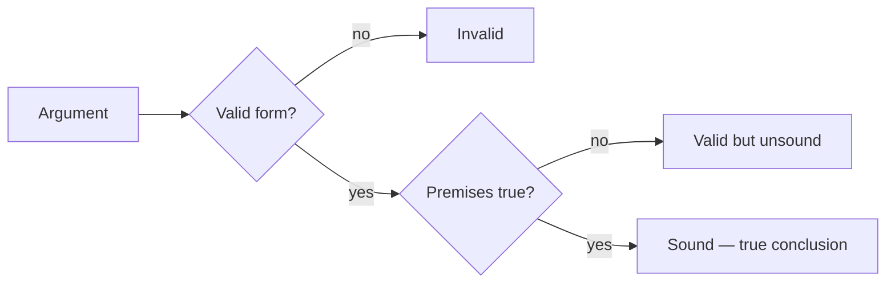

# Arguments: premises, conclusion, validity, soundness

An **argument** in logic is not a quarrel. It is a set of statements where one (the **conclusion**) is alleged to follow from the others (the **premises**). Spotting the parts is the first skill of critical reading.

## 1. Parts of an argument

- **Premise**: a statement offered as evidence or reason.
- **Conclusion**: the claim the premises are meant to support.
- **Inference**: the move from premises to conclusion.

### 1.1 Indicator words

- **Premise indicators**: *because*, *since*, *as*, *given that*, *for*, *seeing that*.
- **Conclusion indicators**: *therefore*, *hence*, *thus*, *so*, *it follows that*, *consequently*.

Example: "*Since* all mammals are warm-blooded, *and* whales are mammals, *therefore* whales are warm-blooded."

Two premises, one conclusion.

## 2. Validity

An argument is **valid** if: *whenever the premises are all true, the conclusion must be true*. Validity is about **form**, not about whether the premises are actually true.

Valid but with false premises:

> All cats are reptiles. All reptiles read Kant. Therefore, all cats read Kant.

The form is valid (a categorical syllogism, Barbara mode). The conclusion is false because the premises are false. **Valid ≠ true**.

## 3. Soundness

An argument is **sound** if it is **valid AND its premises are actually true**. Sound arguments guarantee true conclusions; valid but unsound arguments don't.

Most real-world arguments fail not on validity but on soundness: someone slips in a false or unsupported premise. The trick of critical reading is to identify which premise.

## 4. Deductive vs inductive vs cogent

- **Deductive**: claim of validity. Conclusion *necessarily* follows.
- **Inductive**: claim of strength. Conclusion *probably* follows.
- **Cogent**: a strong inductive argument with true premises.

See [types of reasoning](03-types-of-reasoning.html) for the distinction.

## 5. Hidden premises (enthymemes)

Many real arguments don't state every premise. An **enthymeme** is an argument with one (or more) implicit premises.

> "He must be guilty — he was at the scene of the crime."

Hidden premise: "Being at the scene of a crime implies guilt." False as stated. Critical reading uncovers hidden premises and tests them.

## 6. Common structures

- **Modus ponens**: If P then Q. P. Therefore Q.
- **Modus tollens**: If P then Q. Not Q. Therefore not P.
- **Disjunctive syllogism**: P or Q. Not P. Therefore Q.

See [rules of inference](09-rules-of-inference.html).

## 7. Mapping an argument

For a complex passage, identify each sentence and label:

| # | Statement | Role |
|---|---|---|
| 1 | "All mammals are warm-blooded" | premise |
| 2 | "Whales are mammals" | premise |
| 3 | "Therefore whales are warm-blooded" | conclusion |

When the argument has sub-arguments, you get a tree (see [Toulmin model](38-argumentation-toulmin.html)).

## Exercises

  
Exercise 1 — Is this valid? Sound?

> "If it rains, the streets get wet. The streets are wet. Therefore it rained."

**Invalid** — affirming the consequent. Streets can be wet from a passing cleaning truck. Not sound either.

  
Exercise 2 — Find the hidden premise.

> "She'll succeed because she works hard."

Hidden premise: "Whoever works hard succeeds." False as a universal — many people work hard without succeeding.

## Summary

- Argument = premises + conclusion; identify with indicator words.
- Valid = form preserves truth; sound = valid AND premises true.
- Most real arguments fail at soundness, not validity.
- Enthymemes hide premises — critical reading unhides them.

## Further reading

- Copi & Cohen, *Introduction to Logic*.
- Govier, *A Practical Study of Argument*.
