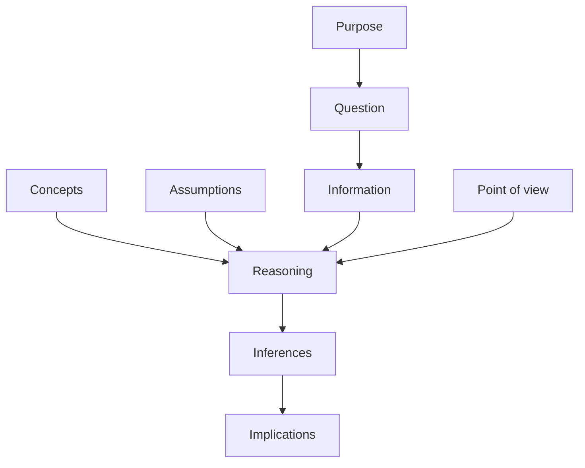

# Critical thinking: Paul-Elder standards

Richard Paul (1937–2015) and Linda Elder developed at the Foundation for Critical Thinking a framework that breaks critical thinking into three components: **standards** (criteria of good thinking), **elements** (parts of any reasoning), and **traits** (intellectual virtues). It is the most concrete checklist available.

## 1. Nine universal intellectual standards

Apply to any thought, claim, or argument.

| Standard | Question to ask |
|---|---|
| **Clarity** | Can you elaborate? Give an example? |
| **Accuracy** | Is that really true? How could we verify? |
| **Precision** | Can you be more specific? Give details? |
| **Relevance** | How does this connect to the question? |
| **Depth** | Are we addressing the complexities? |
| **Breadth** | Other viewpoints to consider? |
| **Logic** | Does this follow from what was said? |
| **Significance** | Is this the most important focus? |
| **Fairness** | Are we biased? Are vested interests at play? |

A common failure: pursuing precision (Q3) when relevance (Q4) is what's missing. Don't optimize one standard at the cost of another.

## 2. Eight elements of reasoning

Every act of thinking has these parts. Identifying them disciplines the analysis.

1. **Purpose**: what is the goal of this thinking?
2. **Question at issue**: what specifically is being addressed?
3. **Information**: what facts/data are used?
4. **Interpretations and inferences**: what conclusions are drawn?
5. **Concepts**: what theoretical ideas frame the thinking?
6. **Assumptions**: what is taken for granted?
7. **Implications and consequences**: what follows?
8. **Point of view**: from what perspective?

## 3. Intellectual virtues

Disposition matters as much as method. The seven traits:

- **Intellectual humility**: aware of limits of one's knowledge.
- **Intellectual courage**: face ideas, beliefs, or viewpoints toward which one has strong negative emotions.
- **Intellectual empathy**: imaginatively put oneself in another's place.
- **Intellectual autonomy**: think for oneself.
- **Intellectual integrity**: same standards of evidence for yourself as for opponents.
- **Intellectual perseverance**: stay with intellectual difficulties.
- **Confidence in reason**: trust that following good reasoning leads to right conclusions.

These echo Aristotelian moral virtues — habits, not switches.

## 4. A usable mini-checklist

Before accepting a claim X:

1. Clear? (Can I restate X precisely?)
2. Accurate? (How would I verify X?)
3. Logical? (Does X follow from stated reasons?)
4. Relevant? (To the question I actually have?)
5. Sufficient? (Depth + breadth of evidence?)
6. Fair? (Vested interests? Alternative views considered?)

This six-question filter, applied honestly, eliminates 80% of weak arguments. The remaining 20% requires deeper formal tools (see [logic](07-propositional-logic.html), [Bayes](33-bayes-theorem.html)).

## Exercises

  
Apply Paul-Elder to: "Climate change is real because 97% of scientists agree."

- **Clarity**: what does "97%" measure exactly? (Cook et al. 2013 — papers, not scientists.)
- **Accuracy**: the 97% refers to papers that take a position; many take no position. Still strong consensus, but the statistic is often misstated.
- **Logic**: appeal to authority — legitimate when authorities are genuinely expert and consensus reflects evidence. Both true here. But the argument's strength is *the underlying evidence*, not the consensus per se.
- **Relevance**: which specific aspect of "climate change" is being claimed? Existence? Human cause? Severity?
- **Depth**: depth is shallow if "consensus" is the only justification.
- **Fairness**: are dissenting views misrepresented?

The claim survives Paul-Elder analysis — but only after pinning down which version of the claim is meant.

## Summary

- Nine standards: clarity, accuracy, precision, relevance, depth, breadth, logic, significance, fairness.
- Eight elements: purpose, question, info, interpretations, concepts, assumptions, implications, viewpoint.
- Seven virtues: humility, courage, empathy, autonomy, integrity, perseverance, confidence in reason.
- Combined: a usable mini-checklist that filters most weak arguments fast.

## Further reading

- Paul & Elder, *Critical Thinking: Tools for Taking Charge of Your Professional and Personal Life* (2014).
- criticalthinking.org — free resources.
