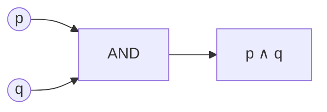

# Propositional logic: connectives and truth tables

Propositional logic (or *sentential logic*) treats statements as atomic blocks that are either **true (T)** or **false (F)**, and combines them with five operators. The Stoics (Chrysippus, 3rd century BCE) had it first; Boole (1854) refounded it in modern form.

## 1. Atomic and compound statements

A **statement** is a declarative sentence with a truth value. "It is raining in Turin" is a statement. "Open the window!" is not.

Atomic statements are denoted with letters: $p, q, r, \ldots$. *Atomic* means not analyzed internally. To analyze "All ravens are black" further, you need [first-order logic](12-predicate-logic-syntax.html).

## 2. The five connectives

| Connective | Symbol | English | Operation |
|---|---|---|---|
| Negation | $\neg$ | "not $p$" | NOT |
| Conjunction | $\wedge$ | "$p$ and $q$" | AND |
| Disjunction | $\vee$ | "$p$ or $q$" (inclusive) | OR |
| Conditional | $\rightarrow$ | "if $p$ then $q$" | IF→THEN |
| Biconditional | $\leftrightarrow$ | "$p$ iff $q$" | IFF |

### 2.1 Truth tables

| $p$ | $q$ | $\neg p$ | $p \wedge q$ | $p \vee q$ | $p \rightarrow q$ | $p \leftrightarrow q$ |
|---|---|---|---|---|---|---|
| T | T | F | T | T | T | T |
| T | F | F | F | T | F | F |
| F | T | T | F | T | T | F |
| F | F | T | F | F | T | T |

Three counterintuitive points:

- $p \vee q$ is **inclusive**: T also when both are T.
- $p \rightarrow q$ is **F only when $p$ is T and $q$ is F**. False antecedent makes the whole conditional vacuously T. This is the **material conditional**: no causal link required.
- $p \leftrightarrow q$ is T when $p$ and $q$ share the same truth value.

## 3. Building a complex truth table

Compute $(p \rightarrow q) \wedge \neg q$.

| $p$ | $q$ | $p \rightarrow q$ | $\neg q$ | $(p \rightarrow q) \wedge \neg q$ |
|---|---|---|---|---|
| T | T | T | F | F |
| T | F | F | T | F |
| F | T | T | F | F |
| F | F | T | T | T |

True in only one row. Neither a tautology nor a contradiction.

With $n$ variables you need $2^n$ rows.

## 4. Tautology, contradiction, contingency

- **Tautology**: T in all rows. E.g. $p \vee \neg p$ (excluded middle), $p \rightarrow p$.
- **Contradiction**: F in all rows. E.g. $p \wedge \neg p$.
- **Contingency**: mixed.

**Satisfiability**: at least one row T. This is the **SAT problem**, the first NP-complete problem (Cook 1971).

## 5. Validity of an argument

$P_1, \ldots, P_n \vdash C$ is **valid** iff in every row where all $P_i$ are T, $C$ is also T. Equivalent to: $(P_1 \wedge \cdots \wedge P_n) \rightarrow C$ is a tautology.

Example: modus ponens. $p \rightarrow q$, $p \vdash q$.

| $p$ | $q$ | $p \rightarrow q$ | $p$ | $q$ |
|---|---|---|---|---|
| T | T | T | **T** | **T** |
| T | F | F | T | F |
| F | T | T | F | T |
| F | F | T | F | F |

Only row 1 has both premises T; conclusion T there. Valid.

## 6. Visualizing AND as a logic gate

Digital circuits are physical implementations of these connectives. Every CPU is a castle of NAND, OR, NOT, XOR gates.

## 7. Don't confuse $\rightarrow$ with $\leftrightarrow$

The fallacy of **affirming the consequent** (see [formal fallacies](20-formal-fallacies.html)) treats $p \rightarrow q, q \vdash p$ as if it were valid — because of confusing direction. Watch your arrows.

## Exercises

  
Exercise 1 — Build the truth table of $p \rightarrow (q \rightarrow p)$.

| $p$ | $q$ | $q \rightarrow p$ | $p \rightarrow (q \rightarrow p)$ |
|---|---|---|---|
| T | T | T | T |
| T | F | T | T |
| F | T | F | T |
| F | F | T | T |

**Tautology**. "If $p$, then $p$ regardless of $q$."

  
Exercise 2 — Is $(p \vee q), \neg p \vdash q$ valid?

Row analysis: only F/T row has both premises T → conclusion $q$ is T. **Valid**. Disjunctive syllogism.

  
Exercise 3 — Is $p \rightarrow q, q \vdash p$ valid?

Row F/T has both premises T but $p$ is F. Counterexample. **Invalid** — affirming the consequent.

## Summary

- Five connectives: $\neg, \wedge, \vee, \rightarrow, \leftrightarrow$.
- Truth table = exhaustive enumeration of T/F assignments.
- Tautology, contradiction, contingency. SAT problem.
- Argument valid ⇔ no row with premises T and conclusion F.
- $\rightarrow$ is material implication: T except when antecedent T and consequent F.

## Further reading

- Boole, *An Investigation of the Laws of Thought* (1854).
- Copi & Cohen, *Introduction to Logic*.
- Mendelson, *Introduction to Mathematical Logic*, ch. 1.
