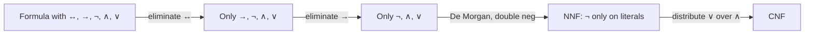

# Logical equivalences, De Morgan, normal forms

Two formulas are **logically equivalent** ($\equiv$) if they share the same truth table. Equivalences let you simplify formulas, derive proofs without exhaustive enumeration, and put any formula into a **normal form** that algorithms can chew.

## 1. Fundamental equivalences

| Name | Equivalence |
|---|---|
| Double negation | $\neg\neg p \equiv p$ |
| Idempotence | $p \wedge p \equiv p$; $p \vee p \equiv p$ |
| Commutativity | $p \wedge q \equiv q \wedge p$; $p \vee q \equiv q \vee p$ |
| Associativity | $(p \wedge q) \wedge r \equiv p \wedge (q \wedge r)$; same for $\vee$ |
| Distributivity | $p \wedge (q \vee r) \equiv (p \wedge q) \vee (p \wedge r)$ |
| | $p \vee (q \wedge r) \equiv (p \vee q) \wedge (p \vee r)$ |
| Absorption | $p \wedge (p \vee q) \equiv p$; $p \vee (p \wedge q) \equiv p$ |
| De Morgan | $\neg(p \wedge q) \equiv \neg p \vee \neg q$ |
| | $\neg(p \vee q) \equiv \neg p \wedge \neg q$ |
| Material implication | $p \rightarrow q \equiv \neg p \vee q$ |
| Contrapositive | $p \rightarrow q \equiv \neg q \rightarrow \neg p$ |
| Biconditional | $p \leftrightarrow q \equiv (p \rightarrow q) \wedge (q \rightarrow p)$ |
| Excluded middle | $p \vee \neg p \equiv \top$ |
| Non-contradiction | $p \wedge \neg p \equiv \bot$ |

### 1.1 De Morgan in plain English

- "Not (A and B)" ≡ "Not A, or not B".
- "Not (A or B)" ≡ "Not A, and not B".

The most useful pair of rules in everyday reasoning: it lets you push negations through complex statements.

## 2. Conditional, converse, inverse, contrapositive

From $p \rightarrow q$:

| Name | Formula | Equivalent? |
|---|---|---|
| Direct | $p \rightarrow q$ | yes |
| Converse | $q \rightarrow p$ | **NO** |
| Inverse | $\neg p \rightarrow \neg q$ | **NO** |
| Contrapositive | $\neg q \rightarrow \neg p$ | **yes** |

Confusing direct with converse → fallacy of affirming the consequent. Confusing direct with inverse → fallacy of denying the antecedent. (See [formal fallacies](20-formal-fallacies.html).)

Contrapositive is genuinely equivalent: often easier to prove than the direct form ("proof by contraposition").

## 3. Normal forms

A **normal form** is a canonical syntax. Two main ones:

### 3.1 Conjunctive Normal Form (CNF)

A **conjunction of disjunctions of literals**. Example: $(p \vee \neg q) \wedge (\neg p \vee q \vee r)$. Each parenthesis is a **clause**. CNF is the standard input to SAT solvers (DPLL, CDCL).

### 3.2 Disjunctive Normal Form (DNF)

A **disjunction of conjunctions of literals**. Example: $(p \wedge q \wedge \neg r) \vee (\neg p \wedge q)$. Reflects directly the T rows of the truth table.

### 3.3 Negation Normal Form (NNF)

Intermediate: all negations are pushed down to literals.

## 4. Algorithm: convert to CNF

1. **Eliminate $\leftrightarrow$**: $p \leftrightarrow q \equiv (p \rightarrow q) \wedge (q \rightarrow p)$.
2. **Eliminate $\rightarrow$**: $p \rightarrow q \equiv \neg p \vee q$.
3. **Push negations down** (De Morgan + double negation) → NNF.
4. **Distribute $\vee$ over $\wedge$**: $A \vee (B \wedge C) \equiv (A \vee B) \wedge (A \vee C)$.

### 4.1 Worked example

Convert $(p \rightarrow q) \wedge (\neg r \rightarrow s)$ to CNF.

Step 2: $(\neg p \vee q) \wedge (\neg\neg r \vee s) \equiv (\neg p \vee q) \wedge (r \vee s)$.

Already in CNF: two clauses.

### 4.2 Exponential explosion

CNF conversion can blow up. $(p_1 \wedge q_1) \vee \ldots \vee (p_n \wedge q_n)$ → DNF length $n$, CNF $2^n$ clauses. Tseitin transformation (1968) avoids this by introducing fresh variables — produces an **equisatisfiable**, not equivalent, formula.

## 5. Functional completeness

A set of connectives is **functionally complete** if it expresses every Boolean function:

- $\{\neg, \wedge, \vee\}$ ✓
- $\{\neg, \wedge\}$ ✓
- $\{\rightarrow, \neg\}$ ✓
- **NAND alone** ($p \uparrow q \equiv \neg(p \wedge q)$) ✓
- **NOR alone** ($p \downarrow q$) ✓

Industrial silicon uses only NAND or only NOR — saves transistors and design uniformity.

## 6. Pipeline

## Exercises

  
Exercise 1 — Simplify $\neg(p \rightarrow \neg q)$.

$\neg(\neg p \vee \neg q) \equiv \neg\neg p \wedge \neg\neg q \equiv p \wedge q$.

  
Exercise 2 — Verify $(p \rightarrow q) \rightarrow (\neg q \rightarrow \neg p) \equiv \top$.

Antecedent is $p \rightarrow q$; consequent is the contrapositive $\neg q \rightarrow \neg p$. They're equivalent. So the implication is $X \rightarrow X$, tautology.

## Summary

- Equivalences: commut., assoc., distrib., De Morgan, double neg, material implication, contrapositive.
- Direct ≡ contrapositive. Direct ≢ converse, inverse.
- CNF = ∧ of (∨ of literals). DNF = ∨ of (∧ of literals).
- Algorithm: eliminate ↔, eliminate →, push ¬, distribute ∨ over ∧.
- NAND alone is functionally complete.

## Further reading

- Mendelson, *Introduction to Mathematical Logic*.
- Russell & Norvig, *AIMA*, ch. 7.
- Marques-Silva, *Conflict-Driven Clause Learning SAT Solvers*.
