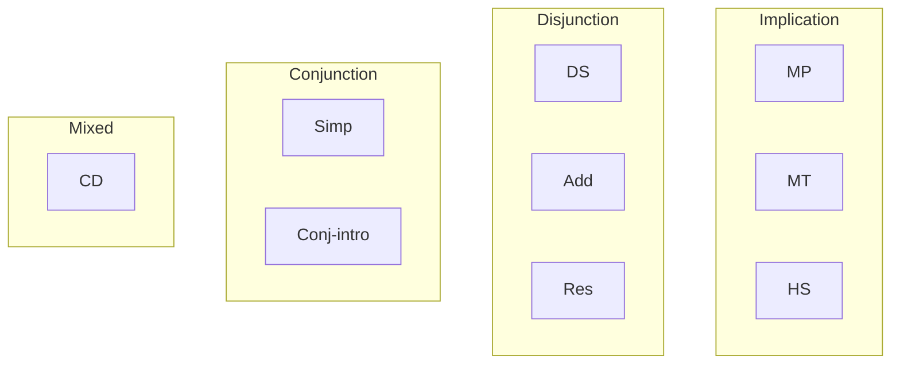

# Rules of inference

A **rule of inference** is a schema for moving from premises to a conclusion while preserving truth. Notation:

$$\frac{P_1 \quad P_2 \quad \ldots \quad P_n}{C}$$

Valid means: no truth assignment makes all $P_i$ true and $C$ false.

## 1. The basic rules

### 1.1 Modus Ponens (MP)

$$\frac{p \rightarrow q \qquad p}{q}$$

"If it rains, the street is wet. It rains. So the street is wet." The workhorse rule.

### 1.2 Modus Tollens (MT)

$$\frac{p \rightarrow q \qquad \neg q}{\neg p}$$

"If it rains, the street is wet. The street is not wet. So it does not rain." Equivalent to using the contrapositive and MP.

### 1.3 Hypothetical Syllogism (HS)

$$\frac{p \rightarrow q \qquad q \rightarrow r}{p \rightarrow r}$$

Transitivity of implication.

### 1.4 Disjunctive Syllogism (DS)

$$\frac{p \vee q \qquad \neg p}{q}$$

"Either at home or office. Not at home. Therefore at office."

### 1.5 Constructive Dilemma (CD)

$$\frac{(p \rightarrow q) \wedge (r \rightarrow s) \qquad p \vee r}{q \vee s}$$

Branching MP.

### 1.6 Simplification (Simp)

$$\frac{p \wedge q}{p}$$

### 1.7 Conjunction (Conj)

$$\frac{p \qquad q}{p \wedge q}$$

### 1.8 Addition (Add)

$$\frac{p}{p \vee q}$$

### 1.9 Resolution

$$\frac{p \vee q \qquad \neg p \vee r}{q \vee r}$$

Robinson 1965. A **complete** rule on its own for CNF: applying it exhaustively detects all unsatisfiability. The backbone of modern SAT solvers and the language Prolog.

## 2. Summary table

| Sigla | Name | Schema |
|---|---|---|
| MP | Modus Ponens | $p \rightarrow q, p \vdash q$ |
| MT | Modus Tollens | $p \rightarrow q, \neg q \vdash \neg p$ |
| HS | Hypothetical Syllogism | $p \rightarrow q, q \rightarrow r \vdash p \rightarrow r$ |
| DS | Disjunctive Syllogism | $p \vee q, \neg p \vdash q$ |
| CD | Constructive Dilemma | as above |
| Simp | Simplification | $p \wedge q \vdash p$ |
| Conj | Conjunction | $p, q \vdash p \wedge q$ |
| Add | Addition | $p \vdash p \vee q$ |
| Res | Resolution | $p \vee q, \neg p \vee r \vdash q \vee r$ |

## 3. Structured proof example

Prove $\neg p$ from $p \rightarrow q$, $\neg q \vee r$, $\neg r$.

| # | Formula | Justification |
|---|---|---|
| 1 | $p \rightarrow q$ | premise |
| 2 | $\neg q \vee r$ | premise |
| 3 | $\neg r$ | premise |
| 4 | $\neg q$ | DS 2, 3 |
| 5 | $\neg p$ | MT 1, 4 |

## 4. The "evil twin" fallacies

| Valid rule | Fallacy "twin" | Fallacious schema |
|---|---|---|
| Modus Ponens | Affirming the consequent | $p \rightarrow q, q \vdash p$ |
| Modus Tollens | Denying the antecedent | $p \rightarrow q, \neg p \vdash \neg q$ |

Affirming the consequent example: "If it rains, the street is wet. The street is wet. Therefore it rains." False: a street cleaner can wet it. See [formal fallacies](20-formal-fallacies.html).

## 5. Rule cluster

## Exercises

  
Prove $\neg s$ from $p \rightarrow q$, $q \rightarrow r$, $r \rightarrow \neg s$, $p$.

1. $p \rightarrow q$ (P)
2. $q \rightarrow r$ (P)
3. $r \rightarrow \neg s$ (P)
4. $p$ (P)
5. $q$ (MP 1, 4)
6. $r$ (MP 2, 5)
7. $\neg s$ (MP 3, 6)

  
"If it rains, I bring an umbrella. It doesn't rain. So I don't bring an umbrella." Valid or fallacy?

Schema: $p \rightarrow q, \neg p \vdash \neg q$. **Fallacy of denying the antecedent**. I might bring an umbrella because the forecast says rain later.

## Summary

- Nine standard rules (MP, MT, HS, DS, CD, Simp, Conj, Add, Res) cover most propositional inference.
- A structured proof = numbered sequence with justifications.
- Affirming the consequent and denying the antecedent are the two most common formal fallacies.
- Resolution alone is complete for CNF (Robinson 1965).

## Further reading

- Copi & Cohen, *Introduction to Logic*, ch. 9.
- Russell & Norvig, *AIMA*, ch. 7.
- Genesereth & Nilsson, *Logical Foundations of AI*.
