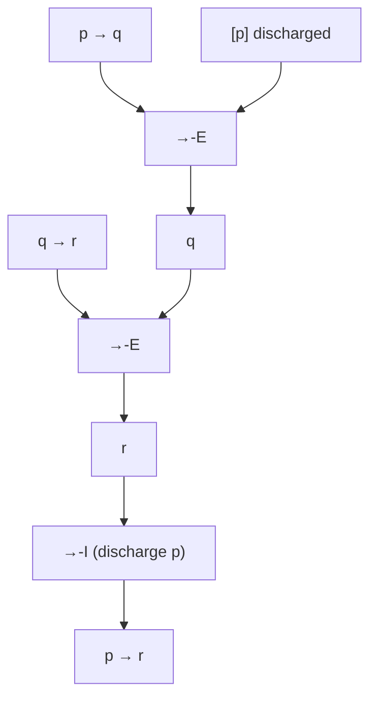

# Natural deduction: I/E rules and structured proof

Natural deduction was born from Gerhard Gentzen's discomfort with the axiomatic systems of the Frege-Hilbert school: long, counterintuitive, populated by axioms no flesh-and-blood mathematician ever uses while actually reasoning. In 1934 (*Untersuchungen über das logische Schließen*) Gentzen introduced **NK** (natural deduction *klassisch*) and **NJ** (*intuitionistisch*): a system in which every connective comes with two rules — an **introduction** (I) rule that justifies its formation, and an **elimination** (E) rule that exploits its presence. Dag Prawitz in 1965 (*Natural Deduction: A Proof-Theoretical Study*) gave the system the canonical form still taught today.

The symmetric I/E idea has a philosophical elegance: the meaning of a connective is fully captured by the rules that introduce and eliminate it. This is the celebrated **inferentialist thesis** (Brandom, Dummett): "meaning is use", literally. This section presents the rules, two competing notations (Fitch and tree), a handful of worked proofs, and the discharge mechanism.

## 1. I/E rules per connective

For each propositional connective we give the I/E pair. We use $\varphi, \psi, \chi$ for generic formulas and $\Gamma$ for the set of active assumptions.

### Conjunction $\wedge$

$$\frac{\varphi \qquad \psi}{\varphi \wedge \psi}\; \wedge\text{-I} \qquad \frac{\varphi \wedge \psi}{\varphi}\; \wedge\text{-E}_1 \qquad \frac{\varphi \wedge \psi}{\psi}\; \wedge\text{-E}_2$$

### Implication $\rightarrow$

$$\frac{[\varphi]^n \;\vdots\; \psi}{\varphi \rightarrow \psi}\; \rightarrow\text{-I}^n \qquad \frac{\varphi \rightarrow \psi \qquad \varphi}{\psi}\; \rightarrow\text{-E (modus ponens)}$$

The superscript $n$ marks the assumption that is **discharged** — no longer "live" after the rule.

### Disjunction $\vee$

$$\frac{\varphi}{\varphi \vee \psi}\; \vee\text{-I}_1 \qquad \frac{\psi}{\varphi \vee \psi}\; \vee\text{-I}_2$$

$$\frac{\varphi \vee \psi \qquad [\varphi]^n \;\vdots\; \chi \qquad [\psi]^m \;\vdots\; \chi}{\chi}\; \vee\text{-E}^{n,m}$$

Disjunction elimination is **reasoning by cases**: from $\varphi \vee \psi$ and a derivation of $\chi$ from each disjunct, conclude $\chi$.

### Negation $\neg$ and absurdity $\bot$

Standard definition: $\neg \varphi \equiv \varphi \rightarrow \bot$.

$$\frac{[\varphi]^n \;\vdots\; \bot}{\neg \varphi}\; \neg\text{-I}^n \qquad \frac{\varphi \qquad \neg \varphi}{\bot}\; \neg\text{-E}$$

$$\frac{\bot}{\varphi}\; \bot\text{-E (ex falso)} \qquad \frac{[\neg \varphi]^n \;\vdots\; \bot}{\varphi}\; \text{RAA (reductio)}^n$$

RAA (*reductio ad absurdum*) is **classically** valid but **not intuitionistically** — the great fault line separating NK from NJ, explored in [Non-classical logics](18-non-classical-logic.html).

### Biconditional $\leftrightarrow$

Defined as $(\varphi \rightarrow \psi) \wedge (\psi \rightarrow \varphi)$, with derivable rules.

## 2. Two notations: Fitch and tree

### Fitch notation (column style)

Invented by Frederic Fitch in 1952 (*Symbolic Logic*). Assumptions open an indented sub-block; the block closes when the assumption is discharged.

```
1 │ p → q              premise
2 │ q → r              premise
3 │ ┌── p              assumption [a]
4 │ │   q              →-E (1, 3)
5 │ │   r              →-E (2, 4)
6 │ └──
7 │   p → r            →-I [a] (3-5)
```

Readable like a program: indentation corresponds to the **scope** of the assumption, exactly as scope in a programming language (deep connection: see [Curry-Howard](19-curry-howard-type-theory.html)).

### Tree notation

Premises on top, conclusions on the bottom, each rule a horizontal line. Leaves are assumptions; discharged ones are parenthesized.



The same proof, two layouts. Fitch is friendlier for humans and proof assistants; the tree exposes the **proof structure** that the Curry-Howard isomorphism interprets as a typed lambda term.

## 3. Worked proof: hypothetical syllogism

Goal: $(p \rightarrow q), (q \rightarrow r) \vdash (p \rightarrow r)$.

| step | formula            | justification           |
|------|--------------------|-------------------------|
| 1    | $p \rightarrow q$  | premise                 |
| 2    | $q \rightarrow r$  | premise                 |
| 3    | $p$                | assumption [a]          |
| 4    | $q$                | $\rightarrow$-E (1, 3)  |
| 5    | $r$                | $\rightarrow$-E (2, 4)  |
| 6    | $p \rightarrow r$  | $\rightarrow$-I [a] (3-5) |

Note the discharge: the assumption $p$ at line 3 is open during 3-5; closing it at line 6 turns the local fact "from $p$ we got $r$" into the unconditional statement "$p \rightarrow r$". The proof is constructive — no excluded middle, no RAA — so it is valid in **NJ** as well.

## 4. A non-proof: ⊢ $p \vee \neg p$?

In NK (classical), $p \vee \neg p$ is a theorem. A typical proof uses RAA:

1. Assume $\neg (p \vee \neg p)$. [a]
2. Assume $p$. [b]
3. From 2: $p \vee \neg p$ by $\vee$-I.
4. Contradiction with 1: $\bot$ by $\neg$-E.
5. Discharge b: $\neg p$ by $\neg$-I [b] (2-4).
6. From 5: $p \vee \neg p$ by $\vee$-I.
7. Contradiction with 1: $\bot$ by $\neg$-E.
8. Discharge a, apply RAA: $p \vee \neg p$.

In **NJ** the move at step 8 is not allowed: intuitionistic negation derives $\neg \neg \varphi$ but not $\varphi$ — there is no double-negation elimination. Hence $p \vee \neg p$ is **not** a theorem of NJ. Counter-model: a Kripke model in which $p$ is undecided. See [Non-classical logics](18-non-classical-logic.html) for the Brouwer-Heyting-Kolmogorov semantics that makes this rigorous.

## 5. Discharge: the subtle part

Discharge is the only piece of natural deduction that confuses beginners. Three rules of thumb:

- Each assumption gets a unique tag ($a, b, c, \ldots$ or $1, 2, 3, \ldots$).
- An assumption is **live** from the point of introduction until it is discharged.
- The rules that discharge are precisely **$\rightarrow$-I**, **$\neg$-I**, **$\vee$-E** (discharges *two* assumptions), and **RAA**.

A common mistake is to use a discharged assumption after it has been "closed". In Fitch this is enforced by indentation: you cannot reach into a closed block. In tree notation it is enforced by the parenthesization on the leaf and the matching superscript on the rule.

## 6. Normalization and the cut

A natural deduction proof can contain **detours**: introducing a connective only to immediately eliminate it. Gentzen-Prawitz **normalization** rewrites any proof into one without detours; the resulting normal form has the **subformula property** — every formula in the proof is a subformula of premises or conclusion. This is a theorem of structural proof theory and the propositional ancestor of cut-elimination in sequent calculus (see [Axiomatic and sequent calculus systems](11-axiomatic-sequent-systems.html)).

## 7. Exercises

<details>
  <summary>Exercise 1 — derive $p \wedge q \vdash q \wedge p$ in NJ.</summary>

| step | formula     | justification        |
|------|-------------|----------------------|
| 1    | $p \wedge q$ | premise              |
| 2    | $p$         | $\wedge$-E$_1$ (1)   |
| 3    | $q$         | $\wedge$-E$_2$ (1)   |
| 4    | $q \wedge p$ | $\wedge$-I (3, 2)    |

No discharge needed — constructively valid.
</details>

<details>
  <summary>Exercise 2 — derive $\vdash \neg \neg (p \vee \neg p)$ in NJ.</summary>

This is the **weak excluded middle** — provable intuitionistically even though $p \vee \neg p$ is not.

1. Assume $\neg (p \vee \neg p)$. [a]
2. Assume $p$. [b]
3. $p \vee \neg p$ by $\vee$-I (2).
4. $\bot$ by $\neg$-E (1, 3).
5. $\neg p$ by $\neg$-I [b] (2-4).
6. $p \vee \neg p$ by $\vee$-I (5).
7. $\bot$ by $\neg$-E (1, 6).
8. $\neg \neg (p \vee \neg p)$ by $\neg$-I [a] (1-7).
</details>

## Summary

- Each connective gets a pair of rules: introduction (I) and elimination (E).
- The Fitch style nests sub-proofs by indentation; the tree style exposes the proof's tree structure.
- **Discharge** turns a local assumption into a conditional fact — the engine of $\rightarrow$-I, $\neg$-I, $\vee$-E and RAA.
- RAA distinguishes classical (NK) from intuitionistic (NJ) natural deduction.
- Normalization eliminates detours and yields the subformula property, the proof-theoretic backbone of the system.

## Further reading

- Gentzen, *Untersuchungen über das logische Schließen* (1934).
- Prawitz, *Natural Deduction: A Proof-Theoretical Study* (1965).
- Fitch, *Symbolic Logic: An Introduction* (1952).
- van Dalen, *Logic and Structure* (5th ed., Springer), ch. 2.
- Troelstra & Schwichtenberg, *Basic Proof Theory* (Cambridge, 2nd ed.).
