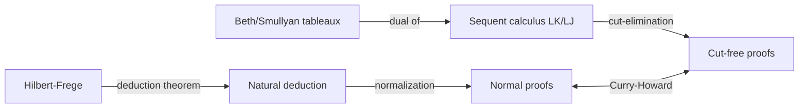
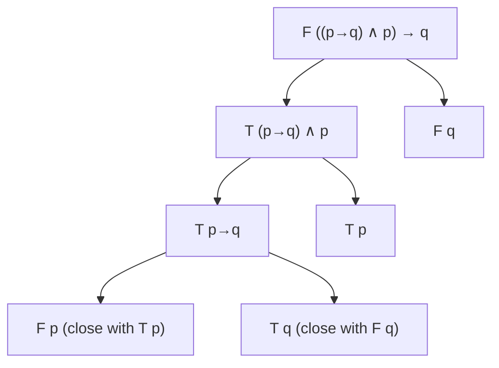

# Axiomatic and sequent calculus systems

If natural deduction tries to mimic how a working mathematician argues, **axiomatic** systems do the opposite: they reduce reasoning to a minimum of fixed schemata and a single rule, then ask you to derive everything from there. **Sequent calculus**, in turn, refuses both extremes and treats proofs as transformations between *judgements* of the form $\Gamma \vdash \Delta$. Each style trades off in a different way between elegance, automation, and human readability.

This section maps the three architectures, gives a worked Hilbert-style proof, presents Gentzen's LK and LJ with their left/right rules, sketches the **cut-elimination theorem** (one of the deepest results in proof theory), and closes with semantic tableaux à la Beth/Smullyan.

## 1. Hilbert-Frege axiomatic systems

Frege's *Begriffsschrift* (1879) and the Hilbert school established the canonical axiomatic style. A typical propositional axiomatization uses **three axiom schemata** plus **modus ponens**:

- **A1.** $\varphi \rightarrow (\psi \rightarrow \varphi)$
- **A2.** $(\varphi \rightarrow (\psi \rightarrow \chi)) \rightarrow ((\varphi \rightarrow \psi) \rightarrow (\varphi \rightarrow \chi))$
- **A3.** $(\neg \varphi \rightarrow \neg \psi) \rightarrow (\psi \rightarrow \varphi)$
- **MP.** From $\varphi$ and $\varphi \rightarrow \psi$ infer $\psi$.

Connectives other than $\rightarrow$ and $\neg$ are introduced by definition.

### Worked Hilbert proof: $\vdash p \rightarrow p$

This is the famous painful derivation that gives Hilbert systems their reputation.

| step | formula                                                       | justification |
|------|---------------------------------------------------------------|---------------|
| 1    | $p \rightarrow ((p \rightarrow p) \rightarrow p)$              | A1            |
| 2    | $(p \rightarrow ((p \rightarrow p) \rightarrow p)) \rightarrow ((p \rightarrow (p \rightarrow p)) \rightarrow (p \rightarrow p))$ | A2 |
| 3    | $(p \rightarrow (p \rightarrow p)) \rightarrow (p \rightarrow p)$ | MP (1, 2)     |
| 4    | $p \rightarrow (p \rightarrow p)$                              | A1            |
| 5    | $p \rightarrow p$                                              | MP (4, 3)     |

Five lines for the most trivial theorem of propositional logic. The redemption is the **deduction theorem**.

### Deduction theorem

> If $\Gamma, \varphi \vdash \psi$ then $\Gamma \vdash \varphi \rightarrow \psi$.

Proven by induction on the length of the derivation. Once available, working in a Hilbert system feels almost like natural deduction — you can "assume $\varphi$, derive $\psi$, discharge". Without the deduction theorem, Hilbert systems are usable only by automated provers.

Hilbert systems remain the reference framework for **metalogic** (see [Metalogic and Gödel's theorems](15-metalogic-godel.html)) because their tiny syntactic surface makes them easy to reason *about*.

## 2. Gentzen's sequent calculus LK and LJ

In the same 1934 paper that introduced natural deduction, Gentzen presented **LK** (classical) and **LJ** (intuitionistic): the **sequent calculus**.

### Sequents

A sequent has the shape

$$\Gamma \;\vdash\; \Delta$$

where $\Gamma$ (antecedent) and $\Delta$ (succedent) are finite multisets of formulas. The intended reading is: *if all formulas in $\Gamma$ hold, then at least one formula in $\Delta$ holds*. In LJ the succedent is restricted to at most one formula.

### Structural rules

$$\frac{\Gamma \vdash \Delta}{\Gamma, \varphi \vdash \Delta}\; \text{W-L} \qquad \frac{\Gamma \vdash \Delta}{\Gamma \vdash \varphi, \Delta}\; \text{W-R}$$

$$\frac{\Gamma, \varphi, \varphi \vdash \Delta}{\Gamma, \varphi \vdash \Delta}\; \text{C-L} \qquad \frac{\Gamma \vdash \varphi, \varphi, \Delta}{\Gamma \vdash \varphi, \Delta}\; \text{C-R}$$

Weakening (W) adds an irrelevant formula; contraction (C) collapses duplicates. Their interplay defines **substructural logics**: drop contraction and you get linear logic (see [Non-classical logics](18-non-classical-logic.html)).

### Logical rules: left/right per connective

Each connective has a **left** rule (how it appears in the antecedent) and a **right** rule (how it appears in the succedent). A handful of examples:

$$\frac{\Gamma \vdash \varphi, \Delta \qquad \Gamma, \psi \vdash \Delta}{\Gamma, \varphi \rightarrow \psi \vdash \Delta}\; \rightarrow\text{-L} \qquad \frac{\Gamma, \varphi \vdash \psi, \Delta}{\Gamma \vdash \varphi \rightarrow \psi, \Delta}\; \rightarrow\text{-R}$$

$$\frac{\Gamma, \varphi, \psi \vdash \Delta}{\Gamma, \varphi \wedge \psi \vdash \Delta}\; \wedge\text{-L} \qquad \frac{\Gamma \vdash \varphi, \Delta \qquad \Gamma \vdash \psi, \Delta}{\Gamma \vdash \varphi \wedge \psi, \Delta}\; \wedge\text{-R}$$

$$\frac{\Gamma, \varphi \vdash \Delta \qquad \Gamma, \psi \vdash \Delta}{\Gamma, \varphi \vee \psi \vdash \Delta}\; \vee\text{-L} \qquad \frac{\Gamma \vdash \varphi, \psi, \Delta}{\Gamma \vdash \varphi \vee \psi, \Delta}\; \vee\text{-R}$$

The pattern is striking: left rules tell you how to *use* a formula; right rules tell you how to *produce* it. The duality of "use" and "produce" is exactly the Curry-Howard duality of "destructor" and "constructor".

### The cut rule

$$\frac{\Gamma \vdash \varphi, \Delta \qquad \Gamma', \varphi \vdash \Delta'}{\Gamma, \Gamma' \vdash \Delta, \Delta'}\; \text{cut}$$

Cut is the sequent-calculus version of using a lemma: derive an auxiliary $\varphi$, then chain it into a larger proof.

### Cut-elimination (Gentzen's Hauptsatz, 1934)

> Any proof in LK (or LJ) can be transformed into a cut-free proof of the same sequent.

The procedure is constructive but blows up the proof size — in the worst case **hyperexponentially**. The pay-off is huge: in a cut-free proof every formula appearing in any sequent is a subformula of the end sequent (the **subformula property**). This yields:

- **Consistency** of LK: there is no cut-free proof of $\vdash$ (empty), so no proof at all.
- **Decidability** of propositional LK: just enumerate cut-free proofs.
- **Interpolation theorems** (Craig, 1957) follow neatly.

Cut-elimination is the proof-theoretic counterpart of normalization in natural deduction; the Curry-Howard correspondence makes the two equivalent under suitable translations.

## 3. Beth/Smullyan tableaux

Semantic tableaux (Beth, 1955; Smullyan, *First-Order Logic*, 1968) refute a formula by tracking what would have to be true for it to be false. A signed formula $\mathbf{T}\varphi$ means "$\varphi$ is true"; $\mathbf{F}\varphi$ means "$\varphi$ is false". Rules decompose formulas; a branch closes when it contains both $\mathbf{T}\varphi$ and $\mathbf{F}\varphi$.

Example: prove $((p \rightarrow q) \wedge p) \rightarrow q$ by attempting to falsify it.

Both branches close, so the original formula is valid. Tableaux are essentially **upside-down sequent calculus**: each tableau rule is a backwards application of a sequent rule. They are the algorithmic workhorse of many automated theorem provers (the **dpll** family for SAT also descends from this idea).

## 4. Trade-offs between systems

| System            | Few rules | Many rules | Human friendly | Automation friendly | Metatheory |
|-------------------|-----------|------------|----------------|---------------------|------------|
| Hilbert-Frege     | yes       | no         | very low       | medium              | very high  |
| Natural deduction | no        | yes        | high           | medium              | medium     |
| Sequent calculus  | no        | yes        | medium         | high                | very high  |
| Tableaux          | no        | yes        | medium         | very high           | medium     |

Different communities pick differently: meta-logicians like Hilbert systems, working mathematicians like natural deduction, proof-search engines like tableaux, and proof theorists like sequent calculus.

## 5. Exercises

  
Exercise 1 — prove $\vdash p \rightarrow (q \rightarrow p)$ in a Hilbert system.

It is exactly axiom A1. One line.

  
Exercise 2 — give an LK proof of $\vdash p \vee \neg p$.

| step | sequent             | rule                |
|------|---------------------|---------------------|
| 1    | $p \vdash p$         | identity            |
| 2    | $\vdash p, \neg p$  | $\neg$-R on 1       |
| 3    | $\vdash p \vee \neg p, \neg p$ | $\vee$-R$_1$ on 2 |
| 4    | $\vdash p \vee \neg p, p \vee \neg p$ | $\vee$-R$_2$ on 3 |
| 5    | $\vdash p \vee \neg p$ | C-R on 4         |

Note step 5: classical excluded middle relies on **contraction** on the right. In LJ, where the succedent has at most one formula, contraction-right collapses — and excluded middle disappears. The structural rule of LK silently encodes classical logic.

## Summary

- **Hilbert systems**: 3 axioms + MP, ugly to work with, ideal for metatheory.
- **Sequent calculus** LK/LJ: judgements $\Gamma \vdash \Delta$ with left/right rules; LK is classical, LJ intuitionistic (succedent restricted to one formula).
- **Cut-elimination** (Gentzen's Hauptsatz) gives the subformula property and consistency.
- **Tableaux** are the dual algorithmic system: refute by trying to falsify, close branches on contradictions.
- The choice of architecture changes the trade-off between human readability and automation but does not change the theorems.

## Further reading

- Gentzen, *Untersuchungen über das logische Schließen* (1934).
- Smullyan, *First-Order Logic* (Springer, 1968).
- Negri & von Plato, *Structural Proof Theory* (Cambridge, 2001).
- Troelstra & Schwichtenberg, *Basic Proof Theory* (Cambridge, 2nd ed.).
- Mendelson, *Introduction to Mathematical Logic*, ch. 1-2.
