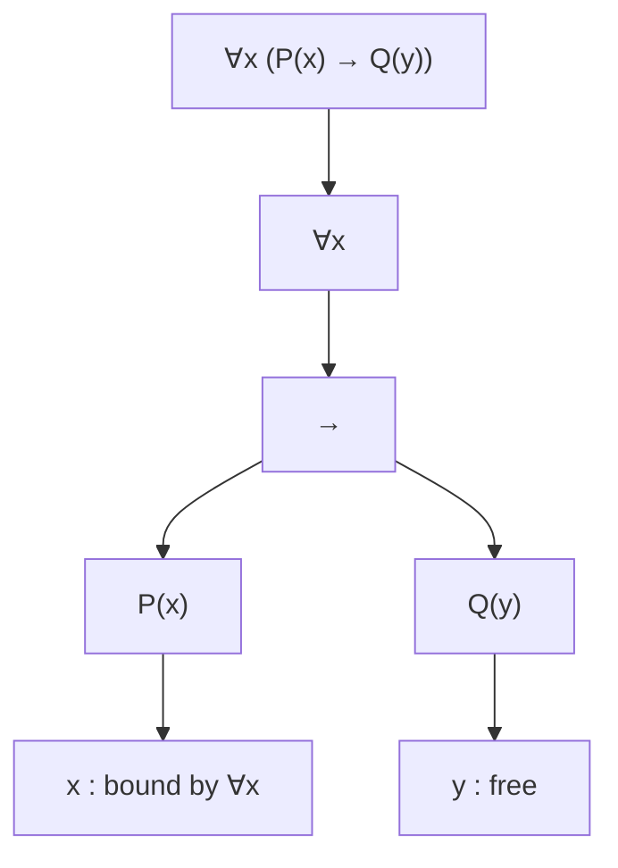

# Predicate logic (FOL): syntax and quantifiers

Propositional logic can say "if it rains, the street is wet". It cannot say "every Athenian is mortal" without collapsing the universal statement into a single atomic letter and losing all its internal structure. **First-order logic** (FOL, also called predicate or quantificational logic) fixes this by introducing **variables**, **predicates**, **functions**, **constants**, and the two **quantifiers** $\forall$ and $\exists$. The leap is comparable to going from arithmetic with concrete numbers to algebra with variables: now we can speak about *all* objects in a domain and *some* objects in a domain.

The system was the achievement of Frege (*Begriffsschrift*, 1879) and was given its mature form by Peano, Russell-Whitehead (*Principia Mathematica*, 1910-13), Hilbert-Ackermann (1928), and Gödel (1930). It is the workhorse of modern mathematics: all of arithmetic, geometry, set theory, and most of analysis is formalized in FOL.

This section is about **syntax**: how to build formulas. Semantics — what formulas *mean* — is in [Predicate logic: semantics, models, validity](13-predicate-logic-semantics.html).

## 1. The alphabet

A FOL **signature** $\sigma$ consists of:

- a (possibly empty) set of **constants** $c_1, c_2, \ldots$ — names of specific objects;
- a set of **function symbols** $f_1, f_2, \ldots$, each with an arity $n \geq 1$;
- a set of **predicate symbols** $P_1, P_2, \ldots$, each with an arity $n \geq 0$ (a 0-ary predicate is a propositional letter);
- the equality symbol $=$ (in FOL *with equality*).

In addition, every FOL alphabet contains:

- a countably infinite set of **variables** $x, y, z, x_1, x_2, \ldots$;
- the propositional connectives $\neg, \wedge, \vee, \rightarrow, \leftrightarrow$;
- the quantifiers $\forall$ (universal) and $\exists$ (existential);
- parentheses and commas.

## 2. Terms and formulas

Terms denote objects in the domain. Formulas express assertions about them.

### Terms

Inductive definition:

- Every variable is a term.
- Every constant is a term.
- If $f$ is an $n$-ary function symbol and $t_1, \ldots, t_n$ are terms, then $f(t_1, \ldots, t_n)$ is a term.

Examples in arithmetic ($+, \cdot, 0, 1$): $x$, $0$, $1+1$, $x \cdot (y + 1)$, $f(g(x), y)$.

### Atomic formulas

If $P$ is an $n$-ary predicate and $t_1, \ldots, t_n$ are terms, then $P(t_1, \ldots, t_n)$ is an atomic formula. Also $t_1 = t_2$ is atomic.

### Well-formed formulas (wffs)

Inductively:

- Every atomic formula is a wff.
- If $\varphi, \psi$ are wffs, so are $\neg \varphi, (\varphi \wedge \psi), (\varphi \vee \psi), (\varphi \rightarrow \psi), (\varphi \leftrightarrow \psi)$.
- If $\varphi$ is a wff and $x$ is a variable, then $\forall x\, \varphi$ and $\exists x\, \varphi$ are wffs.

Nothing else is a wff.

### Example

In a signature with predicate $\text{Mortal}(\cdot)$ and constant $\text{Socrates}$:

$$\forall x\, (\text{Human}(x) \rightarrow \text{Mortal}(x)) \;\wedge\; \text{Human}(\text{Socrates})$$

is a wff. The classical syllogism's premise.

## 3. The quantifiers

The two quantifiers are duals: $\forall x\, \varphi \equiv \neg \exists x\, \neg \varphi$ and $\exists x\, \varphi \equiv \neg \forall x\, \neg \varphi$.

- **Universal** $\forall x\, \varphi(x)$: "for every $x$, $\varphi(x)$ holds".
- **Existential** $\exists x\, \varphi(x)$: "there exists at least one $x$ such that $\varphi(x)$ holds".

The "at least one" matters: $\exists$ does not imply uniqueness. For "there exists exactly one" we write $\exists! x\, \varphi(x)$, which abbreviates $\exists x\, (\varphi(x) \wedge \forall y\, (\varphi(y) \rightarrow y = x))$.

### Quantifier interactions

Order of quantifiers matters enormously.

$$\forall x\, \exists y\, \text{Loves}(x, y) \qquad \neq \qquad \exists y\, \forall x\, \text{Loves}(x, y)$$

The first: "everyone loves someone" (each person may love a different person). The second: "there is a single someone whom everyone loves". The second implies the first, but not vice versa. This is a frequent source of mistakes; the **prenex normal form** (see [Equivalences and normal forms](08-equivalences-normal-forms.html)) plus careful reading of dependencies is the antidote.

## 4. Free and bound variables

A variable occurrence is **bound** if it falls inside the scope of a quantifier $\forall x$ or $\exists x$ that binds that same variable; it is **free** otherwise.

In $\forall x\, (P(x) \rightarrow Q(y))$:

- $x$ is bound by $\forall x$;
- $y$ is **free**.

A formula with no free variables is a **sentence** (or *closed formula*). Only sentences have a determinate truth value in a given model; open formulas have truth values *relative to an assignment* of values to their free variables.

### Substitution and capture

$\varphi[t/x]$ denotes the formula obtained by replacing every **free** occurrence of $x$ in $\varphi$ by the term $t$. We must avoid **variable capture**: substituting a term containing $y$ into a context where $y$ is bound. Example: substituting $y$ for $x$ in $\exists y\, R(x, y)$ would naively give $\exists y\, R(y, y)$, changing the meaning. The standard remedy is **alpha-renaming**: rename the bound variable first ($\exists z\, R(x, z)$, then substitute).

## 5. Translating English into FOL

Translation is the practical skill. A small catalogue:

| English                                  | FOL                                                                         |
|------------------------------------------|------------------------------------------------------------------------------|
| "All ravens are black"                   | $\forall x\, (\text{Raven}(x) \rightarrow \text{Black}(x))$                  |
| "Some ravens are black"                  | $\exists x\, (\text{Raven}(x) \wedge \text{Black}(x))$                       |
| "No raven is white"                      | $\forall x\, (\text{Raven}(x) \rightarrow \neg \text{White}(x))$             |
| "There exists a prime greater than 100"  | $\exists x\, (\text{Prime}(x) \wedge x > 100)$                               |
| "Every student passed at least one exam" | $\forall x\, (\text{Student}(x) \rightarrow \exists y\, (\text{Exam}(y) \wedge \text{Passed}(x, y)))$ |
| "Only Romans love Caesar"                | $\forall x\, (\text{Loves}(x, \text{Caesar}) \rightarrow \text{Roman}(x))$    |
| "Everyone loves themselves"              | $\forall x\, \text{Loves}(x, x)$                                              |
| "Someone loves everyone"                 | $\exists x\, \forall y\, \text{Loves}(x, y)$                                  |

Two structural patterns:

- **Universal claim** about a category: $\forall x\, (\text{Category}(x) \rightarrow \text{Property}(x))$. The implication is essential — using $\wedge$ would claim everything is in the category.
- **Existential claim** about a category: $\exists x\, (\text{Category}(x) \wedge \text{Property}(x))$. The conjunction is essential — using $\rightarrow$ would be trivially satisfied by anything outside the category (vacuous truth).

This **$\rightarrow$ for $\forall$, $\wedge$ for $\exists$** pattern is the single most useful heuristic in FOL translation.

### Negation: pushing through quantifiers

$$\neg \forall x\, \varphi \equiv \exists x\, \neg \varphi \qquad \neg \exists x\, \varphi \equiv \forall x\, \neg \varphi$$

"Not all swans are white" becomes "there exists a swan that is not white" — exactly the classical falsification by counterexample.

## 6. Worked translation: the barbershop

> In a village there is exactly one barber. The barber shaves every man who does not shave himself, and only those. Does the barber shave himself?

Let $B$ be the barber, $\text{Shaves}(x, y)$ "x shaves y", and assume the domain is the men of the village.

$$\forall x\, (\text{Shaves}(B, x) \leftrightarrow \neg \text{Shaves}(x, x))$$

Instantiate $x := B$:

$$\text{Shaves}(B, B) \leftrightarrow \neg \text{Shaves}(B, B)$$

A contradiction. The premise is inconsistent: there is no such barber. This is Russell's paradox in miniature (see [Sets, relations, functions](14-sets-relations-functions.html) and [Famous paradoxes](46-famous-paradoxes.html)).

## 7. Exercises

  
Exercise 1 — translate "between any two distinct rational numbers there is a third rational".

$$\forall x\, \forall y\, ((\mathbb{Q}(x) \wedge \mathbb{Q}(y) \wedge x \neq y) \rightarrow \exists z\, (\mathbb{Q}(z) \wedge \text{between}(z, x, y)))$$

with $\text{between}(z, x, y) \equiv (x < z < y) \vee (y < z < x)$.

  
Exercise 2 — identify free and bound variables in $\forall x\, (P(x, y) \rightarrow \exists y\, Q(y, z))$.

- The outer $x$ is bound by the outer $\forall x$.
- The first $y$ (in $P(x, y)$) is **free** — its quantifier $\exists y$ has not yet been opened.
- The inner $y$ (in $Q(y, z)$) is bound by $\exists y$.
- $z$ is free.

Two variables, one of which ($y$) is used both bound and free — sloppy but legal. Prefer alpha-renaming to avoid confusion.

## Summary

- FOL = propositional logic + variables, predicates, functions, constants, $\forall$, $\exists$.
- Terms denote objects; formulas express assertions; sentences are formulas with no free variables.
- Bound variables behave like local declarations; free variables behave like parameters.
- $\rightarrow$ for $\forall$, $\wedge$ for $\exists$ is the canonical pattern for category claims.
- Quantifier order matters: $\forall \exists \neq \exists \forall$.
- Negation pushes through quantifiers by swapping them.

## Further reading

- Frege, *Begriffsschrift* (1879).
- Hilbert & Ackermann, *Grundzüge der theoretischen Logik* (1928).
- Enderton, *A Mathematical Introduction to Logic* (2nd ed.), ch. 2.
- van Dalen, *Logic and Structure*, ch. 3.
- Smullyan, *First-Order Logic*.
