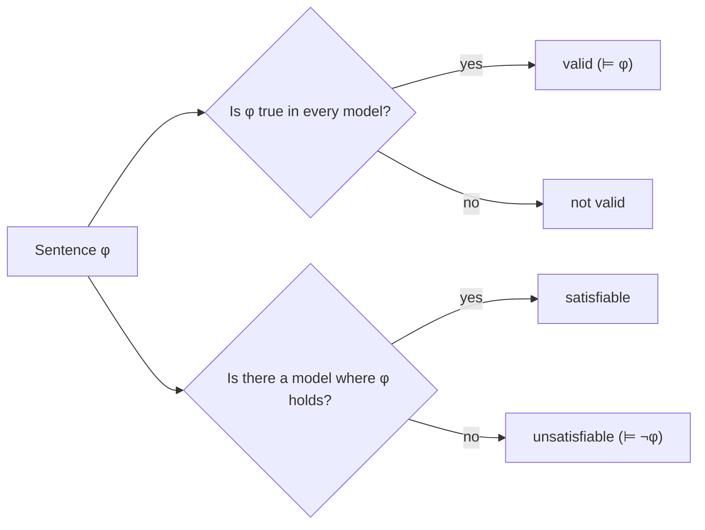

# FOL: semantics, models, validity

Syntax tells us which strings are well-formed; **semantics** tells us what they mean. The standard semantics for first-order logic was given by Alfred Tarski in 1933 (*The Concept of Truth in Formalized Languages*) and remains the basis for almost every modern formal system. The recipe is: pick a non-empty **domain** of objects, interpret every symbol of the signature, then compute truth recursively.

Once we have a semantics we can define the **validity** of a formula (true in *every* model), the **satisfiability** of a theory (some model satisfies all its formulas), the notion of **logical consequence** $\Gamma \models \varphi$, and the relationship between syntactic provability $\vdash$ and semantic validity $\models$. This relationship — the **soundness** and **completeness** theorems — is the heart of [Metalogic and Gödel's theorems](15-metalogic-godel.html).

## 1. Structures (models)

A **structure** (or **model**) $\mathcal{M}$ for a signature $\sigma$ consists of:

- a non-empty set $|\mathcal{M}|$, the **domain** (or *universe*);
- for each constant $c$ of $\sigma$, an element $c^{\mathcal{M}} \in |\mathcal{M}|$;
- for each $n$-ary function symbol $f$, a function $f^{\mathcal{M}} : |\mathcal{M}|^n \to |\mathcal{M}|$;
- for each $n$-ary predicate symbol $P$, a relation $P^{\mathcal{M}} \subseteq |\mathcal{M}|^n$;
- equality interpreted as actual identity on the domain.

### Three example structures

**Arithmetic.** Signature $\{0, 1, +, \cdot, <\}$, domain $\mathbb{N}$, interpretations as usual. The sentence $\forall x\, \exists y\, (y > x)$ holds: the naturals have no maximum.

**Graphs.** Signature with a single binary predicate $E(x, y)$ ("edge"). A model is a graph. The sentence $\forall x\, \forall y\, (E(x,y) \rightarrow E(y,x))$ holds iff the graph is undirected.

**Kinship.** Signature with binary predicates $\text{Parent}(x,y)$, $\text{Married}(x,y)$, unary $\text{Male}(x)$, $\text{Female}(x)$. We can express "a grandparent": $\exists z\, (\text{Parent}(x, z) \wedge \text{Parent}(z, y))$.

The point: **the same syntax** speaks about radically different domains. FOL is a *general purpose* descriptive language.

## 2. Assignments and truth

An **assignment** $s$ is a function from variables to elements of the domain. We extend it to terms inductively:

- $s(c) = c^{\mathcal{M}}$ for a constant $c$;
- $s(x)$ = the value $s$ already gives;
- $s(f(t_1, \ldots, t_n)) = f^{\mathcal{M}}(s(t_1), \ldots, s(t_n))$.

The **satisfaction relation** $\mathcal{M}, s \models \varphi$ ("$\varphi$ is true in $\mathcal{M}$ under assignment $s$") is then defined recursively:

- $\mathcal{M}, s \models P(t_1, \ldots, t_n)$ iff $(s(t_1), \ldots, s(t_n)) \in P^{\mathcal{M}}$.
- $\mathcal{M}, s \models t_1 = t_2$ iff $s(t_1) = s(t_2)$.
- $\mathcal{M}, s \models \neg \varphi$ iff $\mathcal{M}, s \not\models \varphi$.
- $\mathcal{M}, s \models \varphi \wedge \psi$ iff both.
- $\mathcal{M}, s \models \varphi \vee \psi$ iff at least one.
- $\mathcal{M}, s \models \varphi \rightarrow \psi$ iff (not $\mathcal{M}, s \models \varphi$) or $\mathcal{M}, s \models \psi$.
- $\mathcal{M}, s \models \forall x\, \varphi$ iff for every $a \in |\mathcal{M}|$, $\mathcal{M}, s[x \mapsto a] \models \varphi$.
- $\mathcal{M}, s \models \exists x\, \varphi$ iff for some $a \in |\mathcal{M}|$, $\mathcal{M}, s[x \mapsto a] \models \varphi$.

Here $s[x \mapsto a]$ is the assignment that agrees with $s$ everywhere except at $x$, where it maps to $a$.

For **sentences** (closed formulas) the assignment is irrelevant, and we write $\mathcal{M} \models \varphi$.

## 3. Validity, satisfiability, logical consequence

Three core notions:

- $\varphi$ is **satisfiable** if some structure (with some assignment) satisfies it.
- $\varphi$ is **valid** (notation $\models \varphi$) if every structure (with every assignment) satisfies it. Validity is the semantic analogue of theoremhood.
- $\Gamma \models \varphi$ (**logical consequence**) iff every structure that satisfies all formulas in $\Gamma$ also satisfies $\varphi$.

Validity is the central object: the **completeness theorem** (Gödel 1930) says $\models \varphi$ iff $\vdash \varphi$.

### Example: validity by exhaustion

$\models \forall x\, (P(x) \vee \neg P(x))$. In any structure $\mathcal{M}$ and any assignment, each domain element either is in $P^{\mathcal{M}}$ or isn't — classical bivalence.

### Example: invalidity by counterexample

Is $\forall x\, \exists y\, R(x,y) \rightarrow \exists y\, \forall x\, R(x,y)$ valid?

Counterexample: $\mathcal{M} = (\mathbb{N}, <)$, $R := <$. Then $\forall x\, \exists y\, x < y$ holds (the naturals are unbounded), but $\exists y\, \forall x\, x < y$ does not (no maximum). So the implication fails in this structure, hence it is not valid.

This is the **single-counterexample technique**: to refute a candidate logical law you only need *one* structure where it fails.

The four pairs valid/invalid/satisfiable/unsatisfiable are not exclusive: every valid formula is satisfiable; every unsatisfiable formula is invalid. The four corners of the chart are: valid, satisfiable-but-invalid (contingent), unsatisfiable, and "true-but-unprovable" (only meaningful given a deductive system).

## 4. Compactness theorem

A landmark of FOL semantics, due to Gödel (1930, propositional case) and Mal'cev (1936, full FOL):

> A set $\Gamma$ of FOL sentences is satisfiable iff every finite subset of $\Gamma$ is satisfiable.

Equivalently, if $\Gamma \models \varphi$ then there is a finite subset $\Gamma_0 \subseteq \Gamma$ with $\Gamma_0 \models \varphi$. Proofs use only finitely many premises — even when the theory is infinite.

### A spectacular consequence: non-standard arithmetic

Let $T$ be the theory of arithmetic (true sentences about $\mathbb{N}$). Add a new constant $c$ and the axioms $c > 0, c > 1, c > 2, \ldots$. Every finite subset is satisfiable (interpret $c$ as a sufficiently large natural). By compactness, the whole infinite extension is satisfiable. The model is **non-standard**: it contains the naturals plus an "infinite" element $c$.

This shows that FOL cannot rule out non-standard models of arithmetic. It also explains why the natural numbers cannot be axiomatized up to isomorphism in FOL (the *Löwenheim-Skolem-Tarski* limitations).

## 5. Löwenheim-Skolem theorems

- **Downward LST**: if $\Gamma$ has an infinite model, it has a countable model.
- **Upward LST**: if $\Gamma$ has an infinite model, it has models of every infinite cardinality.

A paradoxical corollary, the **Skolem paradox**: ZFC set theory, despite proving the existence of uncountable sets, has a *countable* model (if it has any model at all). The resolution: "uncountable" is *relative* to the model — there is no bijection inside the model, even if one exists outside.

## 6. Difference with second-order logic (sketch)

In **second-order logic** (SOL) we quantify over predicates and functions too:

$$\forall P\, (P(0) \wedge \forall x\, (P(x) \rightarrow P(x+1)) \rightarrow \forall x\, P(x))$$

This is the **induction principle**. In FOL it must be replaced by a *schema* (one axiom per formula $P$), which produces a strictly weaker theory — Peano arithmetic in FOL has non-standard models, while second-order PA does not.

The cost: SOL loses the completeness theorem and the compactness theorem. There is no sound and complete deductive system for the standard semantics of SOL. FOL is the "sweet spot" of expressive power versus tractable metatheory; see [Metalogic and Gödel's theorems](15-metalogic-godel.html).

## 7. Exercises

  
Exercise 1 — is $\forall x\, \exists y\, (x = y)$ valid?

Take any structure $\mathcal{M}$ and any $a \in |\mathcal{M}|$. Pick $y := a$; then $a = a$ holds by reflexivity. So yes, this is valid in any non-empty domain. FOL semantics forbids empty domains for this reason — otherwise even $\exists x\, (x = x)$ would fail.

  
Exercise 2 — give a model where $\exists x\, (P(x) \wedge Q(x))$ is true but $\forall x\, (P(x) \rightarrow Q(x))$ is false.

Domain $\{a, b\}$, $P^{\mathcal{M}} = \{a, b\}$, $Q^{\mathcal{M}} = \{a\}$. Then $P(a) \wedge Q(a)$ holds (the existential witnessed by $a$), but $P(b) \rightarrow Q(b)$ fails because $P(b)$ holds and $Q(b)$ does not.

Moral: "some Ps are Qs" does not imply "all Ps are Qs". A classic informal-logic confusion (see [Formal fallacies](20-formal-fallacies.html)).

## Summary

- A **structure** interprets a signature: domain, constants, functions, relations.
- Truth is defined recursively via Tarski's satisfaction relation.
- **Validity** = true in every model; **satisfiability** = true in some model.
- A formula is invalid as soon as one counterexample exists.
- **Compactness** and **Löwenheim-Skolem** are the two pillars of FOL model theory — and impose hard limits on what FOL can characterize (e.g., $\mathbb{N}$ up to isomorphism).
- Second-order logic gains expressiveness but loses completeness and compactness.

## Further reading

- Tarski, *The Concept of Truth in Formalized Languages* (1933).
- Gödel, *Die Vollständigkeit der Axiome des logischen Funktionenkalküls* (1930).
- Hodges, *A Shorter Model Theory* (Cambridge, 1997).
- Enderton, *A Mathematical Introduction to Logic*, ch. 2.
- Marker, *Model Theory: An Introduction* (Springer).
