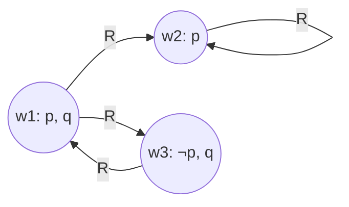

# Modal logic and possible worlds

Classical logic asks "is $p$ true?". Modal logic asks "is $p$ *necessarily* true? *possibly* true?". Operators:

- **$\Box p$**: "necessarily $p$"
- **$\Diamond p$**: "possibly $p$"

They are duals:

$$\Diamond p \equiv \neg \Box \neg p \qquad \Box p \equiv \neg \Diamond \neg p$$

The same machinery serves temporal, deontic, epistemic logics with different readings of "necessarily" — see [sec. 17](17-temporal-deontic-epistemic-logic.html).

## 1. Kripke semantics

Saul Kripke (1959–1963) formalized possible-worlds semantics as a teenager.

A **frame** is a pair $(W, R)$:
- $W$ = set of possible worlds.
- $R \subseteq W \times W$ = accessibility relation; $wRw'$ = "$w'$ is accessible from $w$".

A **model** $(W, R, V)$ adds $V$ assigning to each propositional variable the set of worlds where it's true.

Semantics:

$$M, w \models \Box p \iff \forall w': wRw' \Rightarrow M, w' \models p$$

$$M, w \models \Diamond p \iff \exists w': wRw' \wedge M, w' \models p$$

## 2. Visualizing a frame

At $w_1$: $p$ true, $q$ true. Accessible: $w_2, w_3$.

- $w_1 \models \Box p$? $p$ true at $w_2$, false at $w_3$: **no**.
- $w_1 \models \Diamond p$? Yes (via $w_2$).

## 3. Modal systems

Adding axioms ⇒ restricting $R$.

| System | $R$ property | Axiom |
|---|---|---|
| K | any | $\Box(p \rightarrow q) \rightarrow (\Box p \rightarrow \Box q)$ |
| T | reflexive | $\Box p \rightarrow p$ |
| B | reflexive + symmetric | $p \rightarrow \Box \Diamond p$ |
| S4 | refl. + transitive | $\Box p \rightarrow \Box \Box p$ |
| S5 | refl. + trans. + symm. (equiv. relation) | $\Diamond p \rightarrow \Box \Diamond p$ |

**K** is the minimal system. **S5** is the strongest standard system: in S5, modalities collapse and accessibility becomes "global".

### 3.1 Why reflexivity captures "necessary ⇒ true"?

If $wRw$, then $\Box p$ at $w$ implies $p$ at $w$ (since $w$ is among its accessible worlds). T (reflexivity) is usually wanted: otherwise "necessary" can be true while $p$ is false in the actual world.

## 4. Example: Hamlet's skull

Hamlet in world $w_1$ holds Yorick's skull. In every world accessible from $w_1$ (i.e., possible given current state), Yorick is dead. So $w_1 \models \Box(\text{Yorick dead})$. But there's $w_2$ accessible where Hamlet is also dead: $w_1 \models \Diamond(\text{Hamlet dead})$.

## 5. Necessity a priori vs a posteriori (Kripke 1980)

In *Naming and Necessity*, Kripke decouples *a priori / a posteriori* from *necessary / contingent*. "Water = H₂O" is necessary (in every world water has that molecular structure, by the rigid-designator account) yet a posteriori (we discovered it). Hesperus = Phosphorus is the same: a posteriori necessity. This collapsed Quine-style monism about modality and helped revive modal metaphysics.

## 6. Applications

- **Model checking** (Clarke, Emerson, Sifakis — Turing 2007): verifying that hardware/software satisfies a modal-temporal specification.
- **Philosophy of identity, contingency, necessity.**
- **AI**: reasoning about agents' knowledge.

## Exercises

  
Exercise 1 — In a frame with universal $R$ (every world accesses every world), how do $\Box$ and $\Diamond$ behave?

$\Box p$ at any world $\equiv$ "$p$ true at every world" (a global property). $\Diamond p \equiv$ "$p$ at some world". S5 with total $R$.

  
Exercise 2 — Verify T validates $\Box p \rightarrow p$ but K does not.

In T, $wRw$, so $\Box p$ at $w$ ⇒ $p$ at $w$. In K without reflexivity, a world $w$ may access no worlds, making $\Box p$ vacuously true at $w$ even when $p$ is false there.

## Summary

- $\Box$ (necessary), $\Diamond$ (possible), duals.
- Kripke semantics: $(W, R)$ frames; $\Box p$ at $w$ iff $p$ holds at all worlds accessible from $w$.
- Systems K ⊂ T ⊂ S4 ⊂ S5 (and B). More axioms ⇔ more constraints on $R$.
- S5 with equivalence relation: modalities collapse.
- Foundation for temporal, deontic, epistemic logics.

## Further reading

- Kripke, *Naming and Necessity* (1980).
- Chellas, *Modal Logic* (1980).
- Blackburn, de Rijke, Venema, *Modal Logic* (2001).
