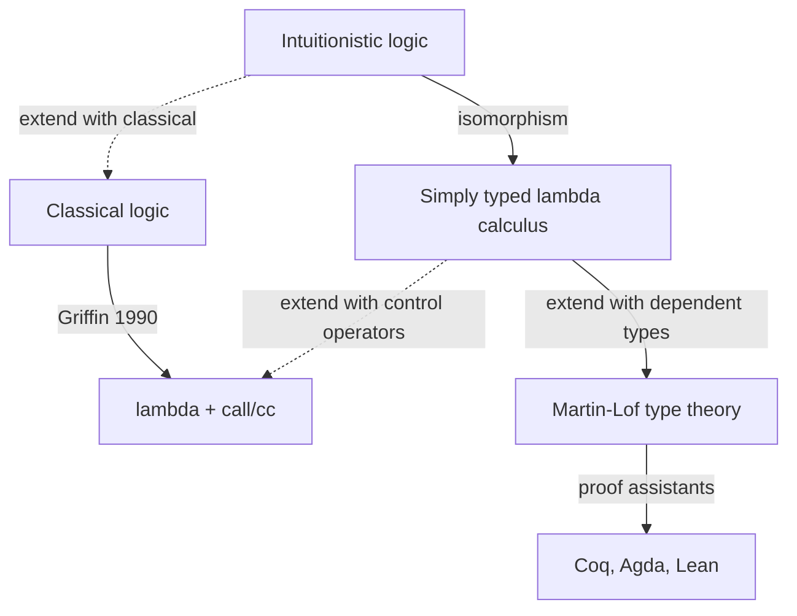

# Curry-Howard and type theory

Some isomorphisms are coincidences; one is so deep that mathematicians and computer scientists now use the same blackboard. Around 1934 Haskell Curry noticed that the types of combinators in combinatory logic look exactly like axioms of implicational logic. In 1969 William Howard, in an unpublished manuscript circulated for decades before being printed in 1980, extended the observation to full natural deduction. The slogan **propositions as types, proofs as programs** was born.

The Curry-Howard correspondence is not a metaphor. It is an isomorphism: every constructive proof can be read as a typed program, and every typed program can be read as a constructive proof of the proposition encoded by its type. The consequences are radical. Pure mathematics, programming languages and machine-checked verification merge into a single discipline — *type theory*.

This section reconstructs the correspondence at three levels: propositional, first-order (Martin-Löf), and dependent (Coq/Agda/Lean). At the end we run a tiny Haskell snippet that *is* a logical proof.

## 1. The original observation: simply typed lambda calculus

Take **implicational intuitionistic propositional logic** (NJ$_\rightarrow$): the only connective is $\rightarrow$, the only rules are introduction and elimination. Now take the **simply typed lambda calculus** $\lambda^\rightarrow$. Compare:

| Logic                                       | Lambda calculus                          |
|---------------------------------------------|------------------------------------------|
| Proposition $A$                             | Type $A$                                 |
| Hypothesis $A$ in the context               | Variable $x : A$                         |
| Proof of $A \rightarrow B$                  | Function $\lambda x{:}A.\, t : A \to B$  |
| $\rightarrow$-introduction                  | $\lambda$-abstraction                    |
| $\rightarrow$-elimination (modus ponens)    | Function application $f\, x$             |
| Normalisation of the proof (cut elimination)| $\beta$-reduction                        |

Formally, the **typing judgement** $\Gamma \vdash t : A$ corresponds to a derivation that $A$ follows from the hypotheses $\Gamma$. The two abstract rules are identical:

$$
\dfrac{\Gamma, x{:}A \vdash t : B}{\Gamma \vdash \lambda x{:}A.\, t : A \to B}\ (\to\mathrm{I})
\qquad
\dfrac{\Gamma \vdash f : A \to B \quad \Gamma \vdash a : A}{\Gamma \vdash f\, a : B}\ (\to\mathrm{E})
$$

Read the left rule as: "if from $A$ I can derive $B$, then I have proved $A \rightarrow B$". Read the right rule as: "from a proof that $A$ implies $B$ and a proof of $A$, I get a proof of $B$".

### 1.1. A miniature proof = miniature program

Proposition: $A \rightarrow (B \rightarrow A)$ (a tautology — the K combinator).

Proof term:
$$
K \;\equiv\; \lambda x{:}A.\, \lambda y{:}B.\, x \;:\; A \to (B \to A)
$$

Read: "Given a proof $x$ of $A$, and a proof $y$ of $B$, return a proof of $A$" — which is just $x$. The program ignores its second argument. The proof "ignores" the hypothesis $B$. Same thing.

## 2. Extending to all connectives

Curry-Howard scales to the full intuitionistic propositional fragment.

| Logic                  | Type theory                                   |
|------------------------|-----------------------------------------------|
| $A \rightarrow B$      | Function type $A \to B$                       |
| $A \wedge B$           | Product (pair) type $A \times B$              |
| $A \vee B$             | Sum (disjoint union) type $A + B$             |
| $\top$ (truth)         | Unit type $\mathbf{1}$ (one inhabitant)       |
| $\bot$ (falsehood)     | Empty type $\mathbf{0}$ (zero inhabitants)    |
| $\neg A$               | $A \to \mathbf{0}$                            |
| $\forall x{:}D.\, P(x)$| Dependent function $\Pi x{:}D.\, P(x)$        |
| $\exists x{:}D.\, P(x)$| Dependent pair $\Sigma x{:}D.\, P(x)$         |

A proof of $A \wedge B$ is a pair $\langle a, b\rangle$ where $a : A$ and $b : B$. The two projection functions $\pi_1, \pi_2$ are exactly the $\wedge$-elimination rules. A proof of $A \vee B$ is `inl(a)` or `inr(b)`; case analysis is $\vee$-elimination.

Crucially, this only matches **intuitionistic** logic. Classical theorems like $A \vee \neg A$ (excluded middle) or $\neg \neg A \rightarrow A$ are not inhabited by closed lambda terms — there is no constructive program that produces a proof of "$A$ or not $A$" for an arbitrary $A$. Classical logic requires extra control operators (Griffin 1990: `call/cc` corresponds to Peirce's law).



## 3. Dependent types: proposition = type, literally

Per Martin-Löf (1972, 1984), a **dependent type** is a family of types indexed by terms: e.g. `Vec A n` is the type of vectors of length $n$ over $A$. The length is part of the type. This is the level at which Curry-Howard becomes a tool, not a curiosity.

Once types may depend on values, we can express genuine mathematical propositions:

- "For every natural number $n$, $n + 0 = n$" becomes the type
  $$\Pi n{:}\mathbb{N}.\, \mathrm{Eq}(\mathbb{N}, n+0, n)$$
- A proof is a *term* of this type — a program that, given $n$, returns evidence that $n+0=n$. Usually written by recursion on $n$.

The **theorem-as-type** principle is now operational: typing the proof = checking the theorem. A type checker is a proof checker.

### 3.1. Identity types and propositional equality

Equality itself is encoded as a type family $\mathrm{Id}_A(a, b)$ (the "identity type"). The single introduction rule is `refl : Id A a a`. Pattern matching on `refl` gives Leibniz substitution. This is the cornerstone of Homotopy Type Theory (Voevodsky et al., 2013), where types are interpreted as $\infty$-groupoids — but that is another story.

## 4. The proof assistants

Three industrial-strength systems instantiate dependent type theory:

- **Coq** (1989, INRIA, now called Rocq since 2024). Based on the Calculus of Inductive Constructions (CIC). Used for the formal proof of the Four Colour Theorem (Gonthier 2005), the Feit-Thompson Odd Order Theorem (Gonthier et al. 2012), and the CompCert verified C compiler (Leroy 2009).
- **Agda** (Norell 2007, Chalmers). Closer in feel to Haskell, with dependent pattern matching and a slick Emacs interface. Excellent for teaching.
- **Lean** (de Moura 2013, Microsoft → AWS). Lean 4 is now a full programming language *and* a proof assistant; the **mathlib** library is the largest formalised library of mathematics (≈1.5M lines as of 2024). Tao, Buzzard, Scholze have all formalised research-level mathematics in Lean.

In all three, the user writes terms (proofs), the kernel checks types (verifies). Tactics — programs that build proofs — are syntactic sugar.

## 5. A worked Haskell snippet that is a proof

Haskell does not have full dependent types (yet), but its type system is enough to demonstrate Curry-Howard at the propositional level. Below is the proof of $A \rightarrow (B \rightarrow A)$ as a Haskell program. Type-check it: GHC just verified the tautology.

```haskell
-- Proposition: A -> (B -> A)
k :: a -> b -> a
k x _ = x

-- Proposition: (A -> B -> C) -> (A -> B) -> A -> C  (the S combinator)
s :: (a -> b -> c) -> (a -> b) -> a -> c
s f g x = f x (g x)

-- Proposition: A and B implies B and A (commutativity of conjunction)
swap :: (a, b) -> (b, a)
swap (x, y) = (y, x)

-- Proposition: A or B implies B or A
swapEither :: Either a b -> Either b a
swapEither (Left x)  = Right x
swapEither (Right y) = Left y

-- Proposition: ex falso quodlibet (from absurdity, anything)
absurd :: Void -> a
absurd v = case v of {}
```

Every function above is a proof. Conversely, every constructive proof of these formulas yields, mechanically, a program with that type.

A tiny Coq sketch of the same K combinator:

```coq
Theorem K : forall A B : Prop, A -> B -> A.
Proof.
  intros A B a b. exact a.
Qed.

(* The proof term, extracted: fun (A B : Prop) (a : A) (_ : B) => a *)
```

The `exact a` is literally the lambda body.

## 6. Why this matters: programming meets verification

Curry-Howard turned three previously distant disciplines into one:

1. **Programming language design**. Types are not bureaucracy — they are specifications. A function `head : forall a n, Vec a (S n) -> a` *cannot* be applied to the empty vector. The type system rules out the bug; you don't need a runtime check.
2. **Formal verification**. CompCert is a C compiler whose Coq proof guarantees that every compiled program preserves the semantics of the source. Airbus uses it on safety-critical code. seL4 (Klein et al. 2009) is a microkernel verified line-by-line in Isabelle/HOL.
3. **Foundations of mathematics**. The Univalent Foundations programme (Voevodsky) proposes type theory + univalence as an alternative to set theory. Mathlib aims at a single, machine-checked corpus.

The political economy of mathematics is shifting: Buzzard's "Liquid Tensor Experiment" (2020-2022) formalised a result of Scholze in Lean in 18 months. Reviewing papers may, in 20 years, look like reading mathlib commits.

## 7. Limits and open questions

Curry-Howard is not a free lunch.

- **Classical reasoning** requires control operators or double-negation translations. Many working mathematicians find this awkward.
- **Decidability**: type-checking dependent types is undecidable in general; proof assistants restrict to a decidable fragment plus user-provided proofs.
- **Engineering cost**: a formal proof can be 10–100× longer than a paper proof. The CompCert proof is ~100K lines of Coq for ~10K lines of C compiler.
- **The "de Bruijn factor"** (how much longer the formal version is than the informal): currently 4–10× in mathlib, dropping each year as tactics improve.

## 8. Exercises

<details>
<summary>Exercise 1 — write the proof term for $(A \wedge B) \rightarrow (B \wedge A)$</summary>

In lambda + pair notation:
$$\lambda p{:}A\times B.\, \langle \pi_2 p,\, \pi_1 p \rangle \;:\; A \times B \to B \times A$$

In Haskell, this is `swap` above. The proof is: take the pair, project right, project left, repackage. Curry-Howard at work.
</details>

<details>
<summary>Exercise 2 — is $\neg\neg A \rightarrow A$ inhabited?</summary>

No, not by a *closed* term in pure intuitionistic lambda calculus. There is no constructive function of type `((a -> Void) -> Void) -> a`. To "extract" an $A$ from a double negation we would need to inspect the function `(a -> Void) -> Void` and produce an actual $a$, which requires either an oracle or a control operator (`call/cc`). This is exactly the classical-versus-intuitionistic divide.
</details>

<details>
<summary>Exercise 3 — give the proof of $\forall n{:}\mathbb{N}.\, n + 0 = n$ as a recursive program</summary>

By induction on $n$. Base case: $0 + 0 = 0$ by definition of `+`, so `refl` works. Inductive step: assume `p : n + 0 = n`. Then $(n+1) + 0 = (n + 0) + 1 = n + 1$ by congruence on `p`. In Agda-ish pseudocode:

```agda
plus-zero : (n : Nat) -> n + 0 ≡ n
plus-zero zero    = refl
plus-zero (suc n) = cong suc (plus-zero n)
```

The proof is a recursive program. The recursion mirrors the induction.
</details>

## Summary

- **Propositions are types, proofs are programs**: the isomorphism between intuitionistic natural deduction and the simply typed lambda calculus.
- The full propositional fragment maps to product, sum, function and empty types; the first-order fragment requires dependent $\Pi$ and $\Sigma$.
- Classical logic sits outside the pure correspondence and demands control operators (Griffin 1990).
- Coq, Agda and Lean realise the correspondence industrially; major theorems (Four Colour, Odd Order, Feit-Thompson, perfectoid spaces) have been machine-verified.
- The CompCert verified C compiler and the seL4 microkernel show that the same machinery handles real-world software.
- The cost is high (de Bruijn factor 4–10×) but shrinking. Verification is increasingly a normal engineering activity.

## Further reading

- Howard, W. A., *The Formulae-as-Types Notion of Construction*, 1969/1980.
- Wadler, P., *Propositions as Types*, CACM 2015 — the canonical accessible introduction.
- Martin-Löf, P., *Intuitionistic Type Theory*, Bibliopolis 1984.
- Pierce, B. C., *Types and Programming Languages*, MIT Press 2002.
- The HoTT Book, *Homotopy Type Theory: Univalent Foundations of Mathematics*, 2013 (free PDF).
- Avigad, J. et al., *Theorem Proving in Lean 4*, online textbook.
- See also: [Natural deduction](10-natural-deduction.html), [Predicate logic — syntax](12-predicate-logic-syntax.html), [Metalogic and Gödel](15-metalogic-godel.html).
