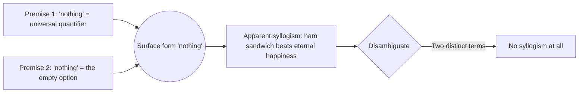

# Formal fallacies

A **formal fallacy** is an argument that is invalid by virtue of its logical *form*, not its content. You don't need to know what "Socrates" or "vaccines" or "ESG" mean: once you can read the form, you can refute it. This is the cleanest part of fallacy theory — there is no judgement call, only a counterexample or a truth table.

Formal fallacies come in two big families: those affecting **propositional logic** (the conditional gets misused) and those affecting **categorical syllogisms** (the Aristotelian quantifiers get tangled). We will work through both, give a formal scheme for each, an English-language example, and the technical reason it fails.

A note before we start. An argument is **valid** iff it is impossible for all premises to be true while the conclusion is false. A formal fallacy presents an argument whose scheme has at least one row in the truth table (or one Euler diagram) where premises are true and conclusion is false — i.e. a counter-model.

## 1. Affirming the consequent

Scheme:

$$\dfrac{P \rightarrow Q,\quad Q}{\therefore P}$$

Example: "If it has rained, the streets are wet. The streets are wet, so it has rained."

Why it's wrong — truth table:

| P | Q | $P \rightarrow Q$ | Q | P |
|---|---|-------------------|---|---|
| T | T | T | T | T |
| T | F | F | F | T |
| **F** | **T** | **T** | **T** | **F** |
| F | F | T | F | F |

The third row (the **counter-model**) has both premises true and the conclusion false: the streets can be wet because of the street cleaner, not the rain. The argument is therefore invalid.

A milder gloss: $P \rightarrow Q$ does *not* license the inference of $P$ from $Q$. It only licenses $Q$ from $P$ (modus ponens) and $\neg P$ from $\neg Q$ (modus tollens). Confusing the conditional with the biconditional is the root of most diagnostic errors.

## 2. Denying the antecedent

Scheme:

$$\dfrac{P \rightarrow Q,\quad \neg P}{\therefore \neg Q}$$

Example: "If you study, you'll pass. You did not study, so you will not pass."

Truth table counter-model: $P$ false, $Q$ true. You may have been lucky, copied, or have an easy exam. The conditional says nothing about what happens when the antecedent fails.

| P | Q | $P \rightarrow Q$ | $\neg P$ | $\neg Q$ |
|---|---|-------------------|----------|----------|
| F | T | T | T | **F** |

Same root cause as §1: a conditional is not a biconditional.

## 3. Faulty categorical syllogism — Aristotelian figures

A **categorical syllogism** has three terms (major, minor, middle) and four possible quantified statements (A: universal affirmative, E: universal negative, I: particular affirmative, O: particular negative). The four **figures** are determined by where the middle term sits. Aristotle catalogued 256 schemes; only 24 are valid (15 unconditionally, 9 with existential import assumptions).

A faulty syllogism is one whose mood/figure combination is not on the valid list. Standard example:

- Major: All A are B.
- Minor: All C are B.
- Conclusion: All C are A.

In figure 2 with middle term B, this is mood AAA-2, which is **invalid**.

Counter-model with Euler diagram:

<svg viewBox="0 0 360 220" width="100%" xmlns="http://www.w3.org/2000/svg">
  <rect width="360" height="220" fill="#181834"/>
  <circle cx="120" cy="110" r="70" fill="none" stroke="#9a8cf0" stroke-width="2"/>
  <circle cx="200" cy="110" r="70" fill="none" stroke="#9a8cf0" stroke-width="2"/>
  <circle cx="160" cy="110" r="100" fill="none" stroke="#ecebff" stroke-width="2" stroke-dasharray="4,3"/>
  <text x="70" y="115" fill="#ecebff" font-size="14" font-family="sans-serif">A</text>
  <text x="240" y="115" fill="#ecebff" font-size="14" font-family="sans-serif">C</text>
  <text x="160" y="30" fill="#ecebff" font-size="14" font-family="sans-serif">B (middle)</text>
</svg>

A and C are both inside B but do not overlap: "all A are B" and "all C are B" can be true while "all C are A" is false.

Example in English: "All mammals are animals. All birds are animals. Therefore all birds are mammals." The middle term *animal* is too broad; it doesn't force A and C to coincide.

## 4. Undistributed middle

This is the formal diagnosis of the previous example. A term is **distributed** in a categorical statement when the statement refers to *every* member of its extension. In "All A are B", A is distributed (it talks about every A) but B is not. In "No A are B", both are distributed.

**Rule**: in a valid syllogism, the middle term must be distributed in at least one premise. In the AAA-2 mood above, the middle term B is the predicate of both premises (both A-statements), so it is **undistributed in both**. Hence the fallacy.

English example: "All terrorists are people who watch the news. All voters are people who watch the news. Therefore all voters are terrorists." Same shape, more dramatic.

## 5. Existential fallacy

Some traditional syllogisms (e.g. AAI-1, mood Barbari) are valid only if we assume the categories are non-empty. Modern logic (after Boole, Frege) treats universal statements as not implying existence: "All unicorns have one horn" is vacuously true even if no unicorns exist.

The **existential fallacy** infers a particular ("Some A is C") from two universals ("All A are B", "All B are C") without licence to assume A is non-empty.

Scheme:

$$\dfrac{\forall x(A(x) \rightarrow B(x)),\quad \forall x(B(x) \rightarrow C(x))}{\therefore \exists x(A(x) \wedge C(x))}$$

Counter-model: empty domain, or $A = \emptyset$. Both premises true (vacuously), conclusion false (no $x$ satisfies $A$).

English example: "All ghosts are spirits. All spirits are immaterial. Therefore some immaterial being is a ghost." Without assuming ghosts exist, the conclusion does not follow.

## 6. Illicit conversion

Switching subject and predicate of a categorical statement. Sometimes legal (E and I statements **convert simply**), sometimes not (A and O statements do **not** convert).

- **Illegal**: "All A are B" $\not\Rightarrow$ "All B are A". E.g. "All cats are mammals" does not entail "All mammals are cats."
- **Illegal**: "Some A are not B" $\not\Rightarrow$ "Some B are not A". E.g. "Some students are not Italian" does not entail "Some Italians are not students."
- **Legal**: "No A are B" $\Leftrightarrow$ "No B are A".
- **Legal**: "Some A are B" $\Leftrightarrow$ "Some B are A".

The fallacy is to perform an illegal conversion as if it were legal.

## 7. Four-term fallacy (*quaternio terminorum*)

A categorical syllogism must have exactly **three** terms, each used in a consistent meaning. The four-term fallacy sneaks in a fourth term, often by **equivocation** (a word used in two senses).

Scheme:

$$\dfrac{\text{All A are B}.\quad \text{All B}' \text{ are C}.}{\therefore \text{All A are C}.}$$

where $B$ and $B'$ look identical in surface form but mean different things.

English example:
- "Nothing is better than eternal happiness."
- "A ham sandwich is better than nothing."
- Therefore, "A ham sandwich is better than eternal happiness."

The word "nothing" shifts meaning between premises (in the first it is a universal quantifier; in the second, an existential reference to the absence of any sandwich at all). Once disambiguated, the syllogism evaporates.

## 8. Mini diagnostic checklist

Given a candidate argument, run this checklist in order. The first hit is the diagnosis.

1. Is a conditional being run backwards? → affirming the consequent / denying the antecedent.
2. Does the syllogism have three clear terms? → if not, four-term fallacy.
3. Is the middle term distributed at least once? → if not, undistributed middle.
4. Was a subject/predicate swap performed? → check legality of conversion.
5. Are both premises universal? Does the conclusion claim existence? → existential fallacy.

Most informal "argument" you'll meet in news or social media will trip one of these by step 3.

## 9. Exercises

Exercise 1 — diagnose this argument

"If a company is profitable, it pays dividends. SuperCorp pays dividends. Therefore SuperCorp is profitable."

**Affirming the consequent.** Counter-model: SuperCorp may pay dividends out of debt, accumulated reserves, or to defend a falling share price. Profit is sufficient, not necessary.

Exercise 2 — diagnose this argument

"All scientists are sceptical. All journalists are sceptical. Therefore all journalists are scientists."

**Undistributed middle.** The term "sceptical" (predicate of both universal-affirmative premises) is not distributed in either premise. The Euler diagram of §3 applies verbatim.

Exercise 3 — diagnose this argument

"All laws apply to citizens. The law of gravity is a law. Therefore the law of gravity applies to citizens."

**Four-term fallacy.** "Law" in premise 1 means a legal norm; in premise 2 it means a regularity of nature. Disambiguate and the syllogism has four terms.

Exercise 4 — diagnose this argument

"If we cut taxes, the economy grows. We did not cut taxes. Therefore the economy will not grow."

**Denying the antecedent.** The conditional says nothing about what happens without a tax cut; the economy might grow from a productivity shock, exports, or fiscal stimulus.

## Summary

- A **formal fallacy** is invalid by form alone; the counter-model is a truth table row or an Euler diagram.
- The two most common conditional fallacies are **affirming the consequent** and **denying the antecedent**: both confuse $\rightarrow$ with $\leftrightarrow$.
- Categorical syllogisms can fail by **undistributed middle**, **illicit conversion**, **existential fallacy**, or by smuggling in a fourth term (often through equivocation).
- The diagnostic checklist (3 steps) catches the majority of real-world cases.
- Distinguish strictly between **formal** fallacies (this chapter) and the **informal** ones treated in [Informal fallacies of relevance](21-informal-fallacies-relevance.html) and [Informal fallacies of presumption](22-informal-fallacies-presumption.html).

## Further reading

- Copi, I. M. & Cohen, C., *Introduction to Logic*, ch. 6 — categorical syllogisms.
- Hurley, P., *A Concise Introduction to Logic*, the standard US textbook.
- Hamblin, C. L., *Fallacies*, 1970 — the modern classic that revived the field.
- Walton, D., *Fallacies Arising from Ambiguity*, Kluwer 1996.
- See also: [Rules of inference](09-rules-of-inference.html), [Informal fallacies of relevance](21-informal-fallacies-relevance.html), [Informal fallacies of presumption](22-informal-fallacies-presumption.html).
