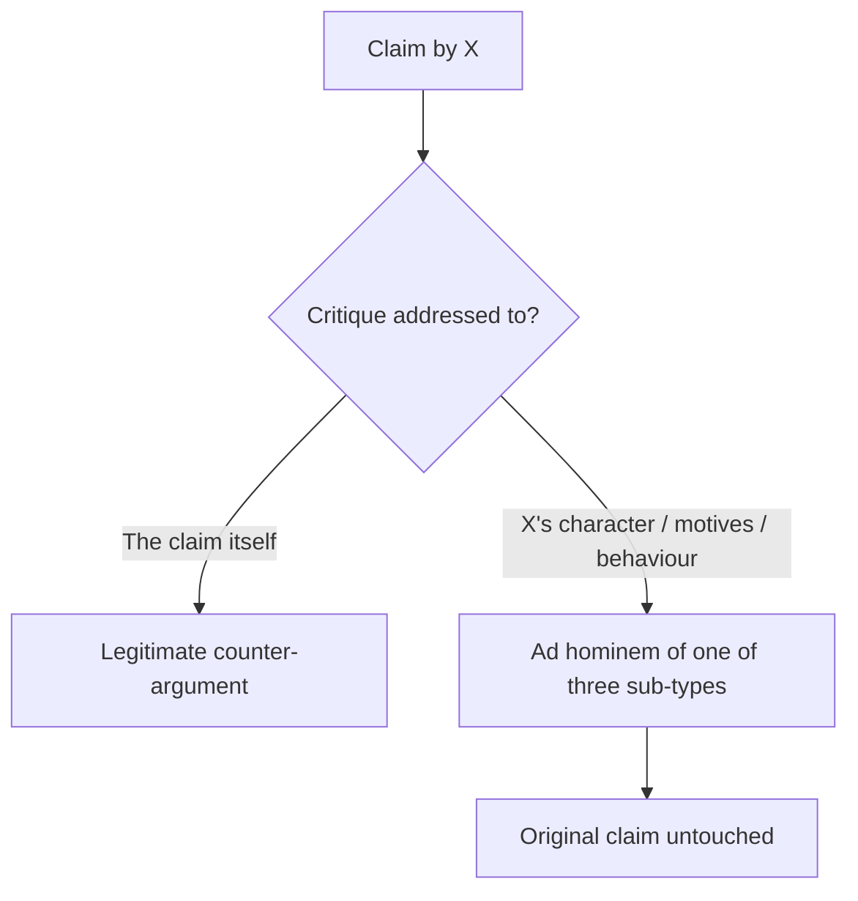
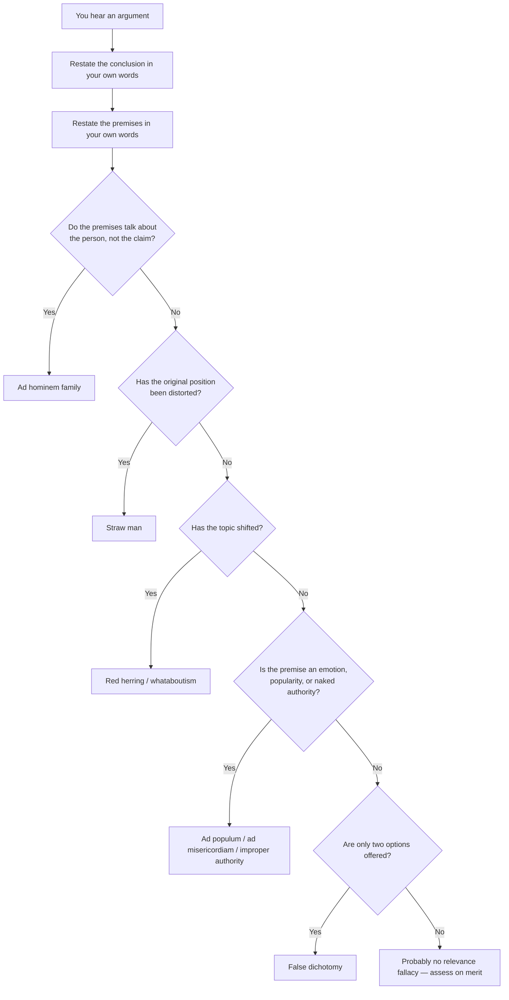

# Informal fallacies of relevance

A **fallacy of relevance** is an argument whose premises, even if true, have no logical bearing on the conclusion. The form may be perfectly fine; the *content* misses the target. These are by far the most common errors in public debate: politics, journalism, social media, family WhatsApp threads. Formal logic doesn't catch them — you need a different lens.

Aristotle catalogued thirteen of them in the *Sophistical Refutations* (4th century BC). Modern lists range from 20 to 200. We will keep to the dozen that, in our experience, account for ~80% of bad public reasoning.

A general note. Calling something a fallacy in conversation is itself rhetorically loaded: it can be used as a thought-terminating cliché ("that's an ad hominem", "that's whataboutism"). The discipline here is to *show* why the inference fails, not just to label it.

## 1. Ad hominem — three sub-types

Attacking the person rather than the argument. The Latin is "to the man".

### 1.1. Abusive ad hominem

Direct insult. "You can't trust anything Mario says, he's a buffoon." The character of Mario is logically separate from the truth of his claim. Mario may be a buffoon *and* right.

### 1.2. Circumstantial ad hominem

Dismissing an argument because of the arguer's circumstances or motives. "Of course he says minimum wage doesn't cause unemployment — he's a left-wing economist." The motive does not refute the claim; the data either supports it or doesn't. Note: circumstance *can* be evidence of bias, which justifies extra scrutiny, but not automatic dismissal.

### 1.3. Tu quoque ("you too")

"You're criticising me for skipping the gym, but you skipped yesterday." Even if true, this doesn't refute the criticism — it just shifts attention to the critic's behaviour. The original argument stands or falls on its own.

## 2. Straw man

Distorting your opponent's position into a weaker version, then refuting *that*. Original: "We should expand bike lanes in the city centre." Straw man response: "So you want to ban all cars and force everyone to cycle in the rain — that's absurd." The opponent argued for *more* bike lanes, not the abolition of cars.

A good rule of thumb (Daniel Dennett's "steel man"): before attacking a view, **restate it in a form your opponent would accept** — ideally a stronger version than they gave. Then refute that. If you can't, you have learned something.

## 3. Red herring

Distraction. Premise true, premise on-topic-looking, premise irrelevant. The name is from training hounds: a smoked herring would throw them off the scent. Example: in a debate about NHS funding, a politician pivots to immigration. The crowd cheers, the original issue is lost. Often combined with a pivot to a topic the speaker is more comfortable on.

## 4. Improper appeal to authority

Citing an authority outside their field of expertise, or one whose authority is contested, or simply assuming "expert said X, therefore X". Example: "Einstein was a vegetarian, so vegetarianism is healthy." Einstein was a physicist, not a nutritionist.

**Legitimate appeal to authority** has four conditions (after Walton 1997):
1. The cited authority is a genuine expert in the domain.
2. There is consensus among the relevant experts (no unreported minority).
3. The authority has no obvious conflict of interest.
4. The claim is *within* the domain in which expertise applies.

If all four hold, citing the authority is a **defeasible** but rational argument, not a fallacy. Most everyday science communication relies on this: you have not personally verified that vaccines are safe — you trust the WHO, the EMA, and a million peer-reviewed papers. That is not a fallacy; that is normal epistemic practice.

## 5. Appeal to popularity (*ad populum*)

"Everyone believes X, therefore X." The vast majority believed the sun went round the Earth for millennia; popularity is not truth. The fallacy is particularly seductive in the age of social media metrics: "this tweet has 200k likes, so it must be right." Likes do not establish facts.

A close cousin is the **bandwagon fallacy** ("everyone is doing it, you should too") — note the prescriptive twist.

## 6. Appeal to emotion

The premises play on the audience's feelings — fear, pity, vanity, anger — rather than provide reasons.

- **Appeal to fear** (*ad metum* or *ad baculum* if it's a threat): "If you don't vote for us, the country will collapse." Maybe; provide the analysis.
- **Appeal to pity** (*ad misericordiam*): "I deserve a passing grade — my family is going through a difficult time." Sympathy is human; grades measure work.
- **Appeal to vanity / flattery**: "Smart people like you obviously see that…". A trap: pre-loading the audience.
- **Appeal to anger** (*ad iram*): mobilising indignation as if it were evidence.

Emotions are not irrelevant to ethical deliberation — Aristotle was clear on this in the *Rhetoric* — but they can't *substitute* for reasons.

## 7. Appeal to ignorance (*ad ignorantiam*)

"There is no proof X is false, therefore X is true." Or its mirror: "There is no proof X is true, therefore X is false." Absence of evidence is not, in general, evidence of absence. (It can be, in a Bayesian sense, when evidence would be expected — see [Bayes' theorem](33-bayes-theorem.html) — but the inference must be made explicitly.)

Classic example: Russell's teapot. "You can't prove there isn't a teapot orbiting the sun between Earth and Mars, so why not believe in it?" The burden of proof lies with the affirmative claim.

## 8. Appeal to nature

"X is natural, therefore X is good" — or its inverse, "Y is artificial, therefore Y is bad". Hemlock is natural; insulin is artificial. The naturalness of a substance, practice or social arrangement says nothing about its moral or practical value. The fallacy is widespread in marketing ("100% natural!") and in some bioethics debates.

## 9. Genetic fallacy

Judging an idea by its origin rather than its current merits. "Modern algebra was developed in part by Muslim mathematicians, so it's tainted with religion." Or, more commonly: "This proposal came from the opposition, so it must be bad."

Distinguish from circumstantial ad hominem: the genetic fallacy targets the *origin* of an idea (could be a person, a culture, a historical period, a discredited source), while ad hominem targets the *current arguer*.

## 10. Whataboutism

A Cold War speciality, still alive. When confronted with a critique, deflect by pointing out a comparable or worse failing of the critic or their group. "You criticise our human rights record? What about your country's prisons?" The whataboutist's premise may even be true — and irrelevant. Two wrongs don't make a right; the original critique is unaddressed.

It's a special case of tu quoque, scaled up to nations or movements.

## 11. False dichotomy / false dilemma

Presenting only two options when more exist. "Either you're with us or you're against us." Often a third option (neutrality, conditional support, calling for more options) is precisely the right answer.

Diagnostic: ask "is there really no other option?" If yes — name it.

## 12. Slippery slope

Asserting that a small first step inevitably leads to a chain of increasingly bad consequences, without justifying the inevitability. "If we allow gay marriage, next people will marry their dogs." The conclusion may or may not be the case; the inferential chain needs argument, not just assertion.

**Not a fallacy** if the chain is supported empirically (e.g. behavioural addiction studies, regulatory creep evidence). Then it's just a causal argument, and stands or falls on the data.

## 13. Spotting fallacies in the wild

A practical algorithm.

## 14. Exercises

Exercise 1 — name the fallacy

"How can the Foreign Minister talk about transparency, given that her party was caught up in a corruption scandal three years ago?"

**Circumstantial ad hominem** (and a flavour of genetic fallacy). The minister's party history is logically independent of whether the *current* transparency proposal is good.

Exercise 2 — name the fallacy

"Look, 70% of citizens want lower fuel taxes. Clearly the policy is right."

**Ad populum.** Popularity does not establish that a policy is economically or environmentally sound; the question is on the merits.

Exercise 3 — fallacy or legitimate?

"The Italian Society of Cardiology recommends limiting saturated fat intake; we should follow their guidance."

**Legitimate**. All four Walton conditions hold: relevant expertise, consensus, no obvious conflict of interest, within domain. Not a fallacy — this is normal evidential reasoning. Distinguish from "Dr X (a famous TV doctor) says yoghurt cures cancer," which fails on consensus and possibly on domain.

Exercise 4 — name the fallacy

"If we accept remote working for some employees, soon everyone will demand to work from the beach and the company will collapse."

**Slippery slope** without supporting evidence. Lots of companies do hybrid work without collapsing. Add data, the argument becomes empirical.

Exercise 5 — name the fallacy

"GMOs aren't natural, so they shouldn't be in our food chain."

**Appeal to nature.** Whether GMOs are safe and ethical is an empirical and normative question; "natural" is not the relevant predicate.

## Summary

- **Fallacies of relevance** disconnect premises from conclusion: the form may be fine, the topic is wrong.
- Three sub-types of **ad hominem** (abusive, circumstantial, tu quoque) all attack the person; the argument is left standing.
- **Straw man** distorts; the counter-discipline is the steel man.
- Appeals to **popularity, emotion, ignorance, nature** dress non-evidence as evidence.
- Appeal to authority is **not** always a fallacy: Walton's four conditions discriminate the legitimate case.
- **False dichotomy** and **slippery slope** are the rhetorician's favourite shortcuts; counter with a third option or a demand for the missing inference.
- Practical rule: restate the conclusion and the premises in your own words. The fallacy usually surfaces in the restatement.

## Further reading

- Walton, D., *Informal Logic: A Pragmatic Approach*, Cambridge 2008.
- Hamblin, C. L., *Fallacies*, Methuen 1970.
- Cassam, Q., *Vices of the Mind*, Oxford 2019 — on epistemic vices like wishful thinking and dogmatism.
- Tindale, C. W., *Fallacies and Argument Appraisal*, Cambridge 2007.
- See also: [Formal fallacies](20-formal-fallacies.html), [Informal fallacies of presumption](22-informal-fallacies-presumption.html), [Propaganda and manipulation](50-propaganda-manipulation.html).
