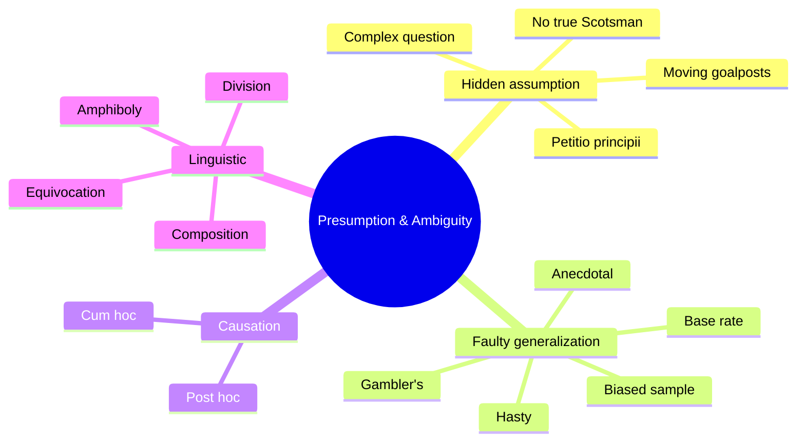

# Informal fallacies of presumption and ambiguity

These fallacies don't attack relevance; they smuggle conclusions through unspoken assumptions or word games.

## 1. Begging the question (*petitio principii*)

The conclusion is hidden in the premises. Circular reasoning.

> "Of course you can trust me — I just said so."

Trust is established by the very claim that asks for trust. Subtler forms restate the conclusion in different vocabulary.

## 2. Complex question

A question with built-in assumption.

> "Have you stopped beating your wife?"

Both yes and no admit the premise. Refuse the frame: "Reject the question — I never beat her."

## 3. Hasty generalization

Generalizing from too few cases.

> "Both Italians I met were rude. Italians are rude."

A sample of 2 isn't reliable. Required: a sample large enough and not selected on the trait of interest.

## 4. Biased sample

The sample is non-representative because of selection.

> "Survey on cellphone use among visitors to landline support forums: 30% use cellphones."

Selection bias. People in landline forums are atypical.

## 5. Post hoc ergo propter hoc

"After this, therefore because of this." Temporal precedence ≠ causation.

> "I took echinacea, then my cold went away. Echinacea cures colds."

Colds resolve in days regardless. See [causality, Pearl](45-causality-pearl.html).

## 6. Cum hoc ergo propter hoc

"With this, therefore because of this." Correlation ≠ causation.

> "Ice cream sales and drownings rise together. Ice cream causes drownings."

Confounder: summer.

## 7. Anecdotal evidence

A vivid story beats statistical evidence in our minds.

> "My grandfather smoked until 95 — smoking can't be that bad."

One person's case ≠ the base rate. Combined with [availability bias](23-cognitive-biases.html).

## 8. Gambler's fallacy

Independent events are believed to "balance out".

> "Black has come up five times in a row. Red is due."

If the roulette wheel is fair, the next spin is still 50/50. Each spin is independent.

## 9. Base rate fallacy

Ignoring the underlying frequency.

> "A test is 99% accurate. Mine is positive. So I have 99% chance of being sick."

Wrong. If disease prevalence is 1/1000, the answer is closer to 9%. See [Bayes' theorem](33-bayes-theorem.html).

## 10. Equivocation

Same word, two meanings, one argument.

> "All laws have a maker. The laws of physics are laws. Therefore the laws of physics have a maker."

*Law* shifts between "human-made rule" and "scientific regularity".

## 11. Amphiboly

Ambiguous grammatical structure.

> "I saw the dog running on TV."

The dog on TV? Or you on TV watching the dog? Marketing and propaganda exploit this.

## 12. Composition

Inferring properties of the whole from properties of parts.

> "Every player is excellent. So the team is excellent."

A team of star egos may play worse than the sum of stars.

## 13. Division

The reverse: inferring parts from whole.

> "American is on average wealthy. So this American is wealthy."

Averages don't apply to instances.

## 14. No true Scotsman

Defending a generalization by redefining the category to exclude counterexamples.

> A: "No Scotsman puts sugar on his porridge."
> B: "My uncle, Hamish, does."
> A: "No *true* Scotsman puts sugar on his porridge."

Ad hoc redefinition. Insidious because it sounds reasonable.

## 15. Moving the goalposts

Changing the criteria of success when the original is met.

> Before vaccination: "We need 70% efficacy."
> After (the vaccine has 80% efficacy): "But it doesn't prevent transmission."

If criteria can shift, no evidence ever suffices.

## 16. Tu quoque (also a relevance fallacy)

"You too." Deflecting criticism by accusing the critic of the same.

Often a defense disguised as logic.

## Mermaid summary

## Exercises

  
"I never met a vegetarian who wasn't fanatical." Identify the fallacy.

Hasty generalization + biased sample. Probably never asked others if they're vegetarian — the silent ones aren't fanatical, by definition.

  
"My horoscope predicted a difficult day, and indeed I had a fight with my boss." Fallacy?

**Confirmation bias** + **post hoc**. Vague horoscope predictions match any day if you look for matches. Ignored: the days when horoscope predicted but nothing happened.

## Summary

- Begging the question, complex question: hidden assumptions.
- Hasty generalization, biased sample, anecdotal: too-few cases.
- Post hoc, cum hoc: causation confusion.
- Equivocation, amphiboly, composition, division: linguistic traps.
- No true Scotsman, moving goalposts: ad hoc redefinitions.
- Base rate fallacy: ignoring prior frequencies; see [Bayes](33-bayes-theorem.html).

## Further reading

- Copi & Cohen, *Introduction to Logic*.
- Carl Sagan, *The Demon-Haunted World* (1995).
- Bo Bennett, *Logically Fallacious* (free online).
