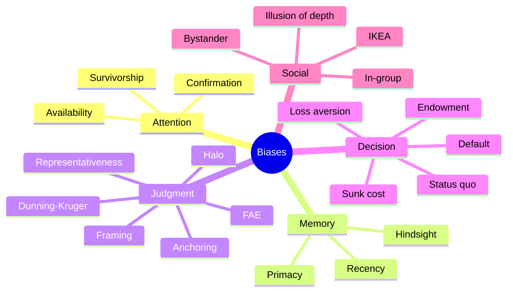

# Cognitive biases: a curated catalog

In 1974 Kahneman and Tversky published "Judgment under Uncertainty: Heuristics and Biases" in *Science*. Their revolutionary idea: the human mind doesn't err *randomly* — it errs in *systematic and predictable ways*. Hundreds of biases have since been catalogued. Here are the most important, organized functionally. It's not a memorization list — it's a checklist when you suspect your thinking is off.

Most biases stem from **System 1** (see [dual process](24-dual-process.html)): fast heuristics that work on average but are systematically distorted in certain contexts.

## 1. Attention and evidence gathering

### Confirmation bias

You seek and remember information that confirms what you already believe. Wason 1960: given the numbers "2, 4, 6", asked to guess the rule, subjects propose hypotheses and *seek only confirmations* instead of disconfirming tests. Mitigation: ask "what would change my mind?" (steelmanning, see [sec. 40](40-debate-dialectic.html)).

### Availability heuristic

Estimate frequency from ease of recall. After a plane crash, you overestimate flight risk. Tversky & Kahneman 1973. Mitigation: seek **base rates**.

### Survivorship bias

You study only the survivors. Canonical case: WWII planes returning had bullet holes in wings — Abraham Wald realized armor should go where they had no holes, because planes hit there didn't return. Applies to "successful CEOs all dropped out": you ignore millions of failed dropouts.

## 2. Memory

### Recency bias

Recent information weighs more. Manager evaluates employee on the last week, not the year.

### Primacy effect

In other contexts, first impressions dominate. Asch 1946: same description with adjectives reordered evaluated differently.

### Hindsight bias

After the outcome, you find it inevitable. Fischhoff 1975.

## 3. Judgment and estimation

### Representativeness

Judging probability by stereotype similarity, ignoring base rates. The **Linda problem** (Tversky-Kahneman 1983): Linda described as "philosopher, feminist activist". Most say she's more likely "bank teller AND feminist" than "bank teller" — violating $P(A \wedge B) \le P(A)$. The **conjunction fallacy**.

### Anchoring

A starting value, even irrelevant, shifts subsequent estimates. Tversky & Kahneman: the wheel of fortune influences estimates of African nations at the UN.

### Framing

Same information differently framed → different choices. "10% mortality" vs "90% survival": same number, different clinical decisions.

### Halo effect

A positive trait (beauty) contaminates evaluation of others (intelligence, honesty). Thorndike 1920.

### Fundamental attribution error (FAE)

You explain others' behavior by character ("he's mean") and your own by situation ("I was tired"). Ross 1977.

### Dunning-Kruger effect

Less competent people overestimate their competence. Kruger & Dunning 1999. Partly artifact of regression to the mean, but qualitatively real.

## 4. Decision

### Loss aversion

Losing $100 hurts about **2× the pleasure of gaining $100**. Heart of prospect theory (see [sec. 35](35-decision-theory.html)).

### Sunk cost fallacy

Continuing a losing investment "to not waste what I've spent". Sunk cost is irrelevant for future decisions.

### Status quo bias

Preferring the current state, even when change would help. Samuelson & Zeckhauser 1988.

### Endowment effect

Valuing something more once you own it. Cornell mug experiment.

### Choice overload

Too many options paralyze. Iyengar & Lepper 2000.

### Default effect

Pre-selected options accepted disproportionately. Opt-in vs opt-out organ donation: 80% difference across EU.

## 5. Social

### In-group bias

Favoring one's group, even arbitrary (Tajfel minimal groups).

### Illusion of explanatory depth

You think you understand a zipper / government, then fail to explain it (Rozenblit & Keil 2002). Mitigation: try to teach a child (Feynman technique).

### IKEA effect

Overvaluing what you've assembled. Norton-Mochon-Ariely 2012.

### Bystander effect

In group, less likely to intervene. Kitty Genovese 1964, Latané-Darley experiments.

## 6. Mermaid summary

## 7. Canonical experiments

| Bias | Canonical experiment | Year |
|---|---|---|
| Confirmation | Wason 2-4-6 task | 1960 |
| Availability | Disease vs accident estimates | 1973 |
| Anchoring | Wheel of fortune + UN nations | 1974 |
| Representativeness | "Linda the bank teller" | 1983 |
| Framing | Asian disease problem | 1981 |
| Loss aversion | Coin flip +200/-100 | 1979 |
| Endowment | Cornell mug | 1990 |
| Hindsight | Nixon's China visit | 1975 |
| Sunk cost | Mexico vs Wisconsin ski trip | 1985 |
| Default | EU organ donation rates | 2003 |

## 8. What actually works for debiasing

Most "debiasing training" has modest effects. Better:

- **Algorithms / checklists**: replace judgment with procedure (Gawande, *The Checklist Manifesto*: 40% drop in surgery mortality).
- **Pre-mortem**: imagine the decision failed and ask why (Klein 2007).
- **Outside view**: instead of judging the specific case, use base-rate from reference class (Kahneman-Lovallo 1993).
- **Skin in the game**: biases dissolve when people bear costs.
- **Aggregation**: wisdom of crowds reduces individual biases.

## Exercises

  
"20 of my neighbors got vaccinated and none died — so it's safe." Which bias?

**Survivorship** + tiny sample. **Availability**: vivid examples beat base rates. In populations of millions, rare effects are expected.

  
"I've already spent 3 years in this relationship, I can't quit now." Bias?

**Sunk cost**. The 3 years are gone. Rational decision is on future expected value.

## Summary

- Biases are *systematic* distortions, not random errors.
- Five families: attention, memory, judgment, decision, social.
- Most lethal in practice: confirmation, anchoring, loss aversion, sunk cost, default effect.
- Knowing about a bias doesn't fix it — change the context/procedure.
- Effective tools: checklists, pre-mortem, outside view, incentives, aggregation.

## Further reading

- Kahneman, *Thinking Fast and Slow* (2011).
- Tversky & Kahneman, *Judgment under Uncertainty*, Science (1974).
- Gawande, *The Checklist Manifesto* (2009).
- Klein, *Sources of Power* (1998).
