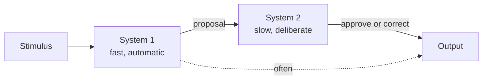

# System 1 and System 2: dual-process theory

The idea that the mind has *two modes of thinking* circulated since the 1970s (Wason-Evans, Schneider-Shiffrin). Kahneman popularized in *Thinking Fast and Slow* (2011), attributing "System 1/2" labels to Stanovich & West.

## 1. The two modes

### System 1 (S1)

**Fast, automatic, intuitive, parallel, emotionally tinted, error-prone in systematic ways.**

Examples:
- Recognize an angry face.
- $2 + 2 = ?$ — the answer appears.
- Drive on an empty road.
- Understand a simple sentence.

S1 is always on. Can't be switched off.

### System 2 (S2)

**Slow, deliberate, sequential, effortful, glucose-burning.**

Examples:
- $17 \times 24 = ?$ — you compute.
- Fill out tax return.
- Parallel-park in a tight slot.
- Resist a second slice of cake.

S2 has **limited capacity**: one hard thing at a time. Under effort, pupil dilates (physiological measure). It's the "rational supervisor" — but lazy. When S1 offers a plausible answer, S2 often accepts without checking.

## 2. Comparison

| Feature | S1 | S2 |
|---|---|---|
| Speed | fast | slow |
| Effort | none | high |
| Voluntariness | involuntary | voluntary |
| Capacity | large, parallel | limited, sequential |
| Processing | associative, heuristic | rule-based, logical |
| Errors | systematic (biases) | computation or fatigue |

## 3. Diagram

## 4. Heuristic substitution

S2 faces a hard question; S1 offers an answer to a *simpler* nearby question. S2, lazy, accepts.

Example:
- Hard: "How happy am I in life?"
- S1-easy: "What's my mood right now?"

Schwarz et al. 1991: life-satisfaction answers depend on whether subjects first counted dates this past month. Mood-of-the-moment contaminates the supposed S2 question.

## 5. Cognitive Reflection Test (CRT)

Shane Frederick 2005. Three questions measuring tendency to use S2 over accepting S1's first reply.

**Q1 (the famous one)**: "A bat and a ball cost $1.10 in total. The bat costs $1 more than the ball. How much does the ball cost?"

S1 says: 10 cents. Wrong.

  
Solution

If ball $= x$, bat $= x + 1$. Total: $2x + 1 = 1.10$, $x = 0.05 =$ **5 cents**. Bat is $1.05.

Check: $1.05 + 0.05 = 1.10$, bat is $1 more than ball.

**Q2**: 5 machines make 5 widgets in 5 minutes — time for 100 machines to make 100 widgets? (S1: 100. Correct: 5.)

**Q3**: A lily doubles daily, covers a lake in 48 days. When half? (S1: 24. Correct: 47.)

Result: only ~17% answer all three correctly. Even MIT and Harvard students often miss.

## 6. Biases as S1 output

Most biases from [sec. 23](23-cognitive-biases.html) are heuristics of S1:
- Availability = S1 estimates frequency by ease of recall.
- Representativeness = S1 judges probability by stereotype.
- Anchoring = S1 latches onto first number.
- Affect heuristic = S1 evaluates risk by emotional valence.

S2 can correct — but rarely does.

## 7. Critiques and variants

### Stanovich (2009): tripartite

- **Autonomous mind** (≈ S1): automatic processes.
- **Algorithmic mind** (≈ S2 power): efficiency in controlled processes (≈ IQ).
- **Reflective mind**: disposition to engage S2 (≈ CRT, actively open-minded thinking).

The latter two are distinct: smart people can still be reflectively lazy.

### Evans (2011): too schematic

No evidence of two distinct neural systems. There's a spectrum of more/less automatic processes. "S1/S2" is metaphor, not architecture.

### Gigerenzer (2007): temper the pessimism

Max Planck researcher: many S1 heuristics are *fast and frugal* and produce good decisions in ecologically realistic domains. "Take the best", "recognition heuristic". The Kahneman narrative is too negative.

## 8. Practical implications

- **Important slow decisions**: give S2 time. Sleep on it. Write it.
- **Where S1 errs systematically**: introduce procedures (checklists, scoring) — "be careful" isn't enough.
- **Reflective disposition is trainable**: steelman, pre-mortem, actively look for counter-evidence.
- **Cognitive load matters**: stress, sleep deprivation, multitasking → S2 offline, S1 dominates.

## 9. When S1 beats S2

Expert intuition (veteran firefighters, grandmasters) operates mostly in S1 and outperforms slow S2 (Klein, *Sources of Power*, 1998). Trained S1 is powerful.

## Exercises

  
Which system fires? "Recognize a friend in a photo within 0.2s."

S1 only. Face recognition is in the fusiform face area, automatic.

## Summary

- Two modes: S1 (fast, automatic) and S2 (slow, deliberate).
- S1 always on; S2 recruited and tires.
- Biases = heuristic outputs of S1 not corrected by S2.
- CRT measures reflective disposition.
- Critiques: no clean dual neural architecture; trained S1 can outperform.

## Further reading

- Kahneman, *Thinking Fast and Slow* (2011).
- Stanovich, *Rationality and the Reflective Mind* (2011).
- Gigerenzer, *Gut Feelings* (2007).
- Frederick, *Cognitive Reflection and Decision Making*, JEP (2005).
