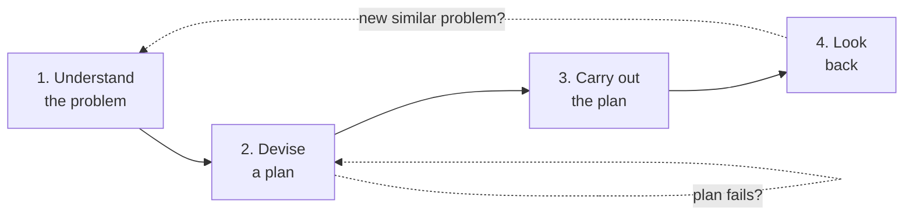

# Polya: how to solve a problem (4 steps)

George Pólya (1887–1985), Hungarian-American mathematician at Stanford. *How to Solve It* (1945), the classic of problem solving. Four phases — a skeleton of questions that force you to not skip moves.

## 1. The four phases

## 2. Phase 1 — Understand the problem

Polya's questions:

- What is given (the data)?
- What is the unknown?
- What condition links the data to the unknown?
- Is the condition sufficient? Redundant? Contradictory?
- Can you restate it in your own words? Draw a picture?

Common error: read once and start computing. Time spent understanding pays back 10×.

### 2.1 Math example

"Find two consecutive integers whose sum is 25."

- Data: sum = 25; consecutive.
- Unknown: two numbers $x, x+1$.
- Condition: $x + (x+1) = 25$.

### 2.2 Life example

"Decide whether to accept a job offer in Milan."

- Data: current and offered salary, Milan cost of living, family situation, career prospects.
- Unknown: yes/no decision, but the true unknown is the *personal utility function*.

## 3. Phase 2 — Devise a plan

The creative step. Heuristics that help:

- Know a similar problem?
- A related theorem?
- Solve simpler cases first?
- Change the unknown?
- *Work backwards* from the goal?
- Decompose into subproblems?

See [problem-solving heuristics](26-problem-solving-heuristics.html) for detail.

### 3.1 Analogy as engine

Pólya emphasizes the power of analogy. "Have you solved a similar problem?" Often a new problem is the disguised reissue of a classic. Experts see patterns invisible to novices — that's the value of accumulated experience.

### 3.2 Example: $1+2+\ldots+100$

Young Gauss applied "work backwards / symmetry":

$$S = 1+2+\ldots+100$$
$$S = 100+99+\ldots+1$$
$$2S = 101 \cdot 100 \Rightarrow S = 5050$$

Trick = pairing/symmetry. Obvious once seen.

## 4. Phase 3 — Carry out the plan

Execute step by step, checking each. If stuck, return to phase 2.

Check questions:
- Do you see clearly that each step is correct?
- Can you prove it?

Discipline: write the steps. Don't improvise mentally. Even for non-mathematical problems, a written sketch reveals gaps.

## 5. Phase 4 — Look back

The phase everyone skips — and the one that produces learning.

Pólya's questions:
- Can you check the result?
- Check it differently?
- Derive it another way?
- See it at a glance?
- Use the result or method for a different problem?

Double purpose: **verify** correctness and **generalize** the lesson.

Example: you solved Gauss's sum. Does the same trick work for $1 + 3 + 5 + \ldots + (2n-1)$? Yes: $n^2$. For a geometric series? Different but analogous trick (multiply by ratio, subtract).

## 6. Mini complete example

"A room is 5 m wide and 8 m long. How many 50 cm-square tiles to floor it?"

**Understand**: room area = 40 m². Tile area = 0.25 m². Find $N$.

**Plan**: $N = 40 / 0.25$.

**Carry out**: $40 / 0.25 = 160$.

**Look back**: sanity — 160 × 0.25 = 40 ✓. Generalization: $L \times W$ m room with square tile $s$ m: $N = LW/s^2$. Real-world caveat: account for waste (~10% extra).

## 7. Limits

Polya is NOT:
- A guaranteed algorithm (wicked problems have no "correct" solution — see [sec. 48](48-wicked-problems.html)).
- A substitute for **domain knowledge**: phase 2 works only with enough exposure to similar problems.

## 8. Modern relatives

- **TRIZ** (Altshuller): engineering inventiveness.
- **Design thinking**: human-centered problems.
- **PDCA** (Deming): quality improvement.
- **OODA** (Boyd): rapid military decisions.
- **5 Whys** (Toyota): causal root analysis.

All variants of "understand → design → execute → learn".

## Exercises

  
Apply Polya to: "Learn French in one year from scratch."

**Understand**: time per day, motivation, resources, *target level* (A2? B1? B2? conversational? written?).

**Plan**: similar problem (other languages). Heuristic: break into sub-goals (vocab 500, basic grammar, listening, writing, speaking). Tools: Anki, immersion, tutor, podcasts.

**Execute**: 30 min Anki + 30 min reading + 1 tutor/week, for 3 months, then reassess.

**Look back**: at 3 months, check sub-goal. Adjust plan.

  
20 people at a party, each shakes hands with every other once. Total handshakes?

**Understand**: $n = 20$. Each handshake involves 2 people.

**Plan**: similar problem? Choosing 2 from $n$: $\binom{n}{2}$. Or each shakes $n-1$ others, total directed encounters $n(n-1)$, each counted twice → $/2$.

**Execute**: $\binom{20}{2} = 20 \cdot 19 / 2 = 190$.

**Look back**: small case, 3 people: $\binom{3}{2}=3$ ✓.

## Summary

- Four phases: understand, plan, execute, review.
- Each phase has key questions; value is in deliberate slowdown.
- Polya is a skeleton, not algorithm — needs domain knowledge.
- Phase 4 produces learning and is most often skipped.
- Modern relatives: design thinking, PDCA, OODA, TRIZ, 5 Whys.

## Further reading

- Pólya, *How to Solve It* (1945).
- Pólya, *Mathematics and Plausible Reasoning* (1954).
- Schoenfeld, *Mathematical Problem Solving* (1985).
