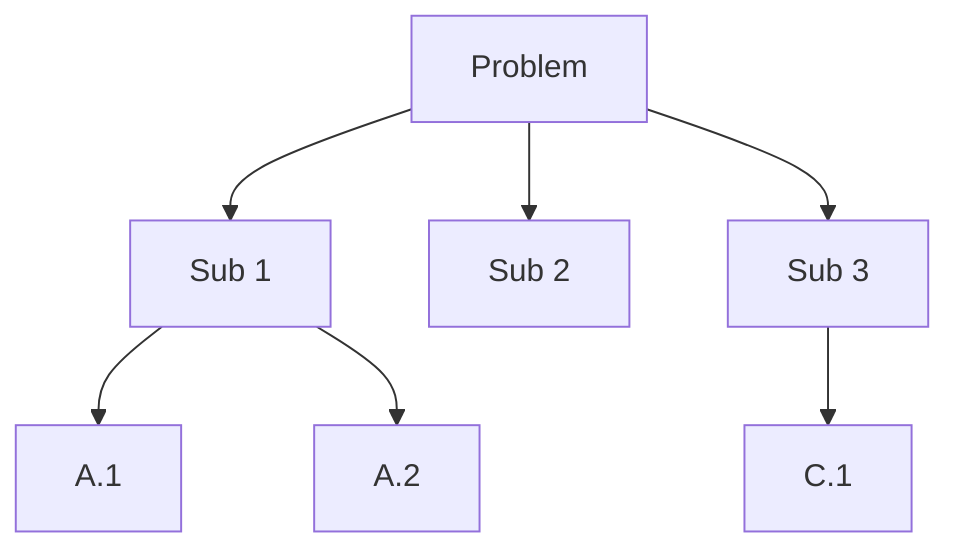

# Problem-solving heuristics

Polya lists heuristics in an appendix to *How to Solve It*. Newell & Simon formalized them in the General Problem Solver (1957-60), the first AI program to use them. Heuristics don't guarantee a solution: they raise its probability.

## 1. Means-Ends Analysis (MEA)

Reduce the gap between current state and goal at each step, choosing the operator that most reduces it.

**Schema**:
1. What's needed to get from here to goal?
2. Which action $A$ reduces the gap most?
3. If preconditions of $A$ aren't met, apply MEA recursively to meet them.

Example: writing a thesis → missing chapter 3 → missing dataset → missing parser code → write code first. Recursive.

## 2. Working Backwards

Start from the goal and reason back to what you have.

**Pappus (~300 BCE)** classic: to prove a theorem, assume the conclusion and seek premises that imply it. When you reach axioms, you're done.

**Practical**: graduate in 2 years. → 60 credits. → 6 exams/year. → 1 every 2 months. → what do I do tomorrow?

## 3. Decomposition

Divide and conquer. Split the problem into smaller parts, solve each, recombine.

Works if sub-problems are **independent** or weakly coupled. Strongly coupled ones produce conflicting constraints.

## 4. Analogy

"Have you seen a similar problem?" Analogy requires extracting **structure** from content: two problems superficially different can have the same form.

Tower of Hanoi and "Missionaries and Cannibals" are both planning problems with state constraints. Techniques for one apply to the other.

## 5. Generalization and specialization

- **Specialize**: too hard generally? Solve $n=1, 2, 3$ and look for pattern.
- **Generalize**: sometimes the general problem is *easier*. The Vandermonde identity is more transparent than its specific cases.

## 6. Draw a figure

Obvious for geometry but also for non-geometric problems: Venn diagrams, tables, graphs, decision trees.

## 7. Extreme cases

What if $n=0$? $n=1$? $n \to \infty$? Degenerate cases often reveal structure.

## 8. Invariants

A property preserved by every step.

Example: chess board with two opposite corners removed. Can you cover with 31 2×1 dominoes?
**Answer**: no. Invariant: each domino covers one white + one black square. Removed corners are same color (both white). 30 black, 32 white remain — parity mismatch.

## 9. Parity arguments

Counting mod 2 (or mod $k$) often excludes solutions.

**Three switches, three bulbs in another room — identify each by entering once**: turn A on 5 min, off. Turn B on. Enter. Lit = B. Off but warm = A. Off cold = C. Three states (on/warm/cold) distinguish three switches.

## 10. Pigeonhole principle

Put $n+1$ items in $n$ boxes → some box has 2 items.

In a city of 2 million, at least two people have the same hair count (< 150k hairs). Pigeonhole.

## 11. Induction

Prove $P(n)$ for all $n \ge 0$:

1. Base: $P(0)$.
2. Step: $P(n) \Rightarrow P(n+1)$.

Variants: **strong induction** (assume $P(k)$ for all $k \le n$), **structural induction**, **transfinite**.

Induction is also a *construction* tool: if you can solve $n$ from $n-1$, you have a recursive algorithm.

## 12. Hill climbing vs systematic search

- **Hill climbing**: each step takes best local improvement. Fast, but stuck at local maxima.
- **Random restart**, **simulated annealing**, **tabu search**: escape local maxima.
- **Systematic search** (BFS, DFS, A*): guaranteed to find a solution (if it exists in enumerable space), at exponential cost.

See [algorithms and strategies](28-algorithms-strategies.html).

## 13. Integrated example: Tower of Hanoi

3 disks on 3 pegs, move all from A to C, never a larger on smaller.

**Strategy**: subgoal + recursion.
- To move $n$ disks from A to C: move $n-1$ from A to B (use C as aux), move the largest from A to C, move $n-1$ from B to C.
- Base: $n=1$, move directly.

Move count: $T(n) = 2T(n-1) + 1$ with $T(1) = 1 \Rightarrow T(n) = 2^n - 1$.

## Exercises

  
13 people in a room. Show that two share a birth month.

12 months, 13 people → pigeonhole.

  
Prove $1 + 3 + 5 + \ldots + (2n-1) = n^2$ by induction.

Base $n=1$: $1 = 1^2$ ✓.
Step: assume sum is $n^2$. Add $(2n+1)$: $n^2 + 2n + 1 = (n+1)^2$ ✓.

## Summary

- MEA, working backwards, decomposition, analogy, generalize/specialize, draw, extreme, invariants, parity, pigeonhole, induction, hill climbing — base kit.
- Heuristics shift the odds; they don't guarantee.
- Expertise = large catalog of similar problems + fast heuristic selection.

## Further reading

- Pólya, *How to Solve It*, appendix.
- Newell & Simon, *Human Problem Solving* (1972).
- Engel, *Problem-Solving Strategies* (1998).
- Schoenfeld, *Mathematical Problem Solving* (1985).
