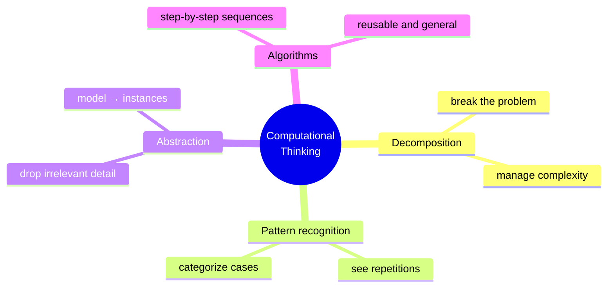

# Computational thinking

Jeannette Wing's *Computational Thinking* (CACM 2006): the way computer scientists think is a general skill — "a fundamental skill like reading, writing, and arithmetic". Computational thinking is NOT programming. It's **formulating problems so a machine (human or artificial) can solve them systematically**.

## 1. The four pillars



### 1.1 Decomposition

Break a complex problem into manageable parts. Top-down.

Example: organize a party → invitees, food, venue, timing. Each split further (food → menu, shopping, cooking). Reveals dependencies (can't shop before menu) and parallelisms (music and food independent).

### 1.2 Pattern recognition

Spot similarity between problems (to reuse solutions) or repetition within (to factor into a procedure).

Example: tax computed for N earners → same calculation × N → a loop.

Pattern recognition is also the basis of Machine Learning — but the cognitive skill is the human-level competence to design/use the system, distinct from the algorithmic ML.

### 1.3 Abstraction

Drop the details irrelevant to the current problem.

**Subway map**: cartographic distances and directions are distorted; only topological info (connections, order, transfers) preserved. Enough for the navigator.

**Programming**: a `sort(list)` function abstracts the algorithm. Users don't need to know merge sort vs quick sort.

**Everyday**: planning a party, ignore plate color if no aesthetic preference — abstract "tableware" as homogeneous category.

The hardest pillar. Costs cognitive effort to choose *what* matters. Wrong abstraction = a map that omits your stop.

### 1.4 Algorithms

A finite sequence of unambiguous steps from input to output.

- **Finiteness**: terminates.
- **Definiteness**: each step unambiguous.
- **Generality**: works on a class of inputs.
- **Effectiveness**: each step executable.

A recipe is an algorithm (with tolerances). IKEA instructions are algorithms (sometimes badly specified).

## 2. Outside computing

### 2.1 Grocery list optimization

Decomposition: per aisle.
Pattern: same 10 items weekly.
Abstraction: list as "category-product-qty" (not specific brand).
Algorithm: walk store following aisle order, no backtracking.

### 2.2 Sorting a card deck

Insertion sort, that you do without knowing:
1. Take the first card.
2. For each next, insert at correct position among already-sorted.
3. End.

Complexity $O(n^2)$. For tiny decks: fine. For 10⁶ documents: know $O(n \log n)$ alternatives.

### 2.3 Debugging as forensic science

A bug is a mystery. Debugging applies the scientific method:

1. Observation: what does the system do? (logs, output).
2. Hypothesis: what might cause this?
3. Test: vary one thing, reproduce.
4. Conclusion: confirm/refute.

Computational thinking + [scientific method](43-scientific-method-popper.html).

## 3. Right level of abstraction

A 1:1 map is useless (Borges). 1:1,000,000 too coarse. The right level depends on the problem.

David Wheeler: "Every problem in CS can be solved with another layer of indirection — except too many layers of indirection."

Excessive abstraction = fog. Insufficient abstraction = unsolvable complexity. Finding the right level is an experience-honed skill.

## 4. CT ≠ programming

Wing is explicit. CT can be taught:

- CS Unplugged (Tim Bell, Canterbury): no-computer activities for kids.
- Paper algorithms: sorting, searching, encoding.
- Math modeling.

## 5. Critiques

Tedre & Denning (2016): "computational thinking" has many incompatible definitions; much published work is "classic problem solving" rebranded. Fair: CT is neither new nor exclusive to CS. Useful as *lens*, not magic pill.

## Exercises

<details>
  <summary>Write "preparing coffee" as an algorithm for an alien.</summary>

```
1. PROCEDURE makeCoffee:
2.   CHECK machine_clean = true (else cleanMachine)
3.   FILL water_tank to max line
4.   INSERT capsule_or_powder in slot
5.   PLACE cup under nozzle
6.   PRESS start button
7.   WAIT until end (~25s)
8.   TAKE cup
9.   IF user.sugar = true: ADD sugar
10.  RETURN cup
```

Abstraction notes: ignore machine type, coffee variety, exact temperature.
</details>

<details>
  <summary>Apply the 4 pillars to: "Organize a volleyball tournament with 8 teams".</summary>

**Decomposition**: registrations, draw, schedule, refs, standings, final.

**Pattern**: every match is the same shape (A vs B, winner advances). Every match-day = $n$ matches.

**Abstraction**: match = function `match(A, B) → winner`. Team = name + cumulative score.

**Algorithm**: single elimination (8→4→2→1) = 7 matches; or round-robin (28 matches, sum-of-points standings).
</details>

## Summary

- CT = decomposition + pattern + abstraction + algorithms.
- Not programming; shares the mindset.
- Abstraction is the hardest pillar: balance simplicity and completeness.
- Applicable beyond CS: daily life, debugging, organization, decisions.
- Critique: risk of rebranding general problem solving.

## Further reading

- Wing, *Computational Thinking*, CACM (2006).
- Bell, *CS Unplugged* (csunplugged.org).
- Tedre & Denning, *The Long Quest for Computational Thinking* (2016).
- Papert, *Mindstorms* (1980).
