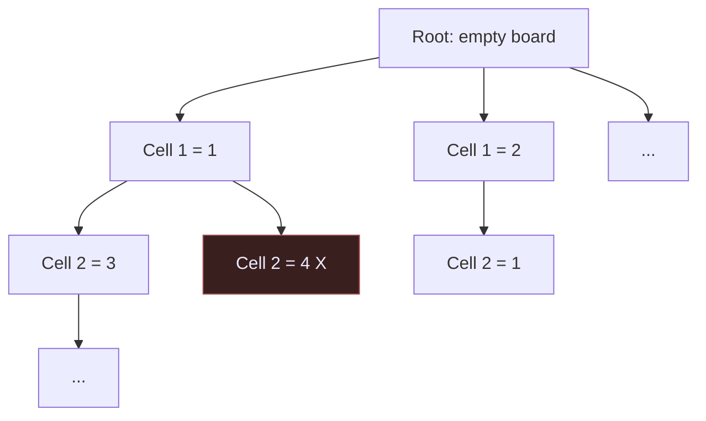
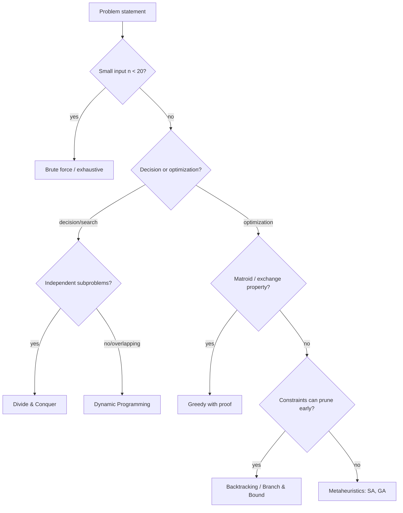

# Algorithms and problem-solving strategies

Polya gave us a meta-recipe (understand, plan, execute, look back). But when the planning phase asks "*which* plan?", a problem solver who knows only "try and see" is at a disadvantage. The history of computer science has crystallised a small number of **algorithmic strategies** — high-level templates for attacking problems — that every disciplined thinker should recognise on sight. They are to algorithms what proof techniques (induction, contradiction, contrapositive) are to mathematics: structural patterns that cut the space of possible solutions in half.

This section is a tour of seven strategies: brute force, divide-and-conquer, greedy, dynamic programming, backtracking, branch & bound, and the modern metaheuristics (simulated annealing, genetic algorithms). For each: when it works, when it fails, a clean pseudocode skeleton, a worked example, and a complexity tag. We close with a decision tree to help you pick the right hammer.

## 1. Brute force: the honest baseline

**Idea**: enumerate every candidate solution and test each one.

```text
function bruteForce(problem):
    for each candidate c in space(problem):
        if isValid(c) and isBetterThan(c, best):
            best := c
    return best
```

Trivially correct, almost always too slow. For the **Travelling Salesman** on $n$ cities, the candidate space has $(n-1)!/2$ tours — $n=20$ already gives $\approx 6\times 10^{16}$. Yet brute force is **the right answer** when (a) $n$ is small, (b) the problem is one-shot, (c) you need certainty. Never apologise for shipping a brute-force solution that runs in 50 ms.

**Complexity**: typically $O(b^n)$ or $O(n!)$. Use it as a *correctness oracle* against which you test smarter algorithms.

## 2. Divide-and-conquer: split, solve, combine

**Idea**: partition the input into smaller independent subproblems, solve them recursively, combine the answers.

```text
function DC(P):
    if size(P) <= base: return solveDirectly(P)
    split P into P_1, ..., P_k
    solutions := [DC(P_i) for i in 1..k]
    return combine(solutions)
```

The cost obeys a recurrence solvable by the **Master Theorem**:

$$T(n) = a\, T(n/b) + f(n)$$

### Worked example: mergesort

Split an array of $n$ elements into two halves, sort each recursively, merge in linear time:

$$T(n) = 2T(n/2) + \Theta(n) \;\;\Longrightarrow\;\; T(n) = \Theta(n \log n)$$

Other canonical examples: binary search ($\Theta(\log n)$), Strassen's matrix multiplication ($\Theta(n^{2.807})$), the Fast Fourier Transform (Cooley–Tukey, 1965), closest-pair-of-points in the plane ($\Theta(n \log n)$).

**When it works**: subproblems are independent (no shared state to coordinate) and the combine step is cheap relative to solving.

## 3. Greedy: locally optimal, globally hopeful

**Idea**: at each step, pick the choice that looks best *right now*, never reconsider.

```text
function greedy(P):
    S := empty
    while P not empty:
        x := pickBest(P)           # local criterion
        if feasible(S + x): S := S + x
        P := P - x
    return S
```

Greedy is **optimal only when the problem has a matroid / exchange structure**. Two classics:

### Interval scheduling

Given $n$ intervals $[s_i, f_i]$, select the maximum-cardinality subset of pairwise non-overlapping intervals. **Optimal greedy**: sort by *finish time*, always pick the interval that finishes earliest among those still compatible. Proof by exchange argument: any optimal solution can be transformed into the greedy one without losing intervals.

### Where greedy fails

The **0/1 knapsack** (sec. 4 below). Greedy by value-density picks items with the best value-per-weight ratio first; counterexample with items $\{(10,5), (8,4), (8,4)\}$ and capacity 9 shows greedy chooses $(10,5)$ then nothing fits, total 10, while $(8,4)+(8,4) = 16$ is optimal.

**Complexity**: usually $O(n \log n)$ from the sort.

## 4. Dynamic programming: remember subproblems

**Idea**: when subproblems **overlap** (the same one is reached via many paths), solve each once and cache it. Two equivalent stylings: **top-down memoisation** or **bottom-up tabulation**.

**Bellman's principle of optimality** (1957): an optimal solution to a problem contains optimal solutions to its subproblems.

### Worked example: 0/1 knapsack

Items $i=1..n$ with weight $w_i$, value $v_i$; knapsack capacity $W$. Let $K(i, c)$ be the best value using items $1..i$ with capacity $c$.

$$K(i, c) = \begin{cases} 0 & i = 0 \\ K(i-1, c) & w_i > c \\ \max\big(K(i-1, c),\; K(i-1, c-w_i) + v_i\big) & \text{otherwise} \end{cases}$$

```text
function knapsack(w, v, W):
    K := table[0..n][0..W]
    for i in 1..n:
        for c in 0..W:
            if w[i] > c: K[i][c] := K[i-1][c]
            else: K[i][c] := max(K[i-1][c], K[i-1][c-w[i]] + v[i])
    return K[n][W]
```

**Complexity**: $\Theta(nW)$ time, $\Theta(nW)$ space (compressible to $\Theta(W)$). Note: $W$ is the *value* of the capacity, not its bit-length, so 0/1 knapsack is **pseudo-polynomial**, not polynomial — knapsack is NP-hard.

### Worked example: longest common subsequence (LCS)

Given strings $X[1..m]$ and $Y[1..n]$, find the longest sequence that appears in both, in order, not necessarily contiguous.

$$L(i, j) = \begin{cases} 0 & i=0 \text{ or } j=0 \\ L(i-1, j-1) + 1 & X_i = Y_j \\ \max(L(i-1, j), L(i, j-1)) & \text{otherwise} \end{cases}$$

Time $\Theta(mn)$. LCS underlies `diff`, `git merge`, DNA-sequence alignment.

## 5. Backtracking: search with undo

**Idea**: build a candidate incrementally; as soon as the partial candidate cannot possibly extend to a valid solution, **prune** that branch and undo the last step.

```text
function backtrack(partial):
    if isComplete(partial): output(partial); return
    for each extension x of partial:
        if isPromising(partial + x):
            backtrack(partial + x)
        # implicit undo when x falls out of scope
```

### Worked example: N-queens

Place $N$ queens on an $N\times N$ board so no two attack each other. Place row by row; after row $r$, prune if columns or diagonals clash. For $N=8$ the search tree has $\approx 2{,}057$ nodes vs $8^8 = 16{,}777{,}216$ brute-force.

### Worked example: Sudoku

For each empty cell, try digits 1–9; prune if the digit violates row/column/box constraints. Order cells by **minimum-remaining-values** heuristic to prune more aggressively.



**Complexity**: worst case exponential, but pruning often makes it practical.

## 6. Branch & bound: optimisation with proofs of pruning

**Idea**: like backtracking, but for **optimisation** problems. At each node, compute a cheap **bound** (lower bound for minimisation, upper bound for maximisation) on the best solution reachable from that node. If the bound is worse than the best solution found so far, prune.

```text
function BnB(node, best):
    if isLeaf(node):
        if value(node) < best: best := value(node)
        return best
    if bound(node) >= best: return best   # prune
    for child c of node:
        best := BnB(c, best)
    return best
```

**Canonical applications**: integer programming, TSP (with LP-relaxation as bound), branch-and-cut in CPLEX/Gurobi. The quality of your bound dictates the speedup: a tight bound prunes 99% of the tree.

## 7. Metaheuristics: when optimality is too expensive

For NP-hard problems on huge instances (TSP with 10,000 cities, scheduling 200 jobs on 30 machines) we abandon optimality and aim for **good-enough** solutions.

### Simulated annealing (Kirkpatrick, Gelatt, Vecchi, 1983)

Inspired by metallurgy. Start with a random solution $s$. At each step, propose a neighbour $s'$. Accept it with probability

$$P(\text{accept}) = \begin{cases} 1 & \Delta E \leq 0 \\ \exp(-\Delta E / T) & \Delta E > 0 \end{cases}$$

where $\Delta E = \text{cost}(s') - \text{cost}(s)$ and $T$ (temperature) decreases over time. Accepting *worse* moves early on lets you escape local minima.

### Genetic algorithms (Holland, 1975)

Maintain a population of solutions. Each iteration: select parents by fitness, **crossover** to produce children, **mutate** with low probability, replace least-fit individuals. Solutions encode as bitstrings or permutations.

These methods give no optimality guarantee. They are tools of last resort — but often the only tools left.

## 8. Choosing a strategy: a decision tree



This tree maps onto Polya's "make a plan" step: it transforms the open-ended question *"how should I solve this?"* into a series of structural diagnostic checks.

## 9. Big-O cheat sheet

| Strategy             | Typical complexity              | Optimality |
|----------------------|---------------------------------|------------|
| Brute force          | $O(b^n)$, $O(n!)$               | Yes        |
| Divide-and-conquer   | Master theorem; often $\Theta(n \log n)$ | Yes |
| Greedy               | $O(n \log n)$                   | Only with matroid |
| Dynamic programming  | Polynomial or pseudo-polynomial | Yes        |
| Backtracking         | Worst-case exponential, pruning helps | Yes |
| Branch & bound       | Exponential with bound-driven cuts | Yes |
| Metaheuristics       | Tunable                         | No guarantee |

## 10. Exercises

<details>
  <summary>Exercise 1 — Solve the 0/1 knapsack with weights $w=[2,3,4,5]$, values $v=[3,4,5,6]$, capacity $W=5$.</summary>

Build the table $K[i][c]$ for $i=0..4$, $c=0..5$.

| i\c | 0 | 1 | 2 | 3 | 4 | 5 |
|-----|---|---|---|---|---|---|
| 0   | 0 | 0 | 0 | 0 | 0 | 0 |
| 1   | 0 | 0 | 3 | 3 | 3 | 3 |
| 2   | 0 | 0 | 3 | 4 | 4 | 7 |
| 3   | 0 | 0 | 3 | 4 | 5 | 7 |
| 4   | 0 | 0 | 3 | 4 | 5 | 7 |

Optimum: $K[4][5] = 7$ (take items 1 and 2 with weights $2+3=5$, values $3+4=7$).
</details>

<details>
  <summary>Exercise 2 — Why does greedy by value-density fail on knapsack but succeed on the *fractional* knapsack?</summary>

In **fractional** knapsack you may take a fraction of any item, so once an item runs out you simply move to the next. The exchange argument works: replacing any item by an equal weight of a higher-density item never hurts. In 0/1 you cannot split, so the indivisibility creates situations where the "best ratio" item blocks a strictly better combination.
</details>

## Summary

- Polya tells you *to* plan; algorithmic strategies tell you *how* — they are the proof-techniques of computation.
- **Divide-and-conquer** wins when subproblems are independent; **dynamic programming** when they overlap.
- **Greedy** is fast and tempting but optimal only with matroid structure — always prove it or refute it with a counterexample.
- **Backtracking** and **branch & bound** are exhaustive search with intelligent pruning; the second adds optimisation bounds.
- **Metaheuristics** sacrifice the optimality guarantee for tractability on hard, large problems.
- Always benchmark a smart algorithm against the brute-force oracle on small inputs.

## Further reading

- Cormen, Leiserson, Rivest, Stein — *Introduction to Algorithms* (CLRS), 4th ed., MIT Press (2022).
- Kleinberg, Tardos — *Algorithm Design*, Pearson (2005).
- Bellman, R. — *Dynamic Programming*, Princeton (1957).
- Kirkpatrick, Gelatt, Vecchi — "Optimization by Simulated Annealing", *Science* 220 (1983).
- Holland, J. H. — *Adaptation in Natural and Artificial Systems*, MIT Press (1975).
- Cross-links: [Polya and problem solving](25-polya-problem-solving.html), [Problem-solving heuristics](26-problem-solving-heuristics.html), [Computational thinking](27-computational-thinking.html).
