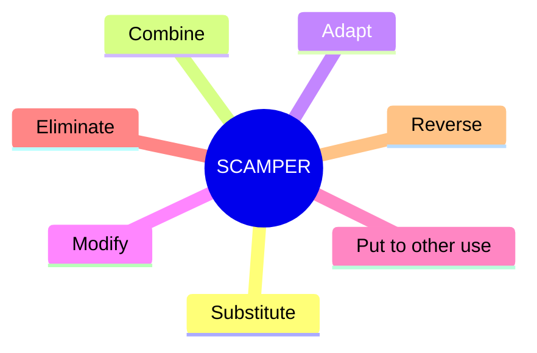
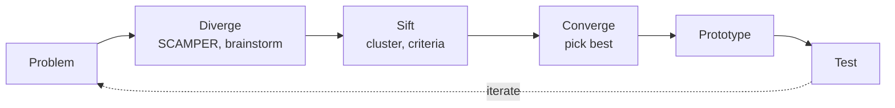

# Creative thinking: lateral thinking, TRIZ, SCAMPER

Creativity is not all-or-nothing. Several structured frameworks help generate novel solutions when "just think harder" doesn't work.

## 1. Lateral thinking (Edward de Bono, 1967)

Vertical thinking moves logically forward. Lateral thinking moves *sideways* — across categories, off-track, towards unexpected angles.

### Six Thinking Hats

A meeting tool. Each "hat" is a mode:

- **White**: facts, data.
- **Red**: emotions, gut.
- **Black**: criticism, risks.
- **Yellow**: optimism, benefits.
- **Green**: creative alternatives.
- **Blue**: process meta-management.

Force the group to wear *one hat at a time*. Avoids the standard chaos where some criticize while others propose. Each mode gets its dedicated air.

## 2. SCAMPER

A checklist for transforming an existing thing into something new.

| Letter | Prompt | Example (chair) |
|---|---|---|
| **S**ubstitute | replace a part/material | wood → bamboo |
| **C**ombine | merge with another | chair + lamp |
| **A**dapt | adjust for a new use | folding for camping |
| **M**odify | scale/shape change | reclining feature |
| **P**ut to other use | new context | as gym equipment |
| **E**liminate | remove something | armrest-less |
| **R**everse | flip orientation | tabletop chair |

## 3. TRIZ (Genrich Altshuller, USSR 1946-)

A theory of inventive problem solving derived from analyzing 200,000 patents. Core finding: most inventions resolve a **contradiction** (e.g. lightweight AND strong) using one of 40 inventive principles.

### 40 inventive principles (selected)

1. Segmentation — break into parts.
2. Taking out — separate the problematic part.
3. Local quality — non-uniform structure.
4. Asymmetry — break symmetry.
5. Merging — combine identical or similar.
6. Universality — one object does several functions.
... up to 40.

### Contradiction matrix

A 39×39 table: which principles historically solve which contradictions. Speed vs accuracy? Look up the cell.

Industrial use in Samsung, Boeing, P&G. Less popular in startups (perceived bureaucratic) but underrated.

## 4. Brainstorming (Osborn 1953) and variants

### Classical brainstorming

- Quantity over quality (first pass).
- No criticism (delay judgment).
- Wild ideas welcome.
- Build on others' ideas.

Famous critique: actual experiments show solo idea-generation often produces more and better ideas than group brainstorming (Diehl-Stroebe 1987). Group brainstorming suffers from *production blocking* (waiting your turn) and *evaluation apprehension*.

### Brainwriting / 6-3-5

6 people, 3 ideas each, every 5 minutes pass paper. 30 minutes → 108 ideas. Removes production blocking.

### Crazy 8s

8 ideas in 8 minutes, solo. Forces past first-three obvious answers.

## 5. Mind mapping

Tony Buzan: write a central idea, branch radially with associations. Visual structure that mimics associative memory. Tools: MindMup, Miro, Coggle, paper.

Good for: exploration, brainstorming, lecture notes, planning.
Bad for: rigorous argumentation (use [Toulmin](38-argumentation-toulmin.html) instead).

## 6. Bisociation (Koestler, 1964)

In *The Act of Creation*, Arthur Koestler argues: creativity emerges from linking two unrelated mental frames. The joke ("she's all chest and no brain") and the insight ("the atom is like a solar system") share this bisociative structure.

Implication: deliberately expose yourself to varied domains. Cross-pollination is the source of novelty.

## 7. Workflow

Classical "double diamond" of design thinking — see [sec. 30](30-design-thinking.html).

## 8. Example: redesign the email inbox

- SCAMPER:
  - Substitute: replace folders with tags.
  - Combine: integrate with calendar.
  - Adapt: voice-only interface.
  - Modify: triage by urgency, not date.
  - Eliminate: remove "reply all" by default.
  - Reverse: AI drafts; you approve, don't compose.

Six ideas in 3 minutes. Some bad, some explorable.

## Exercises

  
Use SCAMPER on a coffee shop.

- Substitute: coffee → tea, dairy → oat.
- Combine: + coworking space.
- Adapt: drive-through.
- Modify: subscription model.
- Put to other use: evenings as wine bar.
- Eliminate: no seating (pure takeaway).
- Reverse: customer brews their own.

→ multiple business model variants in minutes.

## Summary

- Lateral thinking (de Bono): move sideways, six hats for group modes.
- SCAMPER: 7-prompt checklist for transforming an existing thing.
- TRIZ: 40 inventive principles + contradiction matrix.
- Brainstorming variants: brainwriting > classical for productivity.
- Mind mapping for exploration; bisociation for cross-domain insight.

## Further reading

- de Bono, *Lateral Thinking* (1967), *Six Thinking Hats* (1985).
- Altshuller, *The Innovation Algorithm* (1969).
- Koestler, *The Act of Creation* (1964).
- Sutton, *Weird Ideas That Work* (2002).
