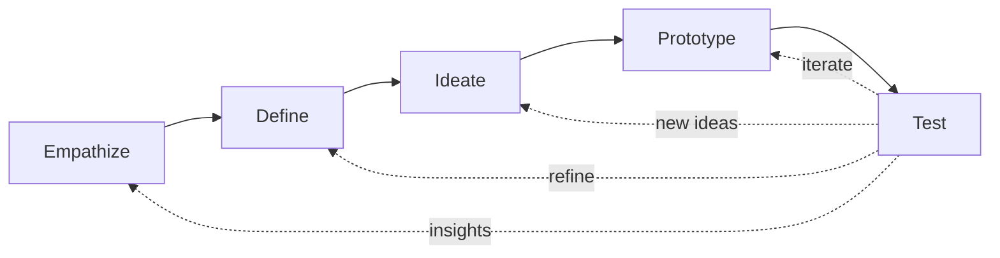

# Design thinking

Design thinking emerged from Stanford's d.school and the design firm IDEO (David Kelley, Tim Brown). A repeatable methodology for problems where the user's needs and the solution are both unclear at the outset.

## 1. The five phases

### 1.1 Empathize

Understand the user. Tools:

- **Interviews**: open-ended, listen for needs not solutions.
- **Observation**: shadow the user in context.
- **Persona**: archetype with name, goals, frustrations.
- **Journey map**: step-by-step user experience with emotions at each step.

The skill: ask *why* repeatedly (5 Whys variant). Avoid leading questions.

### 1.2 Define

Crystallize the problem. Avoid solution-first phrasing.

**Point of View statement**: "[user] needs [need] because [insight]". Example: "A new diabetes patient needs simple meal-planning because they're overwhelmed by carbs counting."

**"How might we…"**: reframe the need as a question. "How might we make carb counting effortless?"

### 1.3 Ideate

Generate many options. Tools from [creative thinking](29-creative-thinking.html): brainstorming, brainwriting, SCAMPER, Crazy 8s.

Quantity first, judgment later. Wild ideas. Cluster after.

### 1.4 Prototype

Build low-fidelity quickly. Paper sketches, cardboard, Wizard-of-Oz (manual back-end pretending to be system). Goal: cheap to throw away.

Resist the temptation to polish. Polishing too early commits to ideas before testing them.

### 1.5 Test

Show prototype to users. Observe more than ask. Their stumbles reveal more than their words.

Document: what works, what fails, what surprises. Feed back into earlier phases.

## 2. Double Diamond (Design Council, 2005)

A meta-shape: alternating divergence (open up) and convergence (narrow down).

- **Diamond 1**: empathize/define — discover the right problem.
- **Diamond 2**: ideate/prototype/test — discover the right solution.

Each diamond opens, then closes.

## 3. Applied example: redesign the ER intake experience

**Empathize**: shadow patients arriving at the ER. Interview nurses. Observe: confusion at registration, long waits without information, emotional distress.

**Define**: "Patients in waiting rooms need real-time information about their position because uncertainty amplifies anxiety."

**Ideate**: status screen like in pizza shops, SMS notifications, simplified registration via QR, mobile triage, calming environment.

**Prototype**: paper mock of mobile screen + dummy SMS to volunteer patients during simulated waits.

**Test**: anxiety self-report. Compare with and without prototype.

If anxiety drops with status screens, refine. If not, return to Empathize: maybe the real driver wasn't uncertainty but something else.

## 4. Critiques

The methodology has been criticized — sometimes harshly:

- **"Design thinking is BS"** (Lee Vinsel, 2017): in many cases it's marketing for consultants more than real innovation; pretends to scale empathy as commodity.
- **Sticky-note theatre**: post-its on walls without rigor or quantitative follow-through.
- **Innovation theatre**: organizations adopt design thinking as a "ritual" without changing decision-making.
- **Empathy is hard**: a 30-minute interview rarely captures genuine user needs.

The valid critiques don't destroy the framework — they warn against shallow application.

## 5. When design thinking shines vs fails

**Shines**:
- New product for unfamiliar user group.
- Service redesign with painful UX.
- Problems where the *real* need isn't clear.

**Fails**:
- Pure technical optimization (use engineering).
- Wicked problems with deep value conflicts (see [sec. 48](48-wicked-problems.html)).
- Problems where the user actually does know the solution and just needs delivery.

## 6. Tools per phase

| Phase | Tools |
|---|---|
| Empathize | interviews, shadowing, persona, journey map |
| Define | POV statement, How Might We, 5 Whys |
| Ideate | SCAMPER, Crazy 8s, brainwriting, mind mapping |
| Prototype | paper, Figma, Wizard-of-Oz |
| Test | usability test, A/B, think-aloud |

## Exercises

  
Apply design thinking briefly to "redesign the bank-branch experience for elderly customers".

**Empathize**: observe elderly clients struggling with digital screens; interview re: emotional discomfort.

**Define**: "Elderly clients need a low-tech, conversational interaction with the bank because digital interfaces produce anxiety and self-doubt."

**Ideate**: greeter at door, dedicated slow-line, voice-only ATMs, paper acknowledgments, peer mentors.

**Prototype**: train a greeter for 1 week at one branch.

**Test**: customer satisfaction + transaction completion rates + emotional state.

## Summary

- 5 phases: empathize, define, ideate, prototype, test. Iterative.
- Double diamond = divergent + convergent twice (problem + solution).
- Tools per phase: persona, How Might We, brainwriting, paper proto, usability test.
- Critiques: "innovation theatre" risk if applied shallowly.
- Best fit: human-centered problems with unclear user needs.

## Further reading

- Tim Brown, *Change by Design* (2009).
- Tom Kelley, *The Art of Innovation* (2001).
- d.school Stanford: free toolkits.
- Vinsel, *Design Thinking Is Kind of Like Syphilis* (2017) — the critique.
