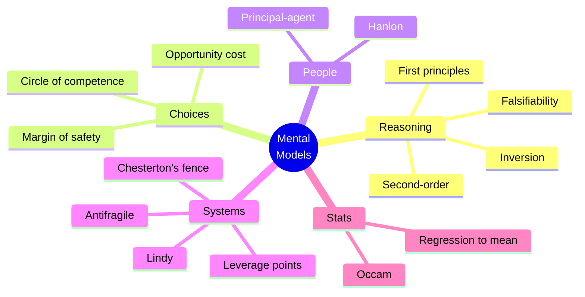

# Mental models

Charlie Munger popularized the idea of a **latticework of mental models**: cross-disciplinary concepts that, applied together, sharpen judgment. The catalog below is curated — many lists swell to 100+ but most are noise. Here are the load-bearing ones.

## 1. First principles thinking

Strip a problem to its most fundamental, irreducible truths and reason up from there. Inverse of arguing by analogy or convention.

Example: "Rocket cost = standard rocket cost" is by-analogy. First-principles: cost = sum of raw materials + energy + labor. SpaceX reasoned this way to push cost orders of magnitude lower.

## 2. Second-order thinking

Don't stop at "what happens?". Ask "...and then what?".

Example: introduce a financial subsidy → first-order: people benefit. Second-order: prices rise, eroding the subsidy. Third-order: incumbents lobby to keep the subsidy after the originally targeted need ends.

Most policy failures are first-order victories ignoring later effects.

## 3. Inversion (Jacobi)

Solve a problem by considering its opposite. Instead of "how to be happy?", ask "how to be miserable?" and avoid those behaviors. Munger uses this constantly.

Practical: "If I wanted to destroy this startup, what would I do?" → checklist of failure modes to avoid.

## 4. Opportunity cost

Every choice forecloses alternatives. The true cost of A is the value of the best non-chosen alternative.

Trap: ignoring opportunity cost gives "free" decisions a false low price. The decision to keep doing X has the opportunity cost of not doing Y.

## 5. Margin of safety

When estimates are uncertain, plan for being wrong. Buy a stock at 60% of intrinsic value (not 95%). Build a bridge to bear 4× its rated load.

Engineering and finance both depend on margins. Real-world systems must absorb shocks that the model doesn't predict.

## 6. Circle of competence

Know what you know — and just as importantly, what you don't. Munger: "Stay within the circle. Knowing the edge is more important than the area."

Mass mistakes: investing in industries you don't understand because they look hot.

## 7. Hanlon's razor

"Never attribute to malice what can be adequately explained by stupidity." Or incompetence, busyness, or ignorance.

Saves emotional energy. The boss who didn't reply probably isn't snubbing you.

## 8. Occam's razor

Among competing hypotheses, prefer the one with fewer assumptions. Not "always pick simplest" — pick the simplest *that fits the data*.

## 9. Chesterton's fence

Don't tear down a fence without knowing why it was put up. Existing rules, even bad-looking ones, often solve problems you haven't noticed.

Applied: before deleting "legacy code", understand why it's there. Often there's an edge case you didn't think of.

## 10. Antifragility (Taleb)

Beyond robust. Some systems *gain* from disorder. Glass is fragile, steel is robust, biology is antifragile (a body that doesn't see germs weakens).

Design choices for antifragility: optionality, redundancy, decentralization, skin in the game.

## 11. Lindy effect

The expected remaining life of non-perishable things is proportional to their age. A book that's been read for 2000 years will likely be read for another 2000. A trendy app probably won't.

Heuristic for filtering: prefer old ideas/books/institutions. They've survived selection.

## 12. Leverage points (Meadows)

Where small inputs produce big system changes. See [systems thinking](47-systems-thinking.html). Meadows lists 12, from weakest (numerical parameters) to strongest (paradigms).

## 13. Principal-agent problem

When an agent acts on behalf of a principal, incentives can diverge. CEO and shareholders. Doctor and patient. Solutions: aligned incentives, monitoring, skin in the game.

## 14. Falsifiability

A claim worth attention must be testable against possible disconfirmation. See [Popper](43-scientific-method-popper.html).

## 15. Regression to the mean

Extreme observations tend to be followed by less extreme ones. The brilliant student's next test is probably lower; the disastrous quarter is probably followed by better.

Common error: attributing the regression to a "fix" or "punishment". Galton 1886.

## Diagram

## When models become fads

A useful model becomes a fad when applied indiscriminately. "First principles!" doesn't mean reject all expertise. Knowing *when not to apply* a model is itself a meta-model — wisdom is the catalog and the discrimination.

## Exercises

  
Apply inversion to "increase team productivity".

"How could I destroy team productivity?" Constant interruptions, unclear goals, micromanagement, no recognition, mandatory meetings without agenda, blame culture. Now: avoid all those.

## Summary

- Latticework: combine cross-disciplinary models for sharper judgment.
- Core: first principles, second-order, inversion, opportunity cost, margin of safety, circle of competence.
- People: Hanlon, principal-agent.
- Systems: Chesterton's fence, antifragility, leverage points.
- Stats: Occam, regression to mean.
- Know when *not* to apply a model.

## Further reading

- Munger, *Poor Charlie's Almanack* (2005).
- Farnam Street, fs.blog — catalog and essays.
- Taleb, *Antifragile* (2012).
