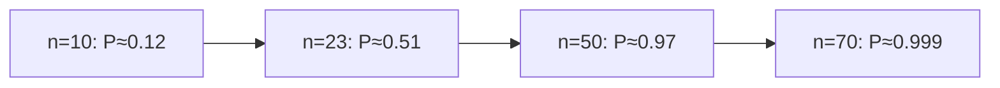

# Probability: foundations for reasoning

Probability extends logic to reasoning under uncertainty (Cox 1946, Jaynes 2003). Thinking probabilistically is the difference between "might happen" and quantifying *how much*.

## 1. Kolmogorov axioms (1933)

Sample space $\Omega$ = all outcomes. Event $A \subseteq \Omega$. Probability $P$ assigns to events in $[0,1]$ such that:

1. **Non-negativity**: $P(A) \ge 0$.
2. **Normalization**: $P(\Omega) = 1$.
3. **σ-additivity**: for disjoint $A_1, A_2, \ldots$, $P(\bigcup A_i) = \sum P(A_i)$.

Derived: $P(\emptyset) = 0$, $P(A^c) = 1 - P(A)$, $P(A \cup B) = P(A) + P(B) - P(A \cap B)$.

## 2. Four interpretations

Same formulas, different meanings.

**Classical (Laplace)**: ratio favorable/possible *when equiprobable*. Good for dice, cards. Circular in real cases.

**Frequentist**: limit of relative frequency over independent repetitions. Doesn't apply to single non-repeatable events.

**Subjective / Bayesian** (de Finetti, Ramsey, Savage): coherent degree of belief. $P=0.3$ means "I'd be indifferent between a bet paying 1 if event occurs and a sure 0.3". Operational via Dutch book argument.

**Propensity** (Popper): physical tendency of a system.

Modern science and AI use Bayesian — applies to singular events, supports updating (see [Bayes](33-bayes-theorem.html)).

## 3. Conditional probability

$$P(A \mid B) = \frac{P(A \cap B)}{P(B)} \quad \text{if } P(B) > 0$$

"Probability of $A$ given $B$ occurred". Restricts the sample space to $B$.

### Product rule

$$P(A \cap B) = P(B) P(A|B) = P(A) P(B|A)$$

### Total probability

If $B_1, \ldots, B_n$ partition $\Omega$:

$$P(A) = \sum_i P(A|B_i) P(B_i)$$

## 4. Independence

$A$ and $B$ are independent if $P(A \cap B) = P(A) P(B)$, equivalently $P(A|B) = P(A)$.

**Beware**: independence ≠ mutual exclusion. Mutually exclusive events are at maximal *dependence*.

**Conditional independence**: $A$ and $B$ may be correlated marginally but independent given $C$: $P(A \cap B | C) = P(A|C) P(B|C)$. See [causality](45-causality-pearl.html) — a confounder explains away the correlation.

## 5. Random variable, distribution

A **random variable** $X: \Omega \to \mathbb{R}$. Discrete: $p(x) = P(X = x)$. Continuous: density $f(x)$ with $P(a \le X \le b) = \int_a^b f$.

Canonical distributions: Bernoulli, binomial, Poisson, geometric (discrete); uniform, normal, exponential, beta (continuous).

## 6. Expectation and variance

$$\mathbb{E}[X] = \sum_x x \cdot p(x) \text{ or } \int x f(x)dx$$

Dice: $(1+2+\ldots+6)/6 = 3.5$.

$$\text{Var}(X) = \mathbb{E}[X^2] - (\mathbb{E}[X])^2$$

$\sigma = \sqrt{\text{Var}}$ has same units as $X$.

**Linearity of expectation**: $\mathbb{E}[aX + bY] = a\mathbb{E}[X] + b\mathbb{E}[Y]$ always — even without independence. Variance is NOT linear in general.

## 7. Birthday paradox

In a room of $n$ people, probability that two share a birthday:

$$P = 1 - \frac{365 \cdot 364 \cdots (365-n+1)}{365^n}$$

$n=23$: > 0.5. $n=50$: ~0.97. Counterintuitively low threshold.

## 8. Correlation ≠ causation

Pearson correlation:

$$\rho_{X,Y} = \frac{\text{Cov}(X,Y)}{\sigma_X \sigma_Y} \in [-1, 1]$$

Two variables can correlate without one causing the other. Ice cream sales & drownings (summer is the cause of both). Cf [Pearl](45-causality-pearl.html).

## Exercises

  
Flip a fair coin 3 times. P(at least one head)?

$1 - (1/2)^3 = 7/8$.

  
Draw 2 cards (no replace). P(both aces)?

$(4/52)(3/51) = 1/221$.

  
$X$ heads in 4 fair flips. $\mathbb{E}[X], \text{Var}(X)$?

Binomial$(4, 0.5)$. $\mathbb{E} = 2$, $\text{Var} = 1$.

## Summary

- Three axioms (Kolmogorov).
- Four interpretations: classical, frequentist, Bayesian, propensity.
- Conditional probability and total probability.
- Independence ≠ mutual exclusion. Conditional independence matters for causality.
- RV, distribution, expectation, variance.
- Correlation ≠ causation.

## Further reading

- Kolmogorov, *Foundations of the Theory of Probability* (1933).
- Jaynes, *Probability Theory: The Logic of Science* (2003).
- Ross, *A First Course in Probability*.
