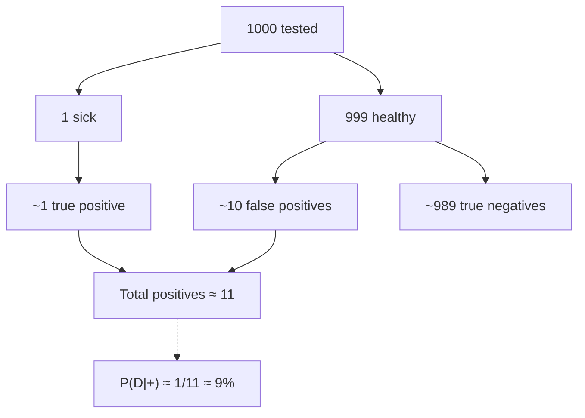

# Bayes' theorem and updating beliefs

Thomas Bayes (1701-1761) proposed a formula for updating belief in light of new evidence. The theorem is mathematically simple but disproportionately important: it powers modern statistics, spam filters, voice recognition, medical diagnostics, and — as a mental habit — quantitative reasoning under uncertainty (cf Tetlock, *Superforecasting*).

## 1. Derivation

From conditional probability:

$$P(A|B) = \frac{P(A \cap B)}{P(B)}, \quad P(B|A) = \frac{P(B \cap A)}{P(A)}$$

Equating $P(A \cap B)$:

$$\boxed{P(A|B) = \frac{P(B|A) \cdot P(A)}{P(B)}}$$

Bayesian terminology:

- $P(A)$ = **prior**.
- $P(B|A)$ = **likelihood**.
- $P(B)$ = **evidence** (normalizer).
- $P(A|B)$ = **posterior**.

## 2. Full form

If $A_1, \ldots, A_n$ are alternative exhaustive hypotheses:

$$P(A_i|B) = \frac{P(B|A_i) P(A_i)}{\sum_j P(B|A_j) P(A_j)}$$

Posterior ∝ likelihood × prior, normalized.

## 3. Canonical example: medical test

**Setup**: rare disease, prevalence **1 in 1000**. Test:
- Sensitivity = $P(+|D) = 0.99$.
- Specificity = $P(-|\bar D) = 0.99$, so $P(+|\bar D) = 0.01$ (false positives).

You test positive. What's the probability you're actually sick?

S1 says ~99%. Wrong.

$P(D|+) = P(+|D) P(D) / P(+)$.

$P(D) = 0.001$.
$P(+) = 0.99 \cdot 0.001 + 0.01 \cdot 0.999 = 0.00099 + 0.00999 = 0.01098$.

$$P(D|+) = \frac{0.99 \cdot 0.001}{0.01098} \approx 0.090 = 9\%$$

**Only 9%**. Intuition fails because it ignores the base rate (1/1000). Of 1000 people tested, expect 1 true positive and ~10 false positives — only 1 of ~11 positives is actually sick.

### Lesson

Base rate fallacy is one of the most common diagnostic errors. For rare diseases, even excellent tests produce many false positives.

## 4. Odds form

$O(A) = P(A) / P(\bar A)$.

$$\frac{P(A|B)}{P(\bar A|B)} = \frac{P(B|A)}{P(B|\bar A)} \cdot \frac{P(A)}{P(\bar A)}$$

**Posterior odds = likelihood ratio × prior odds**.

Test example: prior odds 1/999. LR = 0.99/0.01 = 99. Posterior odds = 99/999 ≈ 0.099. P ≈ 0.099/(1+0.099) ≈ 9%. ✓

Particularly handy for **sequential updating** with multiple independent evidence — just multiply likelihood ratios.

## 5. Sequential updating

Two independent positives:

After first: P ≈ 9%. New prior odds ≈ 0.099. Same LR = 99. New posterior odds ≈ 9.8. New P ≈ 91%. **Two positives push from 9% to 91%**. That's why re-testing matters.

## 6. Bayes for continuous parameters

$$p(\theta | D) = \frac{p(D|\theta) p(\theta)}{p(D)}$$

You update an entire distribution, not a single probability. Bayesian statistics; computationally enabled by MCMC, Stan, PyMC.

## 7. Naive Bayes

Classification under feature-independence assumption (rarely true, often good enough). Spam filter: $C \in \{\text{spam}, \text{ham}\}$, $x_i$ = word presence. Surprisingly effective.

## 8. Bayes vs frequentist

|  | Bayesian | Frequentist |
|---|---|---|
| Probability? | belief degree | frequency limit |
| Parameters? | distribution | fixed unknown |
| Inference? | posterior + credible interval | p-value, confidence interval |
| Updating? | natural, sequential | requires repeated experiments |

## 9. Bayes as habit

Tetlock and others show: top forecasters update beliefs **Bayesian-like** — don't drop hypothesis at first counter-evidence, don't cling stubbornly to first confirmation. Probabilities move in small steps proportional to evidence strength.

## Exercises

  
City has 30% green taxis, 70% blue. Witness identifies a taxi as green; 80% color accuracy. P(actually green)?

$P(G) = 0.3$, $P(B) = 0.7$, $P(\text{say G}|G) = 0.8$, $P(\text{say G}|B) = 0.2$.

$P(\text{say G}) = 0.8 \cdot 0.3 + 0.2 \cdot 0.7 = 0.38$.

$P(G | \text{say G}) = 0.24/0.38 ≈ 63\%$.

Not 80%! Base rate (more blue taxis) compensates. Kahneman-Tversky "Cab problem".

  
Three coins: 2 fair, 1 biased (90% heads). Pick one randomly, flip once: heads. P(biased)?

Prior $P(B) = 1/3$. $P(\text{H}|B) = 0.9, P(\text{H}|\bar B) = 0.5$.

$P(\text{H}) = 0.3 + 0.333 = 0.633$.

$P(B|\text{H}) = 0.3/0.633 ≈ 47\%$.

From 33% to 47% with one heads. Five heads in a row would push to >95%.

## Summary

- $P(A|B) = P(B|A) P(A)/P(B)$.
- Posterior ∝ likelihood × prior.
- Odds form: posterior odds = LR × prior odds.
- Base rate is crucial — ignoring it drastically over-confidence.
- Sequential updating: multiply LRs.
- Naive Bayes, Bayesian statistics, MCMC.
- As mental habit: calibrated updating in proportion to evidence.

## Further reading

- Bayes, *Essay towards solving a Problem in the Doctrine of Chances* (1763 posth).
- Jaynes, *Probability Theory: The Logic of Science* (2003).
- McElreath, *Statistical Rethinking* (2020).
- Silver, *The Signal and the Noise* (2012).
