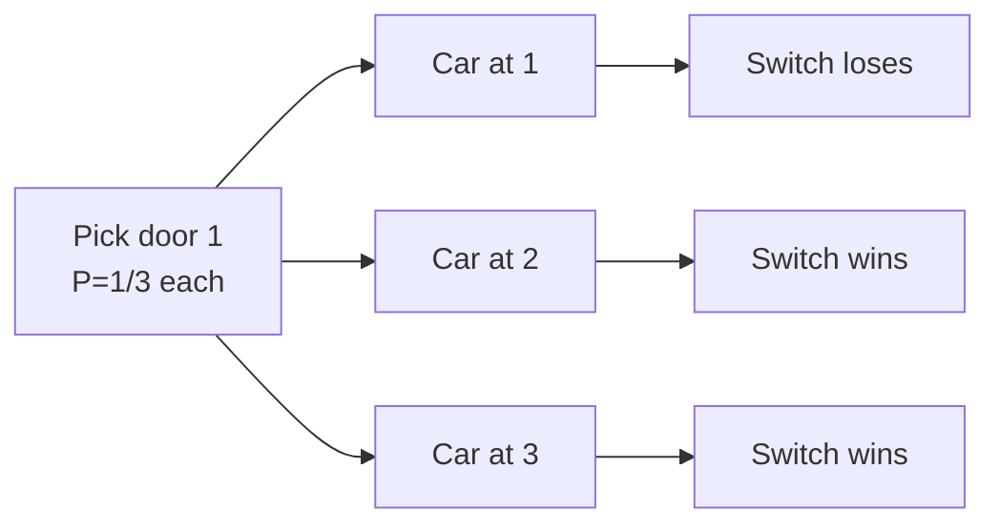

# Probability paradoxes

These "paradoxes" aren't contradictions — they're cases where System 1 reasoning fails systematically.

## 1. Monty Hall

3 doors: 1 car, 2 goats. You pick (say door 1). Monty (who knows) opens *another* door (say 3) revealing a goat. Should you switch?

**Wrong intuition**: 2 doors left, 50-50.

**Correct**: switch! P(win by switching) = 2/3.

### Bayesian tree

Initially $P = 1/3$ for each door.

- Car behind 1: Monty opens 2 or 3 randomly. Switch → lose.
- Car behind 2: Monty must open 3. Switch → win.
- Car behind 3: Monty must open 2. Switch → win.

Switch wins in 2/3 cases.

### Lesson

Monty has info you don't. His choice isn't neutral — it's conditional on car location. Ignoring this conditional correlation produces the error.

## 2. Base rate fallacy

Already seen in [Bayes](33-bayes-theorem.html). 99%-accurate test on 1‰ disease → only ~9% probability of sickness given positive. Without base rate, "strong" evidence is weak.

## 3. Birthday paradox

23 people in a room → P(some pair shares a birthday) > 0.5 (precisely 0.507).

Wrong intuition: 23/365 ≈ 6%.

Correct: $\binom{23}{2} = 253$ pairs to check.

$P(\text{none}) = \prod_{k=0}^{22} (365-k)/365 \approx 0.493$.

Grows quadratically. Confusion: P(someone matches YOU) is linear; P(any pair matches) is quadratic.

## 4. Two children paradox

> A family has two children. At least one is a boy. P(both are boys)?

Sample space: $\{BB, BG, GB, GG\}$. Given $\bar{GG}$, 1 of 3 is BB.

**Answer**: 1/3, NOT 1/2.

Wrong intuition: "the other is 50-50". But "at least one is boy" is asymmetric info — includes "first is boy" or "second is boy".

### Variant

If instead you know "the first is a boy" (specific), the probability is 1/2. Difference: conditioning on existential ($\exists$) vs specific individual.

## 5. Simpson's paradox

A trend in subgroups disappears or reverses in aggregate.

### UC Berkeley 1973

Admission rates: men 44%, women 35%. Discrimination?

But department by department: women admitted at rates *equal or higher*. The trick: women applied more to selective departments (e.g. medicine), men to less selective (e.g. engineering), skewing the aggregate.

| Dept | F appl | F adm | M appl | M adm |
|---|---|---|---|---|
| A (easy) | 100 | 80 (80%) | 800 | 600 (75%) |
| B (hard) | 900 | 90 (10%) | 200 | 16 (8%) |
| Total | 1000 | 170 (17%) | 1000 | 616 (61.6%) |

Per-department women had higher rates; aggregate favored men due to selection.

### Lesson

Aggregation can reverse conclusions. **Always disaggregate** when a confounder might exist. See [causality](45-causality-pearl.html).

## 6. St Petersburg paradox

Game: flip coin until heads. If heads on $k$th, win $2^k$ €. How much would you pay to play?

$$\mathbb{E}[\text{winnings}] = \sum_{k=1}^\infty \frac{1}{2^k} \cdot 2^k = \infty$$

Nobody pays €100. Daniel Bernoulli (1738): **diminishing marginal utility**. With $u(x) = \log x$, EU is finite. Foundation of [decision theory](35-decision-theory.html).

## 7. Two-envelope paradox

I know one envelope has $x$, other $2x$. You open one with €100. Switch or keep?

Bad argument: "the other is 50/200 equally likely. EV of switch = 125 > 100. Always switch."

Same logic after switching → always switch again. Paradox.

**Resolution**: the bad argument assumes a prior distribution on $x$ which doesn't exist (uniform on all reals). With a proper prior, the paradox dissolves.

## 8. Sleeping Beauty

She's drugged. Coin flipped. Heads → wake her once Mon. Tails → twice Mon, Tue (no memory between). On waking she's asked "P(coin was heads)?".

**Halfer**: 1/2 (no new evidence, coin is just a coin).

**Thirder**: 1/3 (over many runs, 1/3 of wakings are heads-scenarios).

Open philosophical dispute. Shows "subjective probability of an observed event" depends on observation process. Related to **anthropic reasoning** in cosmology.

## Exercises

  
Monty Hall with 10 doors: pick one, Monty opens 8 goats. Switch?

P(car behind initial pick) = 1/10. P(car behind remaining unopened) = 9/10. **Switch wins with P = 9/10**.

  
School: 60% boys, 40% girls. Math-good 80% of boys, 90% of girls. Total math-good = 84%. Verify.

$0.6 \cdot 0.8 + 0.4 \cdot 0.9 = 0.48 + 0.36 = 0.84$ ✓

## Summary

- **Monty Hall**: switch (2/3 vs 1/3).
- **Base rate**: without prior, evidence misleads.
- **Birthdays**: quadratic in pairs.
- **Two children**: 1/3 not 1/2 — existential vs individual.
- **Simpson**: aggregation can reverse subgroups. Disaggregate.
- **St Petersburg**: infinite EV → diminishing utility.
- **Sleeping Beauty**: open debate.

## Further reading

- Mlodinow, *The Drunkard's Walk* (2008).
- Hand, *The Improbability Principle* (2014).
- Diaconis & Skyrms, *Ten Great Ideas about Chance* (2017).
