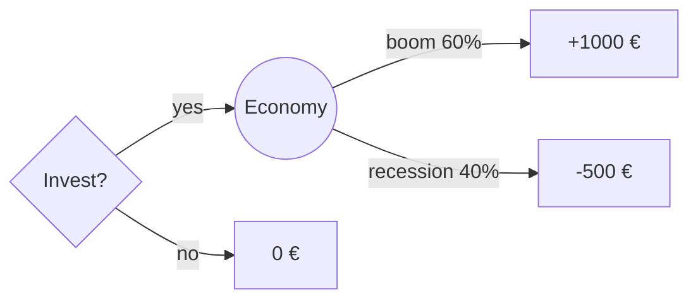

# Decision theory: expected utility and prospect theory

Under uncertainty, what's the rational choice? Decision theory tries to answer. Three historical milestones: expected utility, von Neumann–Morgenstern axioms, and then their empirical demolition by Kahneman-Tversky's prospect theory.

## 1. Risk vs uncertainty (Knight 1921)

- **Risk**: known probabilities. Dice, lottery.
- **Uncertainty** (Knightian): unknown probabilities. Geopolitical events.

Classical decision theory treats risk only. Deep uncertainty: see [Knightian, black swans](37-knightian-black-swans.html).

## 2. Expected value and its limits

Rational choice = max $\mathbb{E}[X] = \sum p_i x_i$.

St Petersburg paradox (see [paradoxes](34-probability-paradoxes.html)) shows infinite EV but no one pays > a few €.

## 3. Expected utility (Bernoulli 1738, vNM 1944)

Replace raw payoffs with **utility** $u(x)$, typically concave:

$$\mathbb{E}[u(X)] = \sum_i p_i u(x_i)$$

With $u(x) = \log x$, the St Petersburg utility is finite.

### vNM axioms (1944)

Rational agent satisfying completeness, transitivity, independence, continuity → behaves *as if* maximizing $\mathbb{E}[u]$ for some $u$ unique up to affine transformation. Representation theorem: rationality ⇔ expected utility.

### Risk attitude

- $u$ concave ($u'' < 0$): risk averse. Prefer sure €50 to 0/100 gamble.
- $u$ linear: risk neutral.
- $u$ convex: risk seeking.

Arrow-Pratt: $r(x) = -u''(x)/u'(x)$ absolute risk aversion.

## 4. Paradoxes breaking vNM

### Allais (1953)

Choice A: 100% of 1M.
Choice B: 89% of 1M, 10% of 5M, 1% of 0.
Most prefer A.

Choice C: 89% of 0, 11% of 1M.
Choice D: 90% of 0, 10% of 5M.
Most prefer D.

Under vNM, A>B implies C>D. People simultaneously violate.

### Ellsberg (1961)

Urn: 90 balls, 30 red, 60 black-or-yellow (unknown ratio).

Bet A: red. Bet B: black. Most prefer A (ambiguity aversion).

Bet C: red or yellow. Bet D: black or yellow. Most prefer D.

A>B and D>C are inconsistent with ANY distribution over black/yellow. People prefer known probabilities even when suboptimal.

## 5. Prospect theory (Kahneman & Tversky 1979)

Descriptive theory of how people actually decide.

### Three findings

**Reference point**: people evaluate gains/losses from a reference (status quo, expectation), not final wealth.

**Loss aversion**: losing hurts more than equivalent gain. Empirically $\lambda \approx 2.25$.

**Diminishing sensitivity**: utility marginal decreases with distance from reference (concave in gains, convex in losses).

### Value function

$$v(x) = \begin{cases} x^\alpha & x \ge 0 \\ -\lambda(-x)^\beta & x < 0 \end{cases}$$

with $\alpha, \beta \approx 0.88$ and $\lambda \approx 2.25$.

<svg viewBox="0 0 400 240" xmlns="http://www.w3.org/2000/svg" style="background:#181834">
  <line x1="20" y1="120" x2="380" y2="120" stroke="#9890b8"/>
  <line x1="200" y1="20" x2="200" y2="220" stroke="#9890b8"/>
  <text x="370" y="135" fill="#ecebff" font-size="11">x</text>
  <text x="206" y="28" fill="#ecebff" font-size="11">v(x)</text>
  <path d="M 200 120 Q 280 100 360 80" stroke="#4cb38a" stroke-width="2" fill="none"/>
  <path d="M 200 120 Q 120 175 40 230" stroke="#e07a8d" stroke-width="2" fill="none"/>
  <text x="270" y="95" fill="#4cb38a" font-size="11">gains: concave</text>
  <text x="60" y="195" fill="#e07a8d" font-size="11">losses: convex and steep</text>
</svg>

Kahneman-Tversky value function: asymmetric, steep in losses.

### Probability weighting

Small probabilities are over-weighted, large ones under-weighted. S-curve:

$$w(p) = \frac{p^\gamma}{(p^\gamma + (1-p)^\gamma)^{1/\gamma}}, \gamma \approx 0.65$$

Explains why people buy lottery tickets AND home insurance — seems contradictory under EU, makes sense under prospect theory.

### Framing

Asian disease problem (1981): 600 people, choices framed as gains vs losses produce opposite choices. Same problem, framing flips behavior.

## 6. Implications

- **Insurance**: sells because small-probability overweighting + loss aversion.
- **Lotteries**: same mechanism, opposite direction.
- **Investors**: hold losers too long, sell winners too soon (disposition effect — Shefrin-Statman 1985).
- **Negotiation**: frame as gains from anchor, not losses.
- **Marketing**: "lose 30%" beats "gain 30%".

## 7. Decision trees

For multistage problems:

EU of invest = $0.6 \cdot 1000 + 0.4 \cdot (-500) = 400 > 0$.

## Exercises

  
With $u(x) = \sqrt{x}$, prefer sure €50 or coin flip 0 vs €100?

$u(50) \approx 7.07$. EU of gamble = $0.5 \sqrt{0} + 0.5 \sqrt{100} = 5$. Prefer sure 50. Concave → risk averse.

  
Explain "disposition effect" via prospect theory.

Bought stock at 100, now at 80. Loss of 20 weighs heavily (loss aversion). Selling realizes loss; you hope for return to 100. Convex-in-losses curve makes you risk seeking. So you hold the loser too long. Small investors keep losers; rational selling would cut and reinvest.

## Summary

- Expected utility (Bernoulli, vNM): rational ⇔ max $\mathbb{E}[u]$.
- Concave $u$ → risk aversion.
- Allais, Ellsberg falsify vNM as description.
- Prospect theory: reference point, loss aversion ($\lambda ≈ 2.25$), diminishing sensitivity, small-probability overweighting.
- Framing flips choices on identical problems.

## Further reading

- von Neumann & Morgenstern, *Theory of Games and Economic Behavior* (1944).
- Kahneman & Tversky, *Prospect Theory*, Econometrica (1979).
- Kahneman, *Thinking Fast and Slow* (2011).
- Wakker, *Prospect Theory* (2010).
