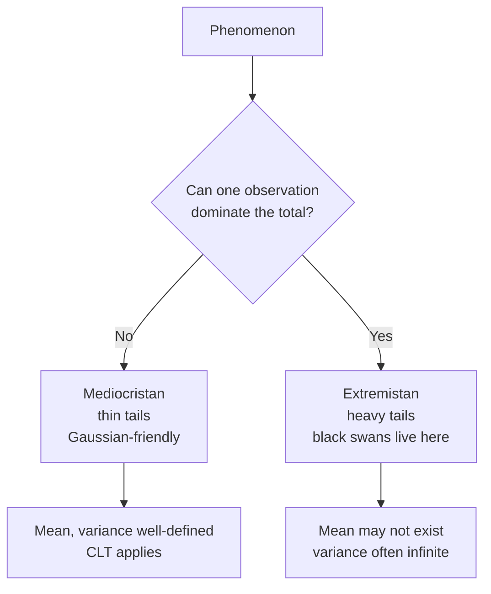

# Knightian uncertainty, black swans, antifragility

Standard decision theory assumes that the probabilities of outcomes are known, or at least estimable. But what if we don't even know what we don't know? This section explores the boundary between **risk** (known probabilities) and **radical uncertainty** (unknown or unknowable probabilities), travelling through Frank Knight (1921), Nassim Nicholas Taleb (black swans, antifragility), and their critics. The material is operational: it is what people use to take decisions in finance, geopolitics, R&D, and pandemic response — anywhere the probability distribution is itself unknown.

## 1. Knight 1921: risk vs uncertainty

Frank Knight, a Chicago economist, in *Risk, Uncertainty and Profit* (1921) drew a distinction that neoclassical theory had blurred:

- **Risk**: a situation in which possible outcomes are known and their probability distribution is quantifiable. Example: a fair die, or auto insurance based on decades of actuarial data.
- **Knightian uncertainty**: a situation in which outcomes or their probabilities are not knowable a priori. Example: launching a new product into an emerging market, or forecasting the political trajectory of a country.

Formally, under risk we can write the expected value $\mathbb{E}[X] = \sum_i p_i x_i$. Under Knightian uncertainty, the $p_i$ are not given. For Knight, **economic profit is the reward for bearing genuine uncertainty**: pure risk is absorbed by insurance markets; what is left for the entrepreneur is the non-insurable residual.

> Knight writes: "It is *un*-measurable uncertainty that gives the entrepreneur his peculiar function." Without true uncertainty, there would be neither profit nor enterprise.

The distinction anticipates by decades the debate on ambiguity (Ellsberg 1961 — see [Probability paradoxes](34-probability-paradoxes.html)) and is now back in the spotlight thanks to Taleb.

## 2. Taleb: the black swan

Nassim Nicholas Taleb, a Lebanese-American trader-essayist, in *The Black Swan* (2007) popularised an old philosophical idea with a striking image. Before the discovery of Australia, Europeans believed, by enumerative induction, that all swans were white. A single black swan (*Cygnus atratus*) falsified millennia of observation — a direct echo of Popper (see [Scientific method and Popper](43-scientific-method-popper.html)).

A **black swan** is an event with three joint properties:

1. **Outlier**: it lies outside the realm of ordinary expectations; nothing in the past plausibly points to its possibility.
2. **Extreme impact**: it produces disproportionate consequences.
3. **Retrospective explainability**: after the fact, the human mind manufactures a narrative that makes it predictable and explicable (*hindsight bias*).

Typical examples in the Talebian canon: 9/11, the 2008 financial crisis, the sudden rise of Google, the fall of the Berlin Wall. COVID-19 is contested: for Taleb himself it is *not* a black swan but a **white swan** that was ignored — epidemiologists (and Taleb in *The Black Swan*) had been forecasting a pandemic for decades.

## 3. Mediocristan vs Extremistan

Taleb classifies phenomena into two "provinces":

- **Mediocristan**: a domain where no single observation significantly alters the mean or total. Thin-tailed distributions (Gaussian, exponential). Examples: human height, weight, measurement errors. If you add a randomly chosen person to a group of 1000, even if it were the tallest person alive (2.72 m), the mean barely moves.
- **Extremistan**: a domain where a single observation can dominate the total. Heavy-tailed distributions (power law, log-normal, Cauchy). Examples: wealth, book sales, war casualties, market capitalisation. If you add Bezos to a group of 1000 people, average wealth explodes.

Black swans live in Extremistan. Applying Gaussian intuitions (mean, variance, confidence intervals) in Extremistan is the cardinal sin Taleb attacks in financial risk management: VaR, modern portfolio theory, and the Black-Scholes assumptions all underestimate tail risk because they assume thin tails.

A power-law tail has density $f(x) \propto x^{-\alpha-1}$. For $\alpha \leq 2$ the variance diverges; for $\alpha \leq 1$ the mean itself diverges. Pareto's original wealth distribution had $\alpha \approx 1.5$: variance is undefined, so the very idea of a "standard deviation of wealth" is meaningless.

## 4. From robust to antifragile

In *Antifragile* (2012) Taleb introduces a triad:

- **Fragile**: harmed by volatility, shocks, stressors. A glass goblet, a centralised supply chain, a leveraged hedge fund.
- **Robust / resilient**: unaffected by shocks (within limits). A rock, a well-diversified portfolio.
- **Antifragile**: *benefits* from shocks. Muscles under load, evolutionary fitness, startup ecosystems, the immune system, certain option positions.

Antifragility is not a synonym of resilience: a resilient system returns to its initial state, an antifragile system improves. The key mathematical concept is **convexity** in the response function.

Let $g(x)$ be the payoff of an action as a function of a stressor $x$. Define the second derivative $g''(x)$.

- If $g''(x) > 0$ (convex), small variability in $x$ is *beneficial*: by Jensen's inequality, $\mathbb{E}[g(X)] \geq g(\mathbb{E}[X])$.
- If $g''(x) < 0$ (concave), variability *harms*: $\mathbb{E}[g(X)] \leq g(\mathbb{E}[X])$.

### Worked numerical example: convexity bias

Suppose the payoff is $g(x) = x^2$ (a long out-of-the-money option). Let $X$ be a stressor with two equally likely values: $X \in \{0, 10\}$, so $\mathbb{E}[X] = 5$.

- $g(\mathbb{E}[X]) = g(5) = 25$
- $\mathbb{E}[g(X)] = \tfrac{1}{2}(g(0) + g(10)) = \tfrac{1}{2}(0 + 100) = 50$

The convexity bonus is $\mathbb{E}[g(X)] - g(\mathbb{E}[X]) = 25$: doubling the result. Volatility produces value, not damage. Conversely, for a concave function ($g(x) = \sqrt{x}$), the same volatility *reduces* expected payoff.

This is why **mean forecasts of nonlinear quantities are systematically wrong** when there is volatility (the "ludic fallacy" Taleb attacks).

## 5. The barbell strategy

The operational counterpart of antifragility is the **barbell**: combine an extremely safe allocation (T-bills, savings) with a small allocation in highly convex, asymmetric bets (long out-of-the-money options, venture capital, side projects). Avoid the "middle" of moderate risk that pretends to be safe (BBB bonds, complex structured products): this is where blow-ups hide.

Symbolically: 85–90% maximally safe + 10–15% maximally aggressive. The downside is bounded by the safe portion; the upside is unbounded thanks to convex tail bets.

Application beyond finance:

- **Career**: a steady job (income floor) + serious creative side projects (book, startup, research).
- **Research**: a steady stream of normal-science papers + a few highly speculative attacks.
- **Diet**: long periods of routine + occasional fasting or maximal effort (hormesis, an antifragile mechanism in biology).

## 6. Critiques and limits

Taleb is provocative, and the academy has hit back hard:

- **"Black swan is unfalsifiable"** (Sornette, Aven): if every surprise is post-hoc reclassified as a black swan, the concept loses scientific content. Sornette responds with **dragon kings**: extreme events that *can* be partially predicted by tracking endogenous bubbles.
- **"Knightian uncertainty exists, but Bayesianism handles it"**: a strict Bayesian (Savage) would deny that probabilities can ever be "unknown" — they are subjective degrees of belief, by definition always definable.
- **"Antifragility is a relabeling"** (statisticians of complexity): the substantial content is convexity in $g$, and that was known since Jensen (1906).
- **Style critique**: Taleb writes belligerently, attacks people by name, mixes serious technical insights with provocation. Many academic readers cannot get past the tone.

Despite the polemics, the **operational core** is solid: distinguishing thin-tailed from heavy-tailed processes; preferring convex bets to concave ones; preferring asymmetry to symmetry; verifying that risk is *truly* bounded on the downside. These are practical principles that any decision maker in [decision theory](35-decision-theory.html) under uncertainty does well to internalise.

## 7. Was COVID-19 a black swan?

A useful test case for the framework.

**Arguments for "yes, black swan"**:

- The general public, most governments, and many markets were genuinely surprised. Equity markets crashed nearly 30% in three weeks (March 2020).
- The combination of *novel pathogen* + *global supply chains* + *coordinated lockdowns* had no precise historical precedent.

**Arguments for "no, white swan / grey rhino"**:

- A respiratory pandemic was *expected* by epidemiologists. Bill Gates gave a TED talk in 2015 ("The next outbreak? We're not ready"). The Spanish flu (1918) and SARS (2003) are recent precedents.
- Taleb himself, in *The Black Swan* (2007), explicitly mentioned a pandemic as a foreseeable risk.
- The economic impact came less from the virus itself and more from the *policy response* (lockdowns), which is endogenous, not exogenous.

The consensus among scholars of risk: COVID-19 is best described as a **grey rhino** (Wucker 2016) — a high-probability, high-impact threat that is ignored — rather than a true black swan. The lesson holds either way: invest in robustness against tail events that are foreseeable, and in antifragility against those that are not.

## 8. Exercise

  
Exercise 1 — convex vs concave bet

You have €10,000. Two options:

- **A**: government bonds yielding €300/year, zero risk.
- **B**: a barbell with 90% in bonds (€270/year) and 10% in deep out-of-the-money call options on the S&P 500 with payoff $g(x) = \max(x - 100, 0)^2$ where $x$ is the index level above today's. Suppose $X$ is symmetric: $\Pr(X=0) = 0.95$, $\Pr(X=50) = 0.04$, $\Pr(X=200) = 0.01$.

Compute the expected payoff of the option component and discuss which option dominates under different attitudes to uncertainty.

**Solution sketch**:

$\mathbb{E}[g(X)] = 0.95 \cdot 0 + 0.04 \cdot 0 + 0.01 \cdot 100^2 = 100$.

So €1000 invested in this option has expected payoff €100, plus €270 from bonds → €370 vs €300 of A. **B dominates in expectation thanks to the convex tail**. But: 95% of the time the option expires worthless. In Knightian terms, we are not sure $\Pr(X=200) = 0.01$ is the *true* probability — it could be 0.001, in which case B loses. The barbell still bounds the downside at €270 vs €300: the loss compared to A is at most €30. The asymmetry is the point.

## Summary

- **Knight (1921)**: distinguish *risk* (known $p_i$) from *uncertainty* (unknown $p_i$). Profit is the reward for the latter.
- **Taleb**: black swans = outliers + extreme impact + retrospective explainability. They live in **Extremistan** (heavy tails), not Mediocristan.
- **Antifragility** is convexity of the payoff in the stressor. By Jensen, $\mathbb{E}[g(X)] > g(\mathbb{E}[X])$ when $g$ is convex.
- **Barbell strategy**: 85–90% safety + 10–15% convex bets. Avoid the deceptive middle.
- **Critiques**: black swan is partly unfalsifiable; Sornette's *dragon kings* are partly predictable; antifragility is mathematically already in Jensen.
- **COVID-19** is more a grey rhino than a black swan: foreseeable but ignored.

## Further reading

- Knight, F. (1921). *Risk, Uncertainty and Profit*. Houghton Mifflin.
- Taleb, N. N. (2007). *The Black Swan*. Random House.
- Taleb, N. N. (2012). *Antifragile*. Random House.
- Sornette, D. (2009). "Dragon-Kings, Black Swans and the Prediction of Crises." *Int. J. Terraspace Sci. Eng.*
- Wucker, M. (2016). *The Gray Rhino*. St. Martin's Press.
- Aven, T. (2013). "On the meaning of a black swan in a risk context." *Safety Science*, 57: 44–51.
