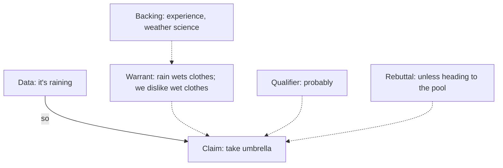

# Argumentation: Toulmin, Walton, argument mapping

Classical logic deals with deductive structure. Most real-world arguments are not strictly deductive but **defeasible**: a strong support that can be overridden by new evidence. Toulmin and Walton developed frameworks for these.

## 1. Toulmin model (1958)

Stephen Toulmin, *The Uses of Argument*. Six components:

- **Claim** (C): the thesis.
- **Data / grounds** (D): the facts/evidence supporting the claim.
- **Warrant** (W): the underlying principle that links D to C.
- **Backing** (B): support for the warrant itself.
- **Qualifier** (Q): degree of certainty ("probably", "usually").
- **Rebuttal** (R): conditions under which the claim fails.

Compared to classical premise-conclusion, Toulmin makes the **warrant** explicit — often the hidden assumption.

### 1.1 Worked example

> "We should ban single-use plastic because it pollutes oceans."

- Claim: ban single-use plastic.
- Data: it pollutes oceans.
- Warrant (implicit): pollution that harms shared environments should be regulated.
- Backing: environmental science, public-good theory.
- Qualifier: missing — does "should" mean immediately, fully? Worth pinning down.
- Rebuttal: unless alternatives are worse environmentally (e.g. heavier carbon footprint of substitutes).

Mapping reveals weak points: the warrant might need stronger backing (or balancing against rebuttals).

## 2. Walton's argument schemes

Douglas Walton catalogs over 60 **defeasible patterns**. Each comes with **critical questions** to test it.

### Example: argument from expert opinion

> Expert $E$ says $A$. $E$ is an authority. Therefore $A$.

Critical questions:
1. Is $E$ a genuine expert in this field?
2. Is $E$ speaking within their expertise?
3. Is $A$ within the current expert consensus?
4. Are there conflicting opinions from other experts?
5. Does $E$ have conflicts of interest?

Pass critical questions → reasonable inference. Fail one → argument is undermined.

### Example: argument from analogy

> $A$ is similar to $B$. $B$ has property $P$. So $A$ has $P$.

CQ: Are the relevant similarities sufficient? Are there relevant dissimilarities?

### Other common schemes

- Argument from sign (smoke → fire).
- Argument from cause to effect.
- Argument from consequences (positive or negative).
- Slippery slope (with CQs about each step).

Walton's value: replaces the classical "fallacy/not fallacy" binary with **conditional validity** — depends on whether CQs are satisfied.

## 3. Argument mapping

Visual representation of argument structure: nodes for claims, links labeled "supports" or "objects to". Tools: Rationale, Argunet, Kialo (commercial-ish), bCisive.

Two organizing principles:

- **Pro/con trees**: each claim has supporting and rebutting children.
- **Inference trees**: each conclusion has the premises that support it.

Why it helps: makes implicit warrants visible; surfaces contradictions; allows multiple people to work on the same argument.

## 4. Applied example

Op-ed: "We should expand nuclear energy."

Decomposition:

- Claim: expand nuclear.
- Pro 1: low carbon emissions. Data: lifecycle studies. Warrant: low-carbon = good given climate.
- Pro 2: high energy density. Data: TWh per ton of fuel. Warrant: high density = useful.
- Pro 3: dispatchable. Data: capacity factor. Warrant: grid needs baseload.
- Con 1: waste storage. Data: spent fuel volumes. Warrant: long-term containment hard.
- Con 2: capital cost & build time. Data: recent EPR/Olkiluoto delays.

Once mapped, a critic addresses *specific nodes* rather than the whole rhetorical sweep.

## 5. Critiques of Toulmin

- Some find the six-element scheme too coarse — real arguments have nested structure.
- The warrant/backing distinction is sometimes elusive.
- Doesn't model multi-step or dialogical structure.

These motivate Walton's schemes and dialectical models (cf. [debate, dialectic](40-debate-dialectic.html)).

## Exercises

  
Map: "We should regulate AI because it threatens jobs."

- Claim: regulate AI.
- Data: AI threatens jobs.
- Warrant: threats to jobs warrant regulation.
- Backing: precedents (automobiles, labor laws), economic theory of disruption.
- Rebuttal: regulation may stifle innovation; jobs lost may be replaced by new ones; "threat" is uncertain.

A well-reasoned response engages each level.

## Summary

- Toulmin: claim, data, warrant, backing, qualifier, rebuttal.
- Walton: defeasible argument schemes with critical questions.
- Argument mapping: visual structure, exposes hidden warrants.
- Real arguments are mostly defeasible, not deductive — frameworks reflect that.

## Further reading

- Toulmin, *The Uses of Argument* (1958).
- Walton, *Argumentation Schemes for Presumptive Reasoning* (1996).
- van Eemeren, *Pragma-dialectics* (2010).
- Tim van Gelder on argument mapping.
