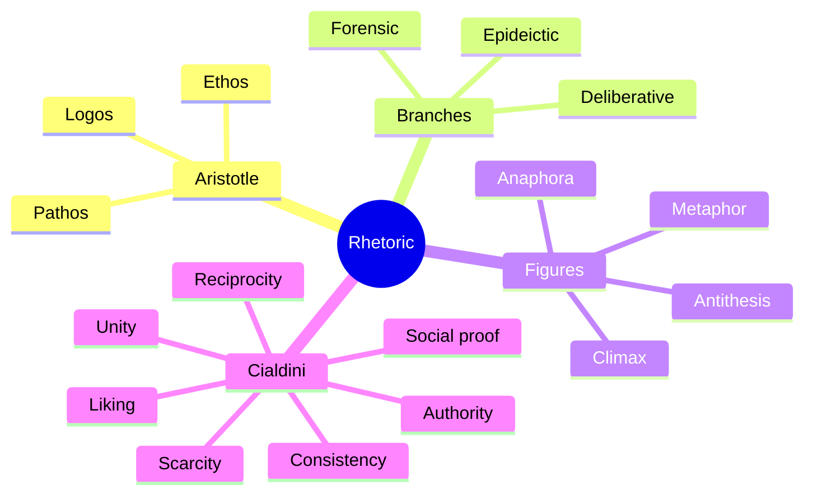

# Rhetoric and persuasion

Rhetoric is the systematic study of persuasion — analyzed by Aristotle in the 4th century BCE and still the backbone of modern theory. Knowing it serves both offense (persuade) and defense (recognize when you're being persuaded).

## 1. Aristotle's three appeals

From *Rhetoric* (~350 BCE):

- **Ethos**: appeal via the speaker's character. Credibility, expertise, integrity.
- **Pathos**: appeal via the audience's emotion. Fear, hope, anger, pride.
- **Logos**: appeal via reason. Logic, evidence, argument.

A persuasive speech weaves all three. Pure logos is dry and unread. Pure pathos is suspicious. Pure ethos is "trust me, I'm an expert" without content.

### 1.1 Three branches of discourse

- **Forensic** (judicial): about past acts — guilt, innocence.
- **Deliberative**: about future actions — laws, policy.
- **Epideictic**: about present — praise or blame, ceremonial.

Each has typical concerns: forensic = justice/injustice, deliberative = beneficial/harmful, epideictic = honorable/shameful.

## 2. Key figures of speech

A tiny selection:

- **Anaphora**: repetition at the beginning of clauses. "We shall fight on the beaches, we shall fight on the landing grounds…" (Churchill).
- **Metaphor**: figure mapping one thing onto another. "Life is a journey."
- **Antithesis**: contrasting ideas in parallel structure. "Ask not what your country can do for you…" (Kennedy).
- **Climax**: ascending intensity. "I came, I saw, I conquered" (Caesar).
- **Hyperbole**: deliberate exaggeration. "I'm dying of hunger."
- **Euphemism**: softening an unpleasant term. "Passed away" for "died".
- **Dubitatio**: feigned doubt. "I don't know which to praise first…".

Figures aren't fallacies — they're devices. They become problematic when they substitute for argument.

## 3. Cialdini's six (now seven) principles (*Influence*, 1984)

Empirical psychology of compliance:

1. **Reciprocity**: we feel obliged to return favors. Free samples.
2. **Commitment / consistency**: once committed (publicly), we stay consistent. Foot-in-the-door technique.
3. **Social proof**: we follow others. "Best seller", "1000 people already…"
4. **Authority**: we defer to authority figures (or symbols of authority — uniform, title).
5. **Liking**: we say yes to people we like (attractive, similar, complimentary).
6. **Scarcity**: we want what's limited. "Last day", "only 3 left".
7. **Unity** (added 2016): shared identity — "we" tribal markers.

These are not fallacies per se. Sometimes authority is a legitimate shortcut. They become problematic when used to bypass deliberation entirely.

## 4. Persuasion vs manipulation

Where's the line?

**Persuasion** respects the audience as rational agents: provides reasons, transparent goals, accurate facts.

**Manipulation** exploits cognitive biases or emotions to bypass deliberation: hidden agendas, false urgency, distorted info, emotional ambush.

The boundary is fuzzy and contested. A useful test: would the audience consent to being persuaded *this way* if they understood the technique? Reciprocity at a wine tasting: yes. Reciprocity in a high-pressure timeshare pitch: not really.

See [propaganda, manipulation](50-propaganda-manipulation.html).

## 5. Modern political examples (formal, non-partisan)

A typical political ad uses:

- Ethos: candidate in family setting, white shirt, eye contact — competence + likeability.
- Pathos: crisis imagery, hopeful conclusion.
- Logos: 1-2 statistics, often cherry-picked.
- Cialdini: scarcity ("our last chance"), social proof ("join thousands").
- Figures: anaphora ("We will… we will… we will…").

Recognizing the techniques doesn't immunize you fully, but it slows S1 (see [dual process](24-dual-process.html)).

## 6. The audience matters

Rhetoric is **audience-relative**. A given appeal that works on one group may backfire on another. Effective persuaders model the audience's:

- Prior beliefs.
- Values.
- Emotional state.
- Vocabulary.

Without audience modeling, even great logos fails ("I made the perfect argument and nobody listened").

## 7. Diagram

## Exercises

  
Identify the appeals: "As a parent, I worry about our children's future. We need clean energy now — every day we wait, the planet burns. The science is settled."

- Ethos: "As a parent" (relatable identity).
- Pathos: "I worry", "the planet burns".
- Logos: "the science is settled" (appeal to consensus, with no detail).

Effective speech rhetorically; logos is weakest link. A challenger should ask: which specific scientific claim, what's its confidence, what's the policy mechanism?

## Summary

- Aristotle: ethos, pathos, logos.
- Three branches: forensic, deliberative, epideictic.
- Figures: tools, not fallacies; problematic only when they replace argument.
- Cialdini: 6+1 principles of compliance.
- Persuasion respects rationality; manipulation bypasses it. Boundary fuzzy.
- Audience-relative.

## Further reading

- Aristotle, *Rhetoric*.
- Cialdini, *Influence: The Psychology of Persuasion* (1984).
- Schopenhauer, *The Art of Being Right* — short and amusing.
- Heinrichs, *Thank You for Arguing*.
