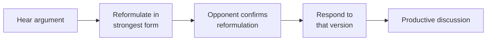

# Debate, Socratic dialectic, steelmanning

Debating isn't "winning a conversation". It's a method to **clarify ideas** — yours, your interlocutor's, the audience's. Philosophy has 2500 years of techniques to keep debate from degenerating into ego-clash.

## 1. Socratic dialectic (elenchus)

Plato (*Apology*, *Meno*, *Theaetetus*) shows Socrates' method:

1. **Irony**: feign ignorance, ask for definitions.
2. **Elenchus**: questions that drive the interlocutor's definition to contradiction.
3. **Aporia**: confusion — the interlocutor realizes they don't know what they thought they knew. The goal: aporia is the precondition for genuine inquiry.
4. **Maieutic** (in *Meno*): help the listener "give birth" to knowledge they already had — learning as remembrance.

### Meno example

Socrates leads an uneducated slave to discover how to double a square's area. The slave's wrong guess (double the side → quadruple area) brings aporia, then truth (the diagonal is the answer). Socrates doesn't teach; he asks.

### In practice

- Demand clear definitions ("what exactly do you mean by X?").
- Probe with examples and counterexamples.
- Generalize and limit cases.
- Tolerate aporia: don't fear "I don't know".

Works wonderfully 1-on-1; poorly on TV (aporia looks like "losing").

## 2. Hegelian dialectic — a usage note

The thesis-antithesis-synthesis triad attributed to Hegel is actually Fichte and Schelling. Hegel speaks of *Aufhebung* (sublation), a much subtler movement. The schema is often abused: any conclusion presented as "synthesis" sounds legitimate. Be wary.

## 3. Habermas and communicative action

Jürgen Habermas: truth emerges from the **ideal speech situation** — all participants have equal voice, sincere, argue rationally, no idea excluded a priori. Utopian regulative ideal, useful as a measuring stick for real debates.

## 4. Steelmanning

**Strawmanning** (see [informal fallacies](21-informal-fallacies-relevance.html)): represent the opponent's argument in its weakest, caricatured form, then demolish it. Dishonest and ineffective.

**Steelmanning** (Daniel/Messinger, popularized 2010s): represent the opponent's argument in its **strongest form** — even stronger than they did — and respond to *that*.

### Why it works

- **Epistemic honesty**: if you're right, you should be right against the best counter, not against a strawman.
- **Persuasion**: opponents seeing their position taken seriously open up.
- **Learning**: you often find the steelman contains truth — your model improves.

### Example

Strawman: "Anti-vax people think vaccines are a pharma conspiracy."

Steelman: "Some genuine vaccine concerns: rare but documented adverse effects; real conflicts of interest in industry, regulators, media; historical bad-faith episodes (Tuskegee, Vioxx); accelerated approval in pandemic. The right question isn't 'safe yes/no' but 'how do we evaluate risk/benefit under uncertainty?'."

Serious response engages the steelman, not the cartoon.

## 5. Principle of charity (Davidson, Quine)

When interpreting another's words, **assume they're as rational and truthful as possible**. Only if that fails, consider error or bad faith.

Quine in *Word and Object* (1960): the principle is foundational to radical translation. Davidson extends to interpretation of belief.

Practical: before saying "your argument is absurd", ask "is there a less absurd interpretation?". Usually yes.

## 6. Formal debate formats

| Format | Description |
|---|---|
| British Parliamentary | 4 teams × 2; 7-min speeches; topic announced 15 min before |
| Lincoln-Douglas | 1v1, value-focused (justice, equality) |
| Policy Debate | "Resolved that…" with deep research, plan + counter-plan |
| Karl Popper Debate | 3v3, cross-examination phases |
| Oxford-style | proposition voted before and after; winner is whoever shifts more opinions |

The Oxford format is interesting because it rewards **opinion-shifting**, not absolute persuasion. Filters for actual argumentative work.

## 7. Constructive refutation

Three honest moves:

- **Reductio ad absurdum**: show argument leads to absurd conclusion.
- **Counterexample**: exhibit a case where conclusion fails.
- **Sinking a premise**: prove a premise is false.

Three dishonest moves (to avoid):

- **Strawman**: distort opponent's argument.
- **Ad hominem**: attack speaker.
- **Whataboutism**: deflect to a different argument.

## 8. Dennett's standard

Daniel Dennett (*Intuition Pumps*, 2013): "You only truly understand your opponent's position when they recognize their view in your reformulation." Steelmanning made operational.

## Exercises

  
Steelman: "Social media is a positive force for society."

Steel: connects isolated people (LGBT in conservative countries, rare-disease patients), enables emancipation movements (#MeToo, Arab Spring), democratizes scientific info, reduces coordination cost for benevolent causes. Negative externalities (polarization, mental health) are design-specific (engagement-optimizing algorithms) — fixable without abolishing social. Aggregate well-being effects are contested, not clearly negative.

A serious response addresses these specifically, not "social is unequivocally good".

## Summary

- Socratic dialectic: definitions, contradictions, aporia, shared discovery.
- Steelmanning: address the strongest opponent.
- Principle of charity: rational interpretation first.
- Formal debate formats structure honesty.
- Reductio, counterexample, premise-sinking: honest refutation.

## Further reading

- Plato, *Apology*, *Meno*, *Theaetetus*.
- Habermas, *Theorie des kommunikativen Handelns* (1981).
- Dennett, *Intuition Pumps and Other Tools for Thinking* (2013).
- Schopenhauer, *The Art of Being Right* — tricks and counter-tricks.
